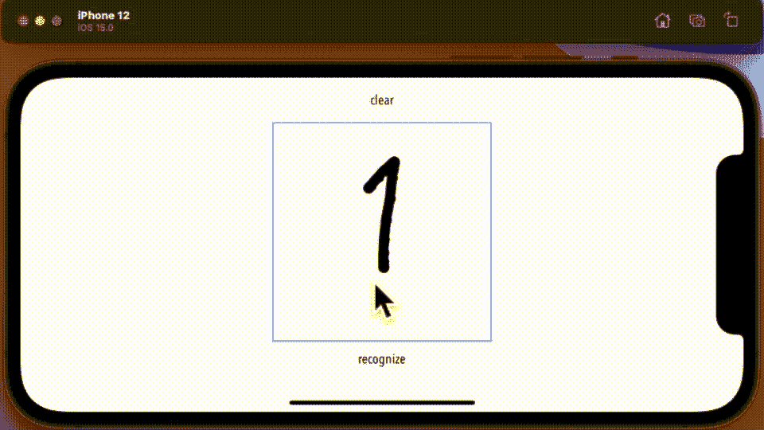

# 在 iOS 15 中使用 Vision 在 SwiftUI 画布上进行文本识别

> 原文：<https://betterprogramming.pub/text-recognition-on-swiftui-canvas-with-vision-in-ios-15-a838318f20d2>

## 将 SwiftUI 中的 Canvas 与 Vision 一起使用

[伊韦克·诺斯](https://unsplash.com/@imkirk?utm_source=medium&utm_medium=referral)在 [Unsplash](https://unsplash.com?utm_source=medium&utm_medium=referral) 上的照片

1993 年，苹果推出了一款产品，我确信它是 iPad 的前身。用他们需要的技术让它真正工作，可悲的是还有点太年轻。有问题的产品是苹果牛顿。

它被作为一款带有手写识别功能的个人数字助理推向市场。当时它的显著特征之一。不幸的是，如果我相信媒体的话，这个功能做得不够好。牛顿注定要成为苹果柠檬。

快进到 2021 年，我注意到 Vision 框架有一个识别图像中的文本和数字的模块。

你知道手写识别——牛顿的特性，据说是它的败笔。加入我的探索之旅，看看我是否可以利用今天的技术来教 iPad 使用视觉框架进行手写识别，变得更好——这可能是成为牛顿之子的第一步。

# 案情摘要

好的——退一步说，这里的挑战是什么，我打算怎么做。

视频加速播放，在这个单词的美国拼写下的微小文本中显示识别的数字

我想使用最新的技术，所以在 iOS 15 中使用 SwiftUI。我需要一个函数来保存我的画布——说起来容易做起来难——并且需要一个函数在我在画布上写了东西后清理/过滤噪声。所以图像过滤。一旦清理完毕，我计划使用视觉框架和机器学习模块`[MNISTClassifier](https://en.wikipedia.org/wiki/MNIST_database)`来识别数字并报告它所看到的。

# 主循环

为了与编码原则保持一致，前几周我讲道——写完代码后，我花了一些时间来重构这段代码。原则循环归结为六个方法，其中几个引用了包含绘图坐标的已发布类。同样的结构包含一个 Bool 来指示笔是刚刚碰到了页面还是在页面上移动。

# 画布视图

在过去的一两个月里，我已经发表了半打关于这个主题的论文——所以让画布视图运行起来相当简单。也就是说，我将视图构建为一个变量，这样我就可以用快照代码来引用它。一个视图，我在其中添加了一个拖动手势来拾取用于绘图的笔事件。相当于 UIKit 中 touch 的 SwiftUI。

这里的秘密是在钢笔上绘制线条和椭圆，在我的页面上得到一条看起来有点像记号笔的线条。

# 拍摄视图快照

我会说我很幸运地找到了这段代码——尽管在这个过程中我确实发现了 iOS 中的一个 bug。

我本想将画布导出为图像，并对其直接应用滤镜——但是应该返回指针的代码却没有返回任何内容。与此同时，我很幸运地找到了这段代码，在[这个网站](https://www.hackingwithswift.com/quick-start/swiftui/how-to-convert-a-swiftui-view-to-an-image)上抓拍了一个视图。几乎开箱即用的代码。

我说几乎是因为我需要在画布中包含标签`.ignoreSafeArea`和标签`.frame`。

# 理解图像

对我来说，这是项目中最有趣的部分——也许因为我本质上是一名计算机科学家——解密/清理 png 图像正合我意，需要很好地理解按位运算符，如 and、or 和 XOR，以及核心图像和 PNG 格式。

我将我认为做另一篇文章致力于这一方法。如你所见，这里有相当多的代码被注释掉了。你需要知道的是，这种方法不仅将图像缩小到一个通道，即红色通道，还将它反转。

# 其他观点

管理应用程序的少数其他视图，这里没有火箭科学。

## **实施视觉模块**

我在这里也有第二次运气，在这个主题的[播放列表](https://www.youtube.com/watch?v=NNKPbdT9gXU&list=PLY1P2_piiWEY761sVFoZAdbqp_B524Y17)上有一系列优秀的视频——这个实现只需要一点点修补就可以让它工作，因为它是基于 UIKit 的，我们正在为 SwiftUI 而努力。

我在这里跳过了一点——实际上忽略了所有的异常，您应该适当地多做一点努力。

## 视觉框架处理程序

将所有这些整合在一起的最后一段代码是:

# 结论

当然，我只是触及了苹果牛顿在这里所能做的表面——我相信有人读到这里会告诉我——但看看苹果在过去三十年里在这个问题上走了多远是一件有趣的事情。当然，我过分简化了这个项目，追求个位数的识别，尽管实际上做更多对一篇中型文章来说太长了。

试用代码；它工作得相当好——尽管我注意到它与数字 6 的斗争远远超过了我的期望。

# 将来的

我已经提到，视觉框架似乎也可以识别文本，去更新项目并实现它，您可以在此处找到其参考资料。

免责声明——虽然我已经老到可以拥有一台苹果牛顿了，但我从来没有拥有过。作为一名 90 年代初刚从大学毕业的初级系统工程师，我并不需要 PDA——当时我关注的是这个星球上最快的图形计算机，Silicon Graphics，一家伟大的公司。