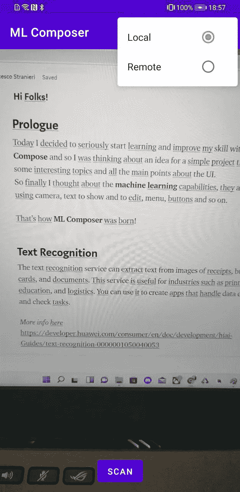
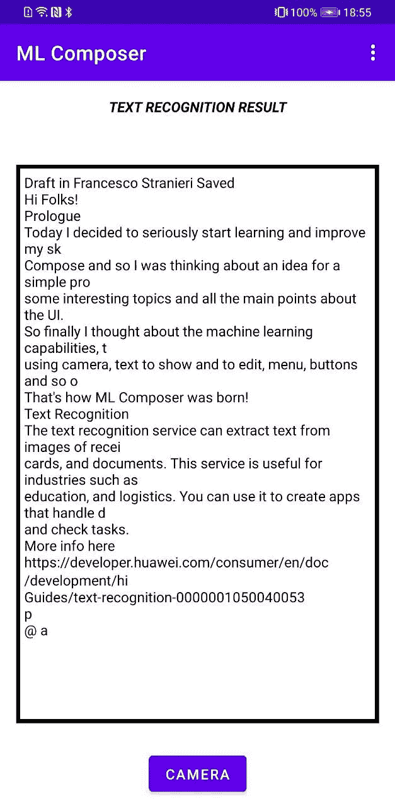
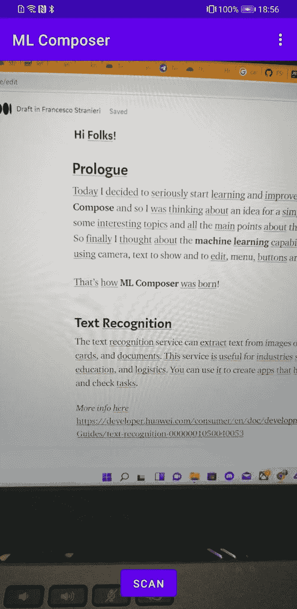

# 使用 Jetpack Compose 和 CameraX 进行文本识别

> 原文：<https://betterprogramming.pub/text-recognition-with-jetpack-compose-and-camerax-9093735edf4f>

## **在你的应用中利用机器学习的力量**


丹尼尔·罗梅罗在 [Unsplash](https://unsplash.com?utm_source=medium&utm_medium=referral) 上的照片

# 序言

今天我决定开始认真学习并提高我的 Jetpack Compose 技能，所以我在考虑一个简单项目的想法，这个项目涵盖了一些有趣的主题和关于 UI 的所有要点。
所以最后我想到了机器学习功能，它们很多，使用摄像头、文本显示和编辑、菜单、按钮等等。

ML 作曲家就是这样诞生的！

# 文本识别

文本识别服务可以从收据、名片和文档的图像中提取文本。这项服务对印刷、教育和物流等行业非常有用。您可以使用它来创建处理数据输入和检查任务的应用程序。更多信息[此处](https://developer.huawei.com/consumer/en/doc/development/hiai-Guides/text-recognition-0000001050040053) *。*

# 项目

[](https://github.com/FStranieri/ML-Composer) [## GitHub - FStranieri/ML-Composer:一个简单的应用程序，具有机器学习和

### 简单的应用程序，具有机器学习提供的功能和 Jetpack Compose - GitHub 提供的美感…

github.com](https://github.com/FStranieri/ML-Composer) 

**如何在你的安卓设备上运行？**按照本[准备指南](https://developer.huawei.com/consumer/en/doc/development/hiai-Guides/config-agc-0000001050990353)操作即可。

# 用户界面

是的，作曲部分！
我们有两个组件:

*   使用适当的布局和状态管理摄像机权限

*   带有相机预览的屏幕(来自 Jetpack libraries 的 CameraX)，底部有一个按钮，屏幕中央有一个圆形进度。
*   循环进度由来自 Compose 本身的`MutableState`管理，位于`viewmodel`、`TextRecognitionViewModel`中。

*   带有文本识别扫描输出的屏幕:

*   `NavHostController`为了在屏幕间导航:

```
setContent {            
val navController = rememberNavController()                         NavHost(navController, startDestination = NAV_MAIN) {                         composable(NAV_MAIN) { BuildCameraUI() }                composable(NAV_TEXTRECOG) { BindTextRecognitionOutput() }          
}        
}
```

# 视图模型

我决定使用一个 ViewModel 来保存所有的文本识别部分及其功能和状态。使用 LiveData 进行输出(成功和失败),我从观察它的活动中触发事件。

[](https://github.com/FStranieri/ML-Composer/blob/master/app/src/main/java/com/fs/sample/cameraxMLsample/viewmodel/TextRecognitionViewModel.kt) [## ML-Composer/textrecognitionviewmodel . kt at master FStranieri/ML-Composer

### 此文件包含双向 Unicode 文本，其解释或编译可能与下面显示的不同…

github.com](https://github.com/FStranieri/ML-Composer/blob/master/app/src/main/java/com/fs/sample/cameraxMLsample/viewmodel/TextRecognitionViewModel.kt) 

# 结果



敬请期待下一集另一个令人敬畏的机器学习超能力！！！

```
**Want to Connect?**Follow me on Twitter ([frankStrangerZ](https://twitter.com/frankStrangerZ))
```