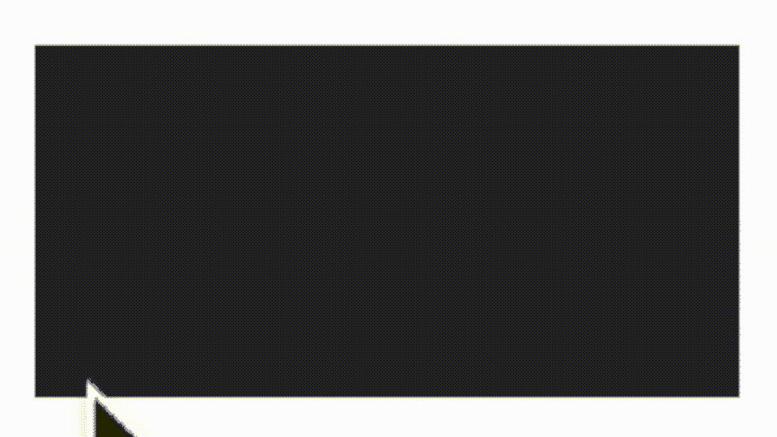
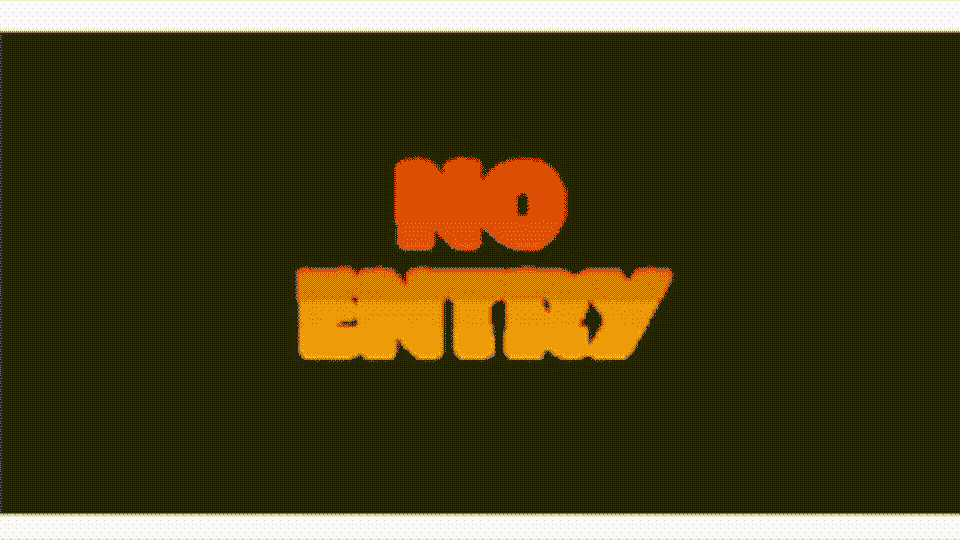
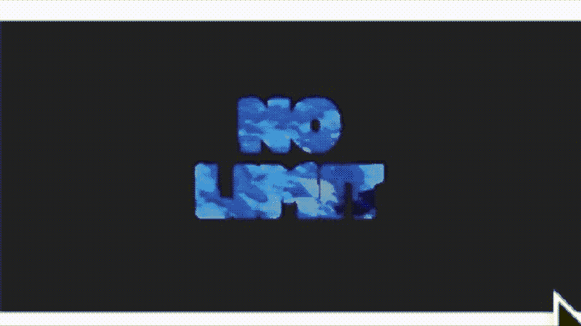
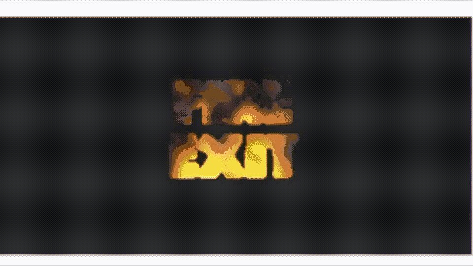

# 使用 SpriteKit 在 SwiftUI 中创建漂亮的文本效果

> 原文：<https://betterprogramming.pub/text-sfx-with-swiftui-spritekit-c3f9777f0f1c>

## 将 SpriteKit 和核心图像过滤器集成到 SwiftUI 应用程序中

在 [Unsplash](https://unsplash.com?utm_source=medium&utm_medium=referral) 上戴着红帽的[女孩的照片。](https://unsplash.com/@girlwithredhat?utm_source=medium&utm_medium=referral)

前几天，我看到了 Artturi Jalli 的一篇精彩文章。它使用 SpriteKit 创建 SwiftUI 登录界面的背景。一个活生生的，动人的背景。

就在几周前，我看到苹果宣布他们现在在 SwiftUI 中支持属性字符串。这个能力[被@郑](/ios-15-attributed-strings-in-swiftui-markdown-271204bec5c1)[记录](https://aheze.medium.com/?source=post_page-----271204bec5c1--------------------------------)。

当我仔细思考这两篇文章时，两种想法碰撞在一起。你看，我有一个游戏的想法，我想开发，但它需要一个强有力的标题。我喜欢 Artturi 的精神背景的想法，但需要一些不同的东西。一些有文字的东西，一个动画属性字符串，但我也不想把我的市场局限于运行 iOS15 的设备。

带着这个想法，我想起了 SpriteKit 中一个叫做`SKCropNode`的特殊节点。这是一个用于屏蔽 SpriteNodes 的节点，从 iOS 7.0 开始就有了(所以在所有工作的 iOS 设备上都有)。

我可以使用`SKCropNode`为我的下一个应用程序的热门标题构建我自己的属性字符串吗？加入我的旅程，探索我能用`SKCropNode`做什么。

# 案情摘要

你需要创建一个标题中带有一些 SFX 的应用程序。与众不同，独一无二。可以用 SwiftUI 但不能用 iOS15！

添加到 SKSpriteNode 的 SKCropNode 的动画 GIF

这里什么都没有。我们运行的是 iOS 14，又名 SwiftUI 2.0，其中嵌入了一个`GameScene`。

# 旅程

你在上面看到的例子，多种颜色的单词“禁止钓鱼”，是我尝试的第一个想法。您看到的是四个 sprite 节点在一个`SKCropMask`内一致移动。他们在移动，因为我有几个`SKActions`在那里。你知道我说的`SKActions`是什么意思，对吧？杰瑞米·雅各布森把[一个很好的介绍](https://medium.com/hackernoon/a-guide-to-spritekit-actions-c20b079f5398)给他们。

这基本上是相同的代码，只是这一次我是随着时间的推移添加精灵。然后我给它们加上重力。这种效果令人毛骨悚然:

添加到 SKSpriteNode 的 SKCropNode 的动画 GIF

如果你正在寻找一个像这样的恐怖节目，那么你需要努力高效地编码。你现在看到的是一张在大约八秒钟的时间里上百个精灵被添加到面具上的图片。显然，我用了一点 iMovie 的魔法来加快速度。杰瑞米·雅各布森也写了一篇关于物理学的文章，如果你需要一些关于物理学方面的提醒的话。

接下来是更高科技的外观。我使用了和上一个例子几乎一样的程序，除了我在这里每隔一段时间分阶段添加精灵。没有重力把戏。

添加到 SKSpriteNode 的 SKCropNode 的动画 GIF

仍然与精灵一起工作，我看了一些核心图像过滤器。首先，我为我的雪碧创建了一个渐变颜色的图像，从黄色到红色。接下来，我用第二个滤镜对图像进行像素化，这样你可以更清楚地看到阴影。想想看:有几十个核心图像过滤器。我写了一篇关于使用这些过滤器的文章。当然，其他人也有。@Jarad Davidson 的这篇文章也是一个很好的参考。

使用核心过滤器将 SKCropNode 添加到 SKSpriteNode 的动画 GIF

我用一个`SKAction`让它闪烁。再次，一个小坦白:我确实在 iMovie 中加快了一点。但是我们现在真的很顺利。接下来是一个`SKVideoNode`。当然，SpriteNodes 不是唯一可以用`SKCropNode`添加的东西。现在看起来不错。关注字母中显示的鱼。太迷人了。这篇由[穆罕默德·阿扎姆](https://medium.com/u/2300266301b3?source=post_page-----c3f9777f0f1c--------------------------------)撰写的[文章很好地概述了`SKVideoNodes`。](https://medium.com/hackernoon/playing-videos-in-augmented-reality-using-arkit-7df3db3795b7)

添加到 SKVideoNode 的 SKCropNode 的动画 GIF

最后，在我离开之前，这里有一个更特别的效果。这一个在我们的面具里使用了一个`SKEmitterNode`来创造一些看起来像着火了的字母。一个属于萝拉·卡芙特式游戏的例子。有八种粒子效果可供选择。在[这篇文章](https://medium.com/flawless-app-stories/how-to-create-a-continuous-rain-of-nodes-in-spritekit-4bf563d9ca7d)中阅读所有关于`SKEmitterNodes`的内容[文森佐·桑尼诺(恩佐桑)](https://medium.com/u/be57955c5f68?source=post_page-----c3f9777f0f1c--------------------------------)。

添加到 SKEmitterNode 的 SKCropNode 的动画 GIF

这就把我带到了文章的结尾。我希望你能像我喜欢写它一样喜欢浏览它。如果你感兴趣的话，可以看看我在 Medium 上的其他文章。在过去的 18 个月左右，我已经发表了 100 多篇不同的文章。

 [## 使用 SpriteKit 构建 SwiftUI 游戏

### SwiftUI、SpriteKit 和缺失触摸手势

better 编程. pub](/build-swiftui-games-using-spritekit-deb069535765) 

当然，在我走之前，这是一个基本的模板，让你开始你的标题效果。这是你在这篇文章里看到的第一个。我不会在这里包含所有代码，因为它们非常相似。如果你需要帮助来弄清楚我是如何做其他人的，请给我留言。

这就是“不钓鱼”过滤器的样子。如果你看不见任何东西，不要担心。那是因为背景是透明的，文字是白色的。

无钓鱼文字蒙版使用由[bmcgehee@mis.net](mailto:bmcgehee@mis.net)创建的自然之触字体

您应该能够将该图像拖到您的桌面上，并使用 Preview 打开它，以查看您到底需要使用什么来完成该操作。

 [## 马克·卢金-中号

### 阅读马克.卢金在媒介上的作品。编码 35 年以上，喜欢使用和学习 Swift/iOS 开发…

marklucking.medium.com](https://marklucking.medium.com)