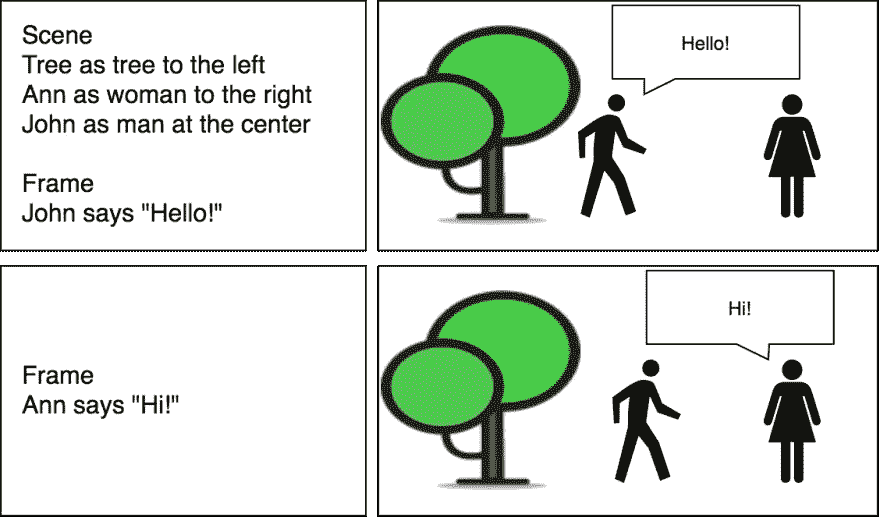
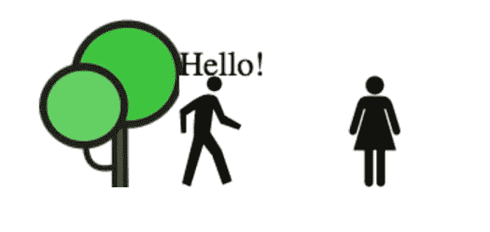
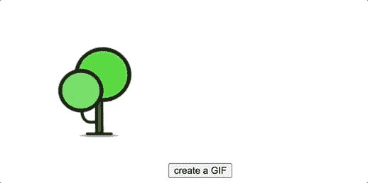
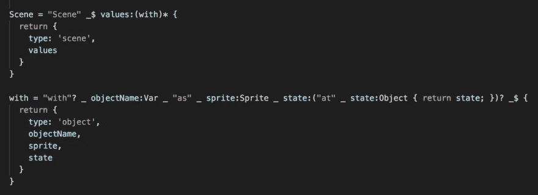
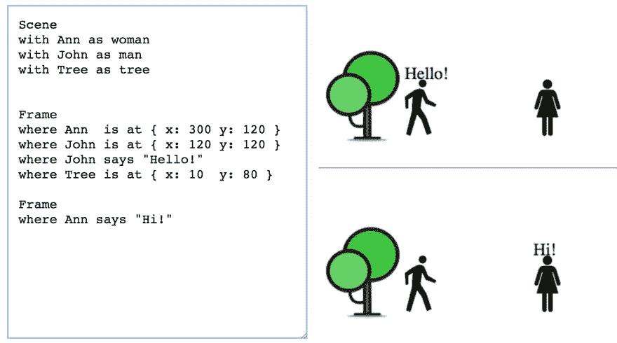
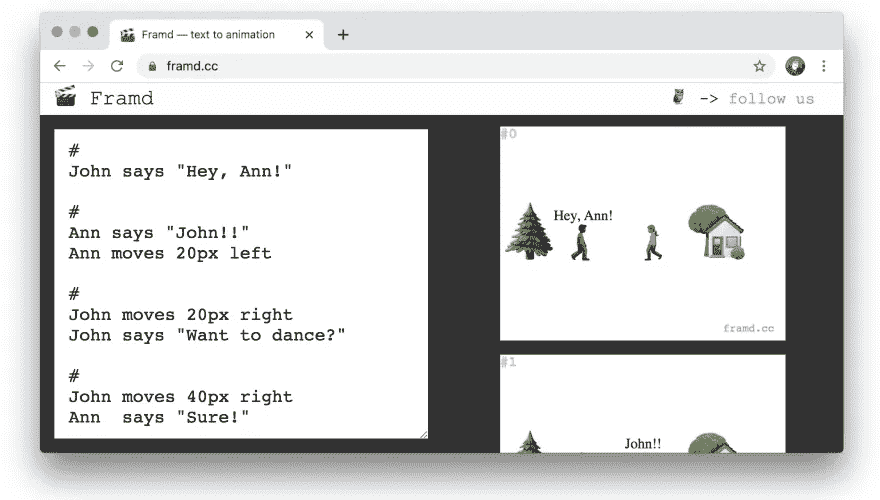

# 创建文本到 GIF 的动画

> 原文：<https://betterprogramming.pub/text-to-gif-animation-reactjs-devlog-5378fc70fd1>

## 从构思到出版…以及它是如何不按计划进行的


图片来源:作者

我有一个想法，从简单的文本创建故事板会很酷，例如:



*用户用文本描述场景并获取图像作为输出*

在这篇文章中，我将分享我的想法，并与你一起建立从想法到出版的过程。

我一定会给你看最后的结果！

**剧透:**没有按计划结束。[TL；博士:最终结果](https://framd.cc/)。

# 0.想法

我开始想象这个想法——首先用笔和纸，然后通过 [Draw.io](https://draw.io/) (你可以看到上面的第一个概念)。然后，我写了一个概述:

> 用户使用简单的英语定义场景:
> 
> `Scene`
> `Ann as woman to the right`
> `Frame`
> 
> 场景定义描述*演员*(装饰)和*画面*。
> *演员*使用预置的小精灵像`tree`、`man`、`woman`。
> *帧*定义了演员执行的动作。
> 
> 用户将能够分享他们的故事，并喜欢和修改其他人的。

想法和语言或多或少有了定义，是时候起草发展计划了:

1.  设置—项目准备
2.  JSON to images——测试我是否能按照自己的意愿创建图像
3.  图像到 GIF——确保我可以在客户端生成 GIF，尝试一些库
4.  文本到 JSON——我需要为该语言创建一个解析器
5.  后端—登录/保存/共享流需要
6.  出版

**注:**为简洁起见，我就不提很多死路一条的想法或者愚蠢的错误了。所以如果你觉得一切都太顺利了，那只是因为剪辑的原因。此外，我将削减大量代码，并使用伪代码风格来缩短源代码。如果你有任何问题，请不要犹豫地问。

我们走吧！

# 1.设置

我需要一个 Git 存储库来组织我的开发过程，并需要一个框架来加速它。我使用了 [create-react-app](https://github.com/facebook/create-react-app) 和 [git init](https://githowto.com/create_a_project) :

```
npx create-react-app my-app
cd my-app
# [skipped TypeScript adding process]
git init -y
git commit -m "initial"
npm start
```

重要思想:我们需要快速检验我们的想法。你使用哪种语言、框架或 VCS 并不重要，只要你对它感到舒适和有效率。

# 2.JSON 到图像

我从定义一个简单的 JSON 开始，测试我是否可以基于这个结构呈现图像。

JSON 应描述:

*   `sprites` —我们演员和装饰的图片网址
*   `scenes` —应包含并定位演员和装饰
*   `frames` —应该包含动作，比如“安向左移动”

```
({
  sprites: { name: 'http://sprite.url' },
  scenes:
    // scene descriptions
    { scene_ONE:
        { entries:
            /* entries with their sprites and position */
            { Ann: { sprite: 'woman'
                   , position: { /* ... */ }
                   }
            }
        },
    },
  frames:
    [ { scene_name: 'scene_ONE'
      , actions: [
          { target: 'Ann'
          , action: 'move'
          , value: {x, y}
          }
        ]
      }
    , // ...other frames
    ]
})
```

对于演员，我定义了三个预设精灵——`tree`、`woman`和`man`——并在项目中添加了相关图像。

现在，对于每一帧，我们将执行所有的动作(移动和说话)。

```
// for each frame
const computedFrames = frames.map(frame => {
  // clone entries
  const entries = _.merge({}, frame.scene.entries);
  // perform actions on the target entry
  frame.actions.forEach(action => {
    const entry = entries[action.target]; if (action.type == 'talk') {
      entry.says = action.value;
    } if (action.type == 'move') {
      entry.position = action.value;
    }
  }); return { entries };
});
```

对于绘制入口精灵，我们肯定会使用[画布](https://developer.mozilla.org/en-US/docs/Web/API/CanvasRenderingContext2D):

```
// draw the entries
const images = computedFrames.map(frame => {
  const canvas = document.create('canvas');
  const ctx = canvas.getContext('2d');
  frame.entries.forEach(entry => {
    ctx.drawImage(entry.sprite); // for sprites
    ctx.fillText(entry.says);    // for speech
  });
  // return rendered frame URL
  return URL.createObjectURL(canvas.toBlob());
})
```

Canvas 可以将其内容导出为[数据 URL](https://developer.mozilla.org/en-US/docs/Web/API/HTMLCanvasElement/toDataURL) 或 [blob](https://developer.mozilla.org/en-US/docs/Web/API/HTMLCanvasElement/toBlob) 。稍后我们将需要它来生成`.gif`。

实际上，代码更加异步:`toBlob`是异步的，所有的图片都应该在`ctx.drawImage`之前下载。我用一个[承诺](https://developer.mozilla.org/en-US/docs/Web/JavaScript/Reference/Global_Objects/Promise)链来处理这个。

此时，我已经证明了图像可以按照预期进行渲染:



*第一张效果图！万岁！*

所以我们可以继续前进…

# 3.图像到 GIF

这需要对可用的库进行一些研究。我已经用 [gif.js](https://github.com/jnordberg/gif.js) 结束了。唉，它目前已经有一年没有更新了，但它做得相当好( [demo](http://jnordberg.github.io/gif.js/) )。

为了生成一个`.gif`文件，我们需要将每张图像输入到`gif.js`生成器，然后对其调用`render()`:

```
const gif = new GIF({ /* GIF settings */ });images.forEach(imgUrl => {
  const img = new Image();
  img.src = imgUrl;
  gif.addFrame(img, { delay: 1000 });
});gif.on('finished', blob => {
  // Display the blob
  updateGifURL(URL.createObjectURL(blob));
});gif.render();
```

太棒了—现在我们可以生成并下载`.gif`:



*行动起来！*

# 4.文本到 JSON

我希望用户用简单的英语输入命令。这对我来说很难，因为我甚至不知道从哪里开始:

*   创建我自己的解析器？
*   `input.split(/\n/)`然后用正则表达式？
*   用一些英语语法解析器？

幸运的是，在四处搜索之后，我看到了这篇文章“[使用 PegJS](https://dev.to/barryosull/writing-a-dsl-parser-using-pegjs--4igo) 编写 DSL 解析器”，这篇文章向我介绍了 PEG.js ( [@barryosull](https://dev.to/barryosull) ，谢谢)。

PEG.js 是一个简单易用的解析器构建器:

1.  您使用类似正则表达式的规则来定义您的语言。
2.  它用你个人的、新鲜的、新的解析器生成一个`.js`文件。
3.  您插入这个解析器并对您的文本运行它。

例如，下面是我的规则中的一段摘录，它解析了`Scene` s:



这些规则将解析此文本:

`*Scene*`

致本 JSON:

```
{
    "type": "scene",
    "values": [
      {
        "type": "object",
        "objectName": "Tree",
        "sprite": "tree",
        "state": {
            "y": 160,
            "scale": 1.5
        }
      }
    ]
}
```

在玩了 PEG.js [在线版本](https://pegjs.org/online)的几个小时后，我终于有了一种可以很好地使用的语言和输出结构。

把它插入应用程序后，我得到了这个:



看，他们边说边听

**边注 1:** 至此，我放弃了模糊定位`Ann to the right`的想法，更新了 PEG.js，定义了一个类似 js 的对象符号:`Ann at { x: 100 y: 100 }`。

**旁注 2:** 另外，我不能在每次文本更新时都重新生成 GIF。它太沉重了:100ms-UI-thread-blocking-on-every-keystone heavy。

[RxJS](https://rxjs.dev/) 前来救援:[去抖](https://thinkrx.io/rxjs/debounceTime-vs-throttleTime-vs-auditTime-vs-sampleTime/)用于输入文本更新和一个简单的[定时器](https://thinkrx.io/rxjs/timer/)，映射到帧开关`imgRef.current.src = next_frame`来模仿动画。

实际的`.gif` 只有在用户点击下载按钮时才会生成。

# 5.后端

这个宠物项目已经花了我一个周末的开发时间，所以我不得不放弃所有与后端相关的任务，暂时坚持使用静态 web 应用程序。

# 6.出版

我使用 [GitHub Pages](https://pages.github.com/) 特性来部署和共享项目。

GitHub Pages 将在其域名`http://username.github.io/repository`下为您的网站提供服务。因为我以后可能会添加后端——我需要购买一个域名，这样我现在分享的所有链接在将来仍然有效。

挑选名字对我来说总是很难。经过一个小时的挣扎，我终于有了:



去 [framd.cc](https://framd.cc/) 试试吧。

# 结尾部分

情节转折:在部署并与朋友分享项目后，我发现我缺少精灵！事实证明，人们不能只用一个男人、一个女人和一棵树的形象来讲述很多故事。所以我决定用表情符号作为精灵。现在你有很多这样的东西🌳👩‍🚀🌍正确地讲述你的故事。

就是这样！感谢您阅读本文。

有什么问题吗？把它们贴在评论区——我很乐意回答！