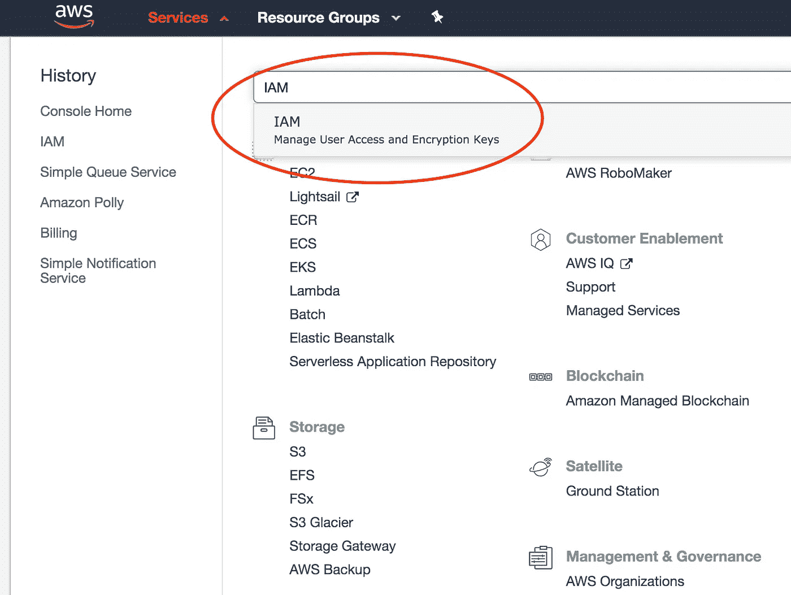
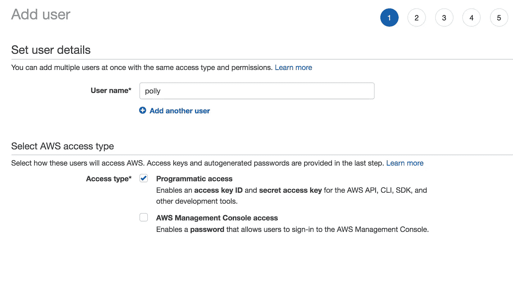
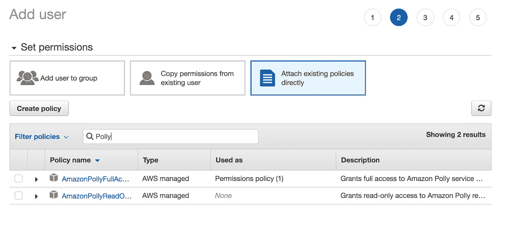
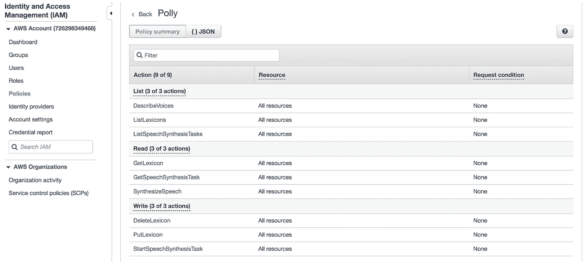
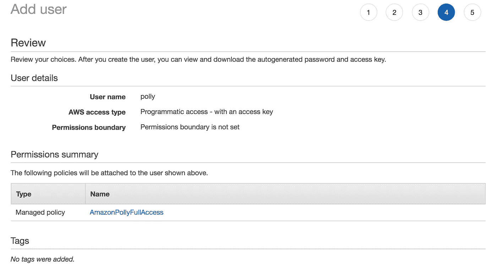
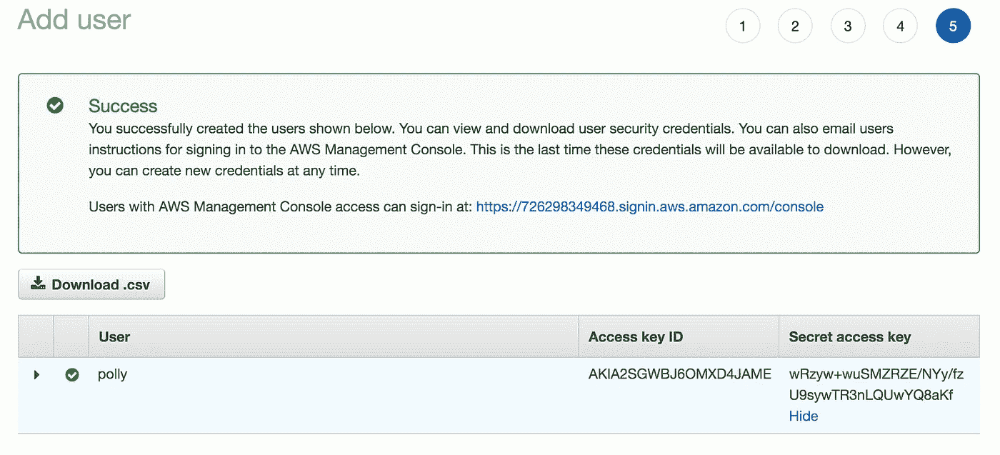

# 文本到语音:构建与 AWS Polly 和 Node.js 对话的应用程序

> 原文：<https://betterprogramming.pub/text-to-speech-build-apps-that-talk-with-aws-polly-and-node-js-a9cdab99af04>

## 深入探讨如何构建“会说话的应用程序”


图片来源:[https://unsplash.com/photos/OKLqGsCT8qs](https://unsplash.com/photos/OKLqGsCT8qs)

人机交互是一直渴望而又难以捉摸的东西。Polly 和 Google Text-to-Speech 等基于 Wavenets synthesis 的新服务让我们更加接近星际迷航时代，在这个时代，我们可以用自然的类似人类的声音进行口头交流，并从计算机系统获得实时反馈。

它们是值得你花时间的两项服务:谷歌 TTS 和 Polly，这是亚马逊的一项服务，可以将文本转化为逼真的语音，让你能够创建会说话的应用程序。

在本教程中，我们将利用 AWS Polly 和 Nodejs 创建一个应用程序，通过抓取像这样的中等文章来集成文本到语音合成。

# AWS Polly 的案例

Polly 与其他在线静态点击安装应用程序的不同之处在于，该服务使用了一个综合过程，利用深度学习来克服传统文本到语音系统的限制。

截至 2020 年 2 月 4 日，AWS 在亚马逊宣布了一个名为[品牌声音](https://aws.amazon.com/polly/features/#Brand_Voice)的[新功能。这使得客户或用户可以与人工智能研究科学家和语言学家组成的亚马逊 Polly 团队合作，帮助建立一个专属的、高质量的神经文本到语音(NTTS)语音，代表他们的品牌形象。](https://aws.amazon.com/blogs/machine-learning/build-a-unique-brand-voice-with-amazon-polly/)

Amazon Polly 带来的一个非常酷的功能是，你可以从各种不同的声音中进行选择，包括英语、德语、波兰语、意大利语、法语等。这有助于为与 Polly 集成的应用程序提供多样性和灵活性。利用 Polly 还可以让您接触到用英语语音交谈的非母语英语口音，这可能有助于某些人口统计数据更好地理解正在合成的内容。

# 入门指南

让我们进入 AWS Polly 的实际实现。下面的示例代码片段向您展示了如何开始使用 Polly。该代码绝不是一个成熟的应用程序，但它说明了这个概念，以及开始将 Polly 集成到 Node JS 应用程序中是多么容易。如果您利用 AWS SDK，所展示的概念在其他编程语言中实际上是相同的。

合成文本到声音样本录音

以上是 AWS Polly 语音合成生成的音频听起来是怎样的(我最喜欢的 AWS 语音之一。)

要开始使用 Polly，您将需要一个启用了计费的 AWS 帐户，尽管本教程将受到自由层资源的限制。

AWS Polly free tier 包括每月 500 万个字符的语音或语音标记请求，从您第一次请求语音开始，为期 12 个月。对于神经语音，免费层包括每月一百万个字符的语音或语音标记请求，前 12 个月，从您第一次请求语音开始。这对于在服务中获得实践应该是绰绰有余的。

要创建免费等级帐户，请在此创建帐户[进行注册。](https://aws.amazon.com/free/?all-free-tier.sort-by=item.additionalFields.SortRank&all-free-tier.sort-order=asc)

登录后，使用导航栏搜索 IAM 用户服务，如下所示。始终确保永远不要使用 AWS root 帐户(即帐户所有者的凭据)。IAM 用户允许您通过使用定义该用户可以执行的操作的策略，安全地控制 AWS 帐户中的用户对 AWS 服务和资源的访问。



IAM 用户菜单

点击`User` > `Add User` > `Check programmatic access only`，因为该用户只能通过代码调用 Polly 服务。



创建仅具有编程访问权限的 Polly 用户

下一步，我们要附加一个策略(权限)。出于简单和测试的目的，您可以授予`AmazonPollyFullAccess` **。**对于生产，建议您只选择您的应用程序需要的权限，以最小化安全风险。



设置 Polly 访问完全权限

要查看 Polly 访问权限的更多详细信息，请单击展开列表:



所有 Polly 权限的列表

点击`next` > `Add user`后，将显示总结页面。



添加用户概要页面

要了解更多关于 IAM 用户和权限边界的信息，您可以查看 [AWS](https://docs.aws.amazon.com/IAM/latest/UserGuide/access_policies_boundaries.html) 文档。完成用户创建后，备份您的凭证，因为您将需要在您的 [AWS CLI](https://docs.aws.amazon.com/cli/latest/userguide/cli-chap-configure.html) 中配置它们或者通过环境变量导出它们。



身份证明复查页面

# 先决条件

让我们开始构建我们的简单项目——一个将一小段文本合成为语音的简单用例。

首先，确保你已经安装了 Node JS [v11.10.0](https://nodejs.org/en/blog/release/v11.10.1/) 。如果 V11.10.0 节点安装与您现有的节点 JS 设置冲突，您可以选择 NVM 节点版本管理器，它允许您在一些节点应用程序绑定到特定版本的情况下在节点 JS 版本之间进行上下文切换。对于这个快速教程，我们将使用节点 11.10.0。作为 NPM 扬声器包输出音频，因为在 Mac OS 10.x 上较新版本的 Node JS 似乎有一些问题

使用 NVM 安装节点版本 11.10.0:

```
$ install nvm$ nvm install 11.10.0
```

让我们为名为`polly`的 Polly 应用程序创建一个工作目录，保存应用程序源代码，并将其作为当前目录。

# 构建 Polly 节点项目

```
$ mkdir polly$ cd polly$ npm init -y
```

`-y`参数指示 NPM 初始化创建一个具有预定义默认值的`package.json`。运行下面的命令来安装必需的强制 NPM 包，其中 AWS-SDK:是官方的 AWS SDK for JavaScript，speaker package 是可写的流实例，它接受 [PCM 音频](http://en.wikipedia.org/wiki/Pulse-code_modulation)数据并将其输出到您的扬声器。

```
$ npm install aws-sdk --save$ npm install speaker --save
```

创建一个新文件 index.js，并为必需的 NPM 包添加以下 NPM 导入语句:

```
const AWS = require('aws-sdk');
const Stream = require('stream');
const Speaker = require('speaker');
const fs = require('fs');
```

下一步，创建一个 Polly 客户机，作为 AWS Polly 服务的接口。客户端抽象出对 AWS Polly 服务的底层 REST API 调用:

创造。与 Polly AWS SDK 一起使用的 Speak 实例

如果您还没有将您的 AWS 凭证保存到 [AWS CLI](https://docs.aws.amazon.com/cli/latest/userguide/cli-chap-configure.html) ，您可以选择手动设置您下载的 AWS 访问凭证。根据您使用的 IDE，这些设置通常可以在运行配置首选项中找到。快速谷歌搜索“如何在`{IDE_NAME}`中定义环境变量”应该会找到一些有用的资源。或者，您可以使用终端并导出环境变量:

```
$ export AWS_ACCESS_KEY_ID={YOUR_ACCESS_KEY} && \
export AWS_SECRET_ACCESS_KEY={YOUR_SECRET_KEY} && \
export AWS_DEFAULT_REGION={YOUR_AWS_REGION}
```

# peech 合成标记语言

采用文本到语音转换还需要 SSML(语音合成标记语言)。

在某些情况下，您可能希望对 Polly 如何从文本生成语音进行额外的控制。例如，您可能希望语音中有较长的停顿，或者您可能希望将一串数字作为标准电话号码读出来。这就是 SSML 支持发挥作用的地方，因为它能让你更精细地控制文本应该如何合成，给它更自然的人类感觉。将 SSML 标签添加到您的文本是一个手动过程，如果您确切地知道要在您的文本中定义标签，则该过程可以自动化。

为了有助于自动化，还有其他替代方法，如情感分析，即对一段文本中表达的观点进行计算识别和分类的过程。本质上，这可以帮助我们以编程方式确定一个单词或句子是积极的，消极的，还是中性的，通过 SSML 标签，文本可以相应地用适当的 SSML 标签进行标记，以产生基于这些标准调整的语气。

尽管 SSML 标签定义是一个更复杂的过程——在电子书的情况下，具有人类元素和语音到文本合成文本有助于更好的收听体验，并且可能产生更接近自然人类语音的高质量录音。

```
<speak>
    <prosody volume="loud">This is my Jira-ticket</prosody>
    <break time="1s" /> There are many like it, but this one is mine. My Jira-ticket is my best friend. It is my life. I must master it as I must master my life. My Jira-ticket, without me, is useless. Without my Jira-ticket, I am useless. I must make my jira-ticket whole and complete it. Complete it i will
</speak>
```

要改变演讲的音量，你可以利用下面的标签。

*   `*volume="silen"t*`、`*x-soft*`、`*soft*`、`*medium*`、`*loud*`、`*x-loud*`:将当前语音的音量设置为预先设定的值。
*   `*+ndB*`:相对于当前音量水平增加音量。例如，`+0dB`表示音量没有变化。`+6dB`大约是当前振幅的两倍。最大正值约为`+4.08dB`。
*   `*-ndB*`:相对于当前音量水平降低音量。例如，`-6dB`表示电流幅度的大约一半。

有关 SSML 标签的更全面列表，请参见 AWS 开发者[文档](https://developer.amazon.com/it/docs/custom-skills/speech-synthesis-markup-language-ssml-reference.html)。上面的代码并没有做很多事情，它只是将你的文本转换成一个可听见的声音。我们可以更进一步，将流程自动化。

请注意，处理文本很简单，但是找出一种方法将它集成到您的应用程序中，以用于真实世界的用例，这才是真正的工作所在。下面我们将改变代码，这样我们可以自动阅读过程，以刮中等文章。我们首先需要利用一些节点包、cheerio 和 puppeteer，其中连字符 save 在 package.json 文件中创建条目。

请注意，抓取不应该用于删除未经授权的内容。确保预期目的不违反任何政策。

```
npm install cheerio  --save
npm install puppeteer  --save
npm install aw-sdk --save
```

让我们把代码放在一起，看看它看起来像什么:

中型文本到语音转换节点 Js 应用程序

# 最后的想法

从几年前开始，文本到语音已经有了很大的发展。有了深度学习，辨别机器合成文本和自然人类语音之间的差异可能不再那么容易。文本到语音转换可以帮助您创建更多功能、更易使用的应用程序。关于本教程中的完整源代码，请参见 [git repo](https://github.com/timothymugayi/polly) 。

我希望你喜欢这个教程。编码快乐！

如果你是中级新手，你可以通过点击这个链接加入[。你会费的一小部分将支持我的内容和这个平台上的许多伟大的专家。](https://medium.com/@timothymugayi/membership)