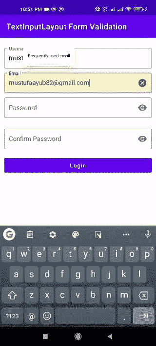
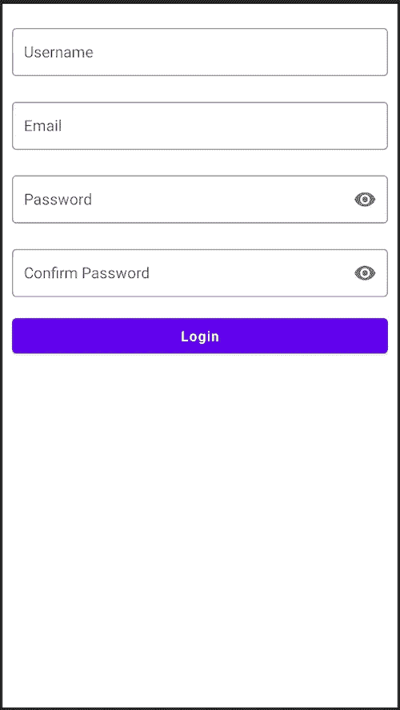

# Android 中使用数据绑定的 TextInputLayout 表单验证

> 原文：<https://betterprogramming.pub/textinputlayout-form-validation-using-data-binding-in-android-86aea8645a11>

## 一种更简单的表单验证方法


Christian Wiediger 在 [Unsplash](https://unsplash.com/s/photos/android?utm_source=unsplash&utm_medium=referral&utm_content=creditCopyText) 上拍摄的照片。

> “除非你通过多种方式学习，否则你什么都不懂”

答几天前，我在做一个项目，我必须使用数据绑定在`textInputLayout`和`textInputEditText`上实现表单验证。不幸的是，没有足够的文档来说明这一点。

最后通过一些研究和实验，达到了我想要的。这就是我想要实现的目标:



最终应用

所以我知道有很多开发人员想要相同的动作和用户友好的表单行为。让我们开始吧。

# 我们要用什么？

1.  科特林
2.  [数据绑定](https://medium.com/better-programming/android-data-binding-139686b65aec)
3.  [素材库](https://material.io/)

我将把整个项目分解成几个步骤，以便于你理解。

1 通过在`android{}`标签下添加这一行来设置初始项目并启用来自`build.gradle(:app)`的数据绑定:

```
dataBinding**{** enabled true
**}**
```

要使用`textInputLayout`和`textInputEditText`，您需要通过在`build.gradle(:app)`中添加该依赖项来启用对 Android 的材料支持:

```
implementation 'com.google.android.material:material:1.2.1'
```

让我们制作一个表单的布局。我把它变得简单，因为我的目标是定义这个特性的核心功能部分，而不是设计布局。

[](https://medium.com/better-programming/android-free-courses-3b550ce388e6) [## 成为成功的 Android 开发者的路线图

### 如果你想成为一名专业的 Android 开发者，请遵循这个路线图

medium.com](https://medium.com/better-programming/android-free-courses-3b550ce388e6) 

我做了这个简单的布局:



下面是`activity_main.xml`:

> *如果你对* `*<layout>*` *标签感到困惑，不用担心。这是我在之前的一篇文章* *中已经涉及到* [*的东西。*](https://medium.com/better-programming/android-data-binding-139686b65aec)

我们的布局已经准备好了。让我们现在做一些编码。

2 如果你看看最终应用程序的 GIF(本文前面)，你会看到当条件变为`true`时，错误是如何显示和隐藏的。这是因为我用`TextWatcher`绑定了每个文本字段，当用户在字段中键入内容时，它会不断调用。

在这里，我在`MainActivity.kt`内部创建了一个继承自`TextWatcher`的类:

不要担心`view`，它传入了类的构造函数。我稍后会定义它。

3 这里是主要部分。每个文本字段都有一些条件，在提交表单之前需要`true`。因此，每个文本字段条件的代码如下:

4 现在是时候用我们之前创建的`textWatcher`类绑定每个文本字段了:

但是`TextFieldValidation`如何知道绑定哪个文本字段呢？向上滚动，看看我在`TextFieldValidation`方法中提到的注释:

```
// checking ids of each text field and applying functions accordingly.
```

请注意，我在`TextFieldValidation`的构造函数内部传递了一个视图，这个类负责分离每个文本字段，并像这样应用上面的每个方法:

您的最终`MainActivity.kt`将如下所示:

运行应用程序，感受神奇之处:


您可以从下面下载该项目的完整源代码:

[](https://github.com/Mustufa786/TextInputLayout-FormValidation) [## mustufa 786/TextInputLayout-form validation

### 此时您不能执行该操作。您已使用另一个标签页或窗口登录。您已在另一个选项卡中注销，或者…

github.com](https://github.com/Mustufa786/TextInputLayout-FormValidation) 

我希望你学到了新的东西。请继续关注更多类似的文章。编码快乐！

关注 [CodixLab](https://medium.com/codixlab) 了解更多技术知识。

## 延伸阅读:

1.  [自定义错误屏幕代替默认崩溃对话框——Android](https://medium.com/codechai/custom-error-screen-instead-of-default-crash-dialog-android-8727ac2fcd50)
2.  [顶级安卓工作室快捷键](https://medium.com/better-programming/top-android-studio-shortcuts-d0d04cbd41ae)
3.  [成为 Android 开发者所需的基本技能](https://medium.com/swlh/basic-skills-required-to-become-an-android-developer-b98b3585ff35)
4.  [Android recycler 用漂亮的动画观看](https://medium.com/better-programming/android-recyclerview-with-beautiful-animations-5e9b34dbb0fa)