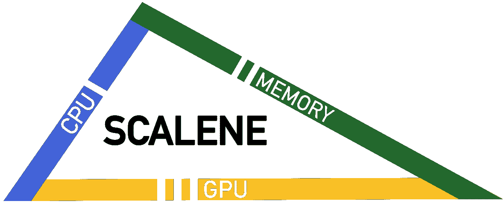
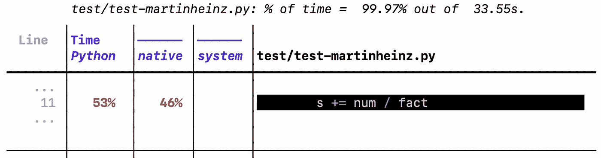

# 那次我优化了一个程序 5000 倍

> 原文：<https://betterprogramming.pub/that-time-i-optimized-a-program-by-5000x-155cb8cfd9f9>

## *TL；DR I 使用我们的 Scalene profiler 和一些数学方法使一个示例程序运行速度提高了 5000 倍。*



不规则体:[https://github.com/plasma-umass/scalene/](https://github.com/emeryberger/scalene/)，`pip install scalene`

我对 Python 性能非常感兴趣，所以我读了这篇文章——[https://martinheinz.dev/blog/64](https://martinheinz.dev/blog/64)，标题是*剖析和分析 Python 程序的性能*。它展示了一个示例程序(来自[https://docs.python.org/3/library/decimal.html](https://docs.python.org/3/library/decimal.html))并展示了如何使用几个过时的 Python 分析器来运行它。不幸的是，它没有带来多少可操作的信息，除了或多或少的“尝试 [*PyPy*](https://www.pypy.org/) ”之外，这将代码速度提高了大约 2 倍。我想知道我是否能够从 Scalene(一个我参与编写的分析器)那里获得更多有用的信息。

我们开发的 Scalene 比现有的 Python 分析器有用得多:它提供*行级*信息，从本地时间中分离出 Python，分析内存使用、GPU，甚至复制成本，所有这些都在一个行的粒度上。

无论如何，下面是在示例代码上运行 Scalene(只是使用 CPU 配置)的结果。真是开门见山。

```
% scalene --cpu-only --cli --reduced-profile test/test-martinheinz.py
```



您可以看到，几乎所有的执行时间都花在了计算`num`和`fact`之间的比率上，所以这确实是唯一可以集中精力进行优化的地方。运行本机代码花费了大量时间，这意味着这一行正在幕后执行一些 C 库。

原来是在分两个`Decimal`(又名 [bignums](https://en.wikipedia.org/wiki/Arbitrary-precision_arithmetic) )。底层的 bignum 库是用 C 代码编写的，速度非常快，但是特别是阶乘变得越来越快。在其中一个输入示例中，`fact`的最终值有 11000 位长！毫不奇怪:对如此庞大的数字做数学运算是昂贵的。让我们看看我们能做些什么来减少这些数字。

我注意到我们可以不从头开始计算`num / fact`,而是递增地计算:通过对非常小的数字进行计算，在每次循环迭代中更新一个变量。为此，我添加了一个新的变量`nf`，它总是等于比率`num / fact`。然后，在每次循环迭代中，程序通过将`nf`乘以`x / i`来更新`nf`。您可以通过观察以下内容来验证这保持了不变量`nf == num/fact`(其中`_new`表示每次迭代中更新变量的计算)。

```
nf == num / fact                  **# true by induction**
nf_new == nf * (x / i)            **# we multiply by x/i each time**
nf_new == (num / fact) * (x / i)  **# definition of nf**
nf_new == (num * x) / (fact * i)  **# re-arranging**
nf_new == num_new / fact_new      **# simplifying**
```

将它合并到原始程序中需要修改三行代码，所有代码后面都跟有`###`:

```
def exp_opt(x):
  getcontext().prec += 2
  i, lasts, s, fact, num = 0, 0, 1, 1, 1
  nf = Decimal(1)   **### was: = num / fact**
  while s != lasts:
      lasts = s
      i += 1
      fact *= i
      num *= x
      nf *= (x / i) **### update nf to be num / fact**
      s += nf       **### was: s += num / fact**
  getcontext().prec -= 2
  return +s
```

这个变化的结果就是，嗯，*戏剧性*。

在苹果迷你 M1 上，原始版本:

```
Original:1.39370958066637969731834193711E+65
5.22146968976414395058876300668E+173
7.64620098905470488931072765993E+1302Elapsed time, original (s):   33.231053829193115
```

优化版本:

```
Optimized:1.39370958066637969731834193706E+65
5.22146968976414395058876300659E+173
7.64620098905470488931072766048E+1302Elapsed time, optimized (s):  0.006501913070678711
```

超过一个 *5000X* 的加速比(准确的说是 5096)。

这个故事的寓意是，使用更详细的分析器(如 Scalene)可以通过可操作的方式定位低效，从而真正有助于优化工作。