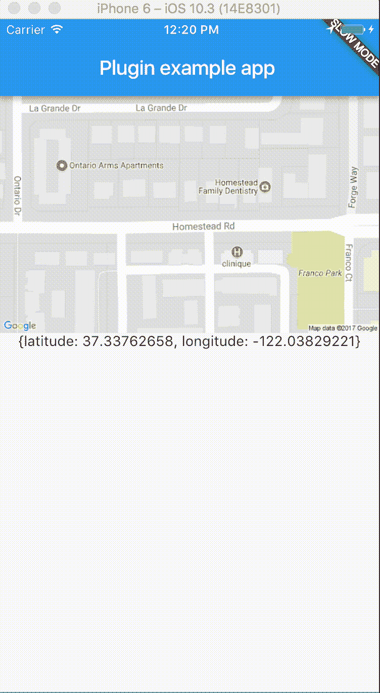

# 10 个最好和最受欢迎的 Flutter 软件包

> 原文：<https://betterprogramming.pub/the-10-best-and-most-liked-flutter-packages-f5813822e118>

## 现在就提高您的生产力和开发速度


作者插图

[Flutter](https://flutter.dev/) 是“谷歌的 UI 工具包，用于从单一代码库为移动、网络和桌面构建漂亮的本地编译的应用程序。”

Flutter 基于 Dart 编程语言。它在 [Dart.dev](https://pub.dev/) 上有一个庞大而活跃的社区，提供官方支持的和第三方的软件包，使 Flutter 开发更加高效。

本文列出了最有前途和最受欢迎的软件包，让您了解 Flutter 作为一个平台的成熟度。

如果你还没有这样做，请先阅读我的介绍文章。它会让你立刻建立并运行一个基本的 Flutter 项目。这可以让你很快尝试你最喜欢的包！

# 1.超文本传送协议

网址:[https://pub.dev/packages/http](https://pub.dev/packages/http)
适用于:iOS、Android、Web

如今一切都是基于网络的，所以健壮的 HTTP 库是必备的。这个 Dart 包包含一组高级函数和类，使得使用 HTTP 资源变得很容易。它由灾难援助反应队开发并积极维护。从 2012 年就有了，应该是坚如磐石！

该库提供了顶级函数，使得使用 HTTP:

```
import 'package:http/http.dart' as http;# Posting data
var url = 'https://example.com/whatsit/create';
var data = **{'name': 'Jack', 'age': 38};**var response = await **http.post(url, body: data)**;print('Response status: ${response.statusCode}');
print('Response body: ${response.body}');# A simple GET request
print(await **http.read('https://example.com/foobar.txt')**);
```

# 2.颤动 _ 可滑动

网址:[https://pub.dev/packages/flutter_slidable](https://pub.dev/packages/flutter_slidable)工作于:iOS、Android、Web


颤振 _ 可滑动动作示例([来源](https://pub.dev/packages/flutter_slidable))

flutter _ slidable 插件为你的项目添加了一个功能丰富的滑块部件。像这样的滑块经常出现在可滚动列表中。Gmail 应用程序是一个显著的例子，其中滑动列表项目极大地提高了工作效率。

这个插件包含了很多特性，随时可以使用，但是如果需要也可以高度定制。列出的一些功能包括:

*   接受主要(左/上)和次要(右/下)部件列表作为滑动动作
*   可以被驳回
*   四个内置操作窗格
*   两个内置的滑动动作部件
*   内置解散动画
*   轻松创建自定义布局和动画
*   点击滑动动作时关闭(可覆盖)
*   当最近的`Scrollable`开始滚动时关闭(可覆盖)
*   轻松禁用幻灯片效果的选项

# 3.共享偏好

网址:【https://pub.dev/packages/shared_preferences
[适用于:iOS、Android、Web、Linux](https://pub.dev/packages/shared_preferences)

这个包包装了特定于平台的持久存储库。它针对简单数据(如用户偏好)进行缩进，并使用:

*   在 iOS 和 macOS 上
*   `SharedPreferences`在安卓系统上
*   `LocalStorage`在网站上
*   Linux 本地文件系统上的 JSON 文件

数据可能异步持久化到磁盘，并且不能保证写操作在返回后会持久化到磁盘，所以这个插件不是用来存储关键数据的。查看 sqflite(见下文)。

# 4.sqflite

网址:[https://pub.dev/packages/sqflite](https://pub.dev/packages/sqflite)
适用于:iOS、Android、MacOS

这是为旋舞准备的 SQLite 插件。它支持 iOS、Android 和 MacOS。不支持 web，因为 web 浏览器中没有基于 SQL 的持久性系统。它的一些特点是:

*   支持事务和批处理
*   自动版本管理
*   插入/查询/更新/删除查询的助手
*   操作在 iOS 和 Android 的后台线程中执行，以防止 UI 锁定

如果您需要的不仅仅是基本的(`shared_preferences`)数据存储，请不要犹豫。

# 5.url _ 启动器

网址:[https://pub.dev/packages/url_launcher](https://pub.dev/packages/url_launcher)
工作于:iOS、Android、Web

这个插件帮助你启动一个 URL。URL 可以是以下类型:

*   HTTP:[http://example.org](http://example.org)和[https://example.org](https://example.org)
*   电子邮件:mailto:<e-mail address=""></e-mail>
*   电话号码:电话:
*   短信短信:短信:

基本用法非常简单:

```
**const** url = 'https://flutter.dev';**if** (**await** canLaunch(url)) {
  **await** launch(url);
} **else** {
  **throw** 'Could not launch $url';
}
```

# 6.视频播放器

网址:[https://pub.dev/packages/video_player](https://pub.dev/packages/video_player)
工作于:iOS、Android、Web


来自[发布和开发](https://pub.dev/packages/video_player)的图像和样本视频

支持许多格式，但这完全取决于您运行的平台。例如，iOS 和 Android 的支持库是不同的。此外，在网络上，支持的格式取决于您使用的浏览器。

请注意，尽管这个插件名为 video_player，但它也可以播放音频。因为这个插件已经相当成熟，并且已经达到了 API 的稳定性，所以把它用在音频上并不是一个坏主意。

该插件可以播放来自本地文件(资源)和远程服务器(如网站)的视频。对于一些示例代码，请前往[本页](https://pub.dev/packages/video_player/example)。

# 7.秘密党员

适用于:所有平台

从 Dart 团队本身来看，这是一组在纯 Dart 中实现的加密散列函数。这意味着你不需要外部库来完成这项工作。

支持以下哈希算法:

*   SHA-1
*   沙-224
*   SHA-256
*   SHA-384
*   SHA-512
*   讯息摘要 5
*   HMAC(即 HMAC-MD5，HMAC-SHA1，HMAC-SHA256)

因为这不是一个 GUI 工具，而仅仅是一个加密库，所以它可以在所有支持的平台上工作。

# 8.旋转木马 _ 滑块

网址:【https://pub.dev/packages/carousel_slider】T2
作品:iOS、Android、Web


来自[发布开发](https://pub.dev/packages/carousel_slider)的样品转盘

旋转滑块是许多应用程序和网站的一部分。carousel_slider 插件提供了一个优秀的可定制的 carousel，可以在多个平台上运行。

因为 carousel 接受小部件作为内容，所以您可以滑动任何可以作为小部件的东西。

关于真实的例子，你可以访问[这个网站](https://serenader2014.github.io/flutter_carousel_slider/#/)，它使用 Flutter web 来演示这个插件。

以下是如何在应用程序中创建旋转木马的示例:

```
**CarouselSlider**(
  options: CarouselOptions(height: 400.0),
  items: [1,2,3,4,5].map((i) {
    return Builder(
      builder: (BuildContext context) {
        return Container(
          width: MediaQuery.of(context).size.width,
          margin: EdgeInsets.symmetric(horizontal: 5.0),
          decoration: BoxDecoration(
            color: Colors.amber
          ),
          child: Text('text $i', style: TextStyle(fontSize: 16.0),)
        );
      },
    );
  }).toList(),
)
```

转盘有几个可配置的选项，例如:

*   高度和长宽比
*   启用无限滚动
*   反转旋转木马
*   以可配置的时间间隔、动画持续时间启用自动播放
*   定义滚动方向(垂直、水平)

# 9.小路

网址:[https://pub.dev/packages/path](https://pub.dev/packages/path)
工作于:iOS、Android、Web

路径既简单又极其复杂，因为它们因平台而异。为了确保不会在代码中引入错误或安全漏洞，在处理路径时，请始终使用路径库。要使用当前操作系统的文件分隔符连接目录和文件，请使用:

```
import 'package:path/path.dart' as p;
**p.join('directory', 'file.txt');**
```

# 10.位置

网址:[https://pub.dev/packages/location](https://pub.dev/packages/location)
适用于:iOS、Android、Web、MacOS

手机的一大优点是其移动性和精确追踪位置的能力。这已经给了我们许多有用的应用。Flutter 的位置插件使得访问当前位置变得很容易。当位置改变时，它提供回调。它还提供 API 端点来正确请求访问用户的位置。



使用位置插件的示例 Flutter 应用程序([来源](https://pub.dev/packages/location)

这是我的前十名。你最喜欢的颤振包有哪些？请在评论中告诉我！

[](https://medium.com/tech-explained/the-dart-programming-language-in-five-minutes-12990caccca1) [## Dart 编程语言五分钟

### 对于那些已经熟悉类似语言的人来说，比如 Java、Kotlin、C++和 C#

medium.com](https://medium.com/tech-explained/the-dart-programming-language-in-five-minutes-12990caccca1)