# 我不能没有的 10 个浏览器扩展

> 原文：<https://betterprogramming.pub/the-10-browser-extensions-i-cant-live-without-df651612d602>

## 改善您的浏览器体验的有用附件

改编自 upklyak 于[freepik.com](https://www.freepik.com/vectors/infographic)出版的《资产》

扩展。如果没有它们，我们的浏览器会怎样？就像没有星星的天空。没有树木的森林。一片没有——好了，你明白了。

以下是我在浏览器上安装的扩展的概要，这些扩展让我的生活变得简单多了。话不多说，这里有 10 个我离不开的浏览器扩展。

# [黑暗阅读器](https://darkreader.org/)

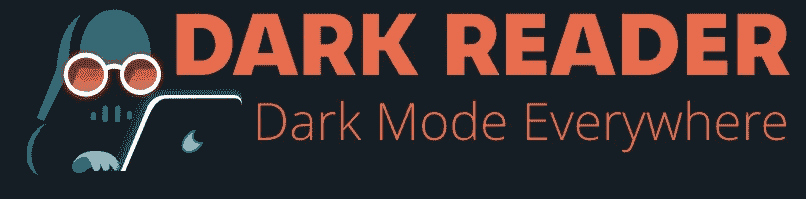

Dark Reader 是一个眼部护理扩展，允许您轻松调整网站的显示方式，以符合您的舒适度并减少眼睛疲劳。该扩展预配置了一个暗主题和一个亮主题，但也允许对显示设置进行更精细的控制，例如亮度和对比度。

除了全局关闭扩展的选项之外，您还可以禁用某些网站的扩展，以及配置特定网站的设置。

鉴于我们大多数人花费大量时间盯着屏幕，这一扩展提供了一种非常需要的替代方法，可以简单地调整屏幕的亮度。

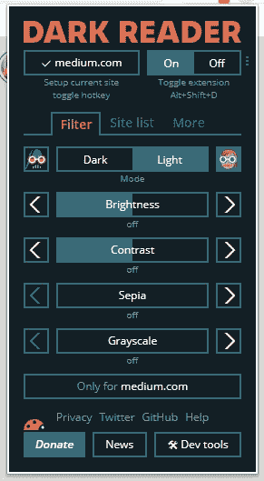

**费用:**免费
**支持的浏览器:** Chrome、Firefox、Safari、Edge

# [ColorZilla](https://www.colorzilla.com/chrome/)

ColorZilla 是图形设计人员和 web 开发人员的一个极好的扩展，它同时具有吸管、颜色选择器、渐变生成器和一系列其他工具的功能。

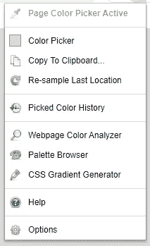

**费用:**免费
**支持的浏览器:** Chrome、Firefox

# [伟大的吊杆](https://chrome.google.com/webstore/detail/the-great-suspender/klbibkeccnjlkjkiokjodocebajanakg) *

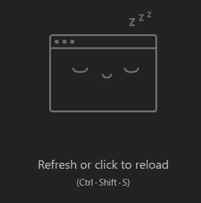

悬挂的标签

你的浏览器现在打开了多少个标签页？没关系，我不会评判。我们时不时都会患上无限标签综合症。

唯一的问题是，随着打开标签数量的增加，浏览器占用的内存也在增加，导致潜在的体验变慢。进入大吊杆。你猜对了，这个扩展会定期暂停不活动的标签，这样它们就不再消耗内存。

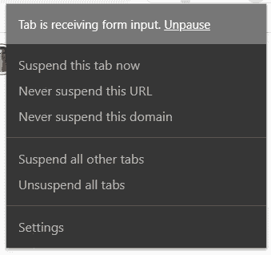

它还会注意到哪些标签正在播放媒体，并排除它们被暂停的可能性——如果你在一个标签中听音乐，而在另一个标签中工作，这是一个重要的功能。此外，您还可以手动排除选项卡。

现在你可以打开尽可能多的标签页，而不会感到内疚！

**费用:**免费
**支持浏览器:** Chrome

* *更新:近期未知* [*变化*](https://github.com/greatsuspender/thegreatsuspender/issues/1175) *对扩展* [*潜在恶意行为的担忧*](https://www.reddit.com/r/chrome/comments/jjgniz/the_great_suspender_recently_updated_to_718_on/) *。在知道这些变化到底有什么作用之前，最好禁用或卸载它。*

# [ExpressVPN](https://www.expressvpn.com/vpn-software)

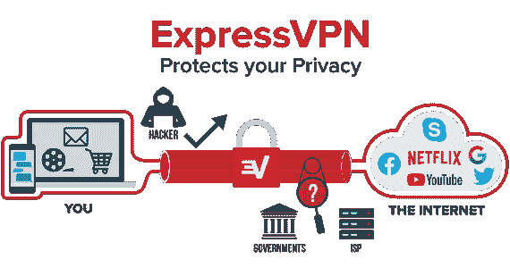

来源:“[什么是 VPN？](https://www.expressvpn.com/what-is-vpn)

如果你在网上做任何事情，虚拟专用网络(VPN)是必备的。除了提供安全和隐私等可能不太令人兴奋的功能之外，VPN 还允许你通过在线更改位置来绕过审查或地理屏蔽内容。

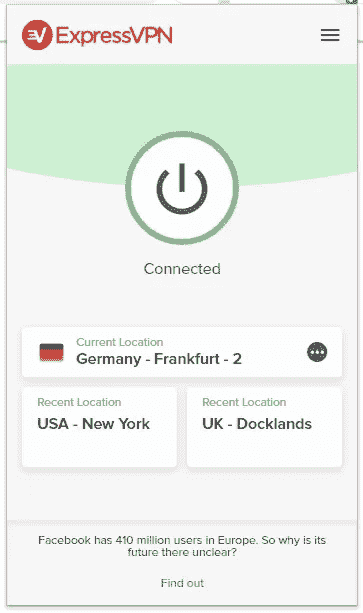

ExpressVPN 只是众多选项中的一个。我在这里提到它只是因为它是我碰巧有的。不过，到目前为止，我还是挺满意的。

**费用:**查看定价信息[此处](https://www.expressvpn.com/support/troubleshooting/frequently-asked-questions/)
**支持的浏览器:** Chrome、Firefox、Edge

# [Vimium](https://chrome.google.com/webstore/detail/vimium/dbepggeogbaibhgnhhndojpepiihcmeb)

这是为那些不喜欢经常把手从键盘上拿开的人准备的。

Vimium 在视觉方面并没有太多值得夸耀的地方，但那只是因为它在幕后施展了所有的魔法。它所做的是为浏览器à la Vim 提供键盘快捷键，这是一个受程序员欢迎的文本编辑器，以其复杂的键映射使用效率而闻名。

我自己不是 Vim 用户，所以我很快就把 Vimium 的默认快捷键改成了我更熟悉的。现在，我可以锁定标签、复制标签、四处移动标签、滚动页面、聚焦输入字段、在历史中向前和向后导航，以及我个人最喜欢的点击链接——所有这些都不需要伸手去抓鼠标。

而这只是 Vimium 提供的控件的一小部分。

看，妈妈，没有老鼠！

**费用:**免费
**支持的浏览器:** Chrome、Firefox

# [dict.cc](https://chrome.google.com/webstore/detail/dict-cc/nknonnojlmhnmjhpeokdbeineeajcemh)

dict.cc 是基于网站 [dict.cc](http://dict.cc) 的双语词典扩展。在将它添加到我的浏览器之前，每当我遇到一个不熟悉的单词，我总是不得不导航到一个新的标签，访问网站，并搜索它。这个扩展允许我在不离开页面的情况下完成同样的事情。

**费用:**免费
**支持浏览器:** Chrome

# [最后一道工序](https://www.lastpass.com/)

为每个新账户设置密码的日子已经一去不复返了(或者到头来到处都用同一个密码)。密码管理器允许您为每个单独的帐户生成强密码，同时只需记住一个允许您访问它们的主密码。

再说一遍，LastPass 只是众多提供这项服务的公司之一。无论你最终选择哪一个，在网上冲浪时，你都少了一件烦心事。

**费用:**免费
**支持的浏览器:** Chrome、Firefox、Edge、Opera

# [语法上](https://www.grammarly.com/)

对于任何在网上写内容的人来说，这是显而易见的。Grammarly 将帮助你发现拼写、语法和标点符号错误，并提出文体建议。总的来说，这会提高你的写作质量，提供更好的写作体验。

值得注意的是，和任何事情一样，语法上并不完美。因此，最重要的是，相信你的直觉，不要盲目接受它所暗示的一切。然而，这是一个绝对值得拥有的工具。

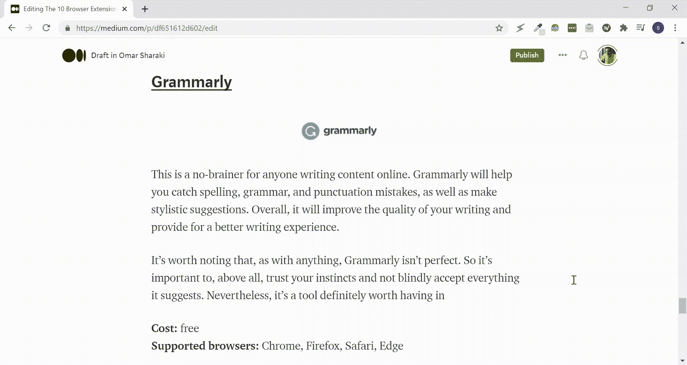

**费用:**免费 **支持的浏览器:** Chrome、Firefox、Safari、Edge

# [**RSS 提要阅读器**](https://feeder.co/)

切断了与脸书新闻频道的联系后，我需要一种新的方式来保持消息灵通。我过去常常通过我关注的各种新闻页面获取每日世界新闻。就在那时，我遇到了 RSS 阅读器，它的核心，正如它的名字已经给出的那样，将你订阅的所有 RSS 源收集到一个地方。它还使得组织这些提要和订阅新提要变得非常容易。

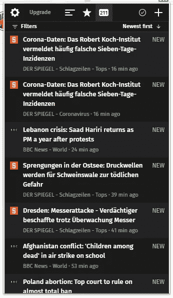

**费用:**免费
**支持的浏览器:** Chrome、Firefox、Edge

# [！砰](https://chrome.google.com/webstore/detail/bang-quick-search/kcopjlobikiakoacoadbnghpdcmngali)

一声巨响

我以前写过刘海如何帮助你[避免在网上分心](https://medium.com/illumination-curated/2-simple-tips-to-kill-2-major-web-distractors-f98b9794b569)。一个 *bang，*只是一个`!`的别称，允许你搜索网站并直接找到结果，而不必首先访问网站。例如，要使用 bangs 进行 YouTube 搜索，只需在地址栏中键入`!yt`,然后输入搜索词。

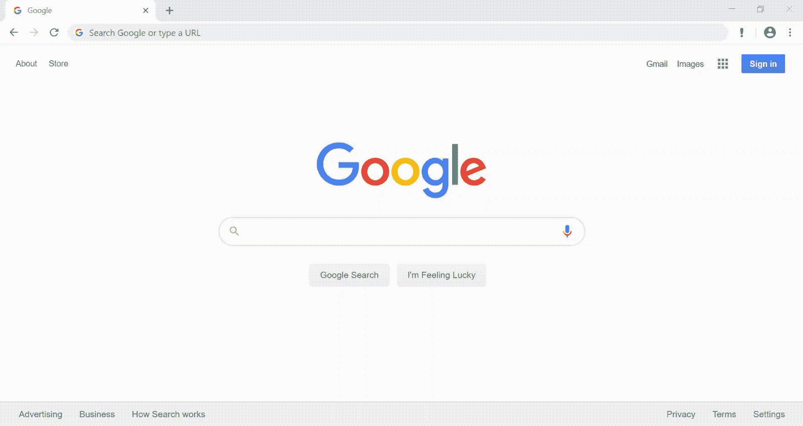

使用刘海不仅效率更高，而且也是一种保持专注的好方法，可以浏览 YouTube 等网站诱人的登录页面，只看到你想要的内容。另外，你什么时候才能说，“我开始搜索了！”

我会出去的。

**费用:**免费
**支持的浏览器:** Chrome

# 荣誉奖:[火花记录器](http://www.sparklogger.com/)

如果不提 Spark Logger，那我就失职了，这是我自己开发的一个扩展，用来解决我在 SparkPeople.com 上的一个个人痛点，我用这个平台来跟踪我的食物。

我从来不喜欢这个网站的界面，也不喜欢它强迫你一次记录一种食物的方式(如果你的食物和我的一样多样化，那将是一场噩梦)。所以我开始制作火花记录器。这里有一个使用 SparkPeople 和不使用 Spark Logger 的比较。

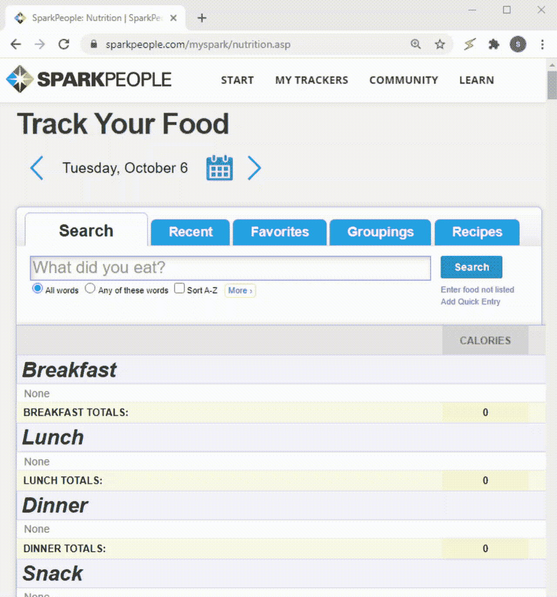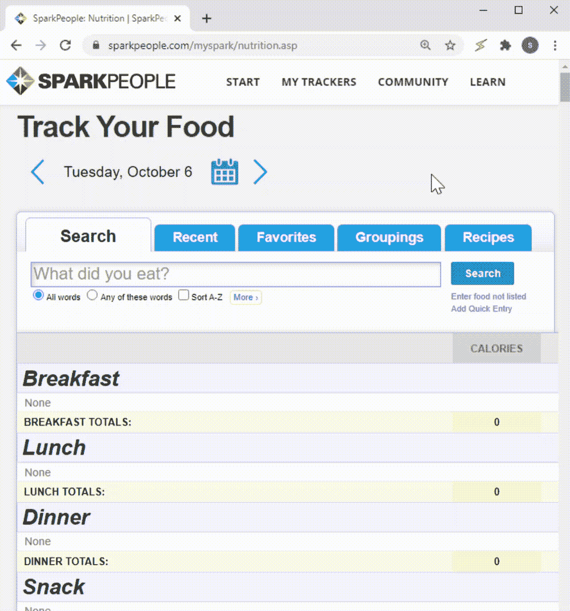

Spark Logger 通过允许您一次添加多个条目，以及其他功能，使添加食物条目更加简化

虽然它的用处仅限于一个网站，但对于使用该网站的人来说，它可以节省大量的时间和精力。

**费用:**免费
**支持浏览器:** Chrome

# 结论

现在你知道了！我每天使用的十个(+1)浏览器扩展帮助我完成任务。我希望你会发现其中一些也很有用。

我很想听听你们的想法，并回答你们可能有的任何问题。