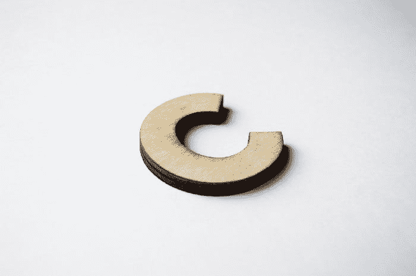

# 过去 50 年中最有影响力的 10 种编程语言及其创造者

> 原文：<https://betterprogramming.pub/the-10-most-influential-programming-languages-of-the-last-50-years-and-their-creators-6559bb9ce224>

## 我列出了过去 50 年中最有影响力的 10 种编程语言及其创造者。

凯文·Ku 在 [Unsplash](https://unsplash.com?utm_source=medium&utm_medium=referral) 上的照片

软件世界中有许多编程语言，而且每年都有越来越多的语言被开发出来。最近我们已经发布了 [Scala](http://javarevisited.blogspot.sg/2018/01/10-reasons-to-learn-scala-programming.html#axzz550Ppgfxg) 、 [Kotlin](https://javarevisited.blogspot.com/2018/02/kotlin-vs-java-which-language-android.html) 、 [Go](https://medium.com/javarevisited/5-free-golang-courses-for-beginners-to-learn-online-22ff73d31721) 、 [Kotlin](https://medium.com/javarevisited/top-5-courses-to-learn-kotlin-in-2020-dfc3fa7706d8) 和 Closure，但是历史表明只有极少数能够存活下来。

这些语言对软件开发世界做出了巨大的贡献，这也是它们入选过去 50 年中最有影响力的 10 种编程语言的原因。

由于[编程语言](https://medium.com/javarevisited/top-5-programming-languages-for-web-development-in-2021-f6fd4f564eb6)是软件开发世界中唯一最重要的东西，并且多年来经常被讨论、批评和改进，当有人使用一种编程语言却不知道它背后的历史时，这让我很困扰。

虽然这种情况在流行的编程语言中不太常见，比如人人都知道詹姆斯·高斯林是 Java 之父，但并不是每个开发人员都知道是谁创造了 Perl、Pascal、Lisp 或 Erlang。

这促使我收集并分享十种最流行、最成功的编程语言背后的程序员和设计师的名字。

# 十大编程语言及其创造者

以下是我列出的十大编程语言及其创造者。语言排名不分先后，但由于我是一名 [Java 开发人员](https://javarevisited.blogspot.com/2018/05/10-tips-to-become-better-java-developer.html#axzz5jwmmAbXI)并且从 [Java](https://medium.com/javarevisited/10-free-courses-to-learn-java-in-2019-22d1f33a3915) 中受益匪浅，我毫不犹豫地将它放在首位。

我知道许多 C 程序员不会同意我的观点，因为 [C](https://medium.com/javarevisited/9-free-c-programming-courses-for-beginners-2486dff74065) 是仍然经常使用的最古老的语言，但这个列表不是为了排名，而是为了了解和记住在编程语言和软件开发领域做出贡献的大师级程序员。

## 1.爪哇—詹姆斯·高斯林

Java 是最流行和最成功的编程语言之一。James Arthur Gosling 博士发明了 Java，并被誉为 Java 编程语言之父。

Java 最初是由 Sun Microsystems 开发和支持的，在 2010 年 1 月收购 Sun Microsystems 后，现在由 Oracle 开发和支持。

Java 是带着 WORA 的使命*“一次编写，随处运行”*而 Java 的平台独立性是其在企业世界中成功的支柱之一。

迄今为止，它是最流行的应用程序编程语言之一。如果你对学习 Java 感兴趣，那么 [**完整的 Java Masterclass**](https://click.linksynergy.com/fs-bin/click?id=JVFxdTr9V80&subid=0&offerid=323058.1&type=10&tmpid=14538&RD_PARM1=https%3A%2F%2Fwww.udemy.com%2Fjava-the-complete-java-developer-course%2F) 课程是一个很好的起点。

[诺兰·伊萨克](https://unsplash.com/@nolanissac?utm_source=medium&utm_medium=referral)在 [Unsplash](https://unsplash.com/?utm_source=medium&utm_medium=referral) 上发表的“笔记本电脑旁杯子里的郁金香图案拿铁艺术”

## 2.丹尼斯·里奇

美国计算机科学家丹尼斯·麦卡利斯泰尔·里奇于 1967 年至 1973 年间在美国电话电报公司贝尔实验室创造了 C 程序语言。

[C](https://medium.com/javarevisited/10-best-c-programming-courses-for-beginners-2c2c1f6bcb12) 仍然非常流行，在系统编程中被广泛使用。它比 Java 古老，但仍然保持着它的优势。

对了，丹尼斯·里奇还和他的老同事肯·汤普森一起创造了世界闻名的 [UNIX](http://www.java67.com/2018/02/5-free-linux-unix-courses-for-programmers-learn-online.html) 操作系统。

如果你把他的受欢迎程度与比尔·盖茨或史蒂夫·乔布斯相比，他是望尘莫及的，但他对软件世界的贡献却无人能及。

每个程序员都应该知道丹尼斯·里奇和他对编程世界的贡献。如果你想学 C，你应该加入 Coursera 上 C 专业 的 [**编程入门。像其他 Coursera 认证一样，所有课程都是免费的，但你需要为认证付费。**](https://click.linksynergy.com/deeplink?id=JVFxdTr9V80&mid=40328&murl=https%3A%2F%2Fwww.coursera.org%2Fspecializations%2Fc-programming)

而且，如果你觉得 Coursera 的课程有用，那么你也可以加入 Coursera Plus ，这是 Coursera 的一个订阅计划，让你可以无限制地访问他们最受欢迎的课程、专业课程、**专业证书、**和指导项目。它每年花费大约 399 美元，但是它完全物有所值，因为你可以获得无限的证书。

照片由 [Nikhil Mitra](https://unsplash.com/@nikhilmitra?utm_source=medium&utm_medium=referral) 在 [Unsplash](https://unsplash.com/?utm_source=medium&utm_medium=referral) 上拍摄

还有如果你想学习数据结构，那你就享受 C **这些 [**免费的数据结构和算法课程吧。**](http://javarevisited.blogspot.sg/2018/01/top-5-free-data-structure-and-algorithm-courses-java--c-programmers.html)**

## 3.C++ —比雅尼·斯特劳斯特鲁普

比雅尼·斯特劳斯特鲁普，1950 年 12 月 30 日出生于丹麦的奥尔胡斯，是一名丹麦计算机科学家，以创造和开发广泛使用的 C++编程语言而闻名。

[C++](https://hackernoon.com/top-5-free-c-courses-to-learn-programming-in-2019-d27352277da0) 顾名思义，是在 C 流行的时候作为下一代语言开发的。它带有面向对象的编程特性，与更结构化的 C 编程相比，这被认为是非凡的。

C++ 仍然是最流行的语言之一，因为它与本地系统非常接近，并且具有流行的面向对象特性，所以在高频交易领域被广泛使用。

如果你想从零开始学 C++的话，我推荐 Udemy 上的 [**开始 C++编程——从入门到超越**](https://click.linksynergy.com/deeplink?id=JVFxdTr9V80&mid=39197&murl=https%3A%2F%2Fwww.udemy.com%2Fbeginning-c-plus-plus-programming%2F) 。它将理论和实例恰当地结合在一起。

[Dawid za wia](https://unsplash.com/@davealmine?utm_source=medium&utm_medium=referral)在 [Unsplash](https://unsplash.com/?utm_source=medium&utm_medium=referral) 上拍摄的“站着并靠在带有 C 标志的地下停车场柱子上的黑白照片”

如果你不介意从免费资源中学习，那么你可以查看这些免费的 C++课程****来开始学习。****

## ****4.Python 吉多·范·罗苏姆****

****Python 是由 CWI 的吉多·范·罗苏姆设计的，是一种通用的高级编程语言，其设计理念强调代码可读性。据说它的语法清晰而富有表现力。****

****在美国， [Python](http://www.java67.com/2018/02/5-free-python-online-courses-for-beginners.html) 在学术层面已经大部分取代了 Java。与上一代不同，学生们已经开始学习使用 Python 而不是 C 或 Java 编程。****

****如果你还不确定开始编程时是用[2023 年 Java 程序员应该学习的 10 件事](https://hackernoon.com/top-5-courses-to-learn-python-in-2018-best-of-lot-26644a99e7ec#axzz5atl0BngO)
[每个程序员都必须阅读的 10 本书](http://www.java67.com/2015/03/10-books-every-programmer-and-software-engineer-read.html)
[提高编程技能的 10 个技巧](http://javarevisited.blogspot.sg/2014/01/10-tips-to-improve-programming-skill-become-better-programmer.html#axzz553pz1hYh)
[每个软件开发人员都应该知道的 10 个工具](http://javarevisited.blogspot.sg/2018/01/10-tools-every-software-developer-know.html#axzz559dyoLSA)
[深入学习软件架构的 5 门课程](https://javarevisited.blogspot.com/2019/03/5-courses-programmers-can-join-to-learn.html#axzz5jKqbGRcg)
[Java 程序员应该知道的 20 个库和 API](https://javarevisited.blogspot.com/2018/01/top-20-libraries-and-apis-for-java-programmers.html)**** 

****感谢阅读这篇文章。我很重视您的时间，也很欣赏您到目前为止所阅读的内容。****