# 2021 年给网络开发者的 11 个最佳 Chrome 扩展

> 原文：<https://betterprogramming.pub/the-11-best-chrome-extensions-for-web-developers-in-2021-c6a73fc7c58d>

## **提升您的 web 开发工作流程**

作者图片

作为开发人员，我们每天使用浏览器做各种各样的事情——从谷歌搜索、寻找解决堆栈溢出问题的方法到在 Reddit 上浪费时间(是的，我也是其中之一),还有测试运行我们正在开发的应用程序。在这种情况下，为正确的工作配备正确的工具至关重要。

大约一年前，我写了同样的帖子，我收集了很多反馈。从那以后，我尝试了许多其他扩展，其中一些是读者推荐的，我喜欢它们。

今天我将为开发者分享我最新最棒的 chrome 扩展列表。

# axe DevTools —网页可访问性测试

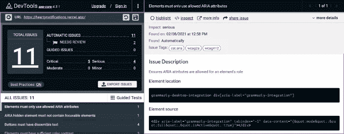

axe DevTools —网页可访问性测试

易访问性应该是任何 web 开发人员最优先考虑的事情之一。虽然 Chrome 的内置[灯塔](https://chrome.google.com/webstore/detail/lighthouse/blipmdconlkpinefehnmjammfjpmpbjk?hl=en)有各种参数可以在网站上测试，但如果你非常关心项目中的 [a11y](https://www.a11yproject.com/) 问题，Axe Dev Tools 会很有帮助。

这是一个快速、轻量、强大的测试工具，使用了由 Deque 开发的[axe-core](https://github.com/dequelabs/axe-core)accessibility engine。

特点:

*   附带智能引导测试:您可以使用简单的 QnA 格式进行更高级的测试。它在后台使用机器学习来快速识别和修复问题。
*   组件级测试:如果您想测试 web 页面元素的特定部分，这很有帮助。
*   导出、保存和共享:您可以轻松地与您的团队共享测试结果。
*   还剩下什么要测试？:这是一个不同的测试报告，对于手动测试来说非常方便。

[下载扩展](https://chrome.google.com/webstore/detail/axe-devtools-web-accessib/lhdoppojpmngadmnindnejefpokejbdd)

# 滴管

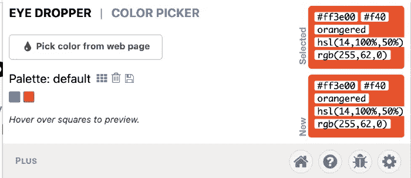

滴管

这是一个开源的扩展，如果作为一个前端开发人员，你很快想知道一些其他网站在它的一个元素中使用什么颜色或十六进制代码，这是很有用的。

它不仅可以从网页中选择颜色，还可以从颜色选择器中选择颜色，以实现更精细的控制。

特点:

*   从网页中选择一种颜色:当你选择一种颜色时，它会自动将十六进制代码复制到你的剪贴板中。
*   从颜色选择器中选择一种颜色:通过其集成的颜色选择器，您可以手动找到您需要的颜色以及不同的颜色值。
*   从历史中选择一种颜色:选择的每种颜色都将像调色板一样存储起来，这样当你以后回来时，所有的颜色都唾手可得。
*   开源:所有代码都在 GitHub 库上开源。

[下载扩展](https://chrome.google.com/webstore/detail/eye-dropper/hmdcmlfkchdmnmnmheododdhjedfccka)

# 格雷珀

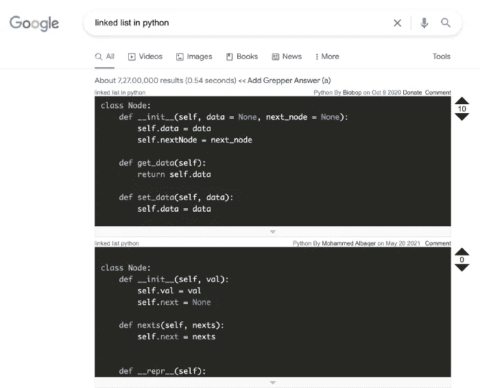

格雷珀

对于开发者来说，Grepper 是一个重要的扩展，因为它将 Stack Overflow 社区和 Google 的力量结合在了一起。正如你所看到的，我们在 Google 中搜索了术语“python 中的链表”, Grepper 所做的就是在搜索结果页面上找到其社区成员给出的解决方案！

特点:

*   轻松获取代码答案:你可以在谷歌搜索中找到常见编码问题的答案！
*   保存代码答案:如果你喜欢重新访问你喜欢的解决方案，你可以随时保存它。
*   为社区做贡献:如果你知道一个搜索查询的答案，你可以很容易地添加你的代码作为贡献。
*   Upvote/downvote:在某些情况下，你会看到你搜索的一个问题的多个答案。在这种情况下，如果你认为其中一个答案更好，而另一个是错误的，那么你可以相应地进行 upvote/downvote。

[下载扩展](https://chrome.google.com/webstore/detail/grepper/amaaokahonnfjjemodnpmeenfpnnbkco)

# Hackertab.dev

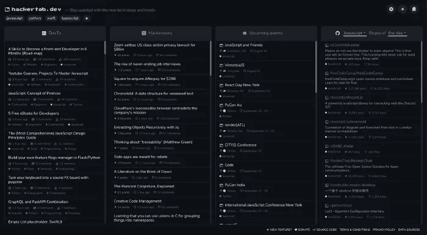

Hackertab.dev

您的新标签页可以包含开发人员行业的最新动态。Hackertab.dev 扩展定义了这一点。如果你懒得打开多个标签——一个用于参加开发活动，一个用于阅读文章，另一个用于查看 GitHub 上的趋势，那么让这个成为你的新朋友。

这取代了你新的 Chrome 标签页，它包含了各种各样的信息，从所有的开发者资料到最好的工具、新闻、工作和事件。

特点:

*   每日更新内容:每天都有新的事情发生，Hackertab.dev 确保您每天都能获得新鲜的信息。
*   个性化的兴趣:你可以很容易地改变你想得到的信息的主题。无论是关于特定的语言、要显示的卡片、以紧凑模式查看等等。
*   可靠的数据提供者:内容来自流行的网站，如 GitHub、Hackernews、DEV Community、Stack Overflow 等。
*   开源:全部代码都在 GitHub repo 上，你也可以在这里投稿。

[下载扩展](https://chrome.google.com/webstore/detail/hackertabdev/ocoipcahhaedjhnpoanfflhbdcpmalmp)

# 每日发展

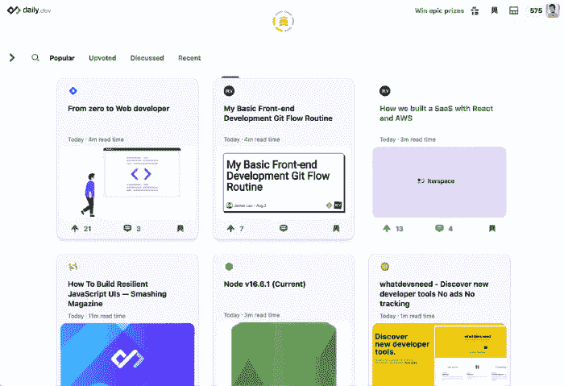

每日发展

Daily.dev 是一个 Chrome 扩展，提供了技术和开发领域所有最新最棒的信息。这个提要是根据你的喜好个性化的，来自世界各地的开发者用这个节省了大量的时间。

你不必从一个新闻/博客位置跳到另一个位置，全世界有超过 10 万的开发者在使用它！

顺便说一句，你知道我们的出版物上了他们的名单，我们的一些文章被特别报道了吗？

特点:

*   手选来源:你对某个你喜欢的网站有偏好吗？从 400 多个来源中挑选，只从这些来源获取内容！
*   标签:开发世界中所有最热门的话题都是按标签分组的，所以如果你想了解#cloud、#aws 和#frontend，那么你的 feed 将会被个性化。
*   永远不要错过一个趋势:一旦在网站上发布了全新的内容，你就会得到它。Daily.dev 获取这些内容并提前向您展示，以便您了解最新的更新！
*   社区:这是 daily.dev 与其竞争对手的区别。有一个完整的学习者、开发者和其他人的社区，你可以在那里评论别人的文章，在社交网站上分享，甚至可以收藏你最喜欢的文章。

[下载扩展](https://chrome.google.com/webstore/detail/dailydev-the-homepage-dev/jlmpjdjjbgclbocgajdjefcidcncaied)

# 八接头

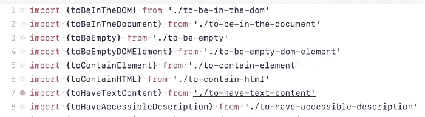

八接头

如果你曾经想要在从一个文件/文件夹导入到另一个文件/文件夹的多行文件之间来回切换，并发现它令人沮丧，那么 OctoLinker 就来拯救你了。

OctoLinker 是 GitHub 的一个浏览器扩展，它将特定于语言的语句如 include、require 或 import 转换成链接。

因此，当您打开一个包含多个导入语句的文件时，如果您想快速打开它，只需将鼠标悬停在链接的文件上并单击打开即可。这与 VSCode 中的工作方式非常相似！

特点:

*   相对文件:它使用 GitHub API 获取链接文件存储库的树形结构。
*   API 文档:它链接到流行工具的 API 文档，如 NodeJS、Python、Oracle 或 Ruby！
*   依赖性发现:在 package.json 这样的文件中定义的依赖性可以很容易地通过它们的源代码找到。
*   Pull 请求:在代码审查中，OctoLinker 链接 Pull 请求上的依赖项和文件。

[下载扩展](https://chrome.google.com/webstore/detail/octolinker/jlmafbaeoofdegohdhinkhilhclaklkp)

# 八叉树

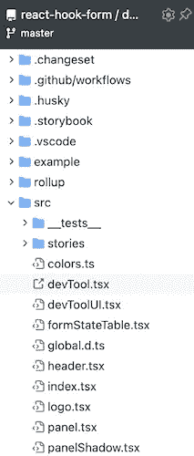

另一个方便的类似 VSCode 的 GitHub 扩展是 Octotree。这实际上构建了 Github 存储库的整个项目结构的树。

每当您导航到一个 repo 时，它都会显示为一个侧栏，您可以打开它来查看 repo 中的全部内容或文件，甚至无需导航到不同的文件夹。不仅如此，它还可以用于你的私人回购——只要给它令牌，你就可以开始了！

特点:

*   代码审查:您可以在任何拉请求或提交中轻松地在文件和注释之间跳转。
*   多重主题:Octotree 不仅仅停留在常规的明暗主题上。它有大约 20 多个主题以及图标主题、代码字体选择等。
*   多个标签:只需双击侧边栏，在新标签上打开一个新文件。所以现在你可以在 Github repo 中打开多个文件标签！
*   基于树的搜索:你可以搜索嵌套很深的文件，并把它们标记为书签，以便以后访问。

[下载扩展](https://chrome.google.com/webstore/detail/octotree-github-code-tree/bkhaagjahfmjljalopjnoealnfndnagc)

# React 开发人员工具

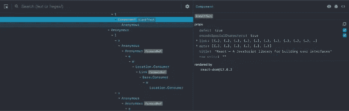

React 开发人员工具

如果您正在积极从事基于 React 的项目，您可能已经听说过它。当涉及到调试时，没有什么比这个扩展更好的了。

它允许你在 Chrome 开发者工具中检查 React 组件的层次结构。默认情况下，当你打开开发工具时，这个扩展带有两个标签:“⚛️组件”和“⚛️剖析器”

特点:

*   Components 选项卡:它向您显示页面上呈现的所有 React 组件。这样，您还可以看到它们的子组件以及传递给每个属性的属性和值。
*   调试组件:当您选择一个树组件时，您可以直接检查和编辑它可能具有的属性。您可以调试组件、其父组件、其子组件等等。
*   Profiler 选项卡:这是一个单独的选项卡，专门用于测量 React 应用程序的性能。在这里，您可以记录、编辑和以类似图形的格式查看 React 特性。
*   开源:它的所有代码都存在于 GitHub repo 中。

[下载扩展](https://chrome.google.com/webstore/detail/react-developer-tools/fmkadmapgofadopljbjfkapdkoienihi)

# 精制 GitHub

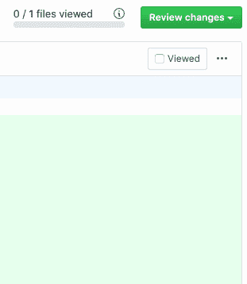

精制 GitHub

这就像一个扩展 GitHub 功能的一体化工具。它做两件事:简化整个 GitHub 界面，然后在其上添加有用的功能。

特点:

*   使空白字符可见:当你打开一个特定的文件时，所有使用的空白字符现在都可见。
*   合并冲突修复:如果你总是在合并冲突时努力跟踪所有需要更改的内容，那么这将添加一系列箭头来接受更改。
*   将头像添加到反应中:所有在 GitHub 评论中添加表情符号反应的人都将获得他们的头像。
*   等待检查的选项:当处理一个拉请求(PR)时，它增加了一个在确认 PR 之前等待检查的选项。
*   恢复更改:如果您在 PR 中错误地添加了错误的内容，您不再需要打开终端并编写命令来恢复它，Refined GitHub 添加了一个简单的选项来轻松恢复更改。

[下载扩展](https://chrome.google.com/webstore/detail/refined-github/hlepfoohegkhhmjieoechaddaejaokhf)

# SVG Gobbler

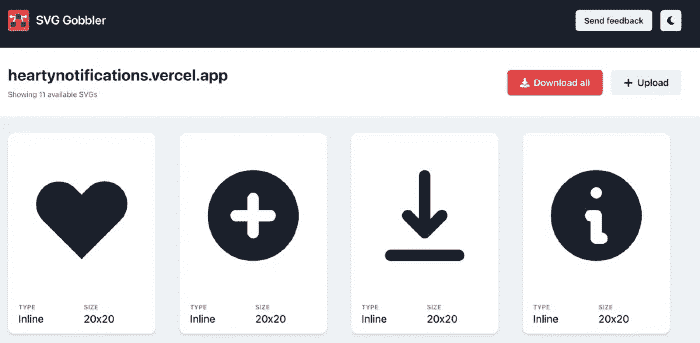

SVG Gobbler

有没有想过获得那些图标、图像或其他资产，比如你最喜欢的网站上使用的插图？如果有一个简单的工具，我们可以很容易地一次提取所有这些信息，会怎么样？

嗯，SVG Gobbler 扩展让您可以轻松完成所有这些工作。您可以下载、优化和转换图标、徽标和矢量 SVG 的代码。

特点:

*   优化 SVG 内容:使用 SVGO 可以优化您从网站或上传内容中选择的 SVG。
*   转换为 React 代码:它可以快速地将 SVG 转换为 React 组件代码。
*   导出选项:您可以将所有 SVG 和 png 导出为多种大小。
*   快速设计工具集成:当您选择您最喜欢的 SVG 元素时，您可以简单地将其复制并粘贴到任何您最喜欢的设计工具中，如 Figma、Sketch 或 Framer。

[下载扩展](https://chrome.google.com/webstore/detail/svg-gobbler/mpbmflcodadhgafbbakjeahpandgcbch)

# Vue.js 开发工具

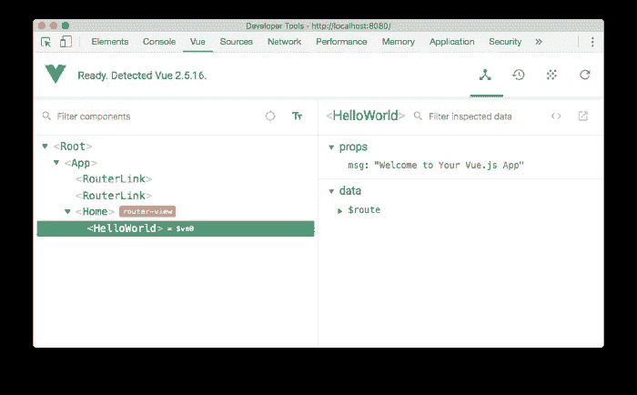

Vue.js 开发工具

这是 React 开发工具的 Vue 对应物。如果你进入了 Vue 生态系统，那么你现在就需要使用 Vue.js devtools 扩展。

这让您可以检查您的 Vue 应用程序，以便更好地调试和了解您的应用程序如何工作。

特点:

*   独立应用:开发工具不仅仅是 Chrome 的扩展，你也可以通过运行 npm install -g @vue/devtools 下载一个独立的应用，然后作为 vue-devtools 启动它。
*   组件选项卡:该选项卡显示当前页面上运行的所有组件实例。
*   Vuex 标签:在这里你可以检查整个应用状态是如何通过 Vuex 管理的。
*   事件和刷新选项卡:在你的 Vue 应用中发出的所有事件将在一个单独的事件选项卡中可用，而如果你只是需要重新加载开发工具，那么刷新选项卡会有所帮助。

[下载扩展](https://chrome.google.com/webstore/detail/vuejs-devtools/nhdogjmejiglipccpnnnanhbledajbpd)

# 结论

扩展可以让我们的生活变得更容易，正如我今天列举的例子。如果你知道任何其他可以帮助开发者提高生产力的工具，请在文章中留下评论。感谢阅读！