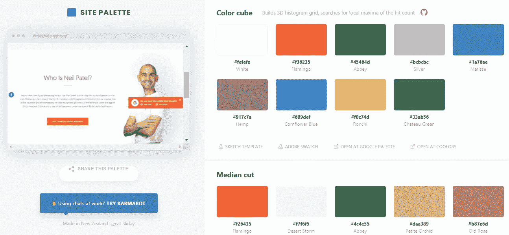
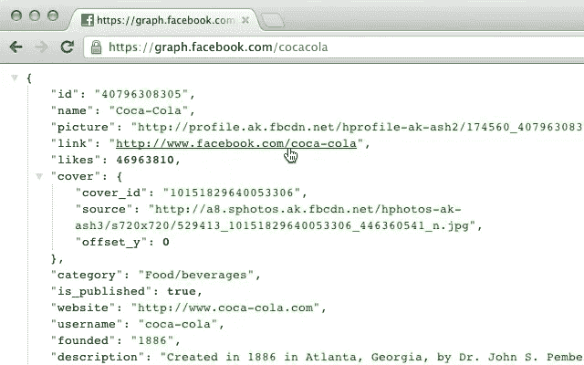
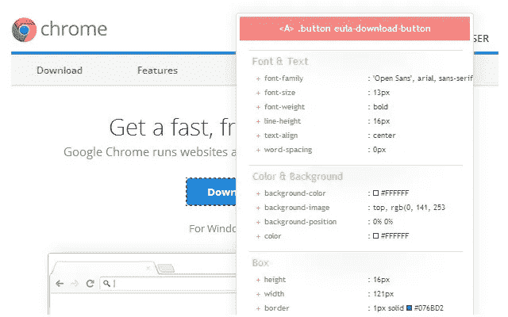
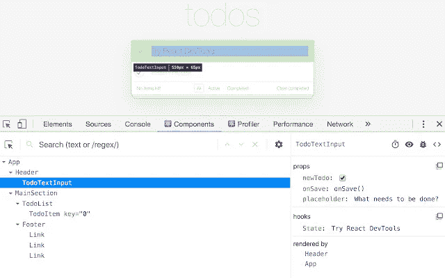
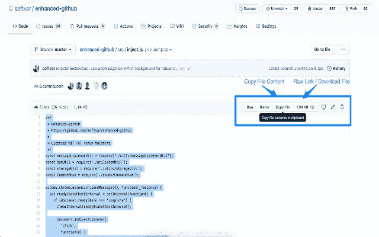
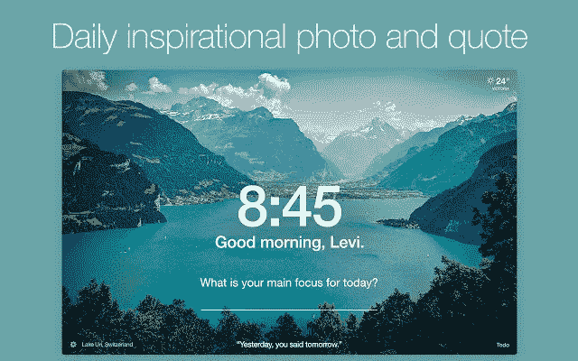
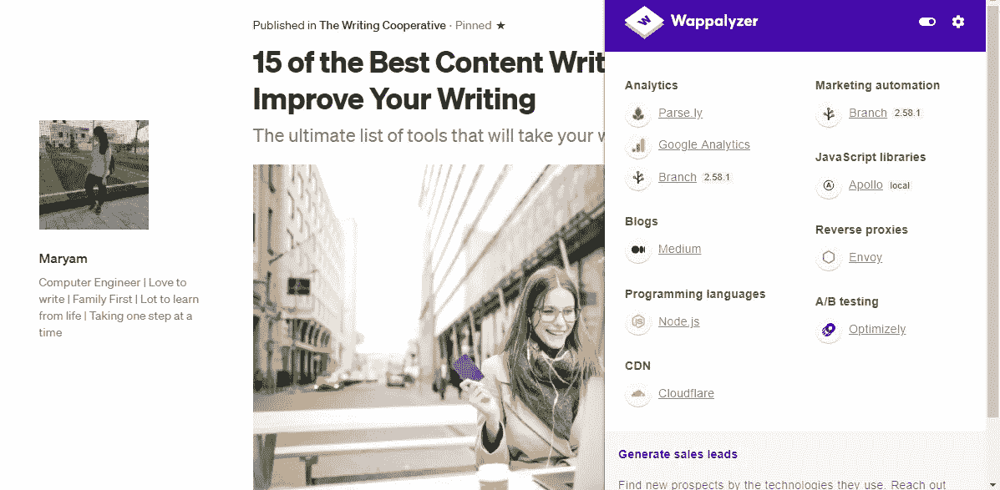
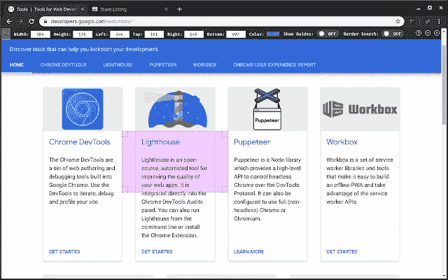
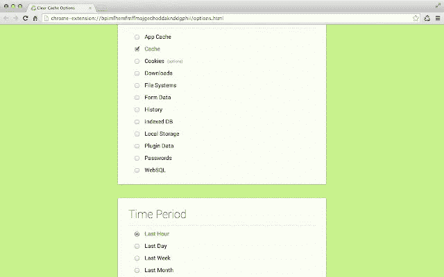
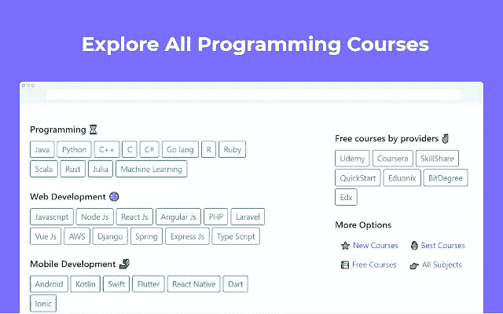

# 提高开发人员效率的 12 个最佳 Chrome 扩展

> 原文：<https://betterprogramming.pub/the-12-best-chrome-extensions-for-developer-productivity-4c60ec613840>

## 每个开发人员都应该考虑使用这些

Agnieszka Boeske 在 [Unsplash](https://unsplash.com?utm_source=medium&utm_medium=referral) 上拍摄的照片

Chrome 扩展让我的生活变得更加轻松。作为一名程序员和作家，我使用了不同的扩展来提高我的生产力。我猜大多数人使用 Chrome 作为他们的主要浏览器，因为它通过使用适当的扩展帮助我们增加我们的工作流程。

我列出了一些对开发者有帮助的浏览器扩展。我提到它们是基于我的观察，但是你需要去探索它们并使用最适合你的。

# 1.网站调色板

尼尔·帕特尔网站作者截图，展示了使用的调色板

[站点调色板](https://chrome.google.com/webstore/detail/site-palette/pekhihjiehdafocefoimckjpbkegknoh/related?hl=en-GB)是前端开发者的必备工具。有时候，我们喜欢一些网站的颜色主题，我们希望在我们的网站或应用程序中使用这种颜色，或者客户告诉我们在新项目中使用与他们现有网站相同的颜色。

这个扩展会让你知道特定网站的确切颜色代码。你甚至可以下载调色板并保存为 pdf 格式。

网站和 app 的吸引力取决于外观。使用这个扩展为你的下一个前端项目选择最好的颜色。

# 2.每天。dev |一体化编码新闻阅读器

图片来自 [daily.dev 网站](https://chrome.google.com/webstore/detail/dailydev-all-in-one-codin/jlmpjdjjbgclbocgajdjefcidcncaied?hl=en)

编程领域每分钟都在升级。它不是停滞不前的，因为每天都有新的更新和新闻。

作为一名程序员，有必要跟上市场的最新趋势。这个 chrome 扩展强烈推荐给开发者，因为它会给你编程领域最好的技术新闻。

你甚至可以过滤你想看的新闻。如果你是 Python 开发者，那么你可以看到 Python 新闻。它是开源的，完全免费。你应该试一试。

# 3.JSON 格式化程序

图像通过 [JSON 格式化程序](https://chrome.google.com/webstore/detail/json-formatter/bcjindcccaagfpapjjmafapmmgkkhgoa?hl=en)

[JSON 格式化程序](https://chrome.google.com/webstore/detail/json-formatter/bcjindcccaagfpapjjmafapmmgkkhgoa?hl=en)是救命恩人。如果您正在使用 API 和所有与 JSON 相关的东西，那么您绝对应该尝试一下。我记得当我需要为 Android 项目获取 API 文件时，这个扩展帮了我很大的忙。

它将提供如下功能:

*   易于阅读并节省您的时间
*   您可以单击 URL
*   提供正确的对齐
*   可以折叠每个部分
*   突出语法

# 4.CSSViewer

图片来自 [CSSViewer](https://chrome.google.com/webstore/detail/cssviewer/ggfgijbpiheegefliciemofobhmofgce/related?hl=en)

[CSSViewer](https://chrome.google.com/webstore/detail/cssviewer/ggfgijbpiheegefliciemofobhmofgce/related?hl=en) 非常适合网络开发者。

这个扩展将显示任何网站上特定元素的所有 CSS 属性:它的样式、字体、颜色、高度、宽度、间距以及元素的每个 CSS 细节。

你所要做的就是点击图标，并将它悬停在特定元素上，以检查其属性。

# 5.React 开发人员工具

图片通过 [React 开发者工具](https://chrome.google.com/webstore/detail/react-developer-tools/fmkadmapgofadopljbjfkapdkoienihi?hl=en)

[React 开发者工具](https://chrome.google.com/webstore/detail/react-developer-tools/fmkadmapgofadopljbjfkapdkoienihi?hl=en)React 开发者的 Chrome 扩展。

它有助于调试 React 应用程序，并且您可以检查 React 组件的层次结构。它向您的控制台添加了两个选项卡:components 和 profiler。components 选项卡显示了所呈现的根组件和子组件。这是理解和可视化 React 组件的一个很好的工具。

记住，它在不使用 React 的网站上不起作用。

# 6.增强型 GitHub

图片来自[增强型 GitHub](https://chrome.google.com/webstore/detail/enhanced-github/anlikcnbgdeidpacdbdljnabclhahhmd)

我估计每个开发者都用 GitHub。如果我们想要访问任何 Github 项目，我们必须下载整个文件，但是[增强的 GitHub 扩展](https://chrome.google.com/webstore/detail/enhanced-github/anlikcnbgdeidpacdbdljnabclhahhmd)将在以下方面帮助您:

*   下载特定文件
*   查看每个文件的大小
*   复制文件内容
*   显示整个回购规模

# 7.动力

图像通过[动量](https://chrome.google.com/webstore/detail/momentum/laookkfknpbbblfpciffpaejjkokdgca/related?hl=en)

[动量](https://chrome.google.com/webstore/detail/momentum/laookkfknpbbblfpciffpaejjkokdgca/related?hl=en)是最神奇的延伸之一。它用一个个人仪表板取代了每个标签，每次点击一个新标签时，你都可以在仪表板上提醒自己要做的事情。它还显示了一个美丽的形象，鼓舞人心的报价和当天的天气。

这个扩展有 300 万用户使用，甚至 Tim Ferris 也提到了这个工具。

击败拖延症并让你专注于你的目标是完美的，因为每个新标签都激励你变得高效和专注，并跟踪你的日常任务。

试试看。你以后会感谢我的。

# 8.瓦帕里斯

作者描述媒体使用的技术的屏幕截图

[Wappalyzer](https://chrome.google.com/webstore/detail/wappalyzer/gppongmhjkpfnbhagpmjfkannfbllamg/related?hl=en) 将帮助你了解什么技术被用来建立任何网站。

它就像一个探测器，显示一个网站正在使用的编程语言、框架、JavaScript 库、分析和营销工具。例如，你可以在上图中看到 Medium 使用了哪些不同的技术。

这是一个简单而有用的工具，让程序员了解每个网站使用的不同技术。

# 9.页面标尺冗余

图片来自[页面标尺还原](https://chrome.google.com/webstore/detail/page-ruler-redux/giejhjebcalaheckengmchjekofhhmal?hl=en)

页面标尺 Redux 对于 web 开发者来说是完美的，因为它给出了任何 web 元素的完美度量。如果你是一个网页设计师，这个工具是给你的。它具有以下特点:

*   您可以创建标尺并调整其大小，以获得组件的精确测量值。
*   您可以根据网站的主题调整颜色对比度。
*   它是免费和开源的。
*   它还将显示设计指南。

# 10.色彩奇拉

图片来自 [ColorZilla](https://chrome.google.com/webstore/detail/colorzilla/bhlhnicpbhignbdhedgjhgdocnmhomnp/related?hl=en)

ColorZilla 会给你网站每个元素的准确颜色代码。您所要做的就是将鼠标悬停在元素上，获取它的 RGB 或十六进制颜色，并将其粘贴到您的项目中。就这么简单。

有如下特点:

*   知道页面任何元素的颜色。
*   从剪贴板复制颜色并使用它。
*   浏览您的颜色历史。
*   甚至还有一个 CSS 渐变生成器和调色板查看器。

# 11.清除缓存

图像通过[清除缓存](https://chrome.google.com/webstore/detail/clear-cache/cppjkneekbjaeellbfkmgnhonkkjfpdn?hl=en)

[Clear Cache](https://chrome.google.com/webstore/detail/clear-cache/cppjkneekbjaeellbfkmgnhonkkjfpdn?hl=en) 对开发者很有用，因为它增强了计算机的性能，提高了生产率。我们的计算机不断地在缓存和 cookies 中保存信息，我们需要通过清除它们来修复它们。

有了这个扩展，只需一次点击就可以清除缓存。

您甚至可以设置一个时间段，并自定义要清除的数据。这些选项包括下载、cookies、缓存、文件系统、历史、插件和本地存储。

# 12.快速编码

图片来自[快码](https://chrome.google.com/webstore/detail/quickcode-free-online-pro/nnigpbiaggiephcndokoaongeefpbdcj?hl=en)

QuickCode 向您展示免费的在线编程课程。

作为一名程序员，你总是想不断提升自己的技能。这个扩展将显示你想要的任何语言的免费课程。可以浏览不同教育网站的免费课程，比如 Udemy、Coursera、edX、skillshare 等。

当你想免费学习课程和省钱的时候，试试吧。

这些是对开发者有帮助的一些扩展。但在互联网上，有足够多的其他人可能更适合你。尝试一下，记住一些扩展，比如 Daily.dev、Momentum 和 QuickCode，在你打开一个新标签页时也能工作。您需要设置优先级，并在打开新标签页时使用您认为最好的一个。