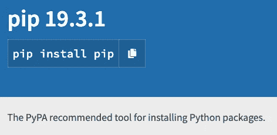
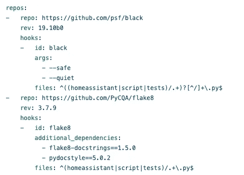
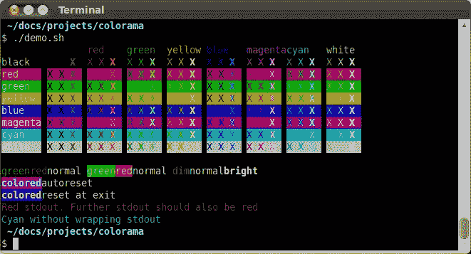

# 世界上最常用的 22 个 Python 包(2020 年)

> 原文：<https://betterprogramming.pub/the-22-most-used-python-packages-in-the-world-7020a904b2e>

## 对 Python 使用方式的教育和惊人见解


照片由 [NASA](https://unsplash.com/@nasa?utm_source=unsplash&utm_medium=referral&utm_content=creditCopyText) 在 [Unsplash](https://unsplash.com/s/photos/global-coding?utm_source=unsplash&utm_medium=referral&utm_content=creditCopyText) 上拍摄

*Python 在全球和各行各业的使用情况如何？*

这个问题启发了我写这篇文章。我认为最常用的 Python 包的列表会给出一个很好的指示。

首先，我列出了过去 365 天 PyPI 上下载最多的 Python 包的清单。让我们深入了解一下它们是做什么的，它们之间有什么联系，为什么它们的排名这么高！

*附:访问 Python.land 的* [*Python 教程*](https://python.land/python-tutorial) *了解所有关于 Python 的知识！*

# 1.Urllib3

## **893M 下载量**

`Urllib3`是一个用于 Python 的 HTTP 客户端，它提供了许多 Python 标准库中所没有的特性:

*   线程安全。
*   连接池。
*   客户端 SSL/TLS 验证。
*   使用多部分编码上传文件。
*   重试请求和处理 HTTP 重定向的助手。
*   支持`gzip`和`deflate`编码。
*   HTTP 和 SOCKS 的代理支持。

尽管名字如此，`Urllib3`并不是`urllib2`的继承者，后者是 Python 核心的一部分。如果你想使用尽可能多的核心 Python 特性，也许是因为你受限于你能安装的东西，那么看看`[urlllib.request](https://docs.python.org/3/library/urllib.request.html#module-urllib.request)`。

对于最终用户，我强烈推荐 requests 包(参见列表中的第 6 项)。这个包之所以排名第一，是因为几乎有 1200 个包[依赖](https://libraries.io/pypi/urllib3/dependents)于`urllib3`，其中许多在这个列表中排名也很高。

# 2.六

**732M 下载量**

`six`是 Python 2 和 3 兼容库。该项目旨在支持在 Python 2 和 3 上工作的代码库。

If 提供了许多函数来消除 Python 2 和 3 之间的语法差异。一个容易理解的例子是`six.print_()`。在 Python 3 中，打印是通过`print()`函数完成的，而在 Python 2 中，`print`不需要括号。因此，通过使用`six.print_()`，您可以用一条语句支持两种语言。

事实:

*   `six`这个名字来源于这样一个事实:二乘三等于六。
*   对于类似的库，也可以查看`[future](https://pypi.org/project/future/)`包
*   如果你想把你的代码转换成 Python 3(并停止支持 2)，看看`[2to3](https://docs.python.org/2/library/2to3.html)`。

虽然我理解它的受欢迎程度，但我希望人们开始完全远离 Python 2，特别是因为 Python 2 从 2020 年 1 月 1 日起正式不被支持。

**链接**:PyPI 页面和[文档](https://six.readthedocs.io/)。

# 3.botocore、boto3、s3transfer、awscli

我将相关项目的数量分组如下:

*   `botocore`(36.6 亿次下载)
*   `s3transfer`(75.84 亿次下载)
*   `awscli`(下载量 3.94 亿次，排名第 17)
*   `boto3`(以 3.29 亿次下载排名第 22)

`Botocore`是亚马逊网络服务的底层接口。`Botocore`作为`Boto3` (#22)图书馆的基础，它允许你使用像亚马逊 S3 和亚马逊 EC2 这样的服务。

Botocore 也是`[AWS-CLI](https://github.com/aws/aws-cli/)`的基础，它为亚马逊网络服务提供了一个统一的命令行接口。

(#7)是一个用于管理亚马逊 S3 转账的 Python 库。它正在大量开发中，它的页面基本上说不要使用它，或者至少要锁定版本，因为 API 可能会改变，即使是在次要版本之间。`Boto3`、`AWS-CLI`、[其他很多项目](https://libraries.io/pypi/s3transfer/dependents)都有对`s3transfer`的依赖。

看到这些特定于 AWS 的库排名如此之高令人着迷——这充分说明了 AWS 有多突出。

链接:

*   `botocore` [PyPI](https://pypi.org/project/botocore/) 页面和[文档](https://botocore.amazonaws.com/v1/documentation/api/latest/index.html)、
*   `Boto3` [PyPI](https://pypi.org/project/boto3/) 页面和[文档](https://boto3.amazonaws.com/v1/documentation/api/latest/index.html)
*   `awscli` [PyPI](https://pypi.org/project/awscli/) 页面

# 4.点

6.27 亿次下载



[PyPI](https://pypi.org/project/pip/) 作者截图

我假设你们大多数人都知道并且喜欢`pip`，Python 的安装包。您可以使用`pip`毫不费力地安装来自 [Python 包索引](https://pypi.org/)和其他索引的包，比如本地镜像或私有软件的自定义索引。

关于`pip`的一些有趣事实:

*   `**pip**`是“Pip 安装包”的递归缩写
*   `pip`非常好用。安装一个包就像`pip install <package name>`一样简单，移除它是通过`pip uninstall <package name>`完成的。
*   它最大的优点之一是它还接受一个包列表，通常是以一个`requirements.txt`文件的形式。该文件可以选择性地包括所需版本的详细规范。大多数 Python 项目都包含这样一个文件。
*   将`pip`与`virtualenv`(列表中的第 57 位)结合使用，可以让您创建可预测的隔离环境，不会干扰您的底层系统，反之亦然。有关所有细节，请查看这篇文章:

[](https://medium.com/better-programming/stop-installing-python-packages-globally-use-virtual-environments-a31dee9fb2de) [## 停止全局安装 Python 包-使用虚拟环境

### 借助虚拟环境，您可以隔离您的软件并避免版本冲突

medium.com](https://medium.com/better-programming/stop-installing-python-packages-globally-use-virtual-environments-a31dee9fb2de) 

# 5.Python-dateutil

**6.17 亿次下载**

`p[ython-dateutil](https://pypi.org/project/python-dateutil/)`模块为标准`datetime`模块提供了强大的扩展。根据我的经验，在常规 Python `datetime`功能结束的地方，`python-dateutil`开始出现。

你可以用这个库做很多很酷的事情。我将把例子限制在一个我认为特别有用的例子上:从日志文件中模糊解析日期之类的:

# 6.要求

**611M 下载量**

`Requests`建立在我们的#1 库`urllib3`之上。它使 web 请求变得非常简单。比起`urllib3`，许多人更喜欢它，而且它可能比`urllib3`被更多的终端用户使用。后者是更低级的，并且通常是其他项目的依赖项，因为对内部的控制水平。

为了展示`requests`有多简单:

链接:

*   [PyPI 页面](https://pypi.org/project/requests)
*   D [文件](https://2.python-requests.org/en/master/)

# 7.S3 传输

我结合了#3、#7、#17 和#22，因为它们都是相关的。见#3！

# 8.证明

**5.52 亿次下载**

近年来，几乎所有的网站都搬到了 SSL，这可以通过你地址栏中的小锁符号来识别。这意味着与该网站的通信是安全和加密的，防止窃听。


这个小锁告诉我们这个网站是用 SSL 加密的。图片作者。

加密是基于 SSL 证书的，这些 SSL 证书是由可信的公司或像 LetsEncrypt 这样的非营利组织创建的。这些组织用他们的(中介)证书对证书进行数字签名。

通过使用这些证书的公开部分，您的浏览器能够验证它们的签名，因此您可以确保您看到的是真实的东西，并且没有人在窥探数据。

Python 软件也可以做到完全一样。这就是它的由来。这与 Chrome、Firefox 和 Edge 等 web 浏览器附带的根证书集合没有太大区别。

`Certifi` ***是根证书的精选集合，因此您的 Python 代码将能够验证 SSL 证书的可信度。***

许多项目信任并依赖于`certifi`，从这里的[可以看出](https://libraries.io/pypi/certifi/dependents)。这也是这个项目排名如此靠前的原因。

链接:[certify PyPI 页面](https://pypi.org/project/certifi/)、[文档](https://certifiio.readthedocs.io/en/latest/)、[certify . io](https://certifi.io/)

# 9.Idna

**5.27 亿次下载**

根据 PyPI 页面，`idna`提供了“对在 [RFC 5891](http://tools.ietf.org/html/rfc5891) 中指定的国际化域名应用(IDNA)协议的支持。”

如果你和我一样，你仍然不知道`Idna`是什么或做什么！你很幸运，你的真的做了找到它的艰苦工作！

应用程序中的国际化域名(IDNA)是一种处理包含非 ASCII 字符的域名的机制。但是最初的域名系统已经提供了对非 ASCII 域名的支持。那么问题出在哪里？


由阿轧曼蒂奥斯——自己的作品，CC BY-SA 3.0，[https://commons.wikimedia.org/w/index.php?curid=1630902](https://commons.wikimedia.org/w/index.php?curid=1630902)

问题是*应用*像电子邮件客户端和网络浏览器不支持非 ASCII 字符。或者更具体地说，电子邮件和 HTTP 协议不支持这些字符。

这对许多国家来说没问题，但对中国、俄罗斯、德国、希腊、印度尼西亚等国家来说是个问题。因此，并非完全巧合的是，这些国家的一群聪明人想出了`IDNA`。

`IDNA`的核心是两个函数:`ToASCII`和`ToUnicode`。`ToASCII`将把一个国际 Unicode 域翻译成一个 ASCII 字符串。`ToUnicode`将逆转这一进程。在`IDNA`包中，这些函数被称为`idna.encode()`和`idna.decode()`，如下面的代码片段所示:

Idna 与中国域名合作

如果你是一个受虐狂，你可以阅读 RFC-3490 来了解编码的细节。

链接: [Idna](https://pypi.org/project/idna/) PyPI 页面， [GitHub](https://github.com/kjd/idna) 页面

# 10.PyYAML

**5.25 亿次下载**

`YAML`是一种数据序列化格式。它是为人类和计算机的可读性而设计的——对人类来说很容易读写，但计算机仍然可以解析它。



YAML 的例子，作者的图像

`PyYAML`是 Python 的`YAML`解析器和发射器，这意味着它可以读写`YAML`。它会将任何 Python 对象写到`YAML`:列表、字典，甚至是类实例。

Python 提供了自己的[配置解析器](https://docs.python.org/3/library/configparser.html)，但是与 Python 的`ConfigParser`的基本`.ini`文件结构相比，YAML 提供了更多。

例如，`YAML`可以存储任何数据类型:`boolean` s，`list` s，`float` s，等等。`ConfigParser`将所有内容存储为内部字符串。如果你想用`ConfigParser`装载一个整数，你需要明确指定你想得到一个`int`:

`config.getint(“section”, “my_int”)`

而`pyyaml`自动识别类型，所以这将返回您的`int`和`PyYAML`:

`config[“section”][“my_int”]`

`YAML`还允许任意深的树，不是每个项目都需要的，但它可以派上用场。

您可以自己决定喜欢什么，但是许多项目使用`YAML`作为它们的配置文件，因此这个项目很受欢迎。

链接: [PyYAML](https://pypi.org/project/PyYAML/) PyPI 页面，[文档](https://pyyaml.org/)。

# 11.Pyasn1

**512M 下载量**

和上面的`IDNA`一样，这个项目也有一个非常有用的描述:

> ASN.1 类型和 DER/BER/CER 编解码器的纯 Python 实现(X.208)。

幸运的是，在这个几十年前的标准上可以找到很多信息。`ASN.1`，抽象语法符号一的简称，被誉为数据序列化的教父。它来自电信世界。也许你知道协议缓冲区或 Apache 节俭？这实际上是 1984 年的版本。

**ASN.1 描述了系统间的跨平台接口以及可以通过该接口发送的数据结构。**

还记得 Certifi 吗(见第 8 条)？ASN.1 用于定义 HTTPS 协议和许多其他加密系统中使用的证书格式。它也用于 SNMP、LDAP、Kerberos、UMTS、LTE 和 VOIP 协议。

这是一个非常复杂的规范，一些实现已经被证实充满了漏洞。你可能也会喜欢这个关于 ASN.1 的有趣的 Reddit 帖子。

我建议远离，除非你真的需要它。但是，因为它在很多地方被使用，所以很多包都依赖于它。

# 12.文档工具

**5.08 亿次下载**

`Docutils`是一个模块化系统，用于将明文文档处理成有用的格式，如 HTML、XML 和 LaTeX。`Docutils`能够阅读`reStructuredText`格式的纯文本文档，这是一种类似 MarkDown 的易于阅读的标记语法。

你可能听说过[人教版](https://www.python.org/dev/peps/pep-0012/)文件，甚至读过一份。那么什么是 PEP 文档呢？称为 PEP-1 的第一个 PEP 文件很好地解释了这一点:

> PEP 代表 Python 增强提案。PEP 是一个设计文档，它向 Python 社区提供信息，或者描述 Python 或其流程或环境的新特性。PEP 应该提供该特性的简明技术规范和基本原理。

PEP 文档以固定的`reStructuredText`模板编写，并使用`docutils`转换成格式良好的文档。

Docutils 也是`[Sphinx](https://www.sphinx-doc.org/)`的核心。`Sphinx`用于创建文档项目。如果`Docutils`是一台机器，`Sphinx`就是工厂。最初创建它是为了构建 Python 文档，但是许多其他项目使用它来记录他们的代码。

你可能读过关于 readthedocs.org 的文档，对吗？那里的大部分文档是由`Sphinx`和`docutils`创建的。

# 13.沙尔代

**501M 下载量**

您可以使用`chardet`模块来检测文件或数据流的字符集。例如，在分析大量随机文本时，这可能会很有用。但是，在处理远程下载的数据时，如果您不知道字符集是什么，也可以使用它。

安装`chardet`之后，你还有一个额外的命令行工具叫做`chardetect`，可以这样使用:

```
chardetect somefile.txt
somefile.txt: ascii with confidence 1.0
```

你也可以通过编程来使用这个库，[查看文档](https://chardet.readthedocs.io/en/latest/usage.html)。

`Chardet`是`requests`和许多其他包的要求。我想没有多少人单独使用`chardet`，所以它的流行一定来自于这些依赖。

# 14.南非共和国(Republic of South Africa)

**4.92 亿次下载**

`rsa`包是一个纯 Python RSA 实现。它支持:

*   加密和解密，
*   签署和验证签名，
*   根据 PKCS#1 版本 1.5 生成密钥。

它可以作为 Python 库使用，也可以在命令行上使用。

一些事实:

*   RSA 中的字母是[罗恩·里维斯特](https://en.wikipedia.org/wiki/Ron_Rivest)、[阿迪·萨莫尔](https://en.wikipedia.org/wiki/Adi_Shamir)和[伦纳德·阿德曼](https://en.wikipedia.org/wiki/Leonard_Adleman)姓氏的首字母。他们在 1977 年描述了这个算法。
*   RSA 是最早的公钥密码系统之一，广泛用于安全数据传输。在这样的密码系统中，有两个密钥:一个公共部分和一个私有部分。您用公钥加密数据，然后只能用私钥解密。
*   RSA 是一种很慢的算法。它不太常用于直接加密用户数据。RSA 通常用于安全地传递对称密钥加密的共享密钥，这在加密和解密大量数据时要快得多。

以下代码片段显示了 RSA 如何用于一个非常简单的用例:

假设 Bob 将他的私钥*保密*，Alice 可以确定他是唯一能够阅读该消息的人。

然而，鲍勃*不*肯定知道是爱丽丝发送了消息，因为任何人都可以获得并使用他的公钥。为了证明是她，爱丽丝可以用她的私钥在消息上签名。Bob 可以用她的公钥验证这个签名，确保确实是她发送的消息。

`google-auth` (#37)、`oauthlib` (#54)、`awscli` (#17)等包依赖于`rsa`包。没有多少人会把它作为一个独立的工具，因为有更快、更本地的替代工具。

# 15.Jmespath

**4.73 亿次下载**

在 Python 中使用 JSON 非常容易，因为 JSON 在 Python 字典上的映射非常好。对我来说，这是它最好的特性之一。


[作者截图](http://jmespath.org/)

老实说，我从未听说过这个包，尽管我在 JSON 方面做了很多工作。我会使用`json.loads()`并手动从字典中获取数据，也许在这里或那里有一个循环。

`JMESPath`，读作“James path”，使得 Python 中的 JSON 更加容易。它允许您以声明的方式指定如何从 JSON 文档中提取元素。以下是一些基本示例，让您感受一下它的功能:

这只是触及了所有可能性的表面。更多信息参见[文档](http://jmespath.org/)和 [PyPI 页面](https://pypi.org/project/jmespath/)。在我的文章中阅读更多关于在 Python 中使用 JSON 的内容:

[](https://towardsdatascience.com/4-tricks-to-effectively-use-json-in-python-4ca18c3f91d0) [## 在 Python 中有效使用 JSON 的 4 个技巧

### 在 Python 中使用 JSON 是一件轻而易举的事情，这将让您马上开始

towardsdatascience.com](https://towardsdatascience.com/4-tricks-to-effectively-use-json-in-python-4ca18c3f91d0) 

# 16.Setuptools

**401M 下载量**

Setuptools 是用来创建 Python 包的工具。

这个项目记录得很糟糕。它没有描述它是什么，并且在它的描述中包含了死链接。最好的信息来源是这个网站:[https://packaging.python.org/](https://packaging.python.org/)，特别是这个创建 Python 包的指南:[https://packaging.python.org/tutorials/packaging-projects/](https://packaging.python.org/tutorials/packaging-projects/)。

# 17.`Awscli`

我结合了#3、#7、#17 和#22，因为它们都是相关的。见#3！

# 18.Pytz

**3.94 亿次下载**

像`dateutils` (#5)，这个库帮助你处理日期和时间。使用时区可能会很困难。幸运的是，有像这样的软件包可以使它变得更容易。

我在时间和计算机方面的经验可以归结为: ***在内部始终使用 UTC。仅当生成可供人类阅读的输出时，才转换为本地时间。***

这里有一个`pytz`用法的例子:

查看[PyPI 页面](https://pypi.org/project/pytz/)获取更多示例和文档。

# 19.期货

**3.89 亿次下载**

从 Python 3.2 开始，Python 提供了`concurrent.futures`模块，帮助您执行异步执行。futures packages 是这个库的一个反向移植，用于 Python 2。因为 Python 3 本身就提供了它，所以它不适合 Python 3 用户。

正如我之前提到的，Python 2 从 2020 年 1 月 1 日起[正式不被支持。当我明年再次访问这个作品时，我真心希望这个包不会排在前 22 位。](https://www.python.org/dev/peps/pep-0373/)

这里有一个使用`futures`的基本例子:

如您所见，您可以创建一个线程池，并提交一个由这些线程之一执行的函数。同时，您的程序将继续在主线程中运行。这是一种并行执行程序的简单方法。

# 20.彩色光

**3.7 亿次下载**

使用 [Colorama](https://pypi.org/project/colorama/) ，您可以为您的终端添加一些颜色:



乔纳森·哈特利截图来自 [Colorama](https://pypi.org/project/colorama/)

为了感受一下这有多简单，下面是一些示例代码:

# 21.简单 json

**3.41 亿次下载**

Python 中的原生`json`模块需要这种高排位的替代，有什么问题吗？没什么！其实 Python 的`json`就是`simplejson`。但是`simplejson`有一些优点:

*   它适用于更多的 Python 版本。
*   它比 Python 更新得更频繁。
*   它有(可选的)用 C 写的部分，使它非常快。

您经常会在使用 JSON 的脚本中看到这样的内容:

```
try:
  import simplejson as json
except ImportError:
  import json
```

除非你特别需要标准库中没有的东西，否则我会使用`json`。`Simplejson`可以比`json`快很多，因为它有一些部分是用 c 实现的。这个速度对你来说不是问题，除非你正在处理成千上万的 JSON 文件。还要看看 [UltraJSON](https://pypi.org/project/ujson/) ，它应该更快，因为几乎所有的代码都是用 c 写的。

# 22.Boto3

我结合了#3、#7、#17 和#22，因为它们都是相关的。见#3！

# `Final Notes`

写完 22 个包之后很难停下来，因为接下来的许多包对于像我们这样的最终用户来说是最有趣的。他们将有机会在我计划的另一部作品中大放异彩！

建立这个列表给了我这些见解:

*   许多顶级软件包都提供了某种核心功能，比如处理时间、配置文件、加密和标准化。它们通常是其他项目的依赖项。
*   一个共同的主题是连通性。这些包中的大多数允许您连接到服务器和服务，或者支持其他包这样做。
*   其余的都是 Python 的扩展。创建 Python 包的工具、帮助创建文档的工具、创建版本间兼容性的库等。

我希望你喜欢这个列表，也许能从中学到一些新东西——我当然喜欢！

[](https://medium.com/pythonland/30-python-best-practices-tips-and-tricks-19172564f9c) [## 30 个 Python 最佳实践、技巧和诀窍

### 提高您的 Python 知识和技能

medium.com](https://medium.com/pythonland/30-python-best-practices-tips-and-tricks-19172564f9c) [](https://medium.com/better-programming/the-12-habits-of-highly-effective-software-developers-cddfa8888d61) [## 高效软件开发人员的 12 个习惯

### # 3——不要自作聪明

medium.com](https://medium.com/better-programming/the-12-habits-of-highly-effective-software-developers-cddfa8888d61)