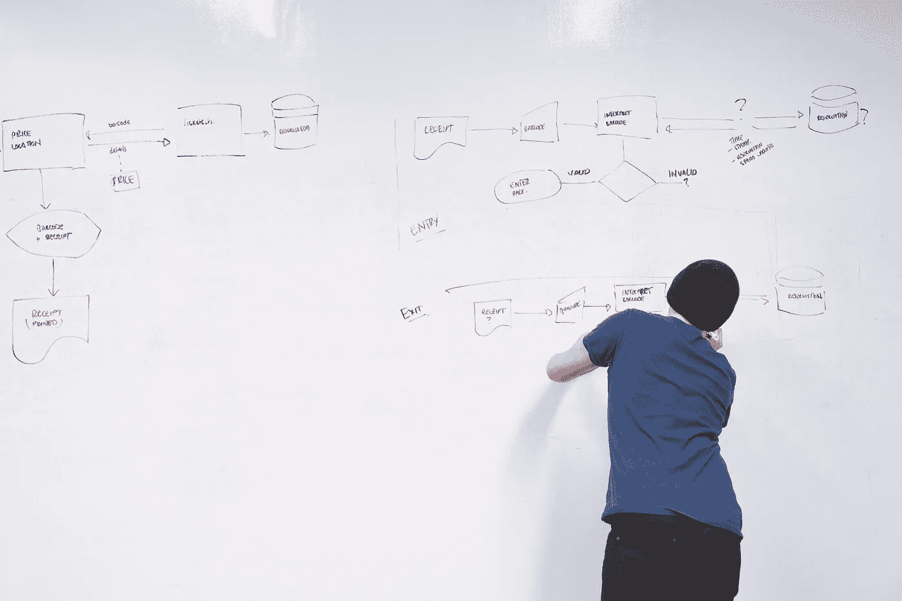
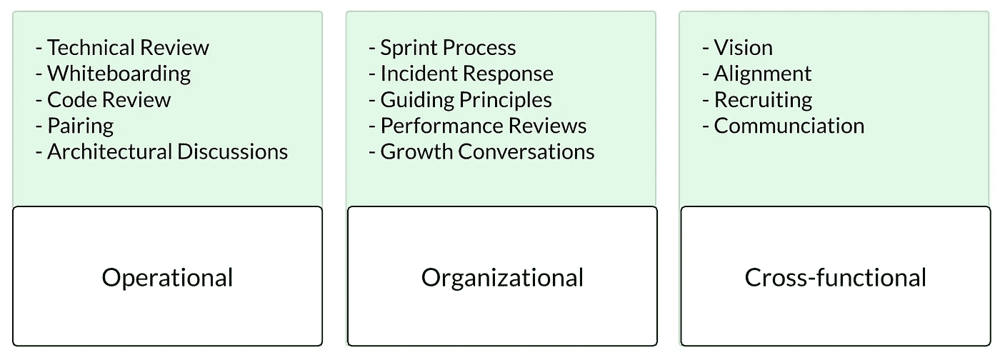

# 优秀管理者的三种能力

> 原文：<https://betterprogramming.pub/the-3-capacities-of-a-good-manager-a950e798aaaa>

## 一个帮助你为你的团队服务的框架

由[拍摄的照片](https://www.pexels.com/@startup-stock-photos)在[像素上](https://www.pexels.com/@startup-stock-photos)

最近，我的一个朋友向我抱怨她的经理给她的工作带来的压力。我们叫他乔希吧。

乔希在我朋友工作的地方很受尊敬。在白板会议中，他很棒，他似乎总能想出聪明的解决方案，最重要的是，他不怕卷起袖子投入到代码中。

起初，我的朋友很高兴能和乔希一起工作。他非常有才华，非常有经验，所以她觉得她可以学到很多东西。然而，在团队中呆了一段时间后，她注意到白板会议之间的时间可能会非常紧张，包括以下事情:

*   计划外的工作经常出现在冲刺阶段，经常在另一个团队的截止日期之前被紧急处理。
*   传呼机值班轮换是出了名的痛苦。有时你甚至找不到拥有破解代码的人。
*   她感觉自己总是在做采访，却没有看到任何新加入的人来帮助增加带宽。
*   这有点像她在一次又一次地进行绩效评估，却不知道自己在朝着什么方向努力。
*   上个季度有两次，她的团队正在进行的一个项目被砍掉了，或者在团队继续前进之前有了一个小的 MVP 展示。

最重要的是，她不知道如何着手解决这些问题。当她和乔希谈到这是如何让她紧张时，他只是同情地说，“是的，希望在本季度结束前完成这个项目能给我们一些喘息的机会。”

她真的很喜欢她正在做的工作，但最后，她要求被调到一个不同的团队，以便每天都更加清醒。

# 优秀经理的特质

尽管 Josh 在与团队合作解决棘手问题时增加了大量价值，但团队成员压力很大，想要离开。管理不仅仅是技术上的卓越。技术能力是构建的基础，但它本身是不够的。优秀的管理者需要三个不同领域的能力:

*   操作的
*   组织的
*   跨职能部门

这些能力中的每一个都包括几个管理职责，这些职责有助于一个运作良好的团队。任何一个领域的过度索引都会让你的团队在其他方面感到痛苦。

有些责任会比其他责任来得更自然。至少，你需要知道你的优势和劣势在哪里，否则你会有人离开你的团队。让我们更详细地回顾一下每项能力，以便更好地理解它们是如何涵盖作为一名经理的独特关注点的。

# 管理不仅仅是专业知识

运营工作是经理参与技术对话、审查代码或帮助确保项目遵循严格的技术流程的能力。对于非技术性工作，它是你需要熟悉的个人贡献者的主题。这是经理工作的重要基础，但不应该是你帮助团队成功的主要方式。

当一个经理经常突然造访他们的团队来完成一个项目时，会出现一些问题:

*   所有权被从 ICs 手中夺走，减缓了他们的成长和学习。
*   经理的时间与团队的工作不成比例。
*   忽略了经理的其他职责(一对一、季度规划等。).
*   它使经理超负荷工作，经常阻碍项目的进展。

非常有才华的贡献者进入管理角色是很常见的。在这样做的时候，他们经常看到他们的贡献减少了，他们参加会议的时间增加了。如果你认为你的工作是 IC++，这可能会非常令人沮丧；也就是说，在给定的主题上做很好的工作，有时会处理一些一对一的工作。

乔希对管理有这样的看法。在成为经理之前，Josh 的绩效评估是基于其贡献的质量和速度。Josh 忽略了他作为经理的大部分职责，继续优先考虑运营工作领域。这种情况经常发生在截止日期临近的时候，确保团队及时发货的压力让他相信他需要接管。

## 支持项目，不要推动它

对于经理来说，运营工作实际上是促进团队的技术工作。要做到这一点，技术知识是必需的，但重点应该是让团队成员更有能力。这样，你就可以把注意力集中在其他责任上。

找到平衡点是一项挑战，尤其是当那些推动项目的人做出的决策与你预期的不同时。参与的一些好例子包括:

*   相信你的团队能够做出重大决策。与其替他们做决定，不如挑战他们为自己的选择辩护。当他们可以这样做时，支持他们的方向。
*   在白板会议期间识别边缘案例。一旦每个人都对讨论的方向感到满意，就要求他们考虑不同的可能性。这将有助于他们巩固当前对问题的看法。
*   不要把自己插在关键路径上。如果你被要求提交一些代码或者签署一些东西，你就变成了一个单点故障。相反，在流程的早期与您的团队合作，以确保您是一致的。
*   在一个项目结束后，与业主一起讨论事情的进展。尽可能详细地回顾哪些地方做得很好，哪些地方可以在下次改进。这不是为了建立责任感，而是为了促进个人成长。

在技术工作中扮演辅助角色随着时间的推移会产生复合效应。你的团队学习如何从头到尾交付他们的工作，因为他们自始至终都是所有者。通过回答你的问题，他们开始在接下来的工作中问自己同样的问题。他们会在项目结束后开始评论自己的工作，而不需要你在场。

当你看到你的一个团队成员指导另一个团队成员，就像你在以前的项目中指导他们一样，这是一种很棒的感觉。

# 打造你的组织

组织工作是任何创造团队文化的工作。这种工作很容易被忽视。或者，如果你对管理持观望态度，当你听到“冲刺过程”或“绩效评估”时，你可能会翻白眼。

第一次担任经理的人会发现，在他们的转变过程中，组织工作是最尴尬或最不愉快的。这很容易被忽视或推迟。组织工作是对团队运作能力的投资。没有它，你会看到各种各样的症状:

*   交付项目时，质量和装运流程不一致。
*   在处理 bug 或事件时，所有权或上报流程不明确。
*   团队成员之间的不同观点。我们是快速移动并打破东西，还是勤奋移动并修复东西？
*   害怕发言，无论是在会议上还是对你的经理。

当组织工作做得很好时，团队成员不会注意到它。一切顺利，每个人都参与进来，我们可以专注于主题而不是组织开销。这是一种微妙的平衡，随着你的团队的成长而变化，它需要持续的关注，与你的团队当时的需求保持一致。

本亚明·梅利西在[像素](https://www.pexels.com/@binyaminmellish)上拍摄的照片

组织工作也是新经理最有趣的事情之一。这是第一次有机会做出影响团队工作方式的决策。在你的团队中播下这些种子是你可以追求的最高杠杆的工作。它还为人们创造了一个更有弹性、更令人兴奋的工作环境。部分工作包括:

*   建立一个实用有效的冲刺过程。
*   建立事故流程，包括回顾。
*   与团队中的个人一起工作，帮助他们在职业生涯中成长。
*   运行绩效评估，帮助你坦诚地与团队成员沟通。

## 组织工作的一个例子:冲刺评审

如果你的团队目前没有进行 sprint 回顾，你的第一件工作就是安排这些会议。改变一个团队的过程可能会很棘手，所以你需要清楚地传达改变是什么以及你为什么要这样做。此外，确保每个人都同意这一改变。我称之为赢得你的报道的人心。你最不想要的就是一个没有人真正关心也没有人参与的会议。那么，你只是在浪费大家的时间。

在 sprint review 中，您希望有一个环境，人们可以自由公开地谈论进展顺利或本可以更好的事情。它需要一个安全的空间，不受任何形式的审判或惩罚。这意味着，尤其是在你召开会议的头几次，你需要营造一个轻松的环境。把每个人说的话作为一组做笔记也是一个好主意。这将允许团队中的人们分享正在发生的事情，并感觉被他们的同事听到了。

在 sprint 回顾之后，你现在有了对你的团队重要的所有事情的列表。祝贺并认可任何成就，解决任何问题或顾虑。解决 sprint review 中提出的问题的组织工作是直接改善您的报告的最有效的方法之一。

这是一个相当大的工作量，需要几个星期才能达到一个地方，在那里你可以向你的团队征求反馈，并根据反馈来改善他们的体验，使他们更有效率。这项工作并不是技术性的，但是你完全有可能在这里增加更多的价值，如果你优先考虑技术参与而不是设置它的话。

组织工作中最引人注目的部分是，如果你认为这种 sprint 评审方法是愚蠢的，你可以用一种完全不同的方式来运行你的评审，或者根本不用。你所做的组织工作塑造了你的团队文化。尊重组织工作很重要；如果你不花太多心思，你可能不知道你的团队文化会变成什么样。

# 与他人一起成功

跨职能工作是任何需要经理作为团队外部利益相关者的联络人的工作。这个领域通常是最具挑战性的，因为它涉及不在团队报告结构内的涉众。这意味着他们有自己的议程、约束和目标。作为团队的经理，你需要确保你的团队与其他团队在做的事情保持一致。你还必须确保你的团队达到预期。

照片由[像素](https://www.pexels.com/photo/blue-boats-daylight-island-358326/)上的 [Pixabay](https://www.pexels.com/photo/blue-boats-daylight-island-358326/) 拍摄

识别跨职能的工作是具有挑战性的，并且通常只有当你感觉到问题的症状时才表现出来。了解你的客户和感受到摩擦的地方是理解你的角色需要什么样的跨职能工作的最好起点。

您会注意到以下症状:

*   一个项目的最后一秒钟的细节会阻止它按时交付，因为它不会与另一个团队的工作相一致。
*   你的工程师花了很多时间来确定项目的范围或需求。
*   您的团队正在进行的各种项目似乎与共同的方向或公司战略无关。
*   其他团队不知道你的团队在做什么，也不知道它为什么重要。
*   你很难说服人们加入你的团队，或者理解你的团队如何融入公司。

当你在跨职能部门工作时，有更多的变量，事情更容易出错。一个常见的问题是当一个团队的愿景或路线图与另一个团队的冲突时。经理的工作是与他们互动的其他团队交流，找到每个人的最佳前进道路，并非常清楚地将其传达给外部团队以及团队中的每个人。

处理这样一个复杂领域的方法是通过朝着一个共同的目标勤奋和持续的努力。我的一个产品经理在这方面做得最好。他安排与我们接触过的每个团队坐下来交谈，问他们还需要什么，并在结束时向他们复述他们所说的一切。我们清楚地说明了我们能做什么或不能做什么，我们能够跨职能前进。

很难知道你是否在跨职能部门工作得很好——你只能知道你是否做得很差。这是那种在它成为大问题之前根本不是问题的事情。然而，有一些习惯可以帮助你朝着正确的方向前进:

*   定期检查并与外部利益相关者交谈。你应该和他们保持足够好的关系，当一个可能影响你的随机考虑出现时，他们会考虑让你知道。
*   通过多种渠道多次传达新信息(空闲时间、面对面、电子邮件等)。).重复自己的话感觉很奇怪，但如果你真的想让所有人都同意，这是必须的。
*   很好地理解你期望你的团队在一年后会做什么。完全适应这一过程中的变化。
*   养成提前与外部利益相关者沟通的习惯。这有助于协调他们的团队，减轻最后一秒钟的紧迫感。把它想象成一个“前方道路作业”的标志，帮助高速公路上的汽车减速，而不是突然急刹车。

跨职能工作的强大能力始终是一项进步中的工作。每隔几个月就会出现一家新的创业公司，试图解决团队如何合作的问题，这是有原因的。清楚地确定需要完成的工作和你发现有效的工作是一个很好的开始。

# 了解你的优势，扩展你的能力

没有哪个经理在各个方面都是完美的。一些领导者是令人信服的远见卓识者，但不能很好地说明“如何”。其他人是低调的“实干家”,对调整团队的过程没有太多兴趣。

这三种能力的一些例子

了解你做得好的地方和你的差距在哪里对建立一个有弹性的团队大有帮助。作为一名经理，你可以采取措施掩盖自己不擅长的事情，并加倍努力做好自己擅长的事情。

重要的是你了解你的团队的需求，以及你作为经理的参与是如何提高还是阻碍他们做好工作的能力。