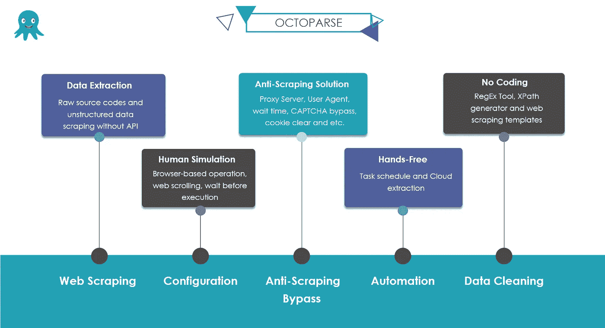
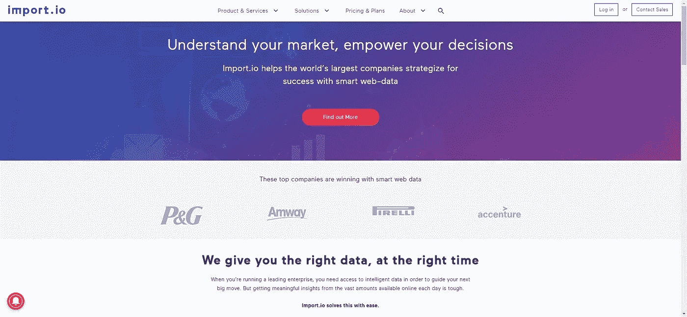
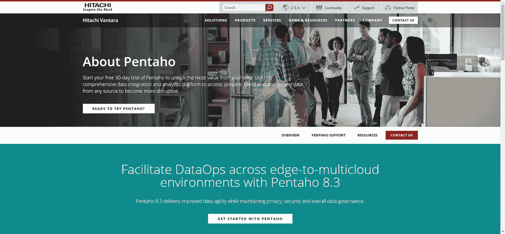
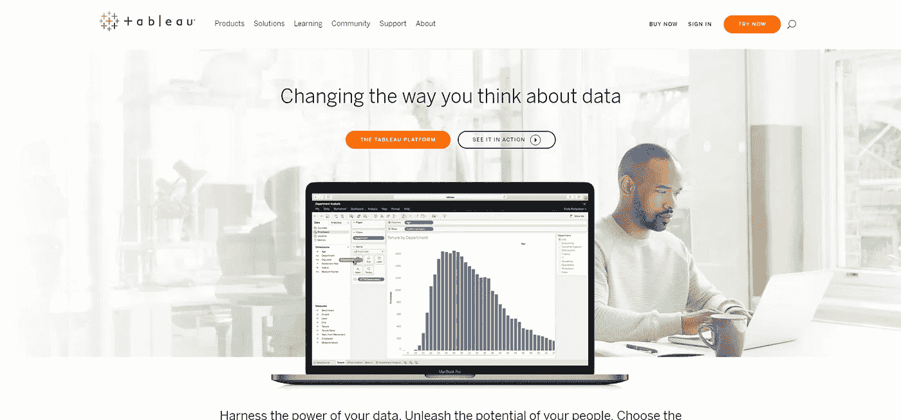
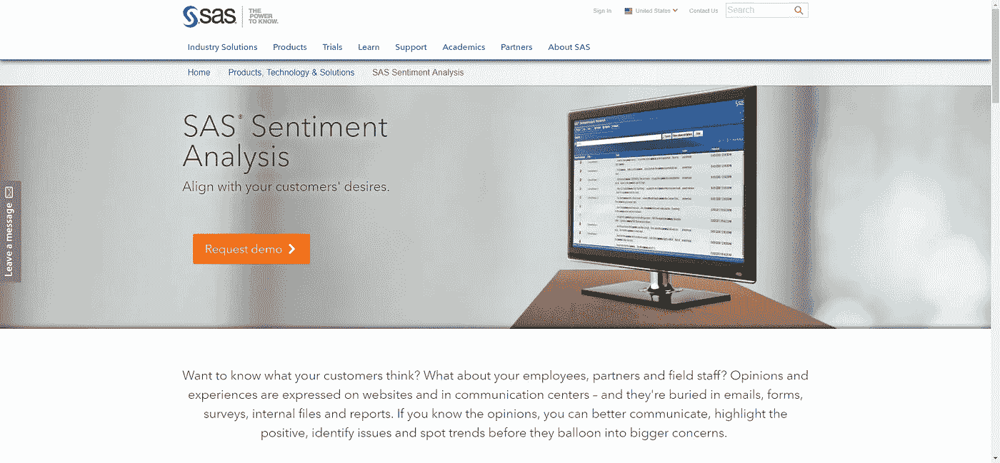
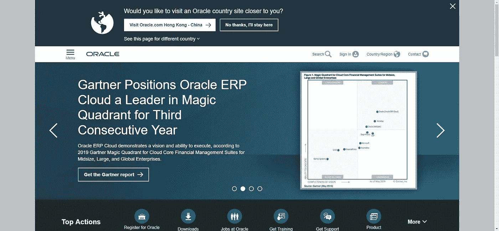

# 用于数据分析的 30 个最佳大数据工具

> 原文：<https://betterprogramming.pub/the-30-best-big-data-tools-for-data-analysis-7e4e1a88920>

## 借助 2019 年的顶级数据工具保持领先地位

约书亚·索蒂诺在 [Unsplash](https://unsplash.com/search/photos/data?utm_source=unsplash&utm_medium=referral&utm_content=creditCopyText) 上拍摄的照片

展望和清理大数据的能力在 21 世纪至关重要。合适的工具是与对手竞争并增加业务优势的先决条件。让我们来看看 30 个顶级大数据工具，让您保持领先。

# 第一部分。数据提取工具

## 1.[八分音符](https://www.octoparse.com/)

从[到](https://www.octoparse.com/)

Octoparse 是一个简单直观的网络爬虫，用于从没有编码的网站中提取[数据](https://www.octoparse.com/)。无论你是第一次自我启动，经验丰富的专家，或企业主，它将满足您的需求，其企业级的服务。为了消除设置的困难，Octoparse 添加了覆盖 30 多个网站的“[任务模板](https://www.octoparse.com/blog/big-announcement-web-scraping-template-take-away)”，帮助您熟悉该软件。用户能够在没有任务配置的情况下捕获数据。随着您获得更多的信心，您可以开始构建一个具有“向导模式”的爬虫对于经验丰富的专业人员来说，“高级模式”可以让您在几分钟内提取企业卷数据。此外，您可以设置计划的云提取，使您能够实时获取动态数据并保持跟踪记录。

## 2.内容抓取器

Content Graber 是一个用于高级提取的网络爬行软件。它为开发、测试和生产服务器提供了一个编程操作环境。你可以使用 **C#或 VB.NET**来调试或编写脚本来控制爬虫。它还允许您在爬虫程序上添加第三方扩展。凭借全面的功能，内容抓取器对具有基本技术知识的用户来说非常强大。

## 3.Import.io

来自 Import.io

Import.io 是一个基于网络的数据提取工具。Import.io 于 2016 年首次推出，其商业模式已从 B2C 转向 B2B。2019 年，Import.io 收购 Connotate，成为 Web 数据整合平台。凭借广泛的 web 数据服务，Import.io 是业务分析的绝佳选择。

## 4.Parsehub

Parsehub 是一个基于 web 的爬虫。它可以提取数据处理动态网站与 AJax，JavaScripts，并在登录。它有一个为期一周的免费试用窗口，供用户体验其功能。

## 5.莫曾达

Mozenda 是一个 web 抓取软件，它也为业务级数据提取提供抓取服务。它可以从云托管和本地软件中提取可扩展的数据。

# 第二部分。开源数据工具

## **1。** [**Knime**](https://www.knime.com/)

KNIME 是一个分析平台。它可以帮助你发现商业洞察力，并在市场中发挥你的全部潜力。它提供了 Eclipse 平台以及其他用于数据挖掘和机器学习的外部扩展。它为准备部署的分析专业人员提供了 2，000 多个模块。

## **2。** [**OpenRefine**](http://openrefine.org/)

OpenRefine(以前的 Google Refine)是处理杂乱数据的强大工具，无论是清理、转换还是链接数据集。借助其分组功能，您可以轻松地规范化数据。

## 3.[**R-编程**](https://www.r-project.org/)

r 是一种用于统计计算和图形的自由软件编程语言和软件环境。R 语言在开发统计软件和数据分析的数据挖掘者中很流行。由于易用性和广泛的功能，它近年来越来越受欢迎。

## **4。**

**与 KNIME 类似，RapidMiner 通过可视化编程进行操作，能够进行操作、分析和建模。它通过开源平台、机器学习和模型部署来提高数据工作的生产率。统一数据科学平台加速了从数据准备到实施的分析工作流。它极大地提高了效率。**

## ****5。** [**Pentaho**](http://www.pentaho.com/)**

****

**来自 [Pentaho](http://www.pentaho.com/)**

**Pentaho 是一款出色的商业智能软件，可以帮助公司做出数据驱动的决策。由于大多数公司难以从他们的数据中获得价值，Pentaho 是有效的，该平台集成了数据源，包括本地数据库、Hadoop 和 NoSQL。因此，您可以轻松地分析和管理数据。**

## ****6。** [**Talend**](https://www.talend.com/)**

**作为一款旨在将数据转化为见解的开源集成软件，Talend 提供各种服务和软件，包括云存储、企业应用集成、数据管理等。它以一个庞大的社区为后盾，允许所有的 Talend 用户和成员从任何地方分享信息、经验和疑问。**

## **7 .**。** [**Weka**](https://weka.wikispaces.com/)**

**Weka 是用于数据挖掘任务的机器学习算法的集合。这些算法可以直接应用于数据集，也可以从您自己的 JAVA 代码中调用。它也非常适合开发新的机器学习方案。它还有一个 GUI，可以向缺乏编程经验的专业人士解释数据科学的世界。**

## ****8。** [**NodeXL**](http://nodexl.codeplex.com/)**

**NodeXL 是一个用于 Microsoft Excel 的开源软件包。作为一个附加扩展，它没有数据集成服务或功能，而是专注于社交网络分析。直观的网络和描述性关系使得社交媒体分析变得容易。它是数据分析的最佳统计工具之一，包括高级网络指标、访问社交媒体网络数据导入器和自动化。**

## ****9。** [**Gephi**](https://gephi.org/)**

**Gephi 也是一个在 NetBeans 平台上用 Java 编写的开源网络分析和可视化软件包。想想你看到的代表 LinkedIn 或脸书关系的巨型友谊地图。Gephi 进一步提供了精确的计算。**

# **第三部分。数据可视化工具**

## ****1。**[**data wrapper**](https://www.datawrapper.de/)**

**微软 PowerBI 既有内部服务，也有云端服务。它最初是作为 Excel 附件推出的，后来因其强大的功能而广受欢迎。到目前为止，它被视为分析领域的领导者，并提供数据可视化和商业智能功能，允许用户以更低的成本轻松创建创新的报告和仪表板。**

## ****2。** [**解算器**](http://www.solverglobal.com/)**

**Solver 是一款专门的企业绩效管理(CPM)软件。其 BI360 软件可用于云和内部部署，专注于财务报告、预算、仪表板和数据仓库这四个关键分析领域。**

## ****3。** [**Qlik**](https://www.qlik.com/us/lp/ppc/qlik-sense-desktop/brand?CampaignID=701D00000011VfG&ppc_id=sk5J4hGK&kw=%2Bqlik&utm_content=ssk5J4hGK_pcrid_359451884128_pmt_b_pkw_%2Bqlik_pdv_c_mslid__pgrid_13958059625_ptaid_aud-706675959962:kwd-19555154308&utm_source=google&utm_medium=cpc&utm_campaign=US+Brand+Search%3EBrand&utm_term=%2Bqlik&gclid=CjwKCAjw-vjqBRA6EiwAe8TCk7-364meAweYAydgGpYqXG5eS4OgNcD-PLcGJadYDrKCU5DCejV1hBoCl4UQAvD_BwE)**

**Qlik 是一种自助式数据分析和可视化工具。可视化仪表板有助于公司有效地“了解”他们的业务绩效。**

## **[**4。**tableau Public](https://www.tableau.com/)**

****

**Tableau 是一个交互式数据可视化工具。与大多数需要脚本的可视化工具不同，Tableau 可以帮助新手克服最初的困难并亲自动手。拖放功能使数据分析变得简单。他们也有一个初学者工具包，并提供丰富的培训资源，以帮助用户创建创新的报告。**

## ****5。** [**谷歌融合表**](https://support.google.com/fusiontables/answer/2571232)**

**Fusion Table 是 Google 提供的数据管理平台。您可以使用它来收集、可视化和共享数据。像电子表格一样，但是更加强大和专业，您可以通过添加来自 CSV、KML 和电子表格的数据集来与同事协作。您还可以发布您的数据作品并将其嵌入到其他 web 属性中。**

## ****6。** [**信息图**](https://infogram.com/)**

**Infogram 提供了超过 35 个交互式图表和 500 多个地图来帮助您可视化数据。除了各种图表，包括柱形图、条形图、饼图和单词云，用创新的信息图给你的观众留下深刻印象并不难。**

# **第四部分。情感工具**

## ****1。** [**HubSpot 的 ServiceHub**](https://www.hubspot.com/products/service)**

**HubSpot 有一个收集客户反馈和评论的客户反馈工具。然后使用 NLP 分析数据，以确定积极或消极的意图。它通过仪表盘上的图形和图表将结果可视化。您还可以将 HubSpot 的 [ServiceHub](https://www.hubspot.com/products/service?_ga=2.44033702.2004389896.1557146893-933118289.1529345498) 连接到 CRM 系统。因此，您可以将调查结果与特定联系人相关联。因此，您可以识别不满意的客户并提供优质服务，以增加客户保留率。**

## ****2。** [**Semantria**](https://www.lexalytics.com/)**

**Semantria 是一个从社交媒体渠道收集帖子、推文和评论的工具。它使用[自然语言处理](https://www.sas.com/en_us/insights/analytics/what-is-natural-language-processing-nlp.html)来解析文本和分析客户的态度。通过这种方式，公司可以获得可操作的见解，并提出更好的想法来改进您的产品和服务。**

## ****3。** [**Trackur**](http://www.trackur.com/)**

**Trackur 的社交媒体监控工具，可跟踪不同来源的提及。它丢弃大量网页，包括视频、博客、论坛和图像，以搜索相关信息。您可以利用其先进的功能保护自己的声誉，并倾听客户对品牌和产品的反应。**

## ****4。** [**SAS 情绪分析**](https://www.sas.com/en_us/software/sentiment-analysis.html)**

****

**来自 [SAS](https://www.sas.com/en_us/software/sentiment-analysis.html)**

**SAS 情感分析是一款综合性软件。网络文本分析最具挑战性的部分是拼写错误。SAS 可以轻松校对和进行聚类分析。凭借其基于规则的自然语言处理，SAS 可以有效地对邮件进行分级和分类。**

## ****5。** [**Hootsuit 洞察**](https://signup.hootsuite.com/pro-ent-na-english-r10/?utm_source=google&utm_medium=cpc&utm_campaign=selfserve-bau-na-en--us-pua-google_search_branded_bmm&utm_term=%2Bhootsuite&gclid=CjwKCAjw-vjqBRA6EiwAe8TCk8U-JXFHF1EDT55waJaAqKxTwNTUVcEoeBngnxfceZn1syEaugybPBoCqPIQAvD_BwE)**

**它可以分析超过 50 种语言的评论、帖子、论坛、新闻网站和超过 1000 万的其他来源。除此之外，它还可以按性别和地点对数据进行分类。这使你可以针对特定群体制定战略营销计划。你还可以访问实时数据，查看在线对话。**

# **第五部分。数据库**

## ****1。** [**甲骨文**](https://www.oracle.com/index.html)**

****

**毫无疑问，Oracle 是开源数据库的冠军。凭借众多功能，它是企业的最佳选择。它还支持不同平台的集成。AWS 易于设置，这使它成为关系数据库的可靠选择。集成信用卡等私人数据的高安全性使其不可替代。**

## ****2。** [**PostgreSQL**](https://aiven.io/postgresql?utm_campaign=PostgreSQL+-+Search+-+NA&utm_medium=ppc&utm_term=postgresql&utm_source=adwords&hsa_kw=postgresql&hsa_acc=5624220120&hsa_mt=e&hsa_net=adwords&hsa_src=g&hsa_cam=952296434&hsa_ver=3&hsa_tgt=kwd-95389463&hsa_ad=337564661665&hsa_grp=60036138224&gclid=CjwKCAjw-vjqBRA6EiwAe8TCk_bYm4DRp1rwHH9eElEZ_emM5Ym5s8Dbh7FZkXa72YeZF-sfTeiZkxoCgwIQAvD_BwE)**

**它超过了 Oracle、MySQL 和 Microsoft SQL Server，成为第四大最受欢迎的数据库。凭借其坚如磐石的稳定性，它可以处理高负载的数据。**

## **3.[气动工作台](https://try.airtable.com/creativeteams?utm_source=google&utm_campaign=airtable_deskdisc_us&utm_term=airtable&utm_content=376179260319&utm_extra2=1t1&utm_extra4=g&gclid=CjwKCAjw-vjqBRA6EiwAe8TCk0iaGx9a_-C4l_ZphK1RFugvDEerA9P-Mp4T8ikcl3y1r--8dCrjCxoCj6cQAvD_BwE&r=aHR0cHM6Ly93d3cuZ29vZ2xlLmNvbS8%3D)**

**它是基于云的数据库软件，具有用于捕获和信息显示的数据表的广泛功能。我也有一个电子表格和内置日历来轻松跟踪任务。它很容易获得关于线索管理、bug 跟踪和申请人跟踪的入门模板。**

## **4.[马里亚布](https://www.capterra.com/p/132005/MariaDB)**

**这是一个免费的开源数据库，用于数据存储、插入、修改和检索。此外，Maria 有一个强大的社区作为后盾，社区成员积极分享信息和知识。**

## ****5。** [**即兴**](https://improvado.io/)**

**Improvado 是一款专为营销人员打造的工具，可通过自动化仪表盘和报告实时将所有数据集中到一个地方。Improvado 最适合希望从一个地方收集所有营销平台数据的营销和分析领导者。您可以选择在 Improvado 仪表板中查看您的数据，或者将其导入数据仓库或您选择的可视化工具，如 Tableau、Looker、Excel 等。品牌、机构和大学都喜欢使用 Improvado，因为它为他们节省了数千小时的手动报告时间和数百万美元的营销费用。**

***原载于 2019 年 6 月 2 日*[*【https://www.octoparse.com】*](https://www.octoparse.com/blog/top-30-big-data-tools-for-data-analysis)*。***