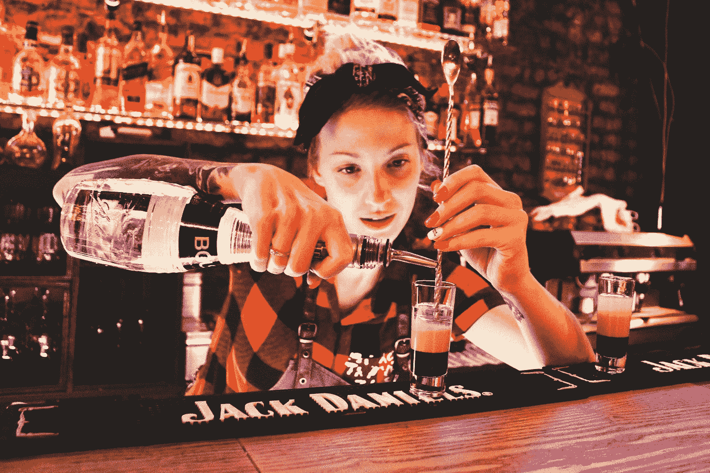

# 我所知道的 4 个最好的经理——是什么让他们变得伟大

> 原文：<https://betterprogramming.pub/the-4-best-managers-ive-ever-known-and-what-made-them-great-dc8a4e2c4354>

## 时尚达人、酒保、跑步者和新人

照片由[梅丽莎·艾斯丘](https://unsplash.com/@melissaaskew?utm_source=medium&utm_medium=referral)在 [Unsplash](https://unsplash.com?utm_source=medium&utm_medium=referral) 上拍摄

在写完我上一篇关于我所知道的最好的程序员的[文章](/the-4-best-programmers-ive-ever-known-and-what-made-them-great-40dc429aba05)后，我觉得有必要分享一下最好的经理。项目可能会很忙碌，经常会有很多“工作剧”干扰你的日常编码工作。那些有助于减少这种戏剧性的应该获得金牌——是的，我现在正在看 2021 年奥运会。

这些年来，在我遇到的众多经理中，有四位在工作中表现出色，他们让工作生活变得更加美好。

# 时尚达人

照片由 [Unsplash](https://unsplash.com?utm_source=medium&utm_medium=referral) 上的 [freestocks](https://unsplash.com/@freestocks?utm_source=medium&utm_medium=referral) 拍摄

有些人对时尚很有一套。他们知道如何穿着得体，也是配饰大师。这不是经理的必备技能，但是当提供 UI 设计反馈时，什么看起来好什么看起来不好的感觉会很有用。对于 web 应用程序，UI/UX 一直是我的激情所在。我相信这位经理在这方面鼓励了我，并扩展了我的能力，使我超越了写代码的范围。

## 是什么让她如此伟大

*   她鼓励创造力，并且总是愿意为我的 UI 设计想法提供反馈。
*   她提出了建设性的批评。它从来没有以消极的方式出现，只是让我更加努力。
*   她有很强的时尚感，这对于管理层来说并不重要，但她对细节的关注符合她的职业道德。
*   她在别人面前称赞我。这导致了我的第一份兼职，也是我创业的开始。

# 酒保

Andrey Grodz 在 [Unsplash](https://unsplash.com?utm_source=medium&utm_medium=referral) 上拍摄的照片

我们第一次见面时，这位经理并不是酒保，但当她说这是她以前的工作时，我并不感到惊讶。她与任何人交谈并让他们立刻感到舒适的能力是无可挑剔的。她能和他们中最好的人开玩笑，而且擅长妙语连珠。我们唯一的合作项目压力很大，但她的幽默感和支持让它变得更容易忍受。

## 是什么让她如此伟大

*   她支持我尝试新技术的愿望，即使其他人拒绝改变。
*   她很有幽默感，是最会笑的人之一。
*   她在工作之外协调了一次社交活动，这有助于建立团队团结和提高团队士气。这是一段难忘的时光，也是减压的好方法。
*   她召开了快速有效的会议，这是一种无与伦比的福气。

# 跑步者

照片由[像素](https://www.pexels.com/photo/woman-girl-silhouette-jogger-40751/)上的 [Pixabay](https://www.pexels.com/@pixabay) 拍摄

我和这位经理是在和时尚达人一起工作时偶然相遇的。她当时是另一个团队的经理，但几年后，当我加入她的项目时，我们再次相遇。作为一名经理，她给人留下了深刻的印象，她的多任务处理能力也是一流的，但更令人难以置信的是，她是如何管理自己的家庭和四个非常活跃的孩子的。她对健身的热爱是众所周知的，人们谈论她的跑步活动和下午的平板训练——我参加过一次，这就足够了。

## 是什么让她如此伟大

*   她非常慷慨，总是给我们队买食物。这也不是她报销的费用。
*   她超级友好，态度开朗。谈论网飞秀和有趣的迷因让每个人都很开心。
*   她鼓励健身，这是每个停滞不前的开发者都需要的。
*   她有四个孩子。这本身就很了不起，但管理他们的时间表也令人印象深刻。

# 新人

[Icons8 团队](https://unsplash.com/@icons8?utm_source=medium&utm_medium=referral)在 [Unsplash](https://unsplash.com?utm_source=medium&utm_medium=referral) 上的照片

你刚刚认识的一些人将会成为伟大的管理者。巧合的是，我也从与时尚达人的项目中听说过这位经理——这是一个大项目——但她当时不是经理。我最早认识她是开发商。当有消息称她将接替我目前的项目经理时，有人有能力接替她，这让我松了一口气。这个项目陷入了混乱，我们遭受了很多员工流失，但她令人钦佩地处理了这种情况，并在我的伟大经理名单中迅速上升。

## 是什么让她如此伟大

*   她有技术背景，这是许多经理没有的，所以解释技术问题更容易。
*   她很好说话，乐于倾听我们的担忧。
*   她减少了我们的会议，所以我们可以专注于编码。
*   她积极学习我们的 web 应用程序如何工作的技术方面。这对于减轻许多原本需要由开发人员来回答的问题来说是很棒的。

# 结论

我遇到过许多能够很好地完成工作的经理，但是这些经理不仅仅是优秀的项目管理人员。

*   他们很支持我。
*   他们很关心。
*   他们很体贴。
*   它们令人鼓舞。
*   他们很慷慨。

幸运的是，今天我仍然和这些经理中的一些人保持着联系，我会抓住机会和他们中的任何一个再次合作。希望你的经理会鼓励和支持你的项目。你应该为他们做同样的事情。

感谢阅读。