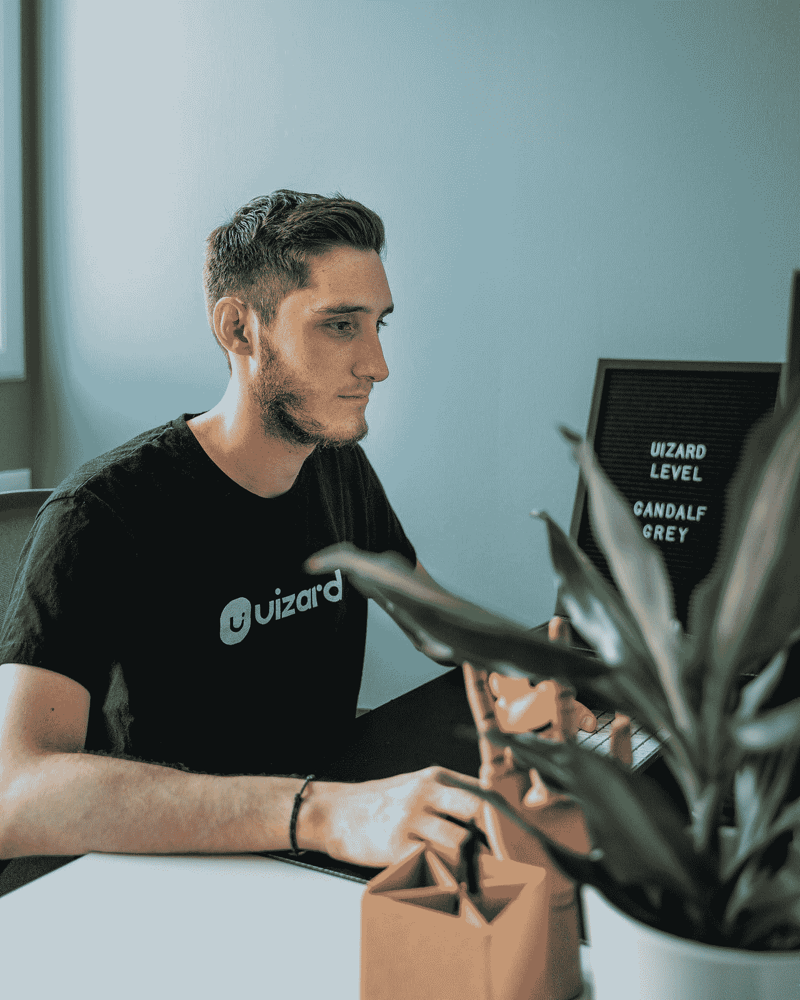

# 我所知道的 4 个最好的程序员——是什么让他们变得伟大

> 原文：<https://betterprogramming.pub/the-4-best-programmers-ive-ever-known-and-what-made-them-great-40dc429aba05>

## 他们教给我的不仅仅是编码

马修·费雷罗在 [Unsplash](https://unsplash.com?utm_source=medium&utm_medium=referral) 上的照片

尽管我已经写了多篇关于我与不太优秀的程序员相处的经历的文章，我必须用那些优秀的程序员来反驳。程序员是我见过的最聪明的人。有些人可能有他们的怪癖，但他们一般都很努力，渴望学习。在我 20 年的职业生涯中，有四位程序员脱颖而出——不仅因为他们教会了我多少编程知识，还因为他们教会了我如何成为一个更好的人。

# 杂耍导师

照片由[佩吉·安克](https://unsplash.com/@instagramfotografin?utm_source=medium&utm_medium=referral)在 [Unsplash](https://unsplash.com?utm_source=medium&utm_medium=referral) 上拍摄

在我上大学的年代，也就是 90 年代末，强调的编程语言是 C 和 C++。直到我在现实世界中的第一份工作，我才开始接触 Java。这种语言对我来说是陌生的，但由于它的开发工具包，看起来比 C++容易得多。和我一起工作的一个比我大一岁的开发人员已经有了相当多的 Java 经验。我把编程语言的核心知识归功于他。

## 是什么让他如此伟大

*   他很有耐心，总是愿意帮助解决任何问题。
*   他教我如何玩杂耍，结果证明这是一个很好的减压方法。
*   他在工作之余编程，因为他非常喜欢它。
*   他很谦逊，但可能是我认识的最聪明的人之一。

# 大笑的建筑师

Denis Agati 在 [Unsplash](https://unsplash.com?utm_source=medium&utm_medium=referral) 上拍摄的照片

有些人你永远不会忘记。在我的一个项目中，有一位建筑师的笑声是最独特和最有感染力的。当你听到的时候，你也忍不住笑了，即使你不知道他在笑什么。这种令人愉快的特性有助于平衡他严格的编码过程和测试驱动的方法。

## 是什么让他如此伟大

*   他让我重视代码审查的重要性。他非常彻底，这是在 GitHub 存在之前。我们在打印纸上审查我们的代码，并使用荧光笔标记问题。
*   他很好地平衡了工作和生活。我和我的同事会和他一起去快乐时光，他有一个坚实的高尔夫球游戏，他甚至拥有一艘船。
*   他很严格，但仍然乐于接受新思想和不同的做事方式。
*   他的笑声。我已经提到了这一点，但它值得再次提及。

# 克星

弗雷德里克·滕东在 [Unsplash](https://unsplash.com?utm_source=medium&utm_medium=referral) 上的照片

这位程序员的绰号不是因为他是一名警察——我以前听说过这种用法——而是因为他的玩家标签。我记不清是先来的，是当面还是网上认识的。我们有一个共同的朋友，也是同事，他提供了最初的介绍。当我们最终在一起工作时，令我印象深刻的是，这个游戏玩家也是一个非凡的程序员。

## 是什么让他如此伟大

*   他总是领先我一步。当我在学习 Spring Boot 的时候，他已经知道了，并且正在学习 Node。我在学 Node 的时候，他在学围棋。当我调查围棋的时候，他已经开始生锈了。你明白了。
*   他是个巨人，身高超过 6 英尺 3 英寸，但他并没有表现得比你好。有些人对自己的身高感到非常自豪，但我从来没有从他那里得到那种感觉。
*   他是一个忠实的游戏玩家。我和他一起玩过很多[战争机器](https://gearsofwar.com)。
*   在工作内外，他总是致力于更新的、流行的技术。据我所知，他在学铁锈，但那是几年前的事了，所以我肯定他已经离开了。

# AWS 神童

照片由 [Radoslav Bali](https://unsplash.com/@radoslavbali?utm_source=medium&utm_medium=referral) 在 [Unsplash](https://unsplash.com?utm_source=medium&utm_medium=referral) 上拍摄

随着年龄的增长，我的同事们自然变得越来越年轻。我第一次遇到这个神童——他比我小十多岁——是在我们听说 AWS 之前。几年后，我们再次相遇，很多事情都变了。不是他这个人，而是他在流行的云技术上有多快。

## 是什么让他如此伟大

*   他获得了所有 AWS 认证，因此有了这个绰号。每当我有 AWS 问题时，我知道先去哪里——嗯，在谷歌之后。
*   他总是很谦虚，有点害羞。即使在 AWS 取得了令人印象深刻的成就，他也从未表现得傲慢。
*   作为一个项目的技术负责人，他成了我的上司，但他总是乐于接受意见。
*   他是我认识的最好的人之一——即使是在和难以取悦的顾客打交道的时候。

# 结论

我和许多聪明的程序员一起工作过，但是这些人令人难忘的不仅仅是他们的编程技能。

*   他们很有耐心。
*   他们愿意帮忙。
*   他们很善良。
*   他们总是试图了解更多。
*   他们很谦逊。

我用过去时态谈论他们，因为我已经多年没见过他们或和他们一起工作了。我的假设是他们去做更大更好的事情了。希望你会遇到一些程序员，他们会激励你在编程之外做更伟大的事情。更好的是，如果你也成为了别人的伟大程序员。