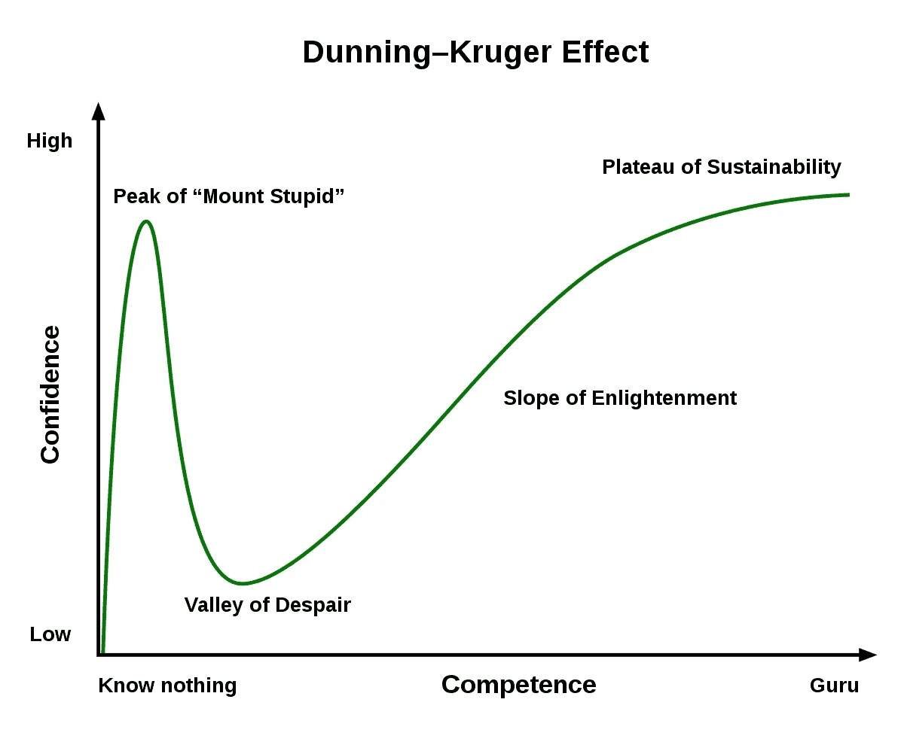

# 作为一名软件工程师，你有 4 个顿悟

> 原文：<https://betterprogramming.pub/the-4-epiphanies-you-have-as-a-software-engineer-45f6e2f135d8>

## “哦哦”的瞬间

在 [Unsplash](https://unsplash.com?utm_source=medium&utm_medium=referral) 上由 [Nghia Le](https://unsplash.com/@lephunghia?utm_source=medium&utm_medium=referral) 拍摄的照片。

你可能以前也有过这样的经历——这些豁然开朗的时刻，事情突然变得有了意义。突然间，你终于找到了自己在这个世界上的位置。

特别是，在大多数软件工程师的职业生涯中，有四个这样的奇迹时刻。

# 1.我会编码！

不，不只是“你好，世界！”但更重要的是。

这可能是你在工作中实现的第一个重要功能，或者你刚刚将你的第一个应用程序推送到应用商店。

直到现在，一切都很糟糕。

也许你是一个传统的大学生，你已经花了几年的时间去做愚蠢的作业和听无趣的讲座。

或者你在独立学习。尽管参加了一个又一个网络课程，你仍然觉得自己什么都知道，却一事无成。你得到的唯一“帮助”是关于堆栈溢出或 Reddit 的尖刻回答。

但是当你最终通过开发赚到钱的时候——当你的代码为真实的人做一些事情的时候——就像一束明亮的光穿过黑暗。

你觉得被救赎了。

当然，无论您是新手还是有经验的人，我们中的大多数人(如果不是所有人)都会在每次运行测试时品味“所有测试都通过了”这一美妙的信息。

但是当你第一次发布真实的东西时，这种感觉是完全令人陶醉的。

你感到被授权和有成就。你觉得你真的可以有所作为——你有能力。

“我*能*码，”你想。

# 2.我没有我想的那么聪明！

你听说过[邓宁-克鲁格效应](https://en.wikipedia.org/wiki/Dunning%E2%80%93Kruger_effect)吗？

图来自[维基媒体](https://commons.wikimedia.org/wiki/File:Dunning%E2%80%93Kruger_Effect_01.svg)。

在你职业生涯的几个月甚至几年后，你的实践已经成熟，你的技能也有所提高。

…你的自我膨胀得像疯了一样。

于是你开始接受更难的任务和项目。最终，你做出了一个中断生产的改变。灾难性地。

SRE 团队在凌晨 3 点从床上爬起来时诅咒你，你的整个部门举行“无可指责”的回顾会，每个人都知道你有错，但他们没有说出来(在我看来，这更糟糕)。

这是你最终进化的时候。你意识到你一直对软件工程知之甚少，你终于从傲慢的巅峰走了下来。

你认为你可以用你的解决方案来吸引人。你认为你可以在你的代码中加入一些小铃铛、哨子和重构。您开始对文档变得懒惰，并留下书面记录。或者也许你没有意识到你的生产系统有多复杂。

它回来咬你的屁股。

然而，从好的方面来看，它改变了你。突然间，你开始认真对待事情。

# 3.我是团队的一员

你猜怎么着？变得更加困难。

原因就是你和你的团队都是人类。我们都不是半机械人(还不是？).我们的一言一行总有不确定性和不一致性。

团队合作。交流。移交任务。同行评审、指导、设计和规划…

除了开发你的第一个特性和导致你的第一次大规模停机，你意识到你是无能为力的。

你是一个单独的工程师，与其他人相互联系。

我们今天看到的复杂系统是由令人难以置信的个人组成的团队构建的。当每个人都朝着同一个方向努力时，事情会更快地完成。

有时候，你会很幸运，在顿悟 2 号的同时意识到这一点。另一个团队成员或你的导师会加入进来，拯救你，并在这个过程中教会你一些东西。

其他时候，它发生在最微妙的时刻。也许某个团队成员提醒了你一些你忘记的事情。也许你会感激某人在某处给予你的帮助。或者也许你或其他人对一个项目贡献了一个想法，尽管并不对它负责。

“团队”里没有“我”工程师们必须一起为伟大而奋斗。当你意识到这一点时，你就会提升到另一个新的层次。它改变了你与他人互动的方式。

# 4.我影响每个人

老实说，每个人。显然，你的顾客是因为他们使用了你的产品。你的队友，正如你在上次顿悟中所了解的。现在，你意识到，你公司的底线。

一些工程师满足于露面。他们想在下午 5 点整关掉笔记本电脑，所以他们匆匆忙忙地完成工作。他们想什么就说什么，毫不犹豫。

但是你的影响力比你意识到的要大得多。

对于另一个工程师来说，你忽略的每一条提交消息或者你懒得在代码中留下的(需要的)注释都是浪费时间。

你的言谈举止，你的态度，以及你做出的每一个即兴评论都会影响到你团队中其他人的动力和能量。

你满足于复利的每一个捷径和简单的解决方案，在几个月或几年后都变成了严重的科技债务。

你没有向经理或队友传达的每一条信息都会导致混乱。

每个搅动的工程师都会在团队中留下一个洞，每个新加入的工程师都需要几个月的时间来热身和适应。

您延迟或未能交付的每个功能都会伤害销售团队、他们的对话和收入增长。

您的应用程序的每一次中断都会损害客户的情绪，伤害所有面向客户的团队、您的管理团队的信心，并最终损害底线。

当你意识到你有多强大——你对每件事的影响有多大——你就会明白成为一名工程师意味着什么。这种最终的认识改变了你做任何事情和说任何事情的方式。

和别人交流的时候，你会更友好，更清晰。

在编码和审查 PRs 时，您会更彻底一些。

你对如何支配自己的时间更有策略，当别人需要时，你会毫不犹豫地介入并给予帮助。

你花更多的时间思考架构，花时间去理解你所设计的东西的设计和用户体验。

你进化了。

# 结论

每一次顿悟都会把你变成一个比以前更好的工程师。最终，经过最后的顿悟，你将成为公司最有价值的工程师之一。

你的影响力和思考力已经达到了领导水平。

如果这些顿悟中的任何一个都没有发生，那就值得考虑改变你的项目或公司:

*   第一次顿悟表明你正在做的工作能让你成功并富有成效。如果你没有“耶！”那么你就错过了工程最基本的乐趣之一。
*   第二个顿悟表明你正在做的工作对你成长来说有足够的难度。如果你从未犯过任何错误，那么很可能你的工作太简单了。
*   第三个顿悟表明你为一个被授权的团队工作。阅读关于授权团队的书 *Accelerate* 和 [Marty Cagan 的帖子](https://svpg.com/empowered-product-teams/)，理解这里的含义。
*   最终的顿悟意味着你不再过于关注自己。当你只能考虑你自己和你如何融入这幅画时，这是缺乏经验和年轻的表现。一个真正领导者的标志是理解每个人和每件事是如何相互影响的。

无论你在旅途中的什么地方，我希望这篇文章是相关的，也许有助于确定你还可以改进的地方。

祝工程顺利。