# 如何调试 REST 请求

> 原文：<https://betterprogramming.pub/the-4-levels-of-rest-debugging-e35269e9da18>

## 通过以四种不同的方式监视正在交换的数据来找到那个烦人的 bug


图片由[穆罕默德·哈桑](https://pixabay.com/users/mohamed_hassan-5229782/?utm_source=link-attribution&utm_medium=referral&utm_campaign=image&utm_content=4445206)来自 [Pixabay](https://pixabay.com/?utm_source=link-attribution&utm_medium=referral&utm_campaign=image&utm_content=4445206)

不管您是在 Angular、React、Vue、Backbone 还是 JavaScript 前端，在某些时候您可能需要与后端服务进行通信。但是，当您的后端回复一个不需要的非 2xx 回复时，会发生什么呢？你传输了你的后端所期望的有效载荷了吗？您是否包含了所需的精确的 HTTP 头？可能在协议层面有问题吗？

在本文中，我们将回顾一些有效调试 REST 调用的常用方法:JavaScript 控制台、网络监视器、中间人服务器和网络流量分析。

# REST 请求的基本要素

如果你想知道 REST 是如何以及何时被定义为一个概念的，维基百科有一个有趣的页面。

总之，REST，即表述性状态转移，是一种“软件架构风格，它定义了一组用于创建 Web 服务的约束。”早在 2000 年，Roy Fielding 在他的博士论文“架构风格和基于网络的软件架构的设计”中首次定义了它。

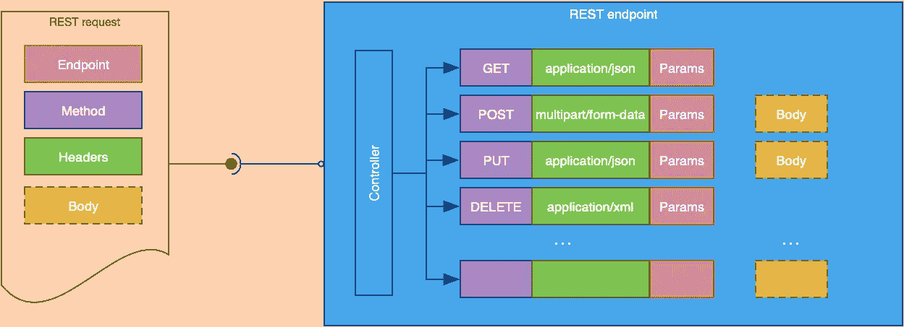

REST 请求的基本元素(图片由作者提供)

为了我们接下来将要讨论的调试方法和工具，让我们快速回顾一下组成 rest 请求的基本元素:

*   **端点:**这是 REST 调用的服务器端接收者所在的位置或地址。它被定义为一个 URL，最完整的形式可能看起来像`protocol://domain/path?queryParameters` *。*
*   **方法:**http 请求 method⁴指示对给定资源要执行的操作。也称为 HTTP 动词，它是以下之一:GET、HEAD、POST、PUT、DELETE、CONNECT、OPTIONS、TRACE 和 PATCH。
*   **头:** HTTP headers⁵由附加信息组成，这些信息伴随着从客户端传递到服务器的 HTTP 请求，反之亦然。您的请求可能有也可能没有相关联的标题。
*   **正文:**HTTP 消息正文是在 HTTP 事务消息中传输的任何附加数据，紧跟在消息头之后。主体是可选的，并不是所有的请求都需要主体。

您首选的后端框架的控制器逻辑必须匹配一个传入的 REST 请求的所有元素，以便为其提供服务。

那么什么会出错呢？如果您动态地创建您的端点，您的处理可能会导致 URL 的重要部分丢失。您的请求中使用的 HTTP 方法可能与后端预期的方法不匹配。或者一个重要的报头可能没有被注入或者可能被拼错。

在接下来的小节中，我们将研究当后端拒绝服务客户端 REST 调用时，增加调试客户端 REST 调用复杂性的四种不同方法。

# 第 1 级:浏览器控制台

如果你仔细计划你的信息，你的因特网浏览器的控制台，虽然穷人调试的选择，可以是有帮助的。

当然，即使您使用一个前端框架来热重新加载您的代码，通过添加输出语句来更改代码可能也不是最有效的调试方式。

但是，您仍然可以利用浏览器的控制台来显示调试消息，以便让您立即了解正在执行的代码，以及作为 REST 调用的一部分而生成和交换的关键数据结构。

根据经验，尽量减少使用浏览器控制台的日志。在你的前端代码中散布调试信息变成了一项技术债务，除非你有一个静态代码分析工具，比如 [SonarQube](https://www.sonarqube.org/) 来为你指出它们，否则它们可能会被遗忘。

因此，如果浏览器控制台是您唯一的选择，至少可以考虑使用日志框架。前端日志记录框架允许您根据级别和其他可能的附加属性将调试消息分组。

根据您需要进一步调试应用程序的哪一部分，您可以有选择地启用和禁用特定的组件级日志记录组，从而了解您需要的特定代码。当您准备好投入生产时，您可以通过轻击一个中心配置变量来禁用所有不必要的日志记录。

根据您在前端使用的框架，有许多日志记录框架可供选择，因此这里没有必要重新发明轮子。这里有一个你可能想尝试的快速选择:

JavaScript/NodeJS: [ulog](https://www.npmjs.com/package/ulog) ，[Winston](https://www.npmjs.com/package/winston)
Angular:[NGX Logger](https://www.npmjs.com/package/ngx-logger)
Vue:[vuejs-Logger](https://www.npmjs.com/package/vuejs-logger)
React:[React-Logger-lib](https://github.com/webcerebrium/react-logger-lib)

当然，你可以像脸书和 CNN 一样，使用浏览器控制台发出一些奇特的或预防性的通知:

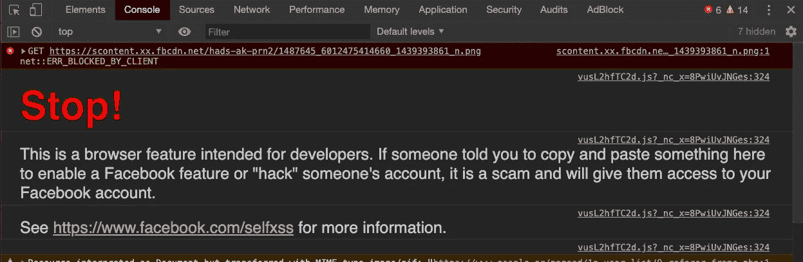

脸书浏览器控制台(图片来自作者)

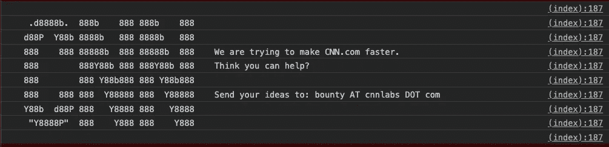

CNN.com 浏览器控制台(图片来自作者)

# 第 2 级:浏览器网络监视器/调试器

如果浏览器控制台的调试功能不足以找出问题所在，并且您的 REST 调用不被后端接受，那么您的浏览器的网络监视器/调试器就该派上用场了。

“网络调试器”选项卡是 JavaScript 或开发人员控制台中的一个选项卡，在所有浏览器中都可以找到。尽管它在不同的浏览器之间看起来略有不同，但它的基本功能是相同的。它允许您查看浏览器获取外部资源的每个网络请求。

为了研究网络选项卡的一些有趣特性，我们将使用由 [Swagger](https://swagger.io/) 提供的在线 [Petstore](https://petstore.swagger.io/) 示例应用程序:

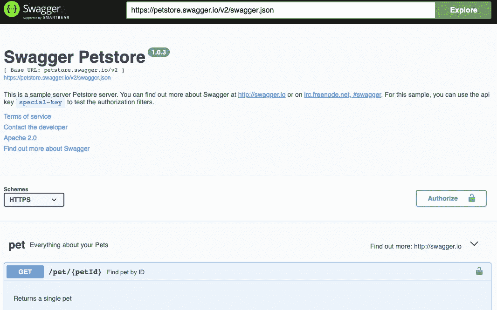

Petstore 示例应用程序(图片由作者提供)

Swagger 的直观设计允许我们选择一个 API 端点，并直接从浏览器中测试它。让我们使用 Chrome 为`/pet/1`发出一个`GET`请求:

*   打开位于[https://Petstore . swagger . io](https://petstore.swagger.io/)的 pet store 应用程序
*   点击`/pet/{petId}`旁边的蓝色获取按钮
*   点击“尝试一下”
*   输入“1”作为宠物 ID，然后点击蓝色的“执行”按钮

你的 Chrome 的网络标签现在应该看起来像这样:

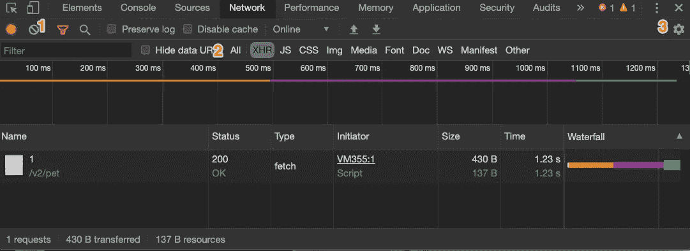

Chrome 的默认网络标签(图片由作者提供)

这里有几个按钮和配置选项。一些最有用的是清除按钮(1)、请求类型选择(2)和网络设置按钮(3)。

使用网络设置下的选项，您可以将网络输出转换为更紧凑的形式，如下所示:

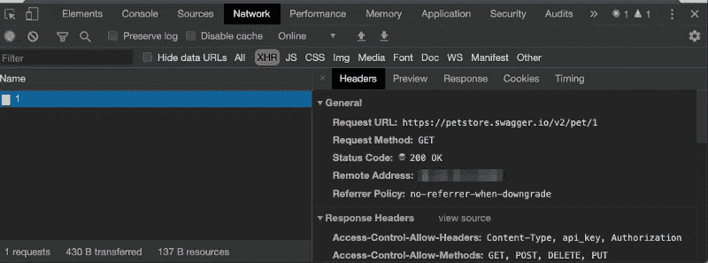

Chrome 网络标签的精简版(图片由作者提供)

通过单击左侧的请求，您可以在右侧看到该请求的详细信息。有五个主要的细节部分，描述了交换的头、接收到的响应的预览(如果是受支持的格式之一，就很好地格式化)、接收到的原始响应、使用的 HTTP cookies，以及关于请求定时的各种信息。

Network 选项卡提供了大量的信息，本质上揭示了 REST 调用背后的大量信息。通过浏览捕获的请求，Network 选项卡使您能够调查您的客户端到底发送了什么，以便有效地与您的后端所期望的进行交叉检查。

在我们进入第 3 级之前，让我们快速突出显示网络选项卡的一个有趣功能。

当您需要快速重放 REST 调用时，不需要在 UI 中重复您的操作，只需右键单击请求并选择“Copy as [cURL](https://curl.haxx.se/) ”

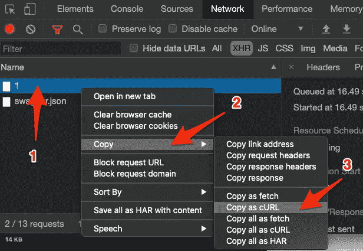

将请求复制为 cURL(图片由作者提供)

然后，您可以打开您最喜欢的命令行界面(CLI ),粘贴请求以重放它:

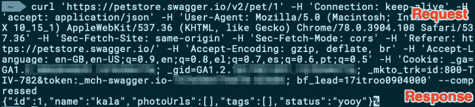

用 cURL 重放请求(图片由作者提供)

# 第三层:中间人代理

当您想要调试浏览器生成的调用时，浏览器 JavaScript 控制台和网络选项卡非常方便。如果您有一个采用嵌入式 REST 客户端的后端应用程序，会怎么样？这就是 man-in-the-middle⁶发挥作用的地方。

在密码学和计算机科学中，中间人(MITM)是一个与*攻击相关的术语。*它用于描述攻击者秘密中继并可能改变两方之间的通信的攻击，这两方认为他们正在直接相互通信。

出于调试目的，我们将借用 MITM 的概念，但不执行攻击或改变请求的内容——只是记录它。通过位于 REST 客户机和 REST 服务器的中间，我们可以从两个方向观察流量，并向第三方提供洞察和日志记录。

接下来看看效果如何。

## 直接请求-答复

最简单的直接请求-回复序列只涉及客户端和 REST 服务器。您直接请求服务器地址和端口，然后收到一个回复:

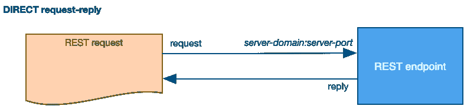

直接的请求-回复呼叫(图片由作者提供)

显然，这里没有中间人，所以让我们继续介绍一个。

## MITM 请求-答复

在 MITM 场景中，我们在架构中引入了一个额外的部分。这是一个位于 REST 客户端和 REST 端点之间的组件:

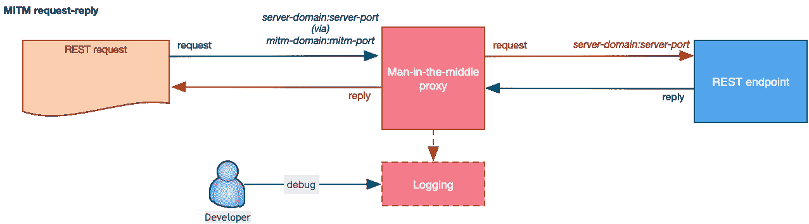

MITM 代理的请求回复(图片由作者提供)

MITM 代理侦听特定端口上的传入请求，然后将所有捕获的请求重新请求到目标服务器和端口。

一旦目标服务器提供了回复，MITM 代理就会将回复转发回原来的 REST 客户端，同时在本地记录所有流量。

您的客户端仍然不知道所有这些发生在幕后，您不需要修改任何代码，除非引入代理 URL。根据应用程序的底层框架和架构，这可能是您需要传递的命令行选项或应用程序内配置选项。

## 使用 MITM 代理

您可以使用一个名为 [mitmproxy](https://mitmproxy.org/) 的优秀开源项目毫不费力地启动您的本地 MITM 代理。这个代理工具适用于所有主流操作系统，也可以在 [Docker 镜像](https://hub.docker.com/r/mitmproxy/mitmproxy/)中使用。对于这一实际操作部分，我们将使用`mitmproxy`、的 Docker 图像，我们还将公开其 web 界面，以便我们可以使用互联网浏览器查看收集的日志。

要使用 Docker 启动`mitmproxy`，您可以发出以下命令:

```
docker run --rm -it \
 -p 8080:8080 \
 -p 8081:8081 \
 mitmproxy/mitmproxy mitmweb \
  --web-iface 0.0.0.0
```

这将在端口 8080 上启动代理侦听，在端口 8081 上公开其 web 接口。我们现在可以使用 cURL 重试之前的 REST 请求，这次使用`mitmproxy`作为我们的代理服务器:

```
curl -k --proxy [http://localhost:8080](http://localhost:8080) [http://petstore.swagger.io/v2/pet/1](http://petstore.swagger.io/v2/pet/1)
```

让我们打开`mitmproxy` 的 web 界面，检查一下捕捉到了什么:

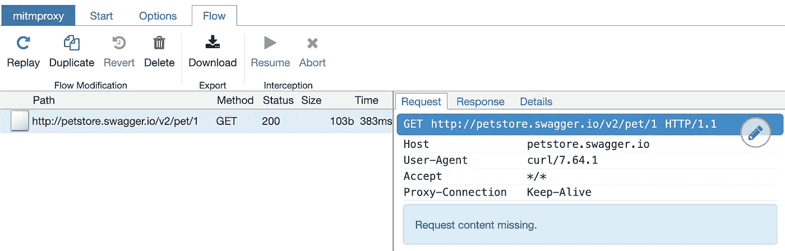

mitmproxy 的 web 界面(图片由作者提供)

在左边，我们看到捕获的原始请求，在右边，我们看到为这个请求交换的数据。

这个界面似乎类似于我们在上面第 1 级中检查的浏览器的网络选项卡；然而，`mitmproxy`提供了更多的选项来拦截请求、保存 HTTP 对话、重放客户端和服务器端响应、过滤和操作内容等。

# 第 4 级:网络流量分析

恭喜你，你已经升到第 4 级了。在前面的所有级别中，调试是通过检查我们和数据之间的另一个应用层已经解释的信息来进行的。在这一层，我们向下移动到网络表示层，这样我们就可以直接在数据包层调试信息。

请注意，这不是需要调试 REST 调用的典型级别。通常，问题出在你的更高层。但是，这一级别的调试允许您发现协议级的更深层次的问题，如连接性问题、安全性问题、数据包丢失、延迟等。早期的调试级别不能帮助你。

所以让我们捕捉一些网络数据。

网络流量分析需要一种方法来捕获网络接口传输的数据包。该类别中最著名的免费工具是[Wireshark](https://www.wireshark.org/)(Ethereal 的一个分支)。Wireshark 是世界上最重要、使用最广泛的网络协议分析器，它让您从微观层面了解网络上发生的事情。

Wireshark 是如此令人印象深刻的综合网络流量分析工具，以至于需要几篇独立的文章来解释它。因此，我将只尝试触及表面，并快速向您展示如何捕获和可视化您的 HTTP 流量。

## 网络捕获和包过滤

如果您开始 Wireshark 的捕获，您会看到许多许多数据包被捕获。你要做的第一件事是过滤那些感兴趣的包。再次使用上面的 Petstore 示例，我们可以看到我们要与之通信的服务器是`petstore.swagger.io`，因此我们需要过滤进出该地址的网络数据包。

在 Wireshark 中设置这样的过滤器只需要几个步骤:

*   转到视图>名称解析，并启用所有解析选项。
*   使用以下过滤器:`ip.host == petstore.swagger.io`

您可以通过单击蓝色鳍图标开始网络捕获。您应该得到类似于以下输出的内容:

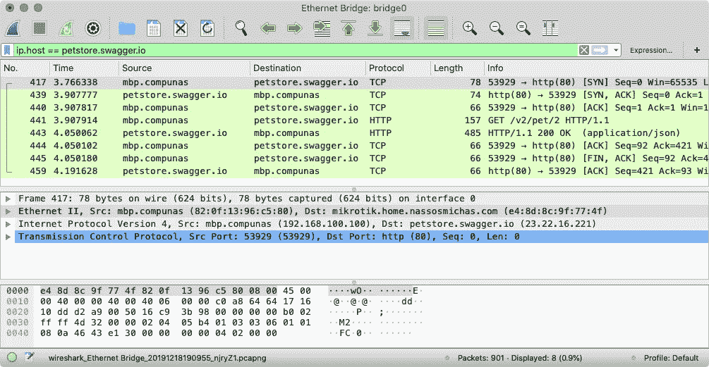

Wireshark 捕获(图片由作者提供)

以上捕获包括您的主机与`petstore.swagger.io`通信并执行`[pet/1](http://petstore.swagger.io/v2/pet/1)`的 REST 调用时发送和接收的所有网络数据包。您可以通过单击上半部分绿色的特定请求/响应来查看每个数据包的完整详细信息。

一种更方便的可视化完整交换的方法是右键单击请求/响应行，然后选择`Follow > TCP Stream`:

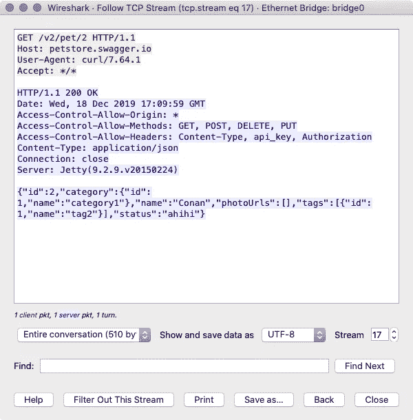

在 Wireshark 中跟踪 TCP 流(图片由作者提供)

Wireshark 可能不是最直观的工具，需要时间来掌握；但是，它可以帮助您在尽可能低的级别发现问题。

# 结论

有时，当我们开发 REST 客户端时，我们发现 REST 后端拒绝提供适当的回复。

在这篇文章中，我们研究了四个不同层次的递增复杂性。让我们能够了解其余的数据交换。

JavaScript 控制台、网络监视器、中间人服务器和网络流量分析是前端软件开发人员识别问题的重要工具。

# 参考

[1]维基百科。2005.表象状态转移【在线百科】。[https://en . Wikipedia . org/wiki/representative _ state _ transfer](https://en.wikipedia.org/wiki/Representational_state_transfer)(2019-12 月访问)。
[2]维基百科。2005.罗伊·托马斯·菲尔丁[在线百科]。[https://en.wikipedia.org/wiki/Roy_Fielding](https://en.wikipedia.org/wiki/Roy_Fielding)(2019 年 12 月访问)。
[3]菲尔丁，R. 2000。架构风格和基于网络的软件架构设计。[http://www . ics . UCI . edu/~ fielding/pubs/dissertation/rest _ arch _ style . htm](http://www.ics.uci.edu/~fielding/pubs/dissertation/rest_arch_style.htm)(访问时间 2019–Dec)。
【4】MDN 网络文档。2016.HTTP 请求方法[网站]。https://developer.mozilla.org/en-US/docs/Web/HTTP/Methods(2019 年 12 月访问)。
[5] MDN 网络文档。2010.HTTP 头[网站]。[https://developer.mozilla.org/en-US/docs/Web/HTTP/Headers](https://developer.mozilla.org/en-US/docs/Web/HTTP/Headers)(2019 年 12 月访问)。
【6】维基百科。2005.中间人攻击【在线百科】。[https://en.wikipedia.org/wiki/Man-in-the-middle_attack](https://en.wikipedia.org/wiki/Man-in-the-middle_attack)(2019 年 12 月访问)
【7】维基百科。2005.域名系统【在线百科】。[https://en.wikipedia.org/wiki/Domain_Name_System](https://en.wikipedia.org/wiki/Domain_Name_System)(2019 年 12 月访问)