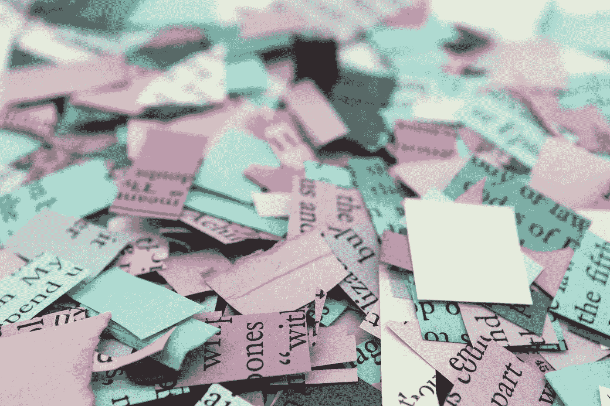

# 项目经理利用混乱项目的 4 种心态

> 原文：<https://betterprogramming.pub/the-4-mindsets-project-managers-embody-to-leverage-a-messy-project-ab634ad51a3b>

## #1 —不要等待完美

梅尔·普尔在 [Unsplash](https://unsplash.com?utm_source=medium&utm_medium=referral) 上的照片

项目混乱的前端是我们做出大量决定的地方，这些决定帮助或阻碍我们交付实际上满足人类需求的产品。

至少感觉重量很大。

那么，你如何用很少的资源、很少的关注和有理由怀疑来执行一些事情呢？

给自己留点风度，开始凌乱。

> 甚至超人在会飞之前就跳进了深水区

超人的秘密在于他和你并没有太大的不同。他出生在另一个星球，但在红色斗篷和紧身衣下，他只是个普通人。

你不会一开始就有惊人的能力；你培养他们。

你甚至不会直接从无助到胜任；在这个过程中有能力的阶段，每一个阶段都建立在你以前能做的基础上。

但是大多数人不投入工作。

这个世界充满了潜在的超人，他们从未真正尝试去做任何重要的事情。为什么？因为太恐怖了！

这意味着冒险、犯错……意味着感觉自己像个傻瓜。如果你成功了，也许人们会喜欢你；如果你失败了，他们会嘲笑你。

这样吧，你不需要知道如何完美地做一件事。你需要知道如何做得足够好才能达到目的。

跳进游泳池的深水区可能会很吓人。但是，如果你跳进深水区，你还是会更好，而不是站在边缘，想着跳进水里会发生什么。

一旦你跳了，就继续游！

# 1.不要等待完美

[摄](https://unsplash.com/@chiro?utm_source=medium&utm_medium=referral)上的[防溅](https://unsplash.com?utm_source=medium&utm_medium=referral)

启动一个项目的最好方法就是开始。

等到你有了一个完美设计的计划——一个有意义的、每个人都喜欢的、已经被你的同事彻底审查过的计划——是很诱人的。

那个计划可能不存在。

等待意味着永远的等待。首先重要的是别的事情:开始。

任何项目的第一步往往都是最难的，因为在这一步，你对自己在做什么以及为什么要做这件事最不清楚。

无论你是在编写一个新的应用程序，还是在打扫你的公寓，或者是在写书，或者是在种植一个花园，或者是在做手术，都是如此。你的大脑还没有时间产生足够的理由来解释为什么这个东西应该存在。

一个项目的第一个版本应该足够开始。不要等待完美。

# 2.适应挑战

管理好一个项目与其说是克服挑战，不如说是理解你的目标是什么，并克服挑战朝着目标前进。

一个项目的混乱不能成为管理不善的借口。混乱是管理过程的一部分——在这个过程中，你要确保利用你所有的资源，将每个问题转化为朝着目标前进的机会。

挡在你面前的不是一堵砖墙，而是一大堆问题。

挑战往往是艰难的，因为它们取决于许多事情，许多事情可能会一起击败你。墙只是一个问题。

我们通过寻找方法来克服这些挑战。

拥抱未知，走出你的舒适区。

克服你面前的障碍，适应它们，才能前进。拥抱未知，尝试新事物可能是度过难关的最佳方式。

# 3.趁乱

混乱的开始有几个好处。

最明显的是，当你还没有收拾干净的时候，解决问题就容易多了。

前进的道路是学会生活在混乱中。不要试图使你早期的草稿完美，而要努力使它们尽可能的糟糕。

要做到这一点，你必须学会如何处理你自己的混乱，以及如何带领其他人通过混乱的大团队一起解决棘手的问题。

你的项目也会很乱。学会如何接受这个事实。

# 4.边走边清理

鲍勃·范·奥贝尔在 [Unsplash](https://unsplash.com?utm_source=medium&utm_medium=referral) 上的照片

边走边清理的问题在于，它不会立即显现出来。

需要几个例子才能让你相信它真的有效。但是一旦你掌握了窍门，边走边收拾是你能做的最有回报的事情之一。这会让你的整个关系变得一团糟。

起初，这看起来像是额外的工作，但是过了一会儿，你意识到如果你等到你弄得一团糟之后才清理，那么弄得一团糟就是额外的工作。这使得清理事情变得更容易，所以你更有可能去做——一旦你在做，你更有可能注意到更深入清理的机会，等等。

那么，我说的边走边收拾是什么意思呢？

我指的是像清空你的收件箱或者盘子一脏就洗之类的事情。

如果有东西需要修理，马上修理。如果有些代码需要重写，马上重写。

如果有什么事情需要计划，马上计划。

你会发现，有时推迟这些事情会比你马上做的事情花费更多的时间——虽然不总是这样，但经常足以让这条规则值得遵循。

# 概括起来

开始凌乱。边走边打扫。

您的项目最终会被清理，但在您有东西要清理之前，您不能进行清理。