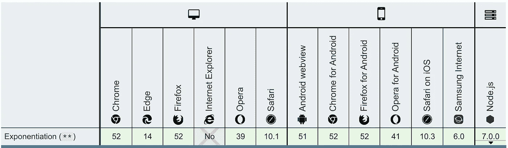
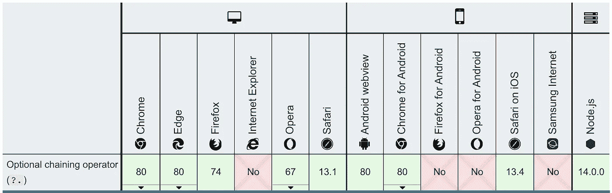
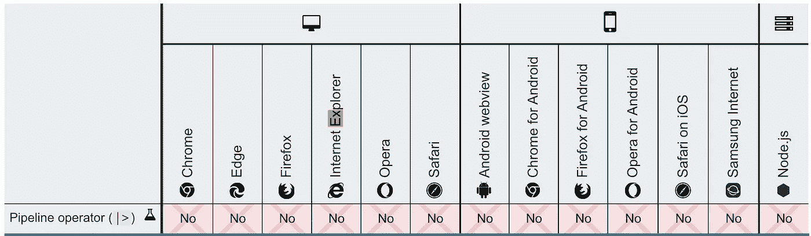

# 4 种最新的 JavaScript 操作:简介

> 原文：<https://betterprogramming.pub/the-4-newest-javascript-operations-an-introduction-9c7c8ee87864>

## 学习取幂、零合并、可选链接和管道操作符

照片由[沙哈达特·拉赫曼](https://unsplash.com/@hishahadat?utm_source=medium&utm_medium=referral)在 [Unsplash](https://unsplash.com?utm_source=medium&utm_medium=referral) 上拍摄

技术委员会 39 ( [TC39](https://tc39.es/process-document/) )是一个致力于 ECMAScript 标准化的 JavaScript 专家小组。

TC39 流程有多个阶段:

*   **阶段 0(斯特劳珀森):**为规范取输入。
*   **第一阶段(提议):**提议高级 API 进行评审。
*   第二阶段(草案):使用正式的规范语言精确地描述语法和语义。
*   **第三阶段(候选):**指定的评审人员已经签署了当前的规范文本。
*   **第 4 阶段(完成):**该添加已经准备好包含在正式的 ECMAScript 标准中。

在第 4 阶段之后，提案将被纳入 ECMAScript 的下一个版本。当规范作为标准通过年度批准时，提案也作为它的一部分被批准。

自 ES2015 以来，推出了许多新的 ECMAScript 语法和功能。在本文中，我们介绍其中的四种:`**`、`??`、`?.`和`|>`。

# 取幂运算符

[取幂运算符](https://developer.mozilla.org/en-US/docs/Web/JavaScript/Reference/Operators/Exponentiation) ( `**`)是在`var1 ** var2`格式中使用的计算运算符。它将`var1`的值返回到`var2`的幂。它等同于`Math.pow`，除了它也接受`BigInt` s 作为操作数。

求幂运算符(`**`)在 ES2016 中。

以下是一些例子:

取幂运算符是右结合的:`a ** b ** c`等于`a ** (b ** c)`。所以第 7 行相当于`2 ** (3 ** 3)`。

在 ES2020 中，所以即使它在浏览器中发布，ESLint 默认不支持它。如果第 8 行没有注释，它将显示错误`“'BigInt' is not defined”`。注释告诉 ESLint`BigInt`是一个全局变量。所以，不要用 no-undef 规则来警告。

第 10 行抛出一个错误:`“Uncaught TypeError: Cannot mix BigInt and other types, use explicit conversions”`。

以下是浏览器兼容性表:

# **无效合并运算符**

[无效合并运算符](https://developer.mozilla.org/en-US/docs/Web/JavaScript/Reference/Operators/Nullish_coalescing_operator) ( `??`)是在格式`leftExpr ?? rightExpr`中使用的逻辑运算符。当`leftExpr`为`null`或`undefined`时，返回`rightExpr`。否则返回`leftExpr`。

ES2020 中有 nullish 合并运算符(`??`)。

这是逻辑 OR 运算符(`||`)的增强，用于格式`leftExpr || rightExpr`。当`leftExpr`为假时，`||`返回`rightExpr`。否则，返回`leftExpr`。有时，当`leftExpr`为假值时，如`false`、`‘’`或`0`，表达式意外返回`rightExpr`。

以下是一些例子:

以下是浏览器兼容性表:

# **可选链接**操作符

[可选的链接操作符](https://developer.mozilla.org/en-US/docs/Web/JavaScript/Reference/Operators/Optional_chaining) ( `**?.**`)是语法上的糖衣，如果对象链中间有一个 nullish ( `[null](https://developer.mozilla.org/en-US/docs/Web/JavaScript/Reference/Global_Objects/null)`或`[undefined](https://developer.mozilla.org/en-US/docs/Web/JavaScript/Reference/Global_Objects/undefined)`)引用，它会短路返回值`undefined`。

可选的链接操作符(`??`)在 ES2020 中。

`a?.b`相当于`a && a.b`。

可选的链接操作符可以堆叠起来，以使代码简洁。

`a?.b?.c?.d?.e`相当于`a && a.b && a.b.c && a.b.c.d && a.b.c.d.e`。

可选链接可用于对象、函数或数组。以下是一些例子:

以下是浏览器兼容性表:

# 管道运营商

[管道操作符](https://developer.mozilla.org/en-US/docs/Web/JavaScript/Reference/Operators/Pipeline_operator) ( `|>`)是格式`expression |> function`中使用的语法糖。它以可读的方式创建链式函数调用。

管道操作员(`|>`)在 TC39 阶段 1。

`value |> function1 |> function2 |> function3 |> function4 |> function5`相当于`function5(function4(function3(function2(function1(value)))))`。

以下是一些例子:

高级示例在 [GitHub](https://github.com/tc39/proposal-pipeline-operator) 中定义。值得一读。

目前，您无法运行这些示例。这是实验性的，没有浏览器支持。

# 结论

编程语言随着时间而发展。跟上他们是一个挑战。与此同时，看到它们改进得更简洁、更强大也很有趣。

2021 年，ECMAScript 将会有新的语法和新的特性。

敬请期待！

感谢阅读。我希望这有所帮助。你可以在这里看到我的其他媒体出版物[。](https://medium.com/@jenniferfubook/jennifer-fus-web-development-publications-1a887e4454af)