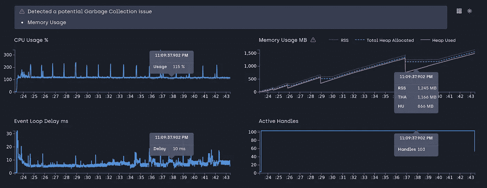
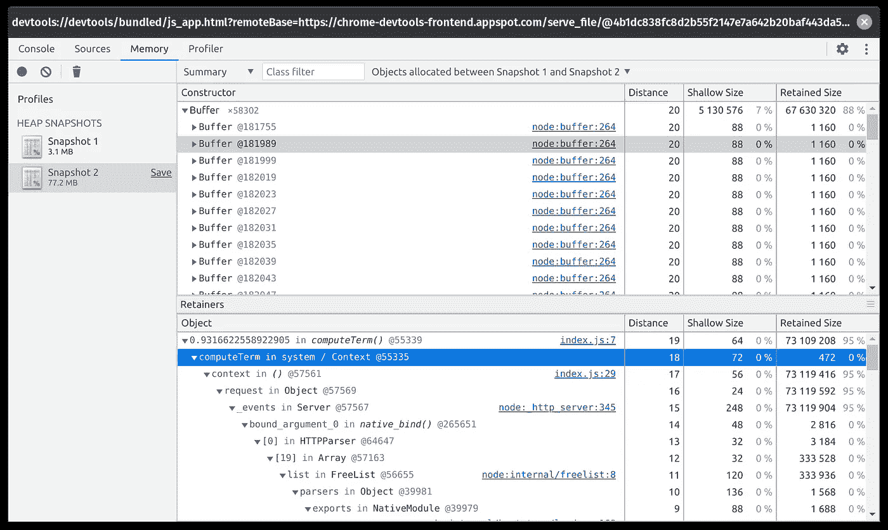
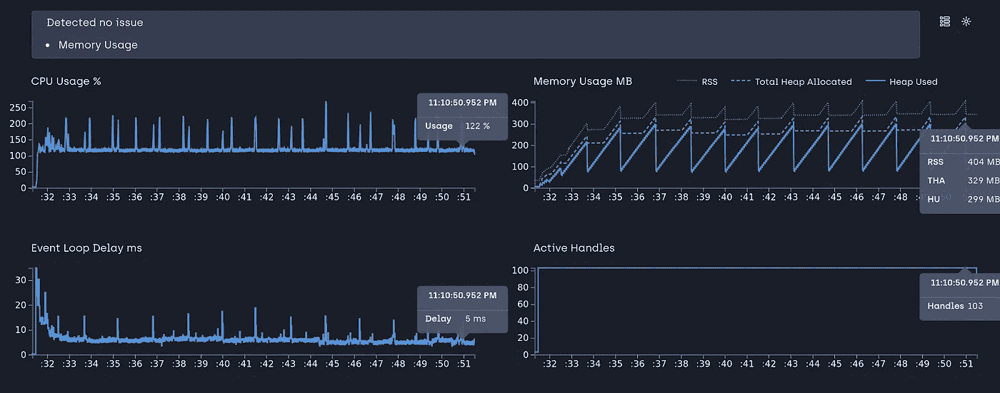
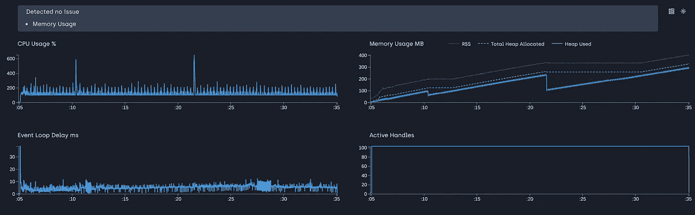
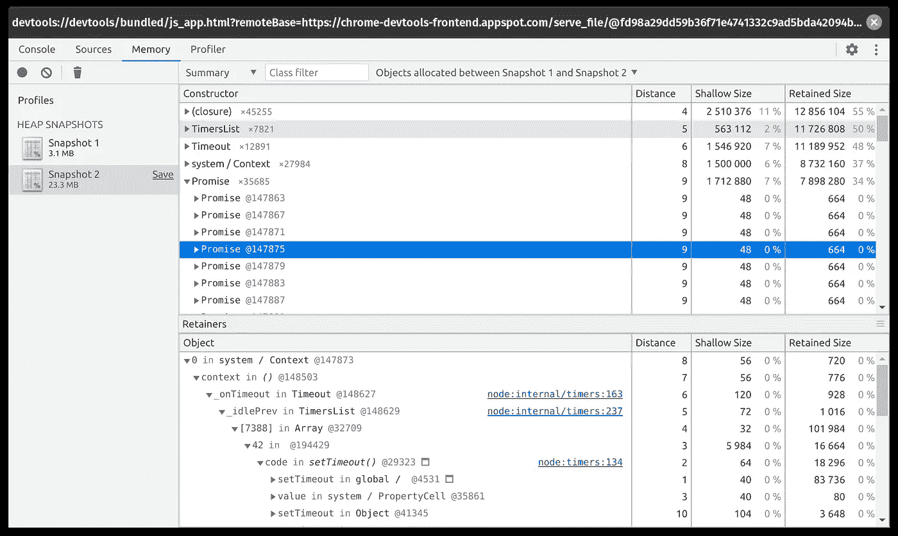
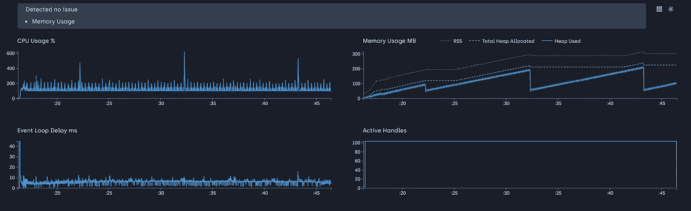

# Node.js 中的 4 种内存泄漏类型以及如何避免它们(第 2 部分)

> 原文：<https://betterprogramming.pub/the-4-types-of-memory-leaks-in-node-js-and-how-to-avoid-them-part-2-f21fbda5c33b>

## 看看缓存和承诺中的内存泄漏


由[paweczerwi324ski](https://unsplash.com/@pawel_czerwinski?utm_source=medium&utm_medium=referral)在 [Unsplash](https://unsplash.com?utm_source=medium&utm_medium=referral) 拍摄的照片

我们正处于软件的黄金时代。我们什么都有工具。我们有制造工具的工具。我们将核心系统构建成高级产品。但是有一件事在所有级别上都是常见的:臭名昭著的内存泄漏。这并不总是代码中的错误；有时不理解运行时的行为也会导致这种情况。

这里讨论的运行时是 Node.js。我已经在第一部分中写了其中的两个。在第 2 部分中，我们将探索另外两种类型。

# 4 种类型的内存泄漏

*   全球资源
*   关闭
*   贮藏
*   承诺

今天我们将重点讨论缓存和承诺。

# 贮藏

缓存是 Node 中最常见的内存泄漏类型。我个人不喜欢磁盘缓存；我总是更喜欢专用的解决方案。但是由于这个问题让很多开发人员感到头疼，所以让我们通过一个简单的例子来看看缓存是如何导致内存泄漏的。

现在，让我们运行以下代码:

```
clinic doctor --on-port 'autocannon -w 300 -c 100 -d 30 localhost:3000' -- node server.js
```

关于这个负载测试如何工作，请参考第 1 部分，但是基本上，我们使用[auto canon](https://github.com/mcollina/autocannon)进行负载测试，使用 [Clinic.js](https://clinicjs.org/) 进行内存图分析。让我们看看我们得到了什么。



内存增长很快。让我们看看脚本中发生了什么。我们知道函数是 JavaScript 中的对象，我们利用它来存储缓存的值。我们在缓存中存储一个 1KB 的缓冲区对象，并使用随机数作为缓存的密钥。让我们进行一次堆转储来检查什么在泄漏。(第 1 部分解释了堆转储过程。)



我们可以看到所有的缓冲区对象都在内存和`computeTerm`缓存中。缓存泄漏内存的原因是我们没有定期清除缓存。解决方法是在超时后释放内存。就这么办吧。

我们在一秒钟后清除缓存，即所有缓存对象在内存中停留一秒钟，我们可以访问它们，但在此之后，它们会被清除。我们使用一秒钟，因为我们的程序只会运行 30 秒钟，所以存储更多不会让我们显示解决方案的工作。这不是理想的解决方案，但它可以显示如何着手处理泄漏。让我们再次进行负载测试，并在临床报告中检查结果。



我们可以看到内存增加了，但不是在我们释放缓存的时候。漂亮又漂亮！我们需要确保在一段时间后释放缓存，这样它就不会占用内存空间。

我们可以通过使用像 LRU 缓存这样更完整的缓存机制来改进这个解决方案。但是我们今天不去了。一个不在机器内存中存储缓存的更合适的健壮的解决方案是使用专用的缓存服务器，如 [Redis](https://redis.io/) 或 [Memcached](https://aws.amazon.com/memcached/) 。我们将在后面的文章中探讨这一点。

# 承诺

承诺对未来有帮助。如果有一个函数在未来运行，一个承诺会给我们一个句柄，这样当它结束时，我们就可以对响应做一些事情，或者执行程序的其他部分。处理承诺时有一点很重要:

> **承诺存储在内存中，直到被处理或拒绝后才被清除**

让我们看一个简单的场景，承诺可能需要更长的时间来解决，并留在记忆中。

这里我们有一个任务承诺，在一定的等待期后得到解决。我们向任务函数发送 100 毫秒到 20 秒之间的随机数，以解决承诺问题。对于每个请求，我们都会创建一个承诺，在 100 毫秒到 20 秒内得到解决。让我们对此进行负载测试。



我们看到记忆稳步增长。但是如果承诺在一段时间后被解决，为什么记忆会增加？因为承诺停留在记忆里。我们不能永远跑下去，等待承诺的解决。如果他们永远无法解决呢？让我们看看堆转储，以确认这是事实。



我们可以在快照中清楚地看到，承诺就在记忆中。这个项目停止了，但是那些从未得到解决的承诺留在了记忆中。解决办法是限制承诺的执行时间以及之后的超时时间。此外，在生产中，我们应该跟踪这些承诺及其任务，以便可以重新启动它们。但在这里，让我们看看我们如何解决这个问题。

我们使用的是`Promise.race`，一个函数，如果一个数组中的任何承诺被解析，它就会拒绝未被解析的承诺。我们可以创建一个`timeout`承诺，这是承诺允许运行的最长时间。这里是 500 毫秒，然后它会返回。让我们看看这是否能解决我们的记忆问题。



我们可以看到内存正在被分配，但是因为有一个超时，它在一定的持续时间后被释放。为长时间运行的任务提供超时功能并处理承诺拒绝总是好的。

# 结论

我们已经了解了缓存和承诺是如何泄漏内存的。在两个教程中，我们了解了 Node 中四种最常见的内存泄漏类型。这些例子当然很短，只显示了演示泄漏场景所需的部分。在现实世界中，漏洞隐藏在数百行代码中。但是，有一个坚实的理解可以帮助我们跟踪那些讨厌的泄漏，而不需要太多的挠头。

项目链接:[https://github.com/Joker666/nodejs-memory-leak](https://github.com/Joker666/nodejs-memory-leak)

# 资源

*   [https://www . alxolr . com/articles/understanding-memory-leaks-in-node-js-part-1 # promises](https://www.alxolr.com/articles/understanding-memory-leaks-in-node-js-part-1#promises)
*   [https://www . alxolr . com/articles/understanding-memory-leaks-in-node-js-part-2 # cached-objects](https://www.alxolr.com/articles/understanding-memory-leaks-in-node-js-part-2#cached-objects)