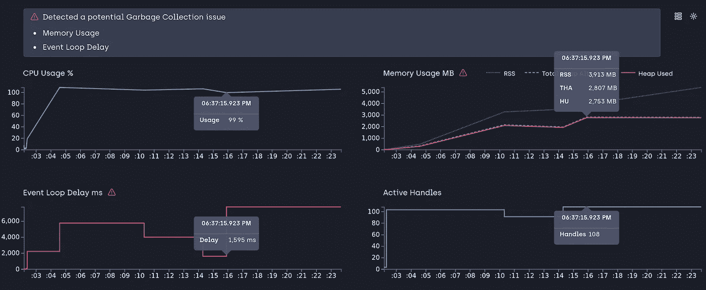
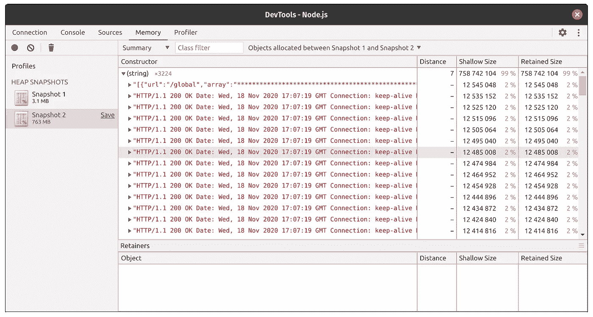
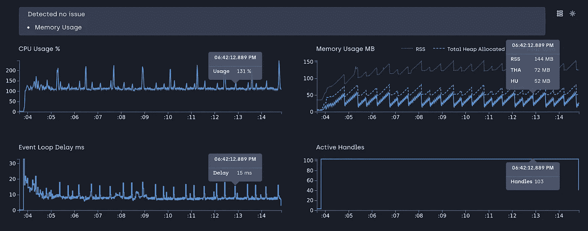
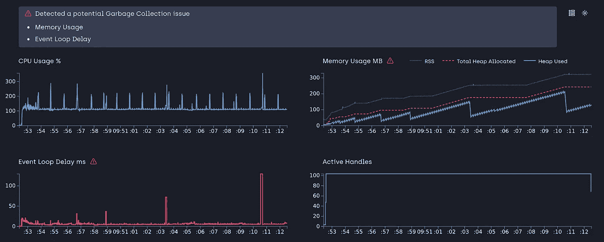
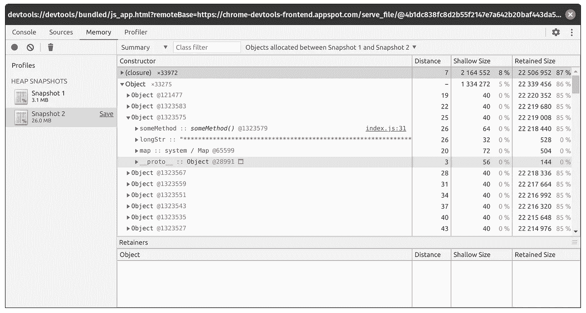
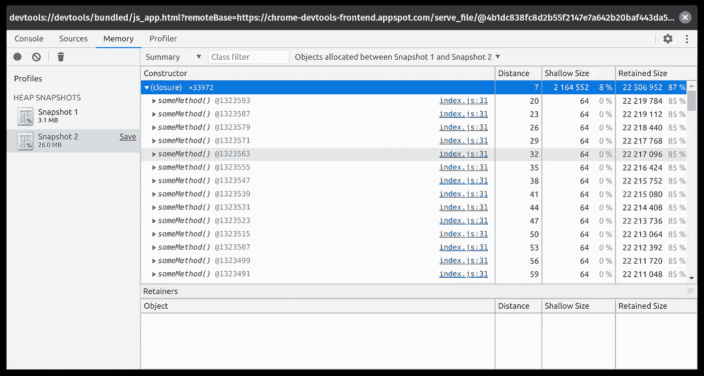
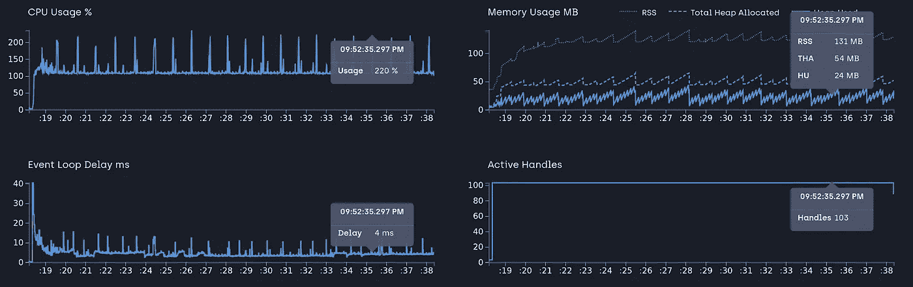

# Node.js 中的 4 种内存泄漏类型以及如何避免它们(第 1 部分)

> 原文：<https://betterprogramming.pub/the-4-types-of-memory-leaks-in-node-js-and-how-to-avoid-them-with-the-help-of-clinic-js-part-1-3f0c0afda268>

## 在 Clinic.js 的帮助下


由[金奎大·穆伊杰](https://unsplash.com/@daanmooij?utm_source=medium&utm_medium=referral)在 [Unsplash](https://unsplash.com?utm_source=medium&utm_medium=referral) 拍摄的照片。

第 2 部分—[node . js 中的 4 种内存泄漏以及如何避免它们](https://medium.com/better-programming/the-4-types-of-memory-leaks-in-node-js-and-how-to-avoid-them-part-2-f21fbda5c33b)

软件引入 bug 是很常见的。我们如何管理它们才是真正的问题。生产环境中最常见的错误之一是内存泄漏，Node.js 因容易发生这种情况而臭名昭著。因此，如果您是一名在生产环境中构建节点应用程序的软件开发人员，理解内存泄漏是如何发生的以及如何解决它们是一项不可思议的技能。

节点应用程序是一个长时间运行的进程，在该进程被终止或服务器重新启动之前，它会被引导一次。它处理所有传入的请求并消耗资源，直到这些被 V8 垃圾收集。泄漏是一种将它们的引用保存在内存中并且不会被垃圾收集的资源。我不会详细介绍 V8 的垃圾收集是如何工作的，但是可以随意查看[主题](https://www.dynatrace.com/news/blog/understanding-garbage-collection-and-hunting-memory-leaks-in-node-js/)上的[文章](https://blog.bitsrc.io/memory-leaks-in-nodejs-54ac7bbd4173)。

相反，我将重点介绍非常常见的四种类型的泄漏以及如何避免它们。

# 4 种类型的内存泄漏

*   全球资源
*   关闭
*   贮藏
*   承诺

对于第 1 部分，我们将探索前两种类型:全局资源和闭包。在第 2 部分中，我们将看到缓存和未处理的承诺是如何导致泄漏的。

# 准备

我们将需要优秀的 [Clinic.js](https://clinicjs.org/) 和`autocannon`来调试这些漏洞。您可以使用您想要的任何其他负载测试工具。几乎所有的方法都会产生相同的结果。Clinic.js 是由 [NearForm](https://www.nearform.com/) 开发的一个很棒的工具。这将有助于我们对内存泄漏甚至循环延迟等性能问题进行初步诊断。所以，让我们先安装这些工具:

```
npm i autocannon -g
npm i clinic -g
```

现在我们准备捕捉一些漏洞！

# 全球资源

这是节点泄漏的最常见原因之一。由于 JavaScript 作为一种语言的本质，它非常容易添加到全局变量和资源中。如果这些问题没有随着时间的推移得到清理，它们会不断累积，最终导致应用程序崩溃。让我们看一个非常简单的例子。假设这是应用程序的`server.js`:

现在，如果我们跑:

```
clinic doctor --on-port 'autocannon -w 300 -c 100 -d 20 localhost:3000' -- node server.js
```

我们正在同时做两件事:用`autocannon`对服务器进行负载测试，并捕捉跟踪数据，以便用 Clinic 进行分析。脚本运行 20 秒后，将会打开一个浏览器窗口，显示如下内容:



我们看到的是内存的稳定增长和事件循环中服务请求的延迟。这不仅增加了堆的使用量，还会影响请求的性能。分析代码可以发现，我们在每个请求中增加了`requestLogs`全局变量，而且我们从来没有释放它。所以它一直在增长和泄漏。

我们可以使用 Chrome 的节点检查器跟踪泄漏，方法是在应用程序第一次运行时获取一个堆转储，在 30 秒的负载测试后获取另一个堆转储，然后比较这两个堆之间分配的对象。我不会详细介绍如何进行堆转储。通过阅读这[两篇文章](https://nodesource.com/blog/memory-leaks-demystified)可以学习技法[。但是当我们遵循这个过程时，我们会看到:](https://marmelab.com/blog/2018/04/03/how-to-track-and-fix-memory-leak-with-nodejs.html)



是全局变量`requestLogs`导致了泄漏。快照 2 的内存使用率明显高于快照 1。让我们来解决这个问题:

这是一种解决方案。如果您确实需要持久化这些数据，您可以添加外部存储，如数据库来存储日志。如果我们再次运行诊所负载测试，我们会发现现在一切正常:



# 关闭

闭包在 JavaScript 中很常见，它们会导致本质上难以捉摸的内存泄漏。阅读 [meteor 的博客](https://blog.meteor.com/an-interesting-kind-of-javascript-memory-leak-8b47d2e7f156)关于他们如何追踪一个闭包基内存泄漏。我们在这里探讨这种情况:

如果我们用`autocannon`和诊所加载测试这段代码，我们会看到:



内存增长很快，如果我们想知道脚本出了什么问题，很明显`theThing`会被每个 API 调用覆盖。让我们来看看堆转储的结果:



当我们比较两个堆转储时，我们看到`someMethod`在所有调用中都保存在内存中，并且它持有`longStr`，这增加了内存的快速增长。在上面的代码中，`someMethod`闭包正在创建一个封闭范围，它持有`unused`变量，尽管它从未被调用过。这阻止了垃圾收集器释放`originalThing`。解决方案就是取消结尾的`originalThing`。我们正在释放该对象，以便不再保留闭包作用域:

现在，如果我们与 Clinic 一起运行负载测试，我们会看到:



封口无泄漏！很好。我们必须关注闭包，因为它们创建自己的作用域并保留对外部作用域变量的引用。

# 结论

我们已经探讨了 Node 中两种主要类型的内存泄漏，以及如何在 Clinic.js 和 Chrome 的 Node 调试器的帮助下检测它们。在下一篇文章[中，](https://medium.com/better-programming/the-4-types-of-memory-leaks-in-node-js-and-how-to-avoid-them-part-2-f21fbda5c33b)我们将探讨另外两种类型。

[项目描述](https://github.com/Joker666/nodejs-memory-leak)有关于如何运行应用程序和负载测试的资源。它还包括解决方案。

# 资源

*   [https://blog . meteor . com/an-interest-kind-of-JavaScript-memory-leak-8b 47d 2e 7 f 156](https://blog.meteor.com/an-interesting-kind-of-javascript-memory-leak-8b47d2e7f156)
*   [https://www . dyna trace . com/news/blog/understanding-garbage-collection-and-hunting-memory-leaks-in-node-js/](https://www.dynatrace.com/news/blog/understanding-garbage-collection-and-hunting-memory-leaks-in-node-js/)
*   [https://blog.bitsrc.io/memory-leaks-in-nodejs-54ac7bbd4173](https://blog.bitsrc.io/memory-leaks-in-nodejs-54ac7bbd4173)
*   [https://nodesource.com/blog/memory-leaks-demystified](https://nodesource.com/blog/memory-leaks-demystified)
*   [https://marmelab . com/blog/2018/04/03/how-to-track-and-fix-memory-leak-with-nodejs . html](https://marmelab.com/blog/2018/04/03/how-to-track-and-fix-memory-leak-with-nodejs.html)