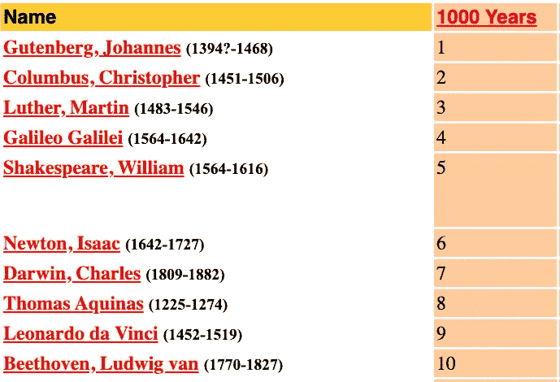
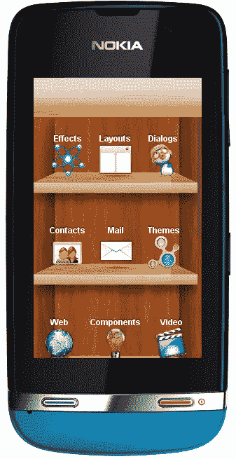

# 5 种最具影响力的编程语言，排名如下

> 原文：<https://betterprogramming.pub/the-5-most-impactful-programming-languages-ranked-fa70bb9a8359>

## 哪一个对世界最有益？


[KOBU 机构](https://unsplash.com/@kobuagency?utm_source=medium&utm_medium=referral)在 [Unsplash](https://unsplash.com?utm_source=medium&utm_medium=referral) 上拍摄的照片

不久前，我偶然看到一个超受欢迎的 [TED YouTube 视频](https://www.youtube.com/watch?v=1X7fZoDs9KU)，它讲述了将爱尔兰确立为最佳国家的好国家指数。

这让我想到“如何用编程语言来衡量这一点？”

当我想得更深时，我变得更加困惑。建立一个国家的参数不能应用于编程语言，原因有二:

*   编程语言是技术创造的工具，技术是科学的产物。它远不是一个被文化、语言和种族所束缚的社区，我们认为它是一个国家。
*   编程语言仅仅是一种向机器和程序员交流思想的工具。它自己没有行善的意识。

那么一个人如何提出编程语言行善指数呢？

自 2011 年以来，Stack Overflow 已经发布了其[编程语言流行度调查。但是，由用户投票驱动的受欢迎程度竞赛往往掩盖了真实的、可衡量的影响。](https://insights.stackoverflow.com/survey/)

人气！=影响？

看起来我需要做一些严肃的研究。

就是在那个时候，我决定研究编程以外的学科。

# 文艺复兴时期的古腾堡

在一本多产的历史书《1000 年，1000 人:塑造千年的男人和女人排名》中，以下十人被列为第二个千年(1001-2000 CE)最具影响力的十大人物:



贷:存档—代表[rhsweb.org](https://web.archive.org/web/20120303082307/http://rhsweb.org/library/1000PeopleMillennium.htm)

令我震惊的是，博学的天才阿尔伯特·爱因斯坦竟然不在这个名单上，尽管他是《时代》杂志评选的 20 世纪最有影响力的人，并且有一张值得迷因的脸！

这给了我一个启示:这本书出版于 1998 年，当时互联网还处于蹒跚学步的阶段。如果它的支持调查在今天完成，也许会完全不同。

真的吗？

如果没有古腾堡，每一个天才的想法都会和它的创造者一起死去。

那时我开始研究古腾堡对整个社会的影响。虽然他的所作所为与他同时代的人，如莱昂纳多·达芬奇相比，从根本上来说算不上天才，但他在欧洲历史上最黑暗的时代创造了一些勇敢的东西:一种传播急需思想的工具——印刷机。

每一个文艺复兴时期的天才都改变了艺术和科学，把我们从错误宗教的迷信魔掌中带了出来。但是这一切都是通过古腾堡的发明到达我们这里的，他的价值是永恒的。

即使在今天这个高度数字化的世界，实体书仍然占据着至高无上的地位。

在考虑了最广泛的可能场景后，我列出了最优秀编程语言的竞争者。

我已经提出了基于我个人观点的排名，但它是开放的讨论。欢迎在评论中写下你的想法。

# 5.服务器端编程语言（Professional Hypertext Preprocessor 的缩写）

当网络在 90 年代兴起时，编程新手疯狂地学习 HTML。要获得极客的地位，你要做的就是:

*   打字更快
*   知道一些 HTML 标签


信用:[推特](https://twitter.com/ivan_limbo/status/1326400828912115712)

HTML 认知者认为自己是摇滚明星。网络上充斥着投资组合网站，这些网站的所有者认为网络只是他们实体企业的一个营销渠道。

但是有些人，包括拉斯马斯·勒德尔夫(一个丹麦裔加拿大计算机程序员)提出了正确的问题，比如:

如何用这些静态设计的网页做生意？

你不能让每个访问者都使用同一个版本的网站。如果没有将动态业务逻辑包裹在愚蠢的 HTML 标签周围，网站就会显得力不从心。

拉斯莫斯与安迪·古特曼和泽夫·苏拉斯基一起创建了 PHP(个人主页的首字母缩写，更名为 PHP:超文本预处理器)来解决这个问题。

尽管它的语法很难看(例如，文章图片)，但它很快成为许多想要避开基于 C 的 web 服务器的本质的程序员的首选工具。PHP 允许他们编写内联业务逻辑和 HTML，这是自互联网出现以来的第一个。

PHP 还允许 C 程序作为动态扩展运行，这部分解决了性能问题。

脸书的应用服务器是用 PHP 编写的。

雅虎，谷歌之前最流行的搜索引擎，运行在 PHP 上。

WordPress 给我们带来了博客世界。多亏了 PHP，WP 和它的数百万个插件为在线商店、作品集和博客提供了动力。

如果你还在质疑 PHP 是否被列入名单，看看这个:世界在线知识的主要来源维基百科的后端是用 PHP 编写的。

这就是今天的古腾堡出版社。

# **4。Python**

20 世纪有了电。21 世纪得到了 AI。

Python 是当今可读性最强的语言。作为一种相当高级的语言，它能让新手程序员在几分钟内编写应用程序。

自上世纪 90 年代以来，在编程范式发生一些最激进转变的时期，它一直在过去 20 年中位列[十大最受欢迎的语言](https://www.tiobe.com/tiobe-index/)。

但仅凭人气不足以将其列入前五榜单。以下是另外三个:

*   Python [运行一些最有影响力的软件系统的后端](https://en.wikipedia.org/wiki/Programming_languages_used_in_most_popular_websites)，包括谷歌、YouTube、脸书和 Pinterest。如果我们正在寻找像古腾堡那样的知识视角的传播，Python 是一个强有力的竞争者。
*   Python 为 ECMAScript 贡献了迭代器和生成器，ECMAScript 是超级流行的 JavaScript 的标准。
*   自 2010 年以来，Python 也将自己重新定位为数据科学和机器学习的语言。他们说 20 世纪有了电。21 世纪有了人工智能。像 NumPy 和 SciPy 这样的库也使它成为科学计算的合适选择。Python 是未来主义的，在一个由 AI 驱动的世界里，没有云提供商可以忽视基于 Python 的运行时。

# 3.Java Script 语言

JavaScript 最初是由 Netscape 创建的，从一开始它就是事实上的 web 客户端脚本语言。

最初，由于微软对 Internet Explorer 的垄断(微软发布了它的 doppelgnger，JScript)，JavaScript 不断得到开源社区的支持。在 2000 年的十年中，Ajax 和 jQuery 在 JavaScript 的帮助下保持了 web 开发的火焰，而 ECMA International 则与 Mozilla 和 Google 等公司一起对其进行了标准化。

它在 2008 年 Chrome 的 V8 版本发布后获得了稳定的地位。在这之后，大部分开发商的阻力消失了。很快，ECMAScript 5 版本(2009)巩固了这一地位。

JavaScript 的流行是因为它是所有程序员的首选语言:

*   它几乎从网络诞生之日起就存在了。
*   受 Java 语法的启发，这是一种非常简单的方法。它是弱类型的，清教徒程序员讨厌它，他们中的一些人提出了严格的类型(尝试发音，你会得到双关语)变体。一个没有编程背景的人可以在一两周内学会它，并且走得相当远。
*   它一直受到浏览器社区的支持。

就像 Python 一样，JavaScript 也很受欢迎，在过去 20 年的 Tiobe 排名中[位列前 10 名](https://www.tiobe.com/tiobe-index/)。

JavaScript 简单的语法和更广泛的应用使其成为最有影响力的 web 和移动开发框架的组成部分:

*   反应(Facebook.com 使用)
*   有角的(Google.com 和 YouTube.com 使用)
*   电子版(由 VSCode、MS Teams、Figma、WhatsApp Desktop 等原生桌面应用使用)
*   React Native(被大多数跨平台应用使用)。

另一方面，服务器端 JavaScript 最初在 Netscape 创建 Netscape Enterprise Server 和微软创建 Internet Information Server (IIS)时找到了相关性，但这些努力很快就消失了。

后来，NodeJS 把它带回到最前沿，还有它的其他基于 JavaScript 的服务器端实现的巨大的[对等列表](https://en.wikipedia.org/wiki/List_of_server-side_JavaScript_implementations)。

JavaScript 有它的怪癖。用 JavaScript 编程很糟糕。但考虑到它是如何开始的，以及它已经走了多远，这不会削弱它的重要性。

# 2.Java 语言(一种计算机语言，尤用于创建网站)

我的第一门编程语言是 Pascal，是学院给我打的耳光。我放弃了过去的课程。在大学期间，我想成为一名专业的 C 程序员，但由于学习曲线陡峭，我的努力是短暂的。

主要的限制是工具链:我负担不起 MS Visual Studio 编写 C 程序的费用。唯一可用的 Borland 代码在充满指针和僵尸的黑暗森林中没有太大帮助。互联网随处可见，但解决每一个编译错误并不容易。

J2SE 1.2 附带的 JRE 是我在采用英特尔赛扬处理器的电脑上安装的第一个语言运行时。有了 Java 清晰的 OOP 结构，再加上指针内存管理，我很快就采用了它来制作我的第一个桌面项目:一个运行在 Java applet 上的基于鼠标指针的 2D 射击游戏。

在我被雇佣后不久，我开发了一个网页抓取器，接着是一个基于套接字的聊天室——两者都使用 Java。它们都不需要超过两个 Java 文件，每个文件不超过 100 个 LOC。

好了，我说了:

*   Java 是免费的，这让微软统治下的私有和掠夺性世界松了一口气。
*   Java 很简洁。用 Java 写几行代码比用 C++写要多得多。
*   Java 是基于 OOP 的，但是没有 C 和它的 OOP 兄弟 C++的内存管理的不良包袱。
*   Java 是跨平台的。它是第一个真正适合桌面平台和新兴网络平台的高级语言(主要用于服务器端，但许多网站也喜欢编写客户端小程序)。不像当时的其他桌面语言，如 Visual Basic，你不必再将你的软件产品局限于 MS 平台。
*   一个人很快就可以非常流利地使用 Java。微软创造的。NET 和它最流行的语言 C#受到了 Java 的这种流畅性的很大影响——这是我没有把 C#包括在这个列表中的原因，忽略了这样一个事实:C#和。NET stack 建了最流行的编程网站，Stack Overflow。

今天，尽管 Sun 已经被 Oracle 收购，但上述大部分情况都是真实的。Oracle 已经开始向 JDK 出售一些支持许可，但是只要涉及到 Java 开发，这些许可都不是强制性的。

Java [运行着](https://en.wikipedia.org/wiki/Programming_languages_used_in_most_popular_websites#cite_note-auto-14)我们日常使用的几乎所有东西的后端，包括谷歌、脸书、YouTube、亚马逊、Twitter、易贝(PayPal 的所有者)和 LinkedIn。Java 还形成了世界上最流行的移动操作系统 Android 的 [API 层。](https://developer.android.com/guide/platform)

但这还不是全部。詹姆斯·高斯林在开发 Java 时还有其他想法:为各种类型的设备开发软件，而不考虑它们的本机操作系统。因此，JRE 在虚拟机中运行，并内置了对在设备中运行的支持，包括但不限于:



信用:[代号一](https://www.codenameone.com/blog/j2me-feature-phones-nokia-devices.html)

*   手机(不是安卓智能手机，安卓智能手机本来就运行大量 Java 代码，但像图中显示的运行 J2ME 的手机)
*   蓝光播放器和智能卡读卡器
*   打印机、网络摄像头、游戏、汽车导航系统
*   彩票终端，停车付费站

根据甲骨文 2015 年发布的估计，世界上有 130 亿台设备运行某种形式的 Java。显然，从那时起，这个数字成倍增加。

# 1.C/C++

c 是一种通用的、过程化的计算机编程语言。

一个计算机科学的学生，如果他的学习经历了学术编程课程，那么他至少读过 100 遍以上的陈述。每一次，都有新的意义从中浮现。

c 很难定义，e̵̵̵v̵̵̵e̵̵̵n̵̵̵̵-̵h̵̵̵a̵̵̵r̵̵̵d̵̵̵e̵̵̵r̵̵̵也不可能被取代。

c 是由 1972-73 年间在贝尔实验室工作的丹尼斯·里奇(与肯·汤普森**)领导的项目。他的目标是为其 Unix 操作系统创建应用程序，并重写一些内核。**

结果是一种人类可读的、简洁的语言，与汇编相比，它仍然可以提供相当高的运行效率。c 提供了它，以至于根据 TOIBE 索引，它仍然是最受欢迎的编程语言。

为了强调 C 语言直接提供了什么，考虑一下汇编语言代码后面的[，它在 x86 Intel 处理器上增加了两个数字(10+14):](https://stackoverflow.com/a/51433261/1506363)

```
SECTION .data

    extern printf
    global main

fmt:
    db "%d", 10, 0

SECTION .text

main:
    mov     eax, 14
    mov     ebx, 10
    add     eax, ebx

    push    eax
    push    fmt
    call    printf

    mov     eax, 1
    int     0x80
```

在 C 语言中，您应该写:

```
int sum(int a, int b) { int sum = a + b; return sum;}
```

与今天的高级速记框架不同，创建 C 所涉及的工作不仅仅是上面的速记，而是设定了一个更高的目标:使用人类可以理解的命令来控制计算机，同时保持对 OS +资源的最细粒度的控制。

我知道你已经在想:COBOL 从 1959 年就存在了，而且是用简单的英语写的。但是 COBOL 的目的在于它的名字(面向商业的通用语言)。一个门外汉可以用 COBOL 编写代码，但是它们是非常简单和冗长的指令。

与 C 程序员不同，COBOL 程序员无法更好地控制许多计算资源，如内存、处理器和存储——这些要求对于任何类型的高性能科学计算都是至关重要的。采用 OOP 之类的特性也很晚(2000 年以后)。

由于 COBOL 与基于大型机的系统的固有绑定，COBOL 程序是不可移植的，并且 COBOL 程序员比大海捞针还难找到。正因为如此，许多旧的政府系统一直使用 COBOL，直到它们开始 100%用现代语言重写。

随着 C 语言(一种通用语言)的出现，一种新的编程语言诞生了:高级语言。

c 的影响是双重的:

*   编译器使用 C 语言创造了新的语言，操作系统使用 C 语言和汇编语言编写的驱动程序扩展了它们的足迹。所有现代和流行的操作系统的内核都完全用 C 编写。所有嵌入式设备都运行用 C 编写的应用程序。简而言之，从你的智能手机芯片到 SpaceX 的最新火箭，C 正在运行一切。
*   较新的语言也继承了 C 的方言(语法+特性)。列表包括最有影响力的 Java，C#，ECMAScript(现代 JavaScript 和 TypeScript 之父)，Objective C，PHP，Go，毫无疑问还有 C++。换句话说，不管你用哪种语言写程序，你都是在用一种或另一种形式写 C！

换句话说，C 是:

*   建造这所房子的砖
*   建造其他砖块的砖块
*   可以克隆和修改以创建其他类型砖块的砖块

c 在管理计算资源时提供了最低级别的粒度(您可以优化到 1 位),同时能够以非常简洁+相当可表达的方式表达您的业务逻辑。

是时候用一些真实的数据来量化它的影响了:

*   谷歌、脸书、亚马逊、Twitter 和 Bing——它们的核心应用逻辑都是用 C/C++编写的。
*   Android 操作系统运行在 Linux 内核上，内核是用 c 编写的，Linux 是用 c 编写的，Mac OS 和 iOS 是基于 BSD 的 Unix 的分支，Unix 大量使用 c 编写。
*   Git 和 Subversion 版本控制系统都是用 c 写的。
*   所有的数据库(Oracle、Postgres、MySQL、IBM Db2、SQL Server——不胜枚举)都是用 C/C++编写的。

> “下一个重要的编程语言必须有像 c 语言一样的语法。”——史蒂夫·耶格

将近 50 年后，随着 C17 的出现和 C2x 的出现，C 一直在发展中。Mapbox、Dropbox 等公司也试验用 C++作为他们的跨平台移动 SDK 开发！这仅仅意味着可以用 C++编写通用的业务逻辑，用各自的本地语言(目标 C / Java)编写 UI。

函数式编程的兴起让基于 OOP 的 C++和 Java 黯然失色。然而他们不能抛弃 C 定义的概念，包括但不限于:函数、对象、现代 if-else (ALGOL 60 以一种[不受欢迎的形式](https://en.wikipedia.org/wiki/Conditional_(computer_programming)#If%E2%80%93then%E2%80%93else_expressions)使用它)等等。

其他语言已经从 C 语言中移除了一些特性来适应他们自己的需要，但是没有什么是 C 语言中不存在的。

史蒂夫·耶格，一个编程语言爱好者(前谷歌和前亚马逊)，已经[为下一个大的编程语言引用了他的第一规则](http://steve-yegge.blogspot.com/2007/02/next-big-language.html):它必须有像 c 这样的语法

# 结论

我列出了最符合条件的五种候选语言——在整个计算历史上为人类做出最大贡献的编程语言。

如果你有不同的观点，并想添加/替换任何观点，请随意发表评论。

组装？不错的候选人。正如托马斯·富克斯所说:

> "最好的错误消息是永远不会出现的消息."—托马斯·富克斯