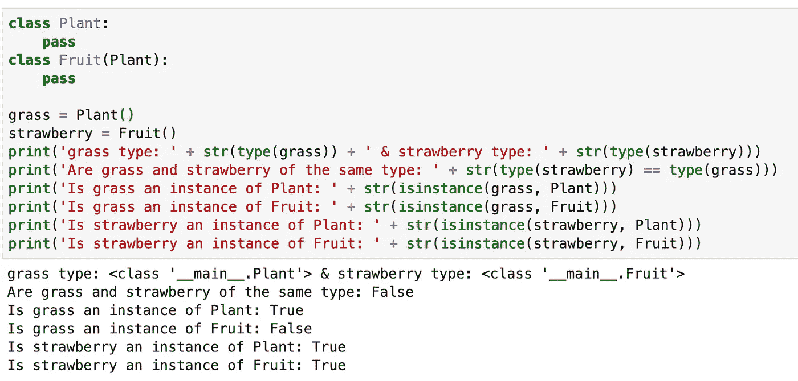

# Python 中最有用的 5 个自省函数

> 原文：<https://betterprogramming.pub/the-5-most-useful-introspection-functions-in-python-7084e3bf9f01>

## 函数来查找有关您正在使用的类型的更多信息


图片由 [PxHere](https://pxhere.com/en/photo/952361) 提供

自省在许多编程语言中是通用的，Python 也不例外。一般来说，在面向对象语言的上下文中，*自省*是一个对象在运行时找出类型、可用属性和方法，以及对该对象执行附加操作所需的其他信息的能力。

这篇文章将向您展示 Python 所提供的最有用的自省功能。

# 目录()

第一个函数是`dir()`函数。它所做的是提供对指定的感兴趣的对象可用的属性和方法的列表，该对象可以是声明的变量或函数。

```
>>> a = [1, 2, 3]
>>> dir(a)
['__add__', '__class__', '__contains__', '__delattr__', '__delitem__', '__dir__', '__doc__', '__eq__', '__format__', '__ge__', '__getattribute__', '__getitem__', '__gt__', '__hash__', '__iadd__', '__imul__', '__init__', '__init_subclass__', '__iter__', '__le__', '__len__', '__lt__', '__mul__', '__ne__', '__new__', '__reduce__', '__reduce_ex__', '__repr__', '__reversed__', '__rmul__', '__setattr__', '__setitem__', '__sizeof__', '__str__', '__subclasshook__', 'append', 'clear', 'copy', 'count', 'extend', 'index', 'insert', 'pop', 'remove', 'reverse', 'sort']
```

正如您可能注意到的，`dir()`函数的返回值实际上是一个排序列表，这意味着我们可以检查某个属性或方法的存在，以查看该对象是否可以执行该操作。下面给出一个例子。

```
>>> b = [1, 2, 3]
>>> b_dir = dir(b)
>>> 'index' in b_dir
True
>>> 'pop' in b_dir
True
```

当`dir()`函数不带参数时，它将返回当前范围内的名字，如下所示。因此，检查在您的开发中定义和使用了什么是有用的。

```
>>> dir()
['__annotations__', '__builtins__', '__doc__', '__loader__', '__name__', '__package__', '__spec__', 'a', 'b', 'b_dir']
```

# 类型()

另一个常用的自检函数是`type()`函数。顾名思义，该函数返回对象的类型，可以是原始数据类型、对象、类或模块。各种例子如下所示。

```
>>> type(1.2)
<class 'float'>
>>> type([1, 2, 3])
<class 'list'>
>>> type((3, 'Three'))
<class 'tuple'>
>>> def do_something():
...     pass
... 
>>> type(do_something)
<class 'function'>
>>> class Fruit:
...     pass
... 
>>> type(Fruit)
<class 'type'>
>>> type(Fruit())
<class '__main__.Fruit'>
>>> import os
>>> type(os)
<class 'module'>
```

我们如何处理这些输出或者来自`type()`函数的返回值呢？我们可以通过使用`==`或`is`直接将返回值与我们想要检查的类型进行比较。下面给出了一些例子。

```
>>> type(1.2) == int
False
>>> type(1.2) == float
True
>>> type([1,2]) == list
True
>>> type((1,2)) is tuple
True
```

# isinstance()

在我们的开发中，一个特别有用的内省函数是`isinstance()`函数。使用这个函数，我们可以确定某个对象是否是指定类的实例。下面给出一个简单的例子。

```
>>> isinstance([1,2], list)
True
>>> isinstance([1,2], tuple)
False
>>> isinstance((1,2), tuple)
True
```

另一件要注意的事情是`isinstance()`函数可以接受一个元组作为它的第二个参数，如下所示。这本质上是独立的`or`评估。

```
>>> isinstance(1, (int, float, tuple))
True
>>> isinstance(1, int) or isinstance(1, float) or isinstance(1, tuple)
True
```

下面给出了一个更实际的使用示例，它涉及一个自定义类。

```
>>> class Fruit:
...     pass
... 
>>> apple = Fruit()
>>> isinstance(apple, Fruit)
True
```

您可能已经注意到`type()`和`isinstance()`都可以用来确定一个对象是否属于某种类型。然而，它们并不相同。

当我们使用`type()`来确定一个对象是否属于某种类型时，我们是在进行一对一的比较。基本上，我们将对象的类型与我们指定的类型进行比较，看它们是否相同。

相比之下，`isinstance()`是一个更灵活的函数——因为它实际上返回一个对象是一个类的实例还是它的子类。换句话说，它将对象与潜在相关类的列表进行比较，这有点像一对多比较。下图显示了相关信息。



# 哈撒特尔()

有时，在我们访问一个对象的属性之前，我们可能想要检查它是否有属性。我们不想看到下面的错误。

```
>>> class Fruit:
...     pass
... 
>>> Fruit().tasty
Traceback (most recent call last):
  File "<stdin>", line 1, in <module>
AttributeError: 'Fruit' object has no attribute 'tasty'
```

为了防止这种情况发生，我们可以在使用`hasattr()`函数访问对象之前检查它是否有这样的属性。

```
>>> class Fruit:
...     tasty = True
... 
>>> fruit = Fruit()
>>> if hasattr(fruit, 'tasty'):
...     print('The fruit is tasty')
... else:
...     print('The fruit is not tasty')
... 
The fruit is tasty
```

注意到没有，但是我们实际上可以使用`dir()`函数来实现相同的结果。

如果您还记得，`dir()`函数返回给定对象的可用属性和方法，这样我们就可以直接比较某个属性是否是返回列表的项目之一。更新后的代码如下所示，修改后的部分以粗体显示。

```
>>> class Fruit:
...     tasty = True
... 
>>> fruit = Fruit()
**>>> if 'tasty' in dir(fruit):**
...     print('The fruit is tasty')
... else:
...     print('The fruit is not tasty')
... 
The fruit is tasty
```

# id()

Python 中最后但同样重要的内省是`id()`函数，它返回对象的内存地址，因此它在现有对象中是唯一的。下面是这个函数的一个简单例子。

```
a = 2
b = 1
id(a)
140339209865072
id(b)
140339209865096
```

Python 中一个常见的代码示例是交换两个变量，只需运行下面的代码`a, b = b, a`就可以实现。让我们看看交换后会发生什么。

```
id(a)
140339209865096
id(b)
140339209865072
a, b
(1, 2)
```

正如您所看到的，这两个变量已经成功地交换了，这反映在它们的内存地址和值上。

# **结论**

在 Python 中可以非常方便地进行自省。

尽管感兴趣的用户在 [Python 的](https://docs.python.org/3/library/inspect.html) `[inspect](https://docs.python.org/3/library/inspect.html)` [模块](https://docs.python.org/3/library/inspect.html)中有更多高级内省方法可以探索，但本文讨论的五个函数是您可以在 Python 项目中使用的最常见的函数。