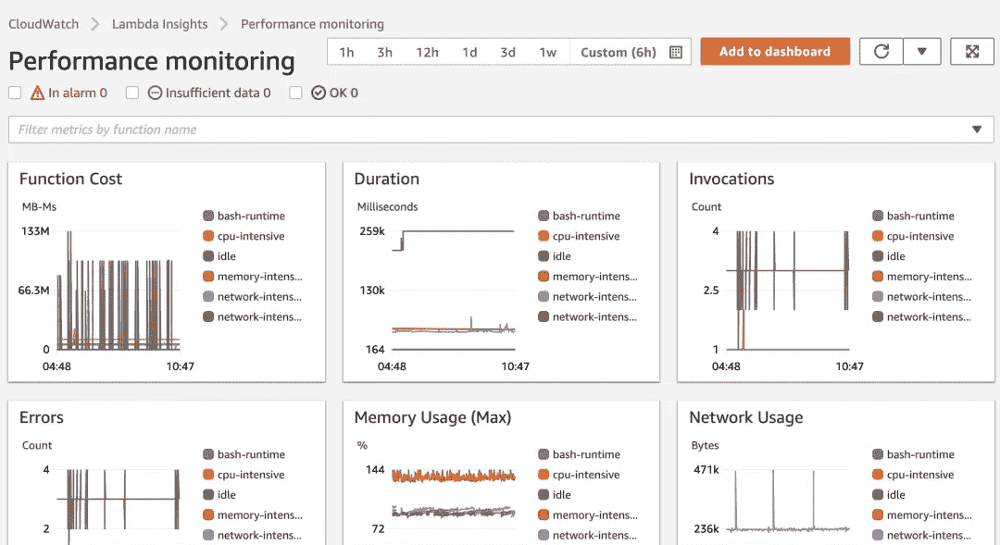

# 无服务器负载测试的 5 步清单

> 原文：<https://betterprogramming.pub/the-5-step-checklist-for-serverless-load-testing-346f4a60841d>

## 3.构建一个监控仪表板

格伦·卡斯滕斯-彼得斯在 [Unsplash](https://unsplash.com/s/photos/checklist?utm_source=unsplash&utm_medium=referral&utm_content=creditCopyText) 上拍摄的照片

无服务器很棒。它消除了您的许多担忧，并将它们交给了您的云提供商，如 AWS。

当涉及到您的职责时，诸如可伸缩性、可靠性和服务器维护之类的事情就不在话下了。但这并不意味着你没有自己的责任。

负载测试的目的是看您的应用程序是否能够处理预期的(再加上一点点)流量。但这就是整个*无服务器可伸缩性*的前提，对吗？这应该不是你的问题吧？

不完全是。

您仍然有责任确保正确地将服务连接在一起，并为您的端点提供适当的节流机制。

> *无服务器负载测试不是为了测试您的云供应商是否可以扩展，而是测试您是否设计了可以扩展的软件。*

记住这一点，在您点击负载测试上的“Go”按钮之前，您需要做几件事情。

# 1.确定主要的业务工作流程

当运行负载测试时，您希望确保 80%的时间内要执行的操作具有最佳伸缩性。在理想的世界中，我们可以对一切进行负载测试，但是在现实的世界中，我们需要测试大多数用例。

如果你有一个购物车应用程序，你的主要用例将是*添加商品到你的购物车，从你的购物车中移除商品，*和*结帐*。在购物应用中，你可以做很多其他的事情，但是 80%的时候，你的用户会做这三个动作中的一个。

希望在您决定运行负载测试时，您已经准备好了[主动监控](https://www.eginnovations.com/blog/what-is-proactive-monitoring)。这意味着您的测试定期在您的系统中运行虚假数据，以便在您的客户发现问题之前发现问题。

有许多工具可用于主动监控:

在我关于负载测试的[上一篇文章](/how-to-easily-load-test-serverless-apps-with-postman-and-aws-912de7f1f7e0)中，我谈到了使用 [AWS 分布式负载测试工具](https://aws.amazon.com/solutions/implementations/distributed-load-testing-on-aws/)和 Postman 来运行负载测试。对于无服务器负载测试，这已经被证明是非常成功的，我继续推荐它。

但是有了所有不同的应用程序性能监控(APM)工具，如果您的测试不在 Postman 中呢？

您可以选择在 Postman 中重新创建测试或者转换它们。如果你使用 DataDog synthetics，我有一个 [Public Postman Workspace](https://t.co/7GRdOauUiH) 可以用来将你的多步 API 合成测试转换成 Postman 集合。

# 2.建立失败重试和警报机制

当无服务器应用程序出错时，最佳实践是将事件发送到一个[死信队列](https://docs.aws.amazon.com/AWSSimpleQueueService/latest/SQSDeveloperGuide/sqs-dead-letter-queues.html)。但是不要止步于此。

一旦一个项目进入死信队列，你会怎么做？

您的负载测试将导致您的应用程序出现一些故障。它应该有意地将事件发送到错误状态，这样您就可以了解应用程序是如何处理故障的。

如何处理无服务器应用程序中的故障？

有两种主要类型的错误:

*   **瞬时错误** —临时/一次性错误，可能是由云供应商基础设施或竞争条件中的小故障引起的
*   **数据错误** —系统中提供的数据不正确，导致系统故障

能够分别跟踪这些错误是快速轻松地重新开始的关键。理论上，暂时性错误是一种可重试的错误，系统可以自行处理。它可以*回退并重试*以查看该信号是否已被解决。

LEGO.com 有一个很好的参考资料，关于他们如何重试暂时性错误并自动跟踪系统的健康状况。

数据错误往往需要人工干预。无论是应用团队的开发人员还是最终用户，都需要有人来解决问题。在这些情况下，你需要一种方法来提醒那些负责修复的人。你可以发送电子邮件、闲置信息、应用程序内通知等…

当这些类型的错误出现在队列中时，您必须提供一种方法让某人知道发生了问题，并给他们一种修复问题的方法。

# 3.构建一个监控仪表板

如果您无法了解系统的性能，负载测试就没有多大价值。为您的无服务器应用程序构建一个仪表板将允许您以多种方式查看它是如何执行的。

您可以查看您的 AWS 服务是否接近任何服务配额，查看 API Gateway 和 Lambda 中的错误与成功响应率，以及各种其他洞察[。](https://docs.aws.amazon.com/lambda/latest/dg/monitoring-insights.html)

*λ监测仪表盘*

负载测试有助于识别系统中的瓶颈，这是应用程序的关键压力点。如果你在某个地方遇到瓶颈，就会影响性能和可伸缩性。确保监控 SQS 队列*项目计数*和队列中的*时间，以快速识别会降低系统速度的区域。*

就像云中的其他东西一样，当涉及到仪表板时，您有多种选择。您可以使用 [AWS CloudWatch](https://aws.amazon.com/cloudwatch/) 、DataDog、Dynatrace 或许多其他工具来构建您所需要的东西。

# 4.建立关键绩效指标(KPI)

当负载测试结束时，您需要一种客观的方法来确定它是否成功。进入*关键绩效指标*。

工作负载 KPI 是一个用于确定应用程序是否正常运行的指标。这些范围根据您的应用程序的性质而有所不同。以购物车为例，您可以使用 KPI 来处理付款。

*   *付款成功率为 99.9%*
*   *支付处理耗时不到 3500 毫秒*
*   *100%的失败支付导致订单取消并通知用户*

这些是围绕应用程序性能的业务指标。如果您的负载测试导致这些中的任何一个失败，您就知道您需要将重点放在哪里。没有 KPI，就无法判断您的应用程序是否如您所愿。

# 5.调整负载测试工具

负载测试应该比您预期的最高流量多提供大约 20%的流量。如果您预计在[峰值突发时间](https://netenrich.com/glossary/bursty-traffic)每分钟 1000 个请求，那么您的负载测试应该通过系统每分钟运行大约 1200 个请求。

如果你以一个不可能达到的量运行你的负载测试(比如在我们上面的场景中，每分钟 1，000，000 个请求)，你不会得到真实的结果。是的，您会对您的系统进行压力测试，但是它不需要被压力压到那个容量。

最终，超越并没有错，但是你可能会为自己做不必要的工作。如果您的应用程序以每分钟 100，000 个请求的速度开始中断，但是您的最大预期规模是每分钟 1，000 个请求，那么您可以将时间花在修复应用程序的其他方面。

了解应用程序的预期流量可能很困难，尤其是在新的应用程序中。如果你在一个客户一个客户的基础上销售你的应用，很容易知道会有多少流量。但是在一个公共网站上估计流量可能会变成西部荒野。你必须求助于像搜索引擎优化排名这样的东西来找到你网站的关键词。

# 结论

负载测试是产品发布中有趣且令人兴奋的部分。您可以看到您的系统在真实世界中的表现，但仍然是在受控的环境中。一旦你修复了最初的问题，考虑在你的 [CI/CD 管道](/are-you-really-ready-for-ci-cd-9a8bf6d01b8a)中添加一个减少负载的测试，以确保正在进行的开发不会在某个地方开始限制你。

记得把重点放在你的主要业务案例上。您希望确保应用程序中使用最多的区域受到最严重的影响。用于初始设置的应用程序区域或很少使用的区域不需要进行负载测试。

KPI 将是你成功的主要指标。如果您在死信队列中得到许多错误，但是它们被重试并最终通过系统，您的 KPI 可能仍然认为这是成功的。*出错并不意味着你的业务流程失败*。对于无服务器，最重要的是可靠性和健壮性。其实就是一个 [AWS 无服务器设计原理](/7-aws-serverless-design-principles-for-solutions-architects-2be22717713b)！

如果您的应用程序可以自动恢复，那么它将更有可能处理大量负载并继续达到您的 KPI。

祝您的负载测试好运。玩得开心！