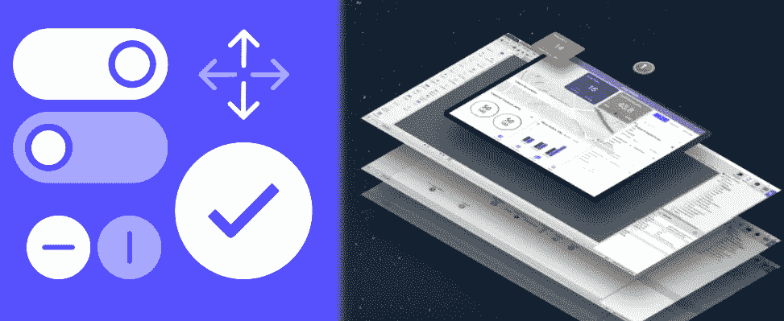

# 快速原型的 5 W

> 原文：<https://betterprogramming.pub/the-5-ws-of-the-rapid-prototype-8e7614f82d29>

## 如何跟上技术的快速发展

技术在发展。随着对我们日常使用的软件的期望发生变化，产品设计、用户体验和开发模式也在变化。软件公司被迫快速创新以保持相关性。创新需要变革，变革需要调整，调整需要围绕一个想法的坚实基础。随着技术的发展，在尽可能短的时间内为你的变革性想法打下坚实的基础是至关重要的。进入快速原型(RP)。

RP 是在单个 sprint 中设计和开发的高保真、功能性的概念验证。它旨在提供丰富的用户体验，并描绘一个想法来征求用户反馈。RP 不是通过导航屏幕截图的引导式体验。为了充分吸引目标受众，让他们能够操作表单、执行工作流或自行探索。

# 我什么时候造一个？

快速原型几乎可以在企业的任何地方使用。由于 RP 背后的驱动力是传递信息，销售、产品和开发组织都可以从中获益。

**销售** —如果 RFP 需要贵公司目前不提供的功能，您可以利用快速原型展示潜在的解决方案。RP 对销售组织来说尤其强大，因为它向客户展示了您的公司可以快速组装和应对挑战的能力。它会给你的即时创新能力注入信心。

**产品**——当你的公司开始探索一个新应用的想法时，在[逆向工作会议](https://uxdesign.cc/working-backwards-my-experience-with-the-aws-design-strategy-f4bd90c87b8)之后，RP 是合乎逻辑的下一步。逆向工作会议将使利益相关者在愿景上保持一致，而 RP 将巩固对视觉和用户体验的期望。

**开发** —现有系统中会破坏当前状态的新的主要特性应该通过 RP 进行审查。维护和扩展现有的/遗留的系统是昂贵的，并且由于体系结构的限制，其可能性通常是有限的。在开始开发之前可视化破坏性的变化可以让你在潜在的问题出现之前抓住它们。

# 为什么要高保真？

想象力是一种技能。有的人有；有些人没有。当在一个新的应用程序或特性上与利益相关者合作时，最好是消除“如果”的假设，给他们一个所见即所得的软件表示。通过消除假设，您可以保证最终产品交付时不会出现意外。

消除猜测也有助于推动设计。用户测试将会产生清晰的期望、痛点和乐趣。有了清晰的用户反馈，您可以对设计进行更新，以解决任何问题或突出一个有用的功能。

构建 RP 也将提供开发优势。在实际开发之前，您可以尝试一下数据库模式，找出任何技术限制，或者测试一个提议的架构。一旦 RP 完成，开发人员将有一个模型来参考和工作，这有助于加快开发过程。

# 我应该包括什么功能？

你正在构建一个快速原型来清晰地表达你的目标。关注实现你目标的驱动因素。如果你的新产品是一个动态表单生成器，把你的注意力放在构建生成器的设置和配置背后的用户体验上。如果目标是构建下一代身份认证服务，则构建创建新用户和登录应用程序所需的步骤。

这里的目标不是构建将应用程序投入生产所需的每一个特性，而是将您的创新可视化。记住，你只有一个 sprint 来完成一个快速原型。将时间花在与改变游戏规则的功能集无关的功能上可能会限制你的创新时间。

然而，这里有一个平衡。你希望测试你的 RP 的用户感觉他们在使用一个功能完整的软件。值得花时间构建一些与您的游戏规则改变者相关的功能。例如，如果您的游戏规则改变器是一种在表单上快速输入数据的快速方法，那么您还可以包含一个特性，使热键能够对可重复的数据输入执行宏操作。

# 谁参与了？

保持你的团队规模较小。做快速原型的一个好处是它们相对便宜，所以保持人员最少将有助于降低成本。推荐的团队规模为两到三人，通常由一名 UX 设计师和一到两名开发人员组成。

在 RP 的开始阶段，需要来自业务方面的输入和愿景。在最初的移交之后，团队将主要是你的设计师和开发人员。

迭代是快速原型的核心支柱。当构建一个 RP 时，通常每天举行小型的“冲刺评审”来迭代设计并尽早发现任何错误。在 sprint 评审中包括涉众，以验证团队正在开发正确的东西。这也给团队提供了一个机会，为提议的设计提供备选方案，并获得即时响应。

# 我从哪里开始？

我发现基于云的工具 Figma 和 OutSystems 最成功。这些公司提供免费服务，让你的设计和快速原型尽快起飞。因为他们是协作的和基于云的，你可以从任何地方即时看到团队的工作。

Figma 是一款基于浏览器的设计工具，用于构建模型和引导体验。您可以构建高保真屏幕，在几分钟内浏览用户旅程。它还提供了建立设计库的能力，以加快未来的快速成型。Figma 可用于与团队成员实时协作，提供令人难以置信的灵活性和速度。此外，当开发人员单击屏幕上的任何元素时，它还为他们提供 CSS 和可下载的资源。使用 Figma 通过定义将要构建的屏幕的布局来启动 RP。

[OutSystems](https://www.outsystems.com/) 是一个低代码平台，旨在通过可视化设计器尽快构建真正的应用程序。它是一个全栈应用构建器，从数据库层一直到用户界面。注册后，您将获得一个免费的开发环境，并可以立即开始构建您的 RP。OutSystems 允许你编辑你构建的任何页面或控件的 CSS 和样式。

当一起使用时，您可以在 Figma 中设计屏幕，并用真实字段、数据持久性和外部系统中的导航构建一个工作副本。这种组合将帮助您以最快的速度交付一个健壮的、功能性的 RP，就像您说“如果……那该多好啊！”

# 把所有的放在一起

记住，在你冲刺的最后，你应该有一个功能性的概念证明。它不应该是生产就绪的软件，但它可以作为一个切入点。您应该多次迭代，对业务需求和用户体验进行微调。你听取了用户的意见。你已经做了一些你可以支持和依靠的事情。

最重要的是，你已经快速、廉价地完成了所有这些工作。如果结果是失败的，你可以吸取经验教训，庆幸自己没有花费数千小时来开发没人要的软件。如果结果是成功的，那太好了！你已经走在了游戏的前面，并且清楚地知道你需要什么才能成功。

创新是当今世界成功的关键。构建快速原型将使您能够快速创新，并保持业务的相关性。

你有制造快速原型的经验吗？请在下面的评论中分享你的故事。

## 相关文章

[愉悦的设计:提高软件设计的标准](https://medium.com/swlh/design-to-delight-raising-the-bar-on-software-design-a1eec234188b)
[为你的新应用选择合适的平台](https://medium.com/better-programming/choosing-the-right-platform-for-your-new-app-7d7820191d3d)
[我不再喜欢提供商模式——以下是你也不应该这样做的原因](https://medium.com/better-programming/i-dont-like-the-provider-model-anymore-here-s-why-you-shouldn-t-either-aafc1fa6fcdf)