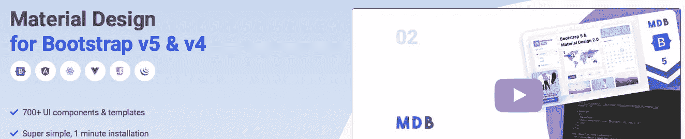
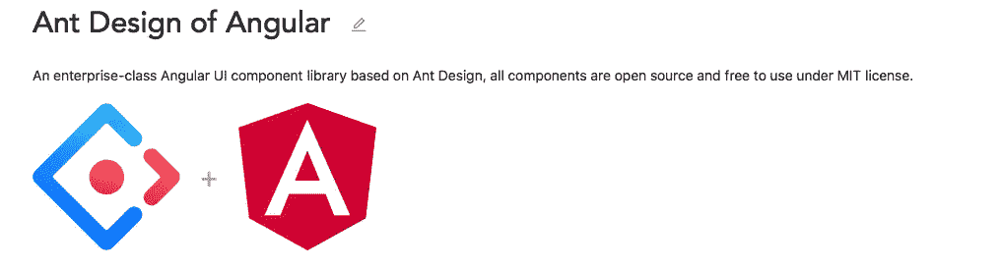

# 6 个最佳角度 UI 套件和框架(2021 版)

> 原文：<https://betterprogramming.pub/the-6-best-angular-ui-kits-and-frameworks-2021-edition-1fd4238c005b>

## 找到最适合你的项目

照片由[picjumbo.com](https://www.pexels.com/it-it/@picjumbo-com-55570?utm_content=attributionCopyText&utm_medium=referral&utm_source=pexels)在[像素](https://www.pexels.com/it-it/foto/carta-per-stampante-bianca-196645/?utm_content=attributionCopyText&utm_medium=referral&utm_source=pexels)上拍摄。作者编辑

Angular 的应用越来越广泛，在前端实现中也越来越受欢迎。

在这个简短的指南中，我们将看看一些最伟大和最流行的 UI 工具包和框架，试图了解哪一个可能是您下一个项目的正确选择。

# 角状材料

[Angular Material](https://material.angular.io) 今天被认为是 Angular 最流行的 UI 套件之一，可能是最流行的一个，尽管它的根本特性使它锚定在材料设计风格上，这可能对每个人都不好。GitHub 上有超过 22k 的星星，这个工具包证明了它是如此受开发人员的喜爱，并保证了良好的社区支持，不断发布和讨论 bug，要集成的功能，最终性能问题，等等。

## 赞成的意见

*   非常受欢迎
*   表示其他 UI 工具包所依赖的基础
*   相当多的组件
*   整合了[材料设计](https://material.io/design)
*   多个模块，不是整体的
*   整合了一个好的 CDK
*   提供一些辅助功能
*   仍然支持 IE 11

## 骗局

*   难以定制:使用这个工具包会让你遭遇怪异的 DOM 结构、幽灵标签和难以编码的 CSS 样式，在某些情况下需要臭名昭著的(也是糟糕的)方法`::ng-deep rules`
*   严格受限于材料设计风格
*   文档并不详尽，会引导您进行堆栈溢出搜索。文档页面也缺少一个好的搜索引擎。

## 裁决

很适合开发 CRM 或管理软件，但不适合通用的前端需求。仍然缺少好的文档，材料的外观和感觉不可能对每个人都好。发现它非常稳定:使用它，不要假装大量定制它，因为尽管有 CDK，它会让你发疯。

# Ng 自举

被其作者定义为“Bootstrap widgets——angular way”的 [Ng-bootstrap](https://ng-bootstrap.github.io/#/home) UI 套件已经流行了很久，并且是第一批可用的套件之一。

颂歌一直是“让我们复制引导程序的特性，并让它们都适用于 Angular”。结果是一个很好的基本 UI 工具包，没有抱怨，但确实是必不可少的。一些组件与原始组件相比有些不足，文档也非常简洁。如果您需要“基本引导”，这是一个不错的选择，但仅此而已。

## 赞成的意见

*   必不可少，这可能是一个优势
*   使用方便
*   在外观和感觉上非常接近原始版本
*   易于定制
*   多个模块，不是整体的
*   这是遗产

## 骗局

*   本质上…你可能不会仅仅满足于这一点，并会引导开发人员将特性与其他东西相结合
*   如今不那么受欢迎的人可能会错过对具体问题的支持

## 裁决

如果你需要简单的引导特性，Ng-bootstrap 是一个很好的工具包，如果你需要更多，它就没用了。今天它正在遭受 Ngx 库的竞争，但 Ngx 更完整、更新，在某些情况下甚至更专业，所以如果你不需要太多，让我们选择这个。

# ngx-自举

由 Valor Software 设计的这款最新 UI 套件正迅速流行起来，并以“开发得更快更好”为座右铭。可能听起来像 Ng-bootstrap 克隆，也可能被认为是类似的东西，但事实是，这是完全重新设计的，提供了更好的功能和高级组件。

支持 Bootstrap 3、4 甚至第 5 版，证明这个库提供了一个很好的支持社区，并且经常更新。

## 赞成的意见

*   它类似于 bootstrap，但更先进
*   非常好的文档
*   多个模块，不是整体的
*   从 Bootstrap 中获取特定组件，如“评级”
*   非常稳定，即使在高级组件上

## 骗局

*   外观和感觉是必不可少的，需要自定义 CSS 规则
*   有时很难理解什么是真正的 Ngx，什么不是，因为术语 Ngx 现在被许多其他库和组件所采用

## 裁决

对我来说，Ngx 是最好的基于 Bootstrap 的 UI 套件。非常坚实，非常全面的文件，从来没有问题。请将此视为现代 web 应用程序的基本标准。如果你错过了什么，就去整合。这是*对我来说真正的自举*。

# MDBoostrap

另一个基于引导的 UI 工具包， [MDBootstrap](https://mdbootstrap.com/docs/b5/angular/) 是一个巨大的工具包，几乎是 Angular UI 组件的精髓，提供了任何需要的一切。

这是唯一一个附带 CLI、高级支持，并且看起来像“专业”工具的软件。但除此之外，结果并不令人满意。我发现它真的很乱，很重，很难安装。

## 赞成的意见

*   可能是组件数量最多的一个
*   良好的美感，比基本的自举好得多
*   看起来不错，如果你需要一个高级 UI 套件
*   提供外部服务:托管和构建工具
*   提供 MDB Pro 版本(某些情况下需要)
*   多个模块，不是单片的…但在这种情况下，在性能方面没有太大的效果
*   也可用于 Vue.js 和 React

## 骗局

*   看起来“很重”
*   因为它的复杂性很难理解，需要一些时间来掌握
*   看起来像商业产品

## 裁决

我对此有过短暂的体验，但它不符合我的需要。如果您想投入一些时间来真正理解它并将其作为“公司标准”开发过程来采用，这可能是一个不错的选择，但并不真正适合业余开发人员或开源项目。太复杂，太不直接，感觉更像是在使用一个“大 Java 框架”而不是 angular 的 UI 工具包。

# 角度的碳成分

IBM 的前端需求解决方案:这个 UI 套件看起来很企业、专业，甚至很漂亮。 [Carbon](https://angular.carbondesignsystem.com) 在 UI kits 全景和竞赛中没有成为真正的突破，但是值得一试。

文档非常棒，涵盖了组件实现的许多方面。

## 赞成的意见

*   IBM 支持的专业工具
*   包含实例的详尽文档
*   多个模块，不是整体的
*   内置设计模式和方法

## 骗局

*   对于某些 B2C 需求来说，专业性太强
*   不太受欢迎…你会解决你的问题吗？
*   需要良好的技能

## 裁决

IBM 的 Carbon 解决方案看起来非常迷人，但必须被认为是一种高级工具，不能满足您的需求。有许多项目，你真的不需要那么多技术，它的复杂性将迫使你花一些时间去真正理解方法和机制。如果您需要企业工具，请尝试一下。

# ng-佐罗

这个用于 Angular 的企业级 UI 工具包是基于 Ant 设计的，在过去的两年里变得日益流行。我有几次机会在我的一些项目中采用它，我有时间看看它是否真的有效。

它包含大约 60 多个组件，都是用 Typescript 编写的，并且支持国际化。值得一试。

## 赞成的意见

*   另类设计…终于！
*   结构良好，甚至在文档中也是如此
*   多个模块，不是整体的
*   支持电子
*   支持 LTR
*   良好的定制选项

## 骗局

*   一些组件不太灵活
*   有时文档并不深入细节
*   有些组件毫无用处:比如阿凡达。让这个工具包看起来更不专业。
*   另一种设计可能会使您的外部材料或引导库不适合您的应用程序。

## 裁决

在一个项目中使用了几个月后，我真的很喜欢这个 UI 套件。文档组织得非常好，我非常喜欢美学部分，它最终是个人的，脱离了自举或材料概念。这是一个非常好的框架，有很多(真的很多)组件，我相信它会成长得更快。

# 一锤定音

即使在这些之外，还有许多其他支持 Angular 的免费和企业 UI 套件，在这个简短的比较中，我只是试图将重点放在最好的和我认为将在未来几年内增加其受欢迎程度的套件上。

如果你需要一个没有太多伪装的基础，Ng-bootstrap 可能是正确的。另一方面，我发现 Ngx 方式更加灵活、完整和专业，真正支持了许多需求和日常挑战中的开发。如果你想要不同的东西，佐罗是真正的选择，在我的测试中反应非常好，所以请继续关注它。