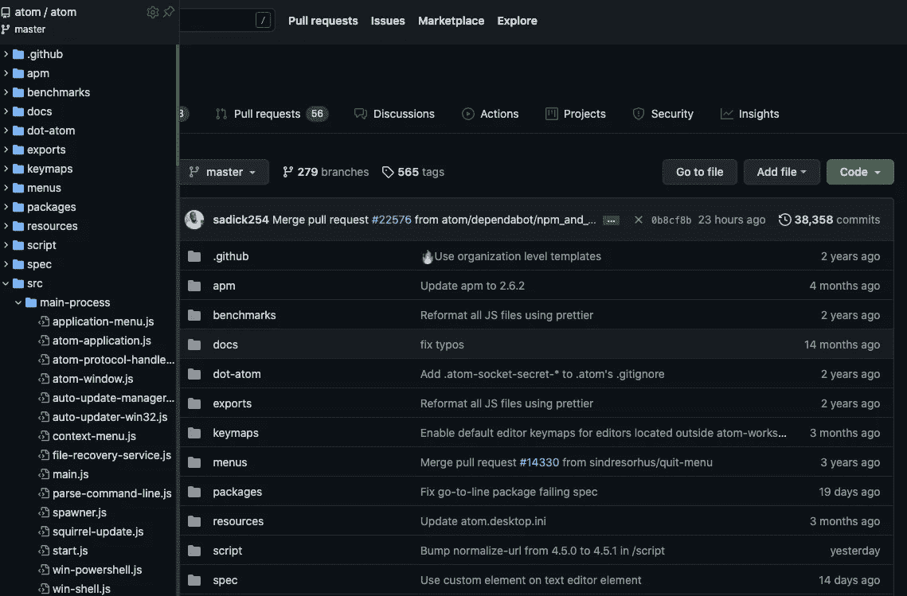
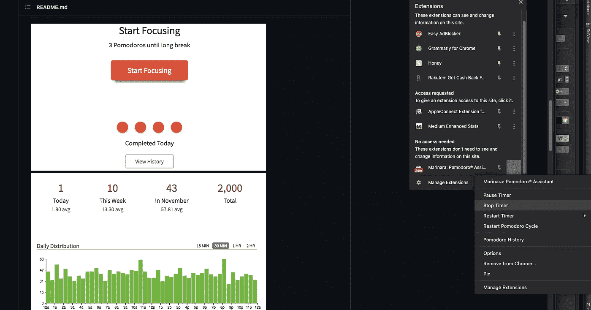
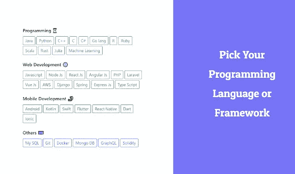
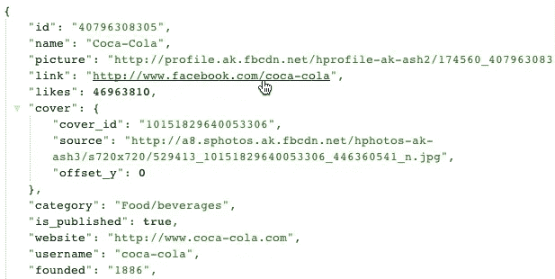

# 提高开发人员工作效率的 6 个最佳浏览器扩展

> 原文：<https://betterprogramming.pub/the-6-best-browser-extensions-for-enhancing-developer-productivity-3d48a088800a>

## 它是每个开发人员工具箱中的必备工具

Aditya Chinchure 在 [Unsplash](https://unsplash.com?utm_source=medium&utm_medium=referral) 上拍摄的照片

每个开发人员都有自己过多的 goto 工具来提高生产力。有些人收集了大量的便笺，上面有所有常用的命令和语法。有些人有一系列的备忘单，以便经常重复使用。一些人将他们经常使用的网站加入书签。

作为一名开发人员，除了上述工具，浏览器扩展也是我的工具箱中的一个巨大部分。这些扩展以某种独特的方式帮助提高了我的生产力，使它们成为我生活中不可或缺的一部分。

以下是我经常使用的六大浏览器扩展，它们让我的生活变得如此简单。

# [八棵树](https://chrome.google.com/webstore/detail/octotree-github-code-tree/bkhaagjahfmjljalopjnoealnfndnagc)

如果你经常使用 GitHub，你可能已经知道这个扩展——[octo tree](https://www.octotree.io/)。这一扩展使得 GitHub 在 web 上的代码审查和探索变得流畅而简单。

创作者称这个扩展为“类固醇 GitHub”。

它的一些很酷的特性是:

→快速类似 IDE 的代码树
→快速文件搜索
→ GitHub 主题等等

使用八叉树 git。作者图片

它也有一个付费版本，有很多附加功能，如多标签支持等。

# [番茄助手](https://chrome.google.com/webstore/detail/marinara-pomodoro%C2%AE-assist/lojgmehidjdhhbmpjfamhpkpodfcodef?hl=en)

如果你正在努力管理时间，或者很难专注于工作，或者可能忘记从工作中休息一下，这一定会帮助你。

对于那些不知道的人来说,[番茄工作法](https://en.wikipedia.org/wiki/Pomodoro_Technique)是一个非常流行的时间管理系统，你可以用一个计时器将工作分成小的时间间隔，通常是 25 分钟，然后休息 5 分钟。这些间隔被称为番茄。大约四个番茄之后，你需要休息 15 到 20 分钟。

这个扩展将帮助你容易地跟随番茄系统。只需添加扩展名，您就可以开始了。尝试遵循这个技巧一周，它很快就会成为你日常生活的一部分。

番茄助手。作者图片

# [Daily.dev](https://chrome.google.com/webstore/detail/dailydev-the-homepage-dev/jlmpjdjjbgclbocgajdjefcidcncaied/related?hl=en)

软件工程领域发展非常迅速，让我们自己跟上最新的新闻和创新是非常重要的。这就是这个扩展派上用场的地方。

[Daily.dev](https://app.daily.dev/?utm_source=landing&utm_medium=cta&utm_campaign=landing_conversions) 是一个带有 dev news 的开源扩展，让你了解所有编程方面的最新信息。它应该是每个开发人员获取编程领域最佳技术新闻的首选扩展。

每当你创建一个新的标签页，你就沉浸在编程最热门的新闻中。

Daily.dev 在工作。作者图片

# [华帕里斯](https://chrome.google.com/webstore/detail/wappalyzer/gppongmhjkpfnbhagpmjfkannfbllamg)

点击一个按钮，Wappalyzer 将帮助你找到任何网站的技术栈。

我们可以用这个扩展做一些很酷的事情:

1.  网站分析—找出网站是用什么构建的
2.  潜在客户生成——通过潜在客户使用的技术来发现他们
3.  竞争对手分析—发现谁在使用竞争对手的软件
4.  网站监控——关注网站技术的变化

还有很多。

面向 Wappalyzer 的技术堆栈。作者图片

# [快速编码](https://chrome.google.com/webstore/detail/quickcode-free-online-pro/nnigpbiaggiephcndokoaongeefpbdcj?hl=en)

[QuickCode](https://coursesity.com/?ref=extension) 策划免费在线编程课程，每天为您提供最好的课程。你可以立即在网上搜索 50，000 多门课程。

对于想跟上最新编程语言的工程师来说，这可能会派上用场。

作者图片

# [JSON 格式化程序](https://chrome.google.com/webstore/detail/json-formatter/bcjindcccaagfpapjjmafapmmgkkhgoa?hl=en)

对于经常使用 JSON 的人来说，这是必须的。

这个扩展具有语法高亮、可点击的 URL 以及在原始和解析的 JSON 之间切换的能力，是一个救星。

你可以随时上网格式化，但是把它作为一个扩展真的很简单省时。

JSON 格式化程序示例

# 结论

这些是我个人认为非常有用的几个扩展，也是我经常使用的。但是市场上可能有许多其他同样有用的扩展。如果有我遗漏的地方，请在评论中补充。

如果你使用以上任何一种，请告诉我你的经历。

感谢阅读。