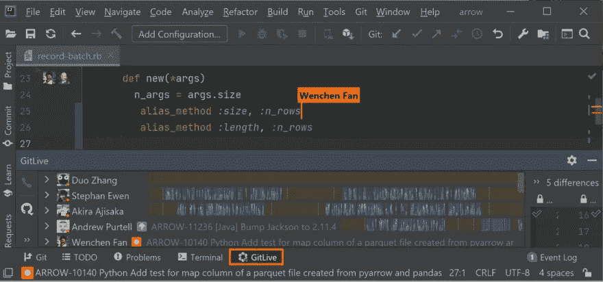
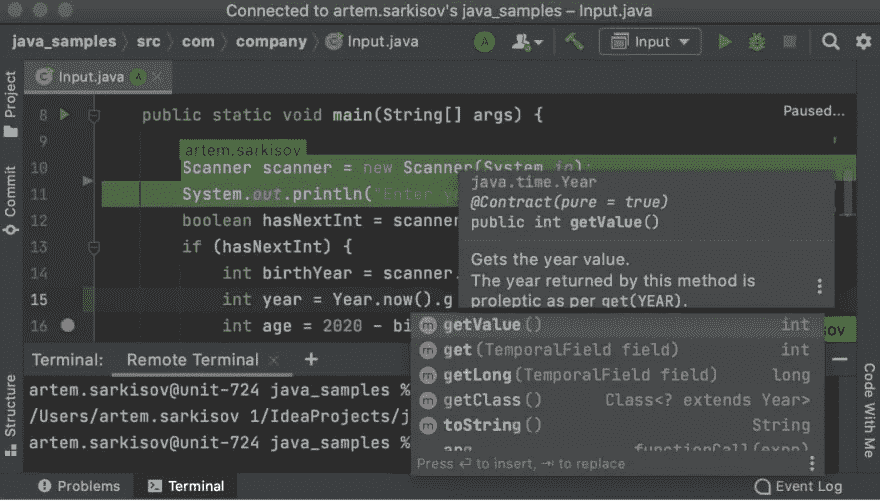
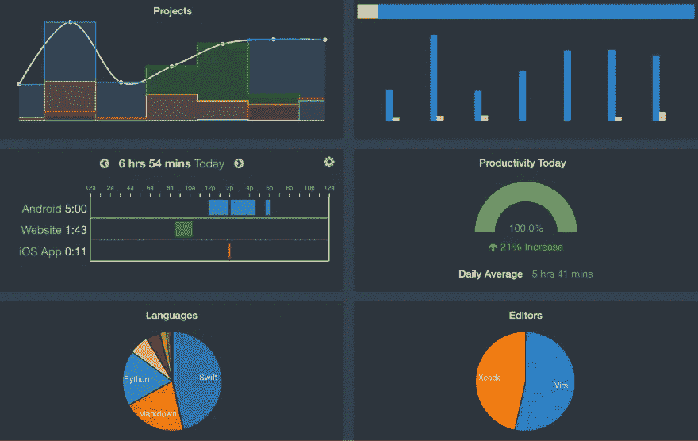
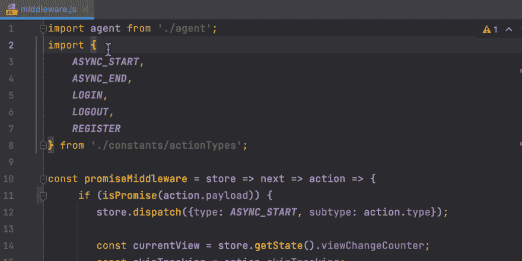
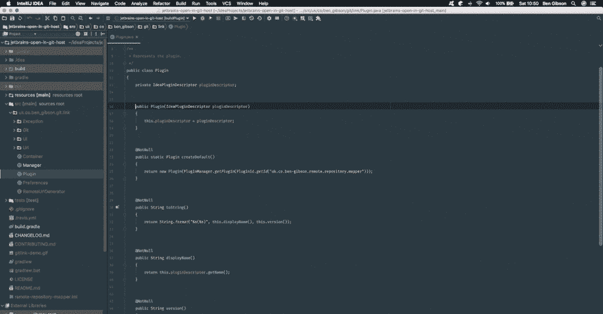
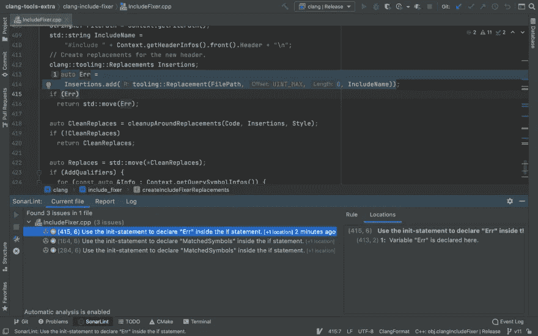

# 用于远程工作的 6 个最佳 JetBrains 插件

> 原文：<https://betterprogramming.pub/the-6-best-jetbrains-plugins-for-remote-working-a72cff319fd3>

## 在家工作时提高您的工作效率

由 [Unsplash](https://unsplash.com?utm_source=medium&utm_medium=referral) 上的 [Fikret tozak](https://unsplash.com/@tozakfikret?utm_source=medium&utm_medium=referral) 拍摄的照片

开发者想要什么？钱，弹性时间表，披萨？当然可以。轻松的远程协作？地狱，是的！

编程是一项团队运动，如果没有适当的交流，你真的不能期待惊人的结果。远程设置可能会使开发人员之间的交流变得困难，但是如果配备了合适的工具，您就没有什么可担心的了。

让我们来看看最好的 JetBrains 插件，它们可以极大地改善您的远程工作程序。

# [GitLive](https://plugins.jetbrains.com/plugin/11955-gitlive)

这个插件是给所有团队成员的，GitLive 让 Git，嗯，活起来了。

它添加了一个工具窗口，您可以在其中查看来自存储库的协作者(如果他们在线)以及他们正在进行的所有工作(他们正在处理的尚未合并的分支、问题或 PRs)，您可以在其中查看不同的文件更改，所有更改都是实时更新的。

他们的旗舰特性，即时合并冲突检测，提供了潜在合并冲突的早期警告。实时装订线指示器显示您的队友对您当前正在处理的文件进行了哪些更改，这非常有用，尤其是在较大的项目中。

最重要的是，GitLive 还支持通过一次单击(或键盘快捷键)与一个合作伙伴启动 Code With Me 会话，对于那些使用 VS 代码的讨厌的合作者，甚至还有跨 IDE 代码共享支持！

## **远程团队的优势**

通过实时跨 IDE 协作、合并冲突检测和视频通话，改善开发人员的沟通！

GitLive

# [跟我码](https://plugins.jetbrains.com/plugin/14896-code-with-me)

如果你是一个远程工作的 JetBrains 用户，你可能已经熟悉这个了。Code With Me 是一个协作编码和结对编程服务，捆绑在大多数 IntelliJ IDEs 的最新版本中。

Code With Me 允许您通过邀请其他人加入编码会话来与他们共享您的 JetBrains IDE(事实上，客人甚至不需要安装 JetBrains IDE—他们可以下载一个轻量级客户端来代替)。由于集成的组调用和可定制的权限，该插件可以用于教学等教育目的，但也可以用于代码审查或技术面试。

## **远程团队的优势**

直接从您的 JetBrains IDE 通过实时结对编程提高您团队的生产力！

和我一起编码

# [瓦卡时间](https://plugins.jetbrains.com/plugin/7425-wakatime)

人们远程工作的一个常见问题是工作和休闲时间之间的界限模糊。Waka Time 是一个帮助解决这个问题的插件。它在你的 IDE 中给你一个漂亮的、视觉上吸引人的仪表板，它总结了你一天的编码活动。它显示了你在编程上花了多少时间，也可以分解成你在使用不同的语言、ide 上花了多少时间，或者你在不同的项目上花了多少时间。

**远程团队的好处**
监控你如何在项目和任务之间分配时间的好方法。团队计划为您提供了团队项目详细信息的概述。WakaTime 自动检测您的团队项目，并显示每个团队成员在每个项目上单独编码的时间。

瓦卡时间

# [演示助理](https://plugins.jetbrains.com/plugin/7345-presentation-assistant)

如果你曾经做过在线代码演示，你会知道动作太快会让你的观众困惑，不断的关于你最后一步动作的问题会很容易让你分心。

幸运的是，这个方便的插件可以帮助你和你的观众在现场编码过程中保持正轨。它提供注释，解释您在演示屏幕时使用的快捷键，这可以使您的观众在工作时更容易跟上。

远程团队的好处
这个插件在全公司范围的演示中很方便，当你需要录制截屏时，当然，在结对编程会话中也很方便。

演示助理

# [GitLink](https://plugins.jetbrains.com/plugin/8183-gitlink)

简单而有效的扩展只有一个作用:允许你从编辑器中发送一个包含选定代码的链接给你的队友，他们可以在 GitHub 中查看它。除了与您的团队共享代码的好处之外(注意，只有提交的更改才会反映在链接中)，如果您想要检查历史、贡献者或分支版本，它也是有用的。

## **远程团队的优势**

轻松地将代码片段的链接发送给同事！

GitLink

# [索朗利特](https://plugins.jetbrains.com/plugin/7973-sonarlint)

正在寻找一个能帮助你编写高效、安全、高质量代码的工具吗？大多数现代的 ide 都有允许静态代码分析的机制，但是你可以通过使用一个像 SonarLint 这样方便的插件将分析带到下一个层次。

SonarLint SonarLint 是一个静态代码分析器，它是一种直接在 IDE 中获取代码反馈的方法。当涉及到检测臭味或发现并修复 bug 时，它非常棒。

SonarLint 与大多数 JetBrains IDEs 集成，支持 C、C++、Java、JavaScript、TypeScript、Python、C#、Kotlin、Ruby、HTML & PHP 等语言。

## **远程团队的优势**

您可以自己使用它，但是当它与 SonarQube 平台连接时效果最好，在 SonarQube 平台上，您的团队可以共享公共语言规则集或项目分析设置。

索纳林特

# 结论

分布式团队内部的良好沟通是高效远程工作的关键。希望我在这篇短文中总结的一些工具能够让您的团队协作更快、更高效、更有成果。黑客快乐！