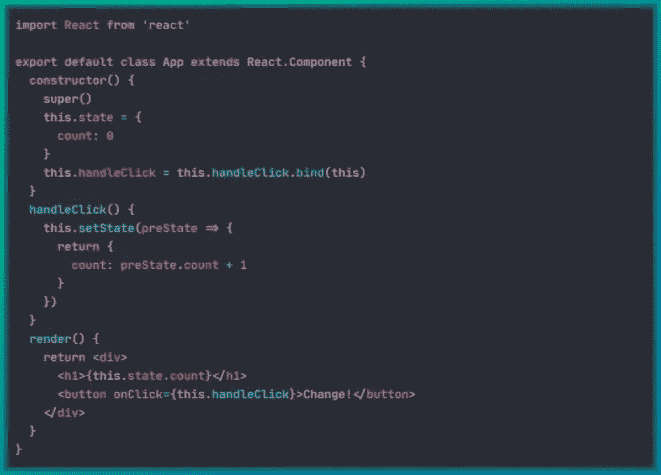
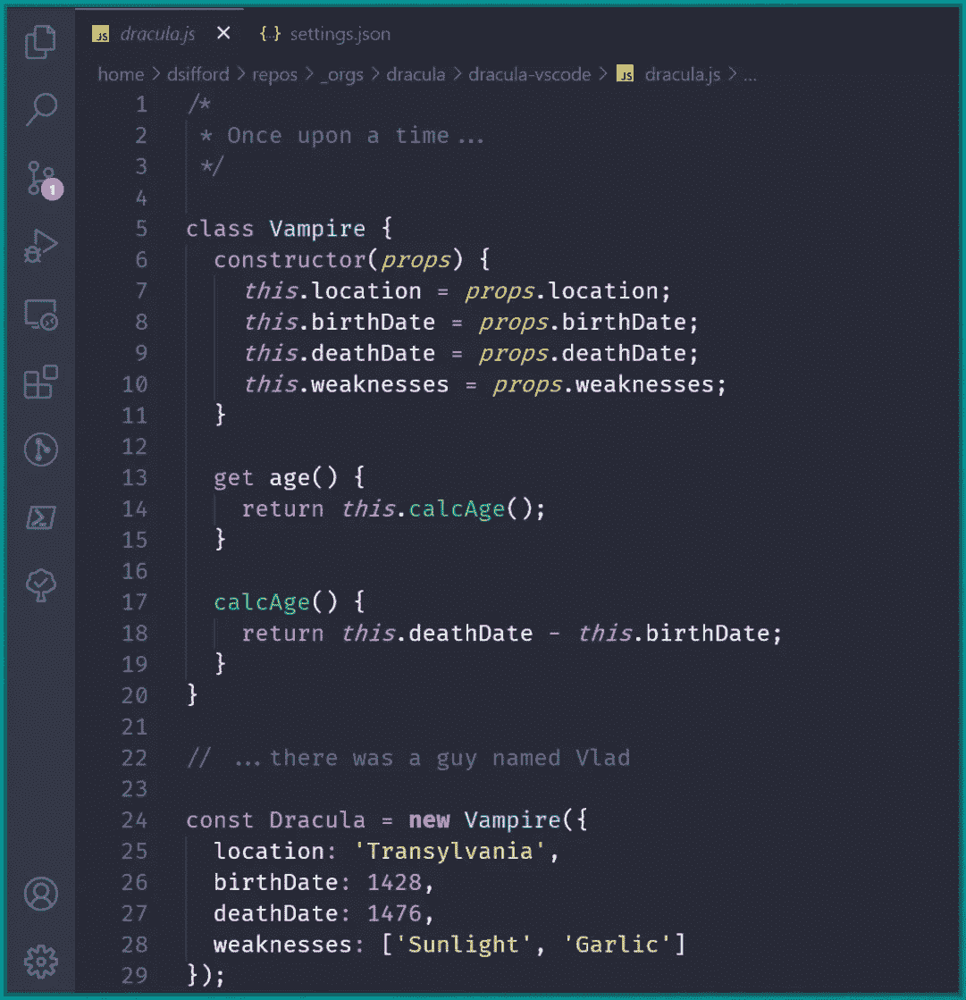
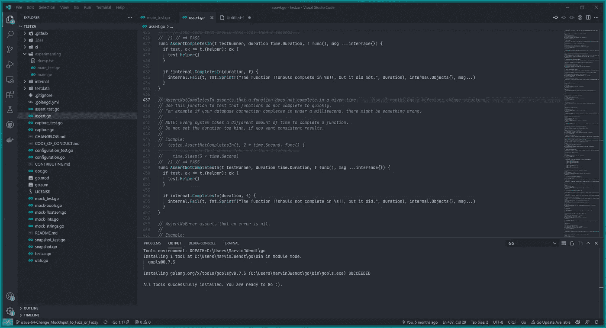
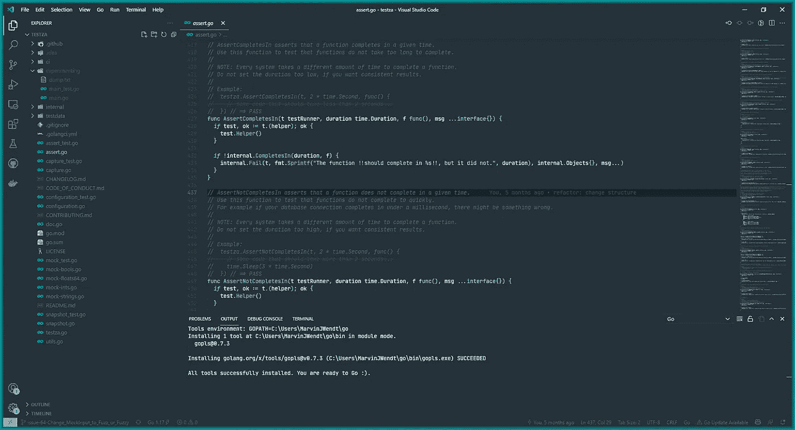
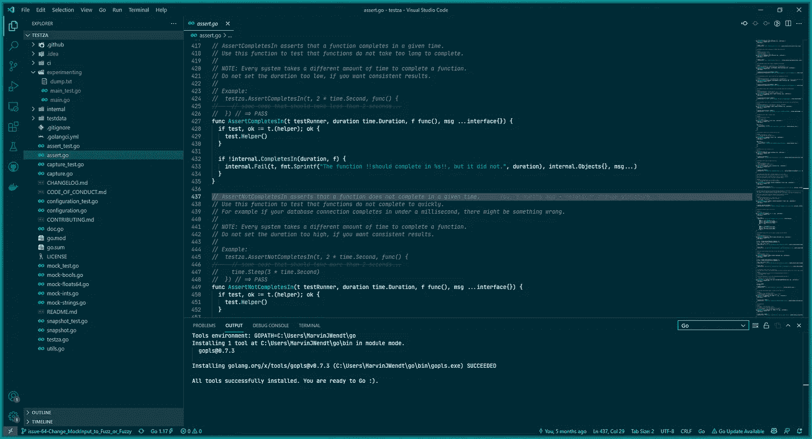
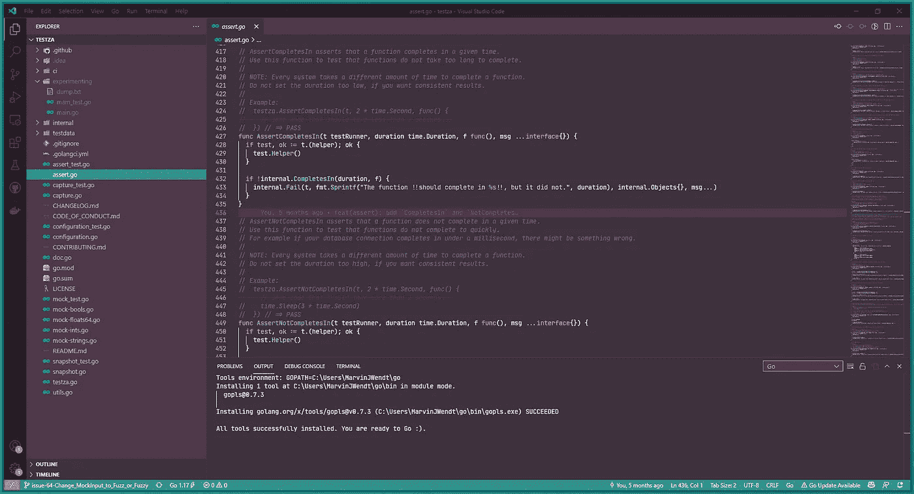

# 2022 年开始的 6 个最佳 Visual Studio 代码主题

> 原文：<https://betterprogramming.pub/the-6-best-visual-studio-code-themes-to-start-into-2022-1b1c7b8b60dc>

## 下面是 VS 代码的六个最佳主题列表

穆罕默德·拉赫马尼在 [Unsplash](https://unsplash.com?utm_source=medium&utm_medium=referral) 上的照片

Visual Studio Code 是微软开发的代码编辑器。它支持各种编程语言，并有扩展，允许您根据自己的需要定制它，并有许多主题可供选择。在这篇博文中，我们将关注 2022 年最佳 Visual Studio 代码主题。我们开始吧！

# 一个黑暗职业

One Dark Pro 是我个人最喜欢的主题之一。它有一个黑暗的，现代的背景，文字非常明亮和丰富多彩。尤其是会议中的屏幕共享，还是很容易看到的。总的来说，它看起来很现代，很悦目。许多内容创作者使用它，它是程序员中最受欢迎的主题之一。

One Dark Pro 截图(作者)

下面是一个黑暗职业 VS 代码的链接:

 [## 一个黑暗的专业视觉工作室市场

### Atom 标志性的 One Dark 主题，也是 VS 代码安装最多的主题之一！

marketplace.visualstudio.com](https://marketplace.visualstudio.com/items?itemName=zhuangtongfa.Material-theme) 

# 德拉库拉

德古拉也是一个非常受欢迎的主题。事实上，这是地球上最受欢迎的主题之一。它不仅适用于 VS 代码，还适用于所有支持自定义主题的应用。它被设计成在你的整个电脑中有一个一致的主题。此外，它有一种“吸血鬼的感觉”,带有深紫罗兰色，看起来非常干净。因此，如果你想要一个主题，你最有可能安装在你的电脑上的许多其他程序，这可能是给你的！

Darcula 市场网站截图

以下是 VS 代码的 Darcula 链接:

 [## 吸血鬼官方-视觉工作室市场

### Visual Studio 代码的扩展-官方德古拉主题。对于许多编辑器、shells 等来说，这是一个黑暗的主题。

marketplace.visualstudio.com](https://marketplace.visualstudio.com/items?itemName=dracula-theme.theme-dracula) 

# GitHub 主题

GitHub 有 VS 代码的官方主题。它和 GitHub 本身有相同的变种。所以黑暗，光明和相关的改进，如色盲的人。如果你经常使用 GitHub，你可能也想在你的编辑器中有一个一致的外观。

VS 代码官方 GitHub 主题截图(作者)

下面是 VS 代码官方 GitHub 主题的链接:

 [## GitHub 主题- Visual Studio 市场

### 转到 VS 市场。点击“安装”按钮。然后选择一个主题。GitHub 主题试图匹配主题…

marketplace.visualstudio.com](https://marketplace.visualstudio.com/items?itemName=GitHub.github-vscode-theme) 

# 材料主题

对于 Visual Studio 代码来说，Material 主题是一个非常现代的平面主题。有点蓝调和科幻的味道。由于它的平面设计，你的 IDE 的边框会不太明显。

VS 代码的素材主题截图(作者)

下面是 VS 代码的 Material 主题的链接:

 [## 材料主题- Visual Studio 市场

### 使用完整的源代码树上下文在您的 IDE 中管理拉取请求和进行代码审查。评论任何一行，不只是…

marketplace.visualstudio.com](https://marketplace.visualstudio.com/items?itemName=Equinusocio.vsc-material-theme) 

# Vue 主题

Vue 主题是一个受 Vue 网络框架启发的主题。它非常蓝和绿，如果你的电脑上有绿色作为强调色，它最适合。

VS 代码的 Vue 主题截图(作者)

下面是 VS 代码的 Vue 主题的链接:

 [## Vue 主题- Visual Studio 市场

### VS 代码编辑器 yo 代码扩展生成器 vsce 发布工具参考

marketplace.visualstudio.com](https://marketplace.visualstudio.com/items?itemName=mariorodeghiero.vue-theme) 

# 松弛主题

Slack 主题提供了从聊天平台 Slack 到你喜欢的代码编辑器的默认主题！下面的截图只是众多 Slack 主题变体中的一个，你可以从中选择。它也有 Ubuntu 的感觉，因为颜色接近 Ubuntu 操作系统的颜色。

VS 代码的 Slack Aubergine 黑暗主题截图(作者)

下面是 VS 代码松弛主题的链接:

 [## 松弛主题- Visual Studio 市场

### 受松弛默认主题启发的配色方案。新的松弛色主题和经典色主题也是想象中的深色…

marketplace.visualstudio.com](https://marketplace.visualstudio.com/items?itemName=felipe-mendes.slack-theme)