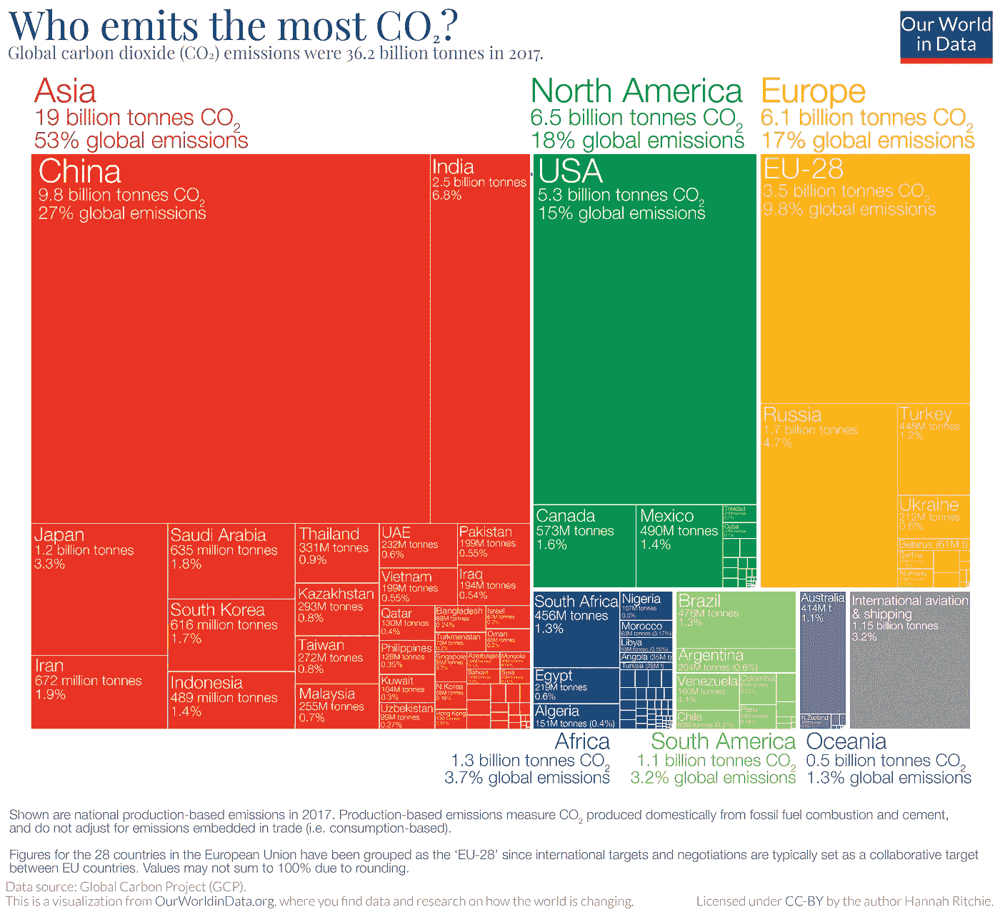

# 有效数据可视化的 6 个原则

> 原文：<https://betterprogramming.pub/the-6-principles-of-effective-data-visualization-9f98d1f7dade>

## 创建有用和信息丰富的图形的关键原则

[我们的数据世界](https://ourworldindata.org/annual-co2-emissions)

[数据可视化](https://en.wikipedia.org/wiki/Data_visualization)是数据科学过程中必不可少的一步。在这里，您可以用直观易懂的图形格式展示您的发现并交流您的分析结果。

数据可视化需要付出艰苦的努力，大量的清理和分析工作需要将杂乱的数据提炼和处理成漂亮的图形和图表。但是，即使准备好了数据，人们仍然必须遵循某些原则或方法来制作有用的信息图表。

也就是说，在这篇文章中，我将从爱德华·塔夫特的书[美丽的证据](https://www.edwardtufte.com/tufte/books_be) *，*中获得灵感，这本书概括了如何制作有用且信息丰富的数据图形的六个原则。正是这些原则将有用的图形与无用的图形区分开来。

这篇文章很大程度上也是受 Roger D. Peng 的书[R](https://bookdown.org/rdpeng/exdata/principles-of-analytic-graphics.html)中的探索性数据分析的启发。它在 Bookdown 上是免费的，你可以阅读它来了解更多关于 EDA 的知识。

现在让我们深入研究一下原理。

# 1.显示比较(对照组与治疗组)

展示比较是良好科学研究的基础。一个假说的证据总是与其他东西相关的。举个例子，你说“黑巧克力可以提高注意力和学习能力。”

这一主张中的一个重要问题是“与什么相比？”没有比较(相对假设)，主张就没用了。

显示对比的一种方法是有一个对照组和一个治疗组。前者不会摄入巧克力，而后者会。这样你就可以根据测试分数或通过测量大脑活动来比较巧克力对注意力和学习的影响。

当创建您的图形来展示您的研究时，您可以做的是用方框图绘制对照组和治疗组。这样，读者就能清楚地了解治疗的效果。

# 2.展示因果关系和解释

下一步是提供一个解释，展示一个思考你试图回答的问题的因果框架。如果你已经证明了治疗组经历了与对照组不同的效果，你必须从证据中形成一个假设来解释为什么会这样。

回到前面的例子，假设治疗组的受试者在测试中得分更高，这表明黑巧克力提高了注意力。一个重要的问题是问为什么会这样。

问这个问题很重要，因为它有助于提出新的问题，在整个研究过程中反驳或强化你的假设。

为了显示因果关系或机制，你可以测量对照组和治疗组的大脑活动，并将结果并排绘制出来。

通过测试分数图和大脑活动图，你可以看到为什么摄入巧克力的受试者得分更高的因果框架，即黑巧克力改善了认知功能。

# 3.显示多元数据(> 2 个变量)

现实世界是复杂的，两个事件之间的关系通常不是线性的。这就是为什么在研究中你有各种各样的属性或变量可以测量。

所有这些变量都以各种方式相互作用。其中一些可能是*，而另一些可能是解释事件关系的重要属性。*

*你可能已经知道，相关性并不意味着因果关系。所以把你的研究限制在仅仅使用两个变量是不理想的，因为这会导致错误的结论。*

*因此，你应该在你的图上显示尽可能多的数据。这可以帮助您识别数据中的任何混杂因素。*

*以[辛普生悖论](https://en.wikipedia.org/wiki/Simpson%27s_paradox)为例，这是一个概率统计中的悖论，其中“出现在不同数据组中的趋势在这些数据组被合并后消失了。”*

*举例说明:*

*   *两个变量—负关系*
*   *三个变量—正相关(x，y，z)(存在混杂变量)*

# *4.不要让工具驱动分析*

*一个好的讲故事的人知道如何保持人们的注意力，并有效地传达一个故事。讲故事的人不受故事本身的限制，但可以通过结合不同类型的感官和大量的意象来独特地表达故事，使故事变得生动。*

*同样，一个好的数据可视化工具并不局限于手边的数据可视化工具。他们有能力从单一的表现形式(线条或圆圈)扩展到使用多种表现方式。*

*例如，不要生成只有文本和线条的报告，而是使用包含图像、图表、文字、数字等信息的图形。，总之使它信息丰富。*

*有了丰富的信息和图形，读者可以在一个地方观察到证据的许多不同的相关性。*

*所以记住，你是讲故事的人。不要让工具限制了你的思维。让分析驱动工具，创造出令人震惊的证据丰富的情节。*

# *5.使用适当的标签、比例和数据源记录您的图形*

*当你第一次看一个图表时，你首先会看到标题是什么，然后是标签，以了解它背后的背景。没有它们，图表根本不会讲述一个故事。*

*良好的报告/图形都有适当的记录，每个图形都有适当的比例和标签。用于创建图形的数据来源也至关重要。*

*因此，一个好的做法是保存用于生成数据和图形的代码，因为这允许再现性。这也增加了你的图片的可信度。此外，通过保存代码，您可以在必要时编辑图表。*

# *6.内容高于一切*

*最终，不管以上所有的原则，如果内容没有质量、相关性和完整性，你的图片将是无用的或误导的。换句话说，“垃圾进，垃圾出。”*

*在报告任何结果之前，确保它是有趣的和重要的。不管你的图形有多漂亮或多直观，它们都不会保存不好的结果。*

*有一些有趣的报道来自个人经历，也可能是从互联网上获得的灵感。无论哪种方式，总是问问题，因为这是一个想法如何变成现实。*

# *结论*

**

*美国宇航局在 [Unsplash](https://unsplash.com?utm_source=medium&utm_medium=referral) 拍摄的照片*

*数据可视化是一项不可思议的技能。你可以把数据转化成美丽的图形和图表，向人们讲述一个故事。在这个数据呈指数级增长的时代，知道如何用数据讲述故事变得越来越重要。这是学习新技能的最佳时机。*

*总结一下原则:*

1.  *展示一下对比。*
2.  *显示因果关系。*
3.  *显示多元数据。*
4.  *整合尽可能多的证据。*
5.  *很好地描述和记录你的图形。*
6.  *确保你有一些有趣的事情要报道。*

*我希望你从这篇文章中得到的最大收获是:永远记住从一个好的问题开始，使用适当的方法，并且只提供回答这个问题所必需的信息。*

*我想引用美国数学家约翰·图基的一句话，他开创了统计学的新时代。*

> *"简单的图表比其他任何工具都给数据分析师的头脑带来了更多的信息."约翰·图基*

*关于这些原则的更详细的解释，我推荐你去看看罗杰·d·彭的书。*

# *资源和参考资料*

*如果您想了解更多关于数据可视化的知识，请查阅这些免费的好书。*

*   *Claus O. Wilke 的《数据可视化基础》*
*   *[gg plot 2:Hadley Wickham 等人制作的用于数据分析的精美图形](https://ggplot2-book.org/)*
*   *温斯顿·张的《R 图形食谱》*

*互联网上有大量平台展示美丽的可视化效果，包括:*

*   *[r/dataisbeautiful](https://www.reddit.com/r/dataisbeautiful/)*
*   *[信息很美](https://informationisbeautiful.net/)*
*   *[我们的数据世界](https://ourworldindata.org/)*

*有关创建地块的指南，请查看以下资源:*

*   *[R 图库](https://www.r-graph-gallery.com/)*
*   *[数据转 Viz](https://www.data-to-viz.com/)*

*本文的参考资料:*

*   *爱德华·塔夫特的书[美丽的证据](https://www.edwardtufte.com/tufte/books_be)*
*   *罗杰·婷·彭著，[探索性数据分析在 R](https://bookdown.org/rdpeng/exdata/principles-of-analytic-graphics.html)*

*感谢阅读！*