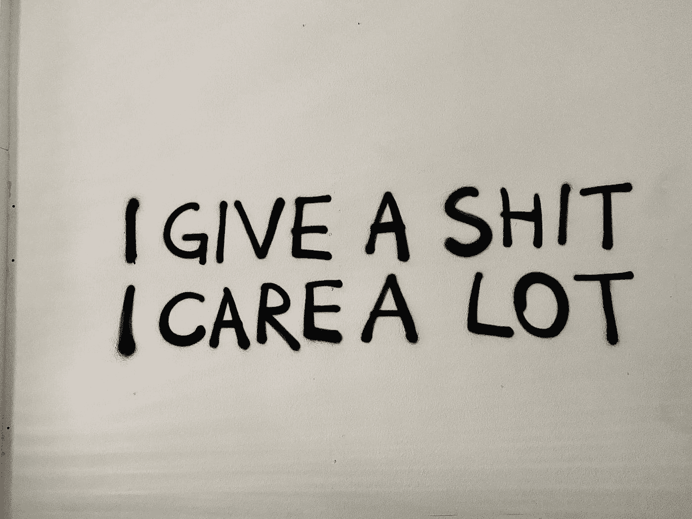

# 一个伟大的软件设计师的 6 个品质

> 原文：<https://betterprogramming.pub/the-6-qualities-of-a-great-software-crafter-8abf0f8b36d9>

## 你如何在职场中脱颖而出

蒂姆·高在 [Unsplash](https://unsplash.com?utm_source=medium&utm_medium=referral) 上拍摄的照片

作为一个真正的软件工匠，没有人更关心软件。不可能对软件开发了如指掌。我阅读书籍、伟大工匠的文章和大量其他资源，并参加会议。这些促使我写了一篇关于这门手艺的文章。

如今在面试过程中，主要关注点往往是技术技能或者推销自己的能力。面试官很少寻找最重要的品质。在本文中，我们将回顾一个认真对待工作的软件开发人员的六个重要品质。

# 致力于他们的手艺

在过去，我有机会见到一些伟大的人。这些人的共同点是他们对技术和工艺的热爱。

其中一人对 MOOCS 非常热情，并有着令人难以置信的跟踪在线课程的记录。他不仅是前同事，还是朋友和导师。他有最好的想法，但不幸的是，由于不可预见的情况，合作结束了。直到今天，我都很后悔他们放走了这个人。有时候，人们带来的影响和智慧是很难衡量的。

你可能已经注意到，有经验的人经常会写一本书或者写一些文章。他们回馈社会。看过《软技能:软件开发人员的生活手册》、《软件工匠:专业、实用、骄傲》等书籍后，我得出结论，它们确实改变了你对软件开发职业的思考方式。

那些书坚持认为你应该把你的事业掌握在自己手中。对于一个工匠来说，不断提高自己的技能是至关重要的。如果你不这样做，你不一定会落后(你总是会在工作中学习)。但是你将无法适应这个行业或者做你喜欢的事情。你要做让你做的事。

重要的是你对你所做的事情充满激情——我见过人们遭受燃烧或厌倦的痛苦。如果你没有激情，你真的很难在同一个环境里呆上几个月或几年。精心打造软件就是精心塑造架构，并让它为未来的几代人变得更好。日复一日的付出你最好的努力和精力。

我们大多数人花很多时间写代码。我们依赖他人的工作。最好的软件开发人员非常关心他们编写软件的方式。他们知道代码被阅读的次数比被编写的次数多。开发人员明白最大的开发成本不是开发本身，而是来自维护。有时候根本不写代码更好(如果它没有带来价值的话)。开发人员不应该只衡量努力。相反，他们应该把价值放在第一位(小事情对客户来说可能意味着很多)。

优秀的软件开发人员会在不破坏现有代码的情况下做额外的工作。他们关心如何编写软件。他们关心在团队内外传播知识。

然而，大多数时候，面试只考虑编写软件的能力。衡量成功的最佳标准是衡量软件开发人员给团队带来的价值。衡量这一点的唯一方法是给他们一个机会(例如，结对编程、试用日、实习)。

找出他们带来了什么，然后与团队沟通。沟通是这里的关键，这让我们想到了下一个质量:沟通！

# 沟通

沃洛季米尔·赫里先科在 [Unsplash](https://unsplash.com?utm_source=medium&utm_medium=referral) 上的照片

在软件开发世界中，我们很少遇到擅长沟通的人。这真是令人失望，因为那些善于沟通的人往往会获得很多好处。这并不一定意味着他们比别人强。但不是不重要！在业界，我们看到一种趋势，认为开发人员内向或害羞是正常的。不过，在一个团队中有太多同类人会很快成为一个问题。

一个好的团队需要由个人组成。你需要社交开发者，那些和同事相处融洽的人。因为拥有一个伟大的、充满活力的团队氛围会极大地影响一个团队的产出。

在工作中获得乐趣非常重要。这也会减轻工作中令人讨厌的方面。问一些问题，比如“你周末过得怎么样？”随便就能把工作场所变成一个健康得多的环境。但是你不能强迫这些问题；它必须是自然的。

除了社交角色，团队成员不害怕经常提出问题也很重要。如果你绞尽脑汁想了半个小时还没找到解决办法，你最好打断一个同事。你会发现大多数时候都是一些愚蠢的事情，你只是在浪费时间。如果你不能收起你的骄傲，在那个时候问一个问题，这是非常不专业的。

如果你真的喜欢一起工作，可以考虑在入职或完成困难任务时结对工作。不过要小心——你会发现如果你们相处不好，就不可能保持专注，所以要定期休息。

# 批判性地思考事物

你曾经和从来没有解决任何问题的团队成员一起工作过吗？从长远来看，结果如何？听起来是个完美的项目，对吧？好吧，让我告诉你，这样完美的项目是不存在的。迟早，你会遇到问题。

让我们达成共识，尽早讨论可以避免以后的问题。我们都经历过这种感觉*要是早点知道就好了*，对吧？然而，在我们的行业，讨论正在被推迟。

由[阿诺·塞纳](https://unsplash.com/@arnosenoner?utm_source=medium&utm_medium=referral)在 [Unsplash](https://unsplash.com?utm_source=medium&utm_medium=referral) 上拍摄的照片

甚至有很多开发商不再关心，他们基本上尽可能避免这些讨论！

这很难理解，比如你怎么会注意到有人已经不再关心你了？

这肯定不容易，但有可能。让我向您展示一个危险信号:在没有得到任何注释的情况下，一个接一个地发送拉请求是不正常的。

如果你觉得你没有得到很多反馈，你可能正为此而痛苦。因为即使是最好的程序员，偶尔也会犯些小错误。没有好的评论，这些就会滑向开发。问题如下:如果你不解决这个问题，它会变得更糟！

在过去的几年里，我看到人们过度设计测试，做出可怕的设计决策，或者产生非常低效的代码。我也有罪。我甚至自己也编写过这样的代码——我们都有！但是什么能区分一个软件工匠呢？他们不会只盯着代码。他们在编辑器中打开代码，然后玩它。他们很挑剔，会一遍又一遍地重复同样的话。因为这很重要，不仅对他们，对客户也是如此。他们在项目过程中不断提高标准。

批判性思考非常重要。不要认为事情是一成不变的。如果你有什么烦恼，说出来。如果你从来没有被代码困扰过，你应该照照镜子。问自己一个问题:我停止关心了吗？敢于对自己诚实。

想办法满足对方的目标。知道对面不对就不要和解。提问。互相交流和学习，在你的职业生涯中保持批判性(以建设性的方式)。当你停止吹毛求疵的时候，你将会成为一个糟糕的开发者。

# 为他们所做的感到自豪

照片由[戴恩·托普金](https://unsplash.com/@dtopkin1?utm_source=medium&utm_medium=referral)在 [Unsplash](https://unsplash.com?utm_source=medium&utm_medium=referral) 上拍摄

软件工匠为他们所做的事情感到自豪。他们应该这样！他们知道他们每天都在交付高质量的工作。

一个软件开发者为他们写的代码感到自豪。几个月后，同样的代码仍然像预期的那样工作。他们理解测试驱动工作的重要性。当所有的代码和每个测试都快速稳定地运行时，他们知道他们很好地完成了工作。

当他们在旅途中学到一些东西时，他们会与社区分享。他们很自豪，他们告诉别人这件事。

在日常工作中，他们为同事和客户提供价值。手工艺者非常重视与众不同。

# 表现得像个专业人士

照片由[鲁特森·齐默曼](https://unsplash.com/@ruthson_zimmerman?utm_source=medium&utm_medium=referral)在 [Unsplash](https://unsplash.com?utm_source=medium&utm_medium=referral) 拍摄

这种品质是显而易见的。在任何工作中，他们都希望你表现得专业。但是开发者的生活是艰难的。由于长时间的工作和困难的项目，一直保持专业的行为是一个挑战。这远远不止是在你应该工作的时候不玩游戏。

软件开发人员总是专业地解决问题。他们言出必行，言出必行——不要做出无法兑现的承诺。为了做到这一点，工匠交流。通过透明和诚实，他们将保持值得信赖。

> “不要做出你无法兑现的承诺”——安娜·贾维斯

对你的同事和客户，做一个谦逊的顾问。试着用每个人都能理解的语言解释事情，避免难懂的技术术语。为人端正，不骄不躁。建议并坚定地表达你的观点。

有时候，有些人，比如经理，会试图说服我们做一些事情。你不能今天完成吗？我们真的需要它。如果你表现得不专业，你就有麻烦了。你的可信度岌岌可危。告诉他们什么是可能的，什么是团队不能做的。如果你不知道，你就不知道！不要给出估计，除非你确切知道需要多长时间。慢慢来，高质量的工作不是匆忙建成的。

当事情不顺利时，我们会及时说出来，这样客户就有时间采取行动。从长远来看，这种透明度和沟通建立了健康的长期伙伴关系。

# 具有团队精神

Javier Allegue Barros 在 [Unsplash](https://unsplash.com?utm_source=medium&utm_medium=referral) 上拍摄的照片

虽然利己主义可以被认为是一种罪恶，但并不是每个人都这样认为。软件设计师是一个团队成员。他们不把矛头指向人，而是指向问题。

考虑以下两种情况:

*   你的代码导致了一个错误
*   一个团队成员的代码导致了一个错误

你会怎么做？想一想这个。

Git 历史说什么并不重要；饭桶指责游戏对我们没有帮助。客户真的不在乎借口，他们在乎的是解决方案。
现在，很容易找出谁是罪魁祸首，对吗？告诉客户团队犯了一个错误，你会尽快调查，这需要一些勇气。你可能很想道歉，但是如果你真的要道歉，要团队合作。因为下一次，这个问题的责任人可能是别人，甚至更糟——是你！

当然，通过不提名字和自己不犯错，你会赢得同事的尊重。

使用 Git 历史来解决问题是可以的，但是不要这样开始你的谈话:“嘿，我正在试图解决你制造的一些混乱。”知道谁犯了错误是有价值的。试着让他们成为解决方案的一部分，给他们一个改变的机会。

通过参与和专业地解决问题，你会赢得客户的尊重。转移你的注意力，成为一名团队成员。

# 结论

软件设计师的这六个特征对我来说非常重要。在写这篇文章的时候，我想到了很多也很适合拥有的特征。在我看来，拥有以上技能会让一个普通的软件开发人员和一个软件工匠有所不同。

没有人是完美的，我也是，但是作为一名软件工匠，定义一些你试图遵循的特征是一件好事。感谢您从头到尾阅读这篇文章。欢迎在下面的评论中讨论这个问题！