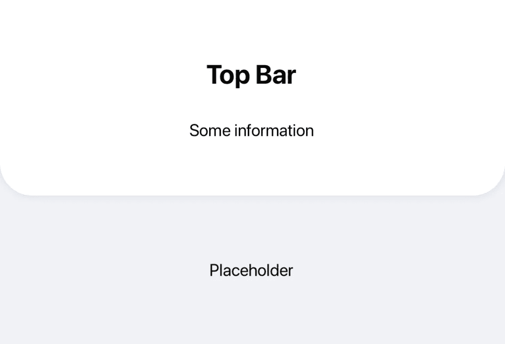
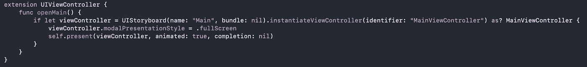

# 我在每个 iOS 项目中使用的 6 个 Swift 扩展

> 原文：<https://betterprogramming.pub/the-6-swift-extensions-i-use-in-every-ios-project-51f5cdac9b61>

## 看看我以前的候补队员


在 [Unsplash](https://unsplash.com?utm_source=medium&utm_medium=referral) 上 [Goran Ivos](https://unsplash.com/@goran_ivos?utm_source=medium&utm_medium=referral) 拍摄的照片。

每当我开始一个新的 iOS Swift 项目时，我做的第一件事就是导入我的实用程序和扩展文件。它们帮助我提高编程效率。让我们来看看我最喜欢和最重要的六个扩展。

# 1.在 UIView 下投影

当实现现代设计时，通常需要在`UIView`下投下阴影。我不用为每个视图编写多行代码，而是使用一个扩展:

当然，每个项目可能需要对阴影样式做一些小的改变，但是可以在一个中心位置进行改变。



以编程方式删除 UIView 阴影的示例。

# 2.从任何地方呈现 ViewController

当处理应用程序时，经常需要动态地改变`ViewController`流。您可以使用对`UIViewController`的扩展，而不是编写函数和选择模态表示风格。如果你不想每次都打开设置作为模态，你可以声明一次，从任何地方使用`viewController.openSettings()`功能！一行代码就完成了！



# 3.简化本地化

Swift 中的程序本地化可能非常难看，尤其是当您试图将多个单词连接成一个句子时:

```
let string = NSLocalizedString("Hello", comment: "") + " " + NSLocalizedString("World", comment: "")
```

这就是为什么我使用我的`String`扩展来简化这个过程:

```
let string = "Hello".localized + " " + "World".localized
```

扩展非常简单，如下所示:

```
extension String {
    var localized: String {
        return NSLocalizedString(self, comment: "")
    }
}
```

# 4.用 3 行代码编写带有延迟的异步代码块

编写异步函数和队列可能很难看。让我分享一个扩展，用不到三行代码简化运行带有延迟完成处理程序的异步后台任务:

这使得编写具有延迟的两部分异步代码块就像下面这样简单:

```
DispatchQueue.background(delay: 1.0, background: {
    print("First")
}, completion: {
    print("Run async after 1 second")
})
```

# 5.震撼视野

当使用用户输入验证时，您经常希望通过摇动视图给出不正确的用户输入反馈。让我们为这个 shake 行为创建一个扩展，这样我们就再也不用编写另一个 shake 代码块了:

就这么简单！

# 6.将 Double 舍入到字符串形式的特定位数

另一个经常需要的扩展是将`Double`或`Float`舍入到特定的位数。通常，我必须计算并呈现一个值，所以我需要它作为一个格式化的`String`(例如 1.42432 四舍五入为 1.42)。然而，在返回四舍五入的双精度数时，1.40432 四舍五入到两位将不会返回 1.40 而是 1.4。让我们来看看这个扩展，以获得一个格式优美的`String`:

# 结论

我希望你在未来的努力中使用扩展的力量。如果你有任何你正在使用的很棒的扩展并且想要分享，请在下面的评论中分享它们！