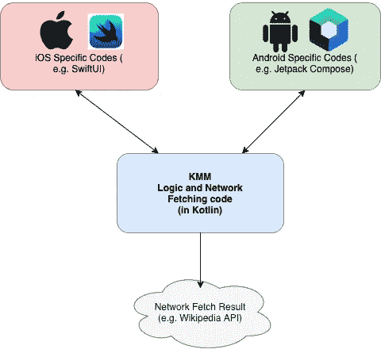

# 聪明开发者的 7 大挑战

> 原文：<https://betterprogramming.pub/the-7-challenges-of-smart-developers-ea05d591d4b3>

## 软件世界

## 所有开发人员都有局限性——即使是聪明的开发人员

蒂莫西·戴克斯在 [Unsplash](https://unsplash.com?utm_source=medium&utm_medium=referral) 拍摄的照片

软件开发是一个技术要求相对较高的领域。尽管这需要大量的学习，但有些人似乎是天生的程序员，轻松地学会了编程语言和概念。

当我们第一次与这样一个“聪明”的开发者一起工作时，这是最令人愉快的。如果我们能跟上他们的步伐，我们就能从他们身上学到很多东西。他们的生产率比其他人高得多。当他们说出他们的技术观点时，每个人都瞠目结舌。

在获得了一些与他们共事的经验后，我注意到一些聪明人面临一些共同的挑战。我在这里分享它们，只是为了带来一些意识，这样你就不会陷入同样的陷阱。

# 1.这些都很明显

从技术上讲，他们非常聪明——学习速度快，思维可视化强。他们可以轻松掌握任何抽象的概念，而不必像我们中的一些人那样深入思考。

对于他们来说，一些比较常见的知识和编程概念只是显而易见的。递归是如何工作的？什么是 lambda 函数？这对他们来说很容易。但对我来说，我需要慢慢消化，冥想一段时间。

当被要求分享其中一些概念时，他们可能会回答:“有什么好谈的？很明显”。对他们来说，这就像解释为什么 1+2 = 3。有什么好教的？

但是对一些人来说，1+2=3 是一个很难理解的概念。一个人必须到较低的层次去教育他们。聪明的人有时看不到不是每个人都像他们一样聪明。他们很难理解为什么有些概念需要剥离出来，变得更简单。

聪明的人能很容易理解复杂的事情。更聪明的人可以*让*如此复杂的事情变得简单。我希望他们能成为更聪明的人！

> 简单可能比复杂更难
> 
> —史蒂夫·乔布斯

# 2.为什么我们需要图表？

当理解某件事很容易时，花力气去解释某件事似乎真的是一种永远得不到回报的额外努力。

我很难理解聪明的开发者写的文档。在阅读之前，有许多假设和背景知识需要了解。读书的时候，可能要我好几个回合才能消化。我只希望里面有图表和插图！

我希望聪明的开发人员明白，技术文档是为了让所有级别的开发人员更容易交流。它不仅仅是一个要完成的“待办事项”,以便人们可以进入编码部分。

技术文档不仅适用于当前的开发人员，也适用于未来的开发人员——他们可能没有当前开发人员那么多的背景知识。提供尽可能清晰的信息，并配以适当的插图，从长远来看会有所帮助。

这里有一个简单的图解说明如何让事情变得更清楚的例子。我们可以这样写:

> 通过 KMM，我们可以让 iOS 和 Android 继续拥有特定于平台的代码，例如 iOS 的 SwiftUI 和 Android 的 JetpackCompose，同时在 KMM 拥有从通用维基百科 API 获取的通用网络获取代码。

我们可以简单地画出这个图表:

这个图表让事情变得简单多了。它也留下了一份遗产:

> 一个高尚的，合乎逻辑的 fiagram，一旦被记录，将不会死亡
> 
> —丹尼尔·伯纳姆

# 3.他们不耐烦了

他们思维敏捷。他们行动迅速。当给他们一个任务时，解决方案就在他们的脑海里，随时可以开始:“哦，那很简单……根本不是问题”。

他们受不了那些慢慢消化，想太多的人。对他们来说，解决方案已经到位。有什么好担心的？为什么要到处乱戳？

对于一个简单的任务来说，这确实令人印象深刻。我们希望开发人员能够快速思考，快速行动，并及时交付卡片。

然而，有时不加思考地快速做事会危及大型项目交付的顺利进行。如今，任何不小的项目都不应该草率从事。

在一个大项目中，需要很多仔细的思考和考虑。事情不能是特设的——仅仅“思考和交付”的习惯是不合适的。需要规划、记录和场景构建。

这就是经验派上用场的地方。开发人员的聪明只能在战术层面上推动项目。它需要与经验和谨慎的考虑相结合，才能达到项目交付的战略层次。

一个人还可以不耐烦，但是需要结合经验和考虑，这需要时间和学习。

> *要走得更快，你必须减速*
> 
> *—约翰·布鲁纳*

# 4.他们很容易感到无聊

当一件事情很容易被学习和掌握时，它很快就会变得无聊。人们期待着下一个挑战——一些新的东西需要学习和探索。

这是聪明人面临的挑战。刚开始的时候，技术学习和项目工作可能会很有趣。但是几次迭代之后，就变得平淡无奇了。感觉像是复制粘贴。

工作生活变得毫无意义。一个人开始寻找和探索新的挑战。如果群体的管理层足够敏感，他们会探索一些对他们来说有趣和新鲜的东西。如果没有，聪明的人很快就会递交辞职信。

不断寻求挑战和拓展自己的技能组合从来都没有错。我强烈鼓励你这样做。如果一个组织没有为你提供平台，那么继续关注，我相信你可以在某个地方找到一个。

但在你这么做之前，我强烈建议你看看内部。聪明的可能会厌烦。但是聪明的人会从中得到一些有趣的东西。有很多可能性:

*   如果这个项目很无聊，就像一个剪切粘贴的工作，为什么不挑战自己来自动化它呢？
*   花时间学习和研究新的东西。积累你目前工作所需之外的知识——将来可能会有用。
*   也许你可以从事相关的副业项目，向你的组织展示这些项目对他们的价值。你可能会中大奖，推荐一些 CEO 可能会注意到的东西！
*   为什么不帮助你的同事，增强团队的能力呢？你可以建立良好持久的关系，人们会感激你的指导。

如果只是无聊，你离开了这个组织，你会注意到，无论你去哪家公司，最终都是一样的。我们只需要改变我们对待无聊这个事实的方式，让它变得有意义。

> 生活永远不会无聊，但有些人选择成为无聊的**。**
> 
> **—韦恩·戴尔**

# **5.他们不容易被指导**

**谁能教聪明人？只有更聪明的人？你尝试过教聪明的开发者吗？也许无论你想教他们什么，他们都已经知道了。**

**他们的精神力量超过了大多数人。当你说几句话时，他们可能知道你想说什么。如果你一路上不小心提到了几个错误的项目，他们可能很容易打断你，用清晰的例子证明你说的是错的。**

**由于他们的智力，也许从别人那里学到一些东西会让他们感到自卑。他们从不喜欢那种感觉——这种事情不常发生。他们只尊重少数比他们聪明的人。**

**当他们觉得自己的智力受到挑战时，他们可以迅速做出反应，给出 101 个理由来解释他们认为正确的原因。承认他们错了是一种“恐吓”。他们提供的理由听起来很有逻辑，很有意义，尽管有时事实可能被聪明地扭曲了。**

**试图教他们一些东西从来都不好玩。我们有些人放弃了。他们认为自己太聪明了，不会从我们的输入和经验中学习。**

**我们宁愿教那些更容易接受我们的教学的人——那些更愿意学习的人。我们多年来获得的经验，尽管我们不能明智地说出为什么，却包含着宝贵的教训。**

**事实上，并不是他们的智力阻止了他们学习。骄傲慢慢地爬进来，蒙蔽了他们的双眼，让他们意识到学习不仅仅来自比他们聪明的人，也可以来自任何人。当它使别人放弃教他们时，这对他们是不利的。**

**如果他们意识到向任何人学习的重要性，再加上他们的智力，我相信他们会达到顶峰。**

> **如果你虚心学习，每个人都有东西可以教你”**
> 
> **—标记光盘卷**

# **6.他们通常非常固执己见**

**我觉得这很有趣。**

**我非常尊重聪明的开发人员，以及他们如何能够很好地理解事实和数据。他们能够逻辑清晰、令人信服地描述自己的想法。**

**所以，我认为高智商的人能够看透每一种选择的利弊。**

**然而，令我惊讶的是，当聪明的人选择了他们喜欢的一个选项时，他们可以提出 101 个理由来说明这个选项优于其他选项，并消除他们选择的那个选项的所有缺点。如果我们让另一个聪明人选择另一个选项，那么我们就看到了泰坦的冲突！**

**非常固执己见。这就是为什么程序员的三大战争持续了几十年，仍然没有结束！**

** [## 程序员的三场战争以及它们将如何结束

### 几十年来对琐事的争论，会结束吗？

levelup.gitconnected.com](https://levelup.gitconnected.com/the-3-wars-of-programmers-and-how-will-they-end-37fabaa0e37b) 

也许他们并不是看不到缺点。只是他们只是在智力上有能力辨别利弊，聪明地把黑说成白，反之亦然，这取决于他们站在哪一边。

在这些时候，我真的希望有意识的人比理智的人说话更响亮。

> 讨论永远比争论好，因为争论是为了找出谁是对的，而讨论是为了找出什么是对的。
> 
> —未知作者

# 7.从技术上来说，他们可能会走极端

大多数时候，从技术角度思考有助于解决具有挑战性的问题。但是有时人们会陷入思考太深的陷阱。有时，所需的解决方案根本不是技术性的。

例如，假设我们需要一个清晰锐利的静态背景图像。在加载模式期间，静态图像应该是模糊的。

一个总是偏爱技术解决方案的聪明的开发人员可能会想，“酷，让我们探索如何通过编程使图像模糊。如果有 API，太好了！如果没有，我们可以研究如何将图像转换成位图，并应用模糊算法。”

但是如果我们退后一步想，“这是一个静态图像。为什么不直接让设计师给我们一个模糊版的图像呢？那会节省那么多时间！”

过于技术化并不总能产生最佳解决方案。模糊图像是一个困难的算法(我有一篇文章解释它)。试着从非技术性的角度去思考。

 [## 如何在 Android 上模糊图像

### 建立一个图像模糊算法

medium.com](https://medium.com/mobile-app-development-publication/blurring-image-algorithm-example-in-android-cec81911cd5e) 

有时候，我们只需要想一个简单的解决办法。

一个很好的例子是下面的一个谜语。据称，80%的幼儿园小朋友都能回答，但只有 17%的大学生能回答。看看能不能答出来？(需要的话谷歌一下答案)

> 什么比上帝更伟大，比魔鬼更邪恶；
> 穷人有，富人不需要；如果你吃了它，你会死吗？

# TL；速度三角形定位法(dead reckoning)

平心而论，我上面写的并不适用于所有聪明的开发者。然而，如果一个人没有意识到聪明的潜在陷阱，这些问题很容易浮出水面。

这是因为聪明使人自信。但如果管理不当，自信会变成傲慢。人们可能会忽视自己的局限性和他人的感受。

让我们小心，不要掉进这个陷阱。**