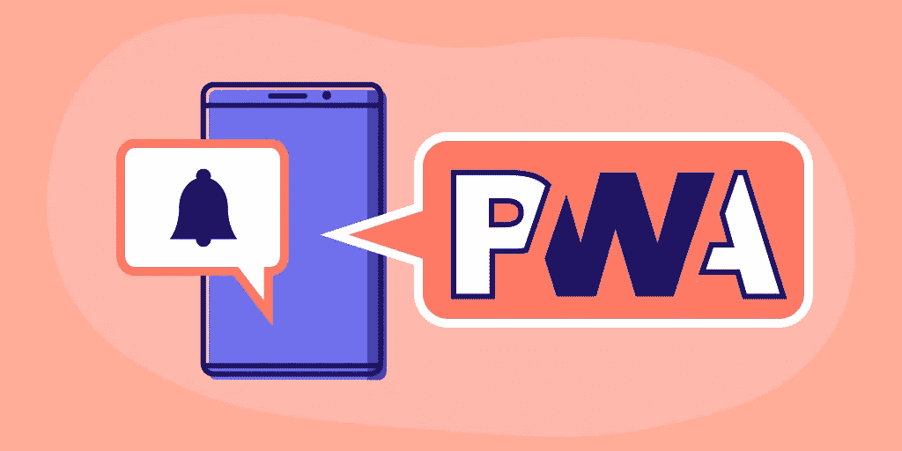
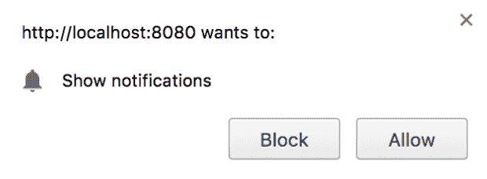

# 渐进式网络应用推送通知的 8 分钟指南

> 原文：<https://betterprogramming.pub/the-8-minute-guide-to-push-notifications-in-progressive-web-apps-40f0c61686c9>

## 了解如何在 PWAs 中实施推送通知，以及针对您的应用的最佳通知实践



图片由作者提供

渐进式网络应用程序(PWAs)因其易用性和快速的开发过程正在席卷整个行业。当与推送通知功能相结合时，这些 pwa 成为个人和专业开发人员的强大动力。

今天，我们将继续探索 PWAs，了解是什么让推送通知如此有用，并向您展示如何在您自己的应用中实现基本的推送功能。最后，您将了解推送最佳实践，并为您自己的项目构建一个推送服务起点。

> 刚从 PWAs 开始？在继续之前，请阅读本系列的第一部分以了解基础知识:[用渐进式 Web 应用程序构建现代的离线应用程序](https://www.educative.io/blog/build-modern-apps-progressive-web-apps)。

**下面是我们今天要学的:**

*   什么是推送通知？
*   推送通知的最佳实践
*   如何实现推送通知
*   包扎

# 什么是推送通知？

推送通知是一种与用户即时沟通的新方式，应用程序目前已关闭。推送通知使用两种 API:

*   通知 API
*   推送 API

通知 API 允许应用程序在运行时向用户显示系统通知。推送 API 允许应用程序显示这些通知，即使在应用程序离线时也是如此。在手机上，如果手机被锁定，推送通知甚至可以显示出来。

后台服务人员使离线时发送消息成为可能。该应用程序使用推送 API 来管理一个服务工作人员，该工作人员不断地监听来自应用程序服务器的特殊推送通知。一旦收到推送消息，服务人员会将通知“推送”给用户，无论应用程序当前是否正在运行。

只有当应用程序能够后台访问设备并使用支持推送 API 的浏览器时，推送通知才能发挥作用。用户必须通过提示授予应用程序的后台访问权限，并且可以随时禁用访问权限。

大多数浏览器都支持推送 API，如 Chrome、Safari 和 Firefox。不支持的浏览器如 Microsoft Edge 已经宣布他们将在未来版本中添加推送支持。

# 推送通知的常见用途

推送通知是一个强大的工具，可以重新吸引过去的用户，并持续接触到当前的订户。它们最好用在有时间敏感组件的应用上，比如销售或突发新闻。推送通知在电子商务应用和新闻服务中变得特别受欢迎，因为它们能够不断吸引客户。

以下是一些使用推送通知的流行应用类型:

*   **新闻应用(CNN，纽约时报，NPR):** “突发新闻:这是突发新闻”
*   电子商务应用(易贝、亚马逊。):“只需 1 美元即可获得该产品”
*   **娱乐(网飞、Youtube、苹果播客):**“新一集现已推出”
*   **Rideshare (Lyft，优步，Grabtaxi):** “你的坐骑来了！”

# 推送通知的利与弊

## **优点:**

*   即时通知
*   可以接触到大量的用户
*   返回指标，如有多少用户点击了通知
*   即使过去的用户不再积极使用该应用程序，他们也可以参与进来

## **缺点:**

*   必须谨慎使用，以免用户选择退出推送通知
*   可以撤销正面品牌。一些用户不喜欢推送通知，也可能不喜欢使用它的应用程序。
*   受到苹果等供应商的严格监管。

# 推送条款快速指南

*   **推送消息:**从服务器发送到客户端的消息。
*   **Push Notification:** 由 Push 消息生成的要发送给用户的通知。
*   **通知 API:** 配置并向用户显示通知的接口。
*   **推送 API:** 将应用与推送服务链接起来的接口，允许服务人员接收推送消息。
*   **Web 推送:**基于 Web 的推送通知实现。
*   **推送服务:**处理推送消息的浏览器专用系统。大多数都是应用程序开发的标准，唯一的变化是在幕后。
*   **Web 推送协议:**由应用程序开发人员创建的指令，用于说明应用程序或用户如何与浏览器的推送服务进行交互。

# 推送通知的最佳实践

如果使用不当，推送通知会损害用户体验。使用我们的 5 个最佳实践列表，确保您从这个新的推广系统中获得最大收益。

## 1.每周发送少于五条通知

研究来源为通知频率找到了不同的断点，但大多数都认为推送通知应该很少使用。每条信息的确切效果取决于应用程序的类型和选择的媒体。一般来说，每天不要发送超过一条的推送通知，尽量每周少于五条。

## 2.选择加入而不是选择退出

大多数用户更喜欢选择加入推送通知的能力，而不是选择退出。使用选择退出模式的应用程序总是比选择加入模式的应用程序更不受欢迎。此外，像苹果这样的许多提供商要求应用程序开发人员使用选择加入模式进行推送，作为他们指导方针的一部分。

## 3.软选择加入优于硬选择加入

硬选入是指当用户打开应用程序时，系统会提示用户授予访问权限。软选择加入是指当用户操作触发提示时，比如当他们点击通知按钮时。后者更受青睐，因为它提供了有关用户可能会收到哪些通知的更多信息。它被认为不太具有侵扰性，并提供了让用户在下次访问时选择加入的机会。

## 4.包括强大的通知设置

包括针对推送和非推送通知以及应用程序上不同功能的单独通知设置。例如，想象你的应用程序显示新闻文章，并允许你购买优质文章的新闻订阅。用户应该被允许从一个功能中选择退出推送通知，如订阅优惠，但仍然可以收到新闻文章的推送通知。同样，用户应该能够选择接收电子邮件通知，即使他们不想要推送通知。

这两种设计都确保你避免了用户的全有或全无的选择，从而在所有类型的用户中保持最大的产品曝光率。

## 5.符合平台指南

现在越来越多的提供商在他们的平台上监管推送通知，比如苹果的 iOS 平台。注意你的应用程序将在哪里启动，并检查它是否符合所有准则。不符合指导原则的应用程序将被禁止进入该平台。跨平台的两个一致准则是:

*   应用程序运行不需要推送通知。
*   推送通知不得发送敏感或机密信息。

# 如何使用 PWA 实现推送通知

现在，我们将带您了解如何在您自己的应用中实现基本的推送通知。任何支持推送的应用程序需要的基本功能是:创建服务人员、检查权限、请求权限和取消订阅。

学完本教程后，您将创建简单的推送功能，在继续 PWA 应用程序开发之旅时，您可以基于这些功能进行构建。

## 1.设置工作空间

在开始之前，我们将创建我们的工作区。首先，创建一个名为`notification.js`的 JavaScript 文件。这将是我们为其他步骤添加所有代码的地方。您还应该在应用程序的 HTML 文件中添加对此文件的引用，代码行为:

```
<script src="./js/notification.js"></script>
```

我们还需要建立一个简单的方法来激活服务人员。如果您想通过这些步骤跟踪您的程序的进度，您需要移除并重新加载服务工作器来查看更改。

使用此代码在您的`notification.js`文件的顶部创建一个服务工作者:

```
if ('serviceWorker' in navigator) {
  window.addEventListener('load', function() {
    navigator.serviceWorker.register('/service-worker.js');
  });
}
```

上面的第 1 行检查浏览器是否支持服务人员。如果是，第 2 行和第 3 行将 worker 设置为在页面完全加载后激活。最佳实践是将服务工作者的激活延迟到页面加载之后。如果在页面加载时激活工作线程，低端设备将会出错。

## 2.检查权限

现在，我们将检查用户是否启用了推送通知，以及当前浏览器是否支持推送通知。如果两者都支持，我们检查服务人员是否准备好了第 14 行的`navigator.serviceWorker.ready`。最后，我们使用第 16 行内置的`.getSubscription`函数来获取用户订阅信息。

## 3.请求权限

每个使用推送通知的应用程序都必须能够请求用户权限。为了学习基础知识，我们将使用一个硬选入模型请求。下面的`subscribePush()`函数询问用户是否要订阅推送通知，如果同意就订阅。

在第 3 行，我们要求用户用弹出窗口订阅。在用户端，它看起来像是:



选择加入消息示例

然后在第 4 行，我们设置了用户何时会看到通知的标准。对于这个例子，我们设置用户查看所有发送的通知。

最后，我们使用第 6–10 行来检查订阅是否已通过，并告诉用户他们已成功订阅。

## 4.取消订阅

作为最后一部分，我们将为用户添加一种取消订阅推送通知的方式。下面的`unsubscribePush()`函数获取用户订阅 ID，然后将其从我们的推送服务中移除。

第 2–11 行使用内置的`getSubscription()`函数获取用户的订阅信息。我们使用第 13 行订阅信息作为`unsubscribe()`函数的输入。这将选择和取消用户订阅我们的推送通知。如果一切正常，我们将向用户打印一条消息，告诉他们已经成功取消订阅。

# 包扎

恭喜你！现在，您已经拥有了创建推送服务所需的所有基本功能。开发应用程序的后续步骤是:

*   创建订阅按钮
*   实施软选择加入
*   起草您的第一条推送通知