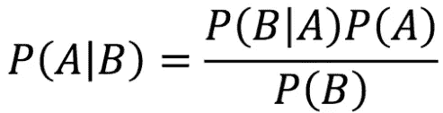
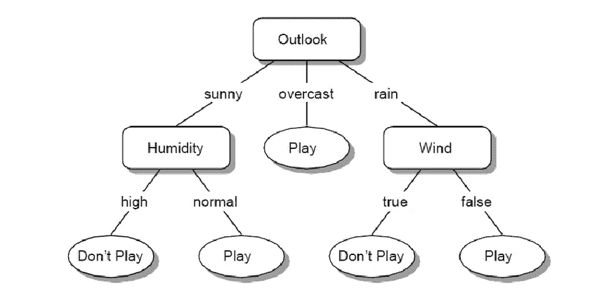
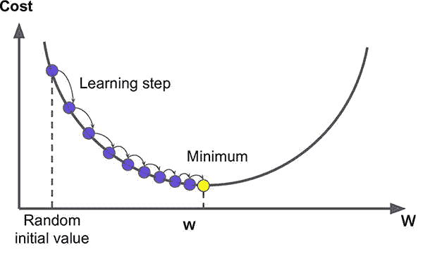
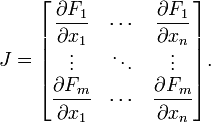
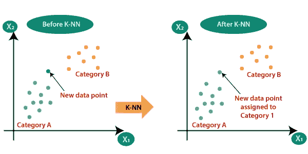
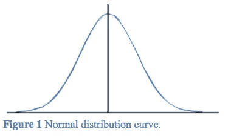
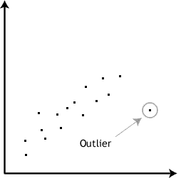
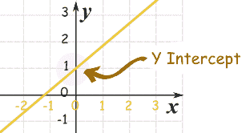

# 数据科学基础知识:26 个最重要的概念

> 原文：<https://betterprogramming.pub/the-abcs-of-data-science-26-of-the-most-important-concepts-be097434ed5d>

## 从人工神经网络到 Z 分数

马蒂亚斯·海德尔在 [Unsplash](https://unsplash.com?utm_source=medium&utm_medium=referral) 上的照片

数据科学已经成为世界上发展最快的领域之一。在科技语言中，这个词本身已经成为名人，越来越多的人对此感兴趣，想要分一杯羹。

然而，学习数据科学需要时间——有许多概念和实践必须在开始之前先了解。

使用字母表中的字母，我将简要介绍数据科学中最重要的 26 个概念。

也就是说，让我们从 a 开始。

# 人工神经网络

设计用来模拟构成人类大脑的神经元网络的计算系统，这样计算机将能够以类似人类的方式学习和做出决定。

# 贝叶斯定理

非常流行的确定条件概率的数学公式。条件概率是基于条件先验知识的事件概率。

# 分类

预测给定数据点类别的过程。换句话说，将输入变量( *x* )映射到离散变量( *y* )。

一个例子是，在给定年龄、工资或性别等变量的情况下，预测一个人是否购买了特定的产品。

# 决策树

用于绘制每个决策的可能结果的树状模型。决策树的每个分支代表一个可能的结果或决策，最远的分支是最终结果/最终决策。

照片来自 ResearchGate，作者是 Mariam Hassib

# 集成学习

将弱模型*(弱学习器)*组合在一起，以获得比任何单独添加的模型更准确的预测模型。

# f 分数

分析模型准确性的测量类型。F 值结合了精度和召回值，并给出了错误分类情况的度量。

# 梯度下降

[“寻找可微函数局部最小值的优化算法。”](https://en.wikipedia.org/wiki/Gradient_descent)目标是在最陡下降方向迭代移动，直到达到局部最小值。

照片由[艾格尼丝·绍尔](https://miro.medium.com/max/600/1*iNPHcCxIvcm7RwkRaMTx1g.jpeg)拍摄

# 分层聚类

一种聚类方法，旨在构建聚类的层次结构。类似于决策树。

# 自变量

不基于其他变量而改变的变量。

例如，当分析食物消耗和体重之间的关系时，食物消耗是独立的，因为它确实会随着某人的体重而变化。

# 雅可比矩阵

在微积分中，雅可比矩阵是多个变量的所有一阶偏导数的矩阵。

# k-最近邻(KNN)

一种数据分类方法，根据哪组数据点更接近单个数据点来估计某个数据点成为一组或另一组成员的可能性。

照片由[Java point](http://javatpoint.com)拍摄

# 线性回归

最基本和最常用的预测分析，使用最佳拟合的线性线对自变量和因变量之间的关系进行建模。

# 机器学习

构建能够从数据中学习并随着时间的推移提高准确性的应用程序和算法，而无需通过编程来实现这一点。

这些算法的例子包括决策树、k 均值聚类、逻辑回归、人工神经网络等。

# 正态分布

显示接近平均值的数据比远离平均值的数据出现得更频繁的概率分布。看起来像一条钟形曲线，中间对称。

查尔斯·d·吉拉尼的照片

# 极端值

出现异常且远离其他数据点的数据点。很可能是由于所采取的测量的可变性。

# p 值

在统计测试中使用，它是结果不是偶然获得的概率。根据经验，小于 0.05 或 5%的 p 值拒绝接受结果是偶然获得的这一符号。

# 定量和定性变量

数量变量是测量变量，如身高、体重、跑步时间和在商店购买的商品数量。

定性变量是非测量变量，如颜色、狗的品种、水果等。

# 回归

给定一组数据，预测连续变量的过程。换句话说，将输入变量( *x* )映射到连续变量( *y* )。

一个例子是，在给定某人的年龄、部门、在公司的年数等的情况下，预测其在公司的工资。

# 结构化查询语言

数据科学家最常用的工具之一。SQL 代表*结构化查询语言*，设计用于存储、操作和检索数据库中的数据。

# 训练和测试设备

*训练集*是用于训练模型的数据子集。*测试集*用于通过预测模型未知的结果来验证该模型。

# 无监督学习

自行工作以发现模式和信息的模型。不需要监督——与监督模型不同，它们不测试输入变量和输出变量之间的关系。

# 差异

在概率统计中，方差[“衡量一组数字与其平均值相差多远。”](https://en.wikipedia.org/wiki/Variance)

# 加权平均数

类似于普通平均值，只是有些数据点对平均值的贡献大于其他数据点。换句话说，数据点对平均值的贡献并不相等。

# y 轴截距

图表上一条线与纵轴相交的点，通常称为 y 轴。

玛丽·莫利纳[拍摄的照片](https://i2.wp.com/www.mathsisfun.com/images/intercept.gif)

# z 分数

在统计学中，Z 得分是原始得分值高于或低于所观察或测量的平均值的标准偏差数。

# 最终想法

理解这些主题会让你对数据科学的不同领域有一个基本的了解——包括统计学、微积分、代数和编程。

我只简单总结了 26 个话题(字母表中的 26 个字母)，但还有很多。如果你真的想在数据科学领域工作并从中分一杯羹，你应该不断尝试学习和研究数据科学领域的新概念和实践。

# 参考

[1] Bruce，P. *数据科学家实用统计学:使用 R 和 Python 的 50+个基本概念。*加利福尼亚州塞瓦斯托波尔。奥雷利媒体。2017 年 5 月 10 日。

[2] Vanderplas，J. *Python 数据科学手册*。加利福尼亚州塞瓦斯托波尔。奥莱利传媒。2016 年 11 月 17 日。

[3] Upasana，a .*2021 年你必须准备的 100+数据科学面试题。*[https://www . edu reka . co/blog/interview-questions/data-science-interview-questions/](https://www.edureka.co/blog/interview-questions/data-science-interview-questions/)