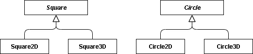

# 面向初学者的抽象工厂模式

> 原文：<https://betterprogramming.pub/the-abstract-factory-pattern-for-beginners-4c756c21c1b8>

## 通过例子理解抽象工厂设计模式


由 [ThisisEngineering RAEng](https://unsplash.com/@thisisengineering?utm_source=unsplash&utm_medium=referral&utm_content=creditCopyText) 在 [Unsplash](https://unsplash.com/s/photos/software-engineering?utm_source=unsplash&utm_medium=referral&utm_content=creditCopyText) 上拍摄。

在我上一篇关于[策略模式](https://www.linkedin.com/pulse/approaching-design-patterns-beginners-mind-strategy-m%C3%A1rcio-j%C3%BAnior)的文章中，我涵盖了比预期更多的内容。这一次，我会更直截了当。关于设计模式的一个重要教训似乎是不要将代码提交给作为特定类实例的变量。如果代码是根据特定的对象实现的，它会导致子系统之间的依赖，并使其难以更改或重用。

我们通常会创建这样的对象:

```
MyClass mc = new MyClass();
```

如果一个应用程序对一个特定类的构造函数有很多这样的调用，那么当需要改变时就很难维护了。希腊哲学家赫拉克利特说过:“变化是生活中唯一不变的东西。”这也适用于系统设计。

> “最大化重用的关键在于预测新的需求和对现有需求的变更，以及设计您的系统以便它们可以相应地发展。
> 
> …
> 
> 一个不考虑变化的设计在将来会有重新设计的风险。”— [设计模式](https://books.google.ca/books?id=6oHuKQe3TjQC&pg=PT46&lpg=PT46&dq=The+key+to+maximizing+reuse+lies+in+anticipating+new+requirements+and+changes+to+existing+requirements,+and+in+designing+your+systems+so+that+they+can+evolve+accordingly.+A+design+that+doesn%27t+take+change+into+account+risks+major+redesign+in+the%C2%A0future.&source=bl&ots=lQkIAUfJGC&sig=ACfU3U3_2TsrKv1uWLHc5fnIn0EhsUWITA&hl=en&sa=X&ved=2ahUKEwiExZqNsY3xAhVCheAKHYZXA2YQ6AEwB3oECAkQAw#v=onepage&q&f=false)

幸运的是，我们可以通过如下实例化类来减少依赖性:

```
MyClass mc = Factory.Create();
```

现在我们有了一个`Factory`的实例，它像对象工厂一样创建其他对象。并且`create`方法返回我们想要的特定对象的新实例。那么，有什么不同呢？作为客户机，我们负责实例化一个新对象的代码不知道任何关于被创建对象的事情。它只知道`Factory`接口。那个工厂*抽象了*对象创建的过程。

# 抽象

当谈到软件设计时，抽象是一个经常使用的词。在我们继续之前，我想确定你明白它的意思。从它的拉丁词根来看，抽象意味着“拖走”或“拉走”你可以找到抽象的几个定义，但我认为当谈到软件时，它仍然带有它最初的含义。

简而言之，抽象是一种原则，在这种原则下，您可以去掉代码的一部分，使其独立。因此，这部分代码通常会成为一个接口或一个抽象类——也称为抽象。现在，我们可以在不知道接口如何工作的情况下对其进行编程。

看看这段计算和显示矩形面积的代码:

```
int area = width * length;
Console.WriteLine("area = " + area);
```

这完全依赖于矩形形状，我们知道实现细节。我不会在这里深究糟糕设计的细节，但它可以重新设计如下:

```
int area = shape.GetArea();
Console.WriteLine("area = " + area);
```

我们不再知道实现细节，只需要处理`shape`接口，它可以是矩形或圆形。这里是多态现象。

# 抽象工厂

抽象工厂模式属于一类称为 Creational 的模式，因为它处理对象创建。创建模式抽象了对象创建的过程。抽象工厂关注对象的家族，而其他工厂关注一种对象。从现在开始，我们将把对象称为产品。



图片由作者提供。

该图显示了两个相关产品系列:`Square`和`Circle`。让我们从创建一个抽象概念开始:

```
interface ISquare
{
    void Draw();
}
```

该图还显示了实现接口的具体类。它可以是不同类型的正方形(例如 Square3D)。为了简洁起见，我将省略这一点(因为我不喜欢阅读有大量代码的文章)。只需考虑这两个抽象产品和您的四个具体实现。

现在我们需要一个工厂来制造它们，对吗？没问题:

```
interface IFactory
{
    ISquare CreateSquare();
    ICircle CreateCircle();
}
```

这就是该模式的名称:抽象工厂。但是你可能知道，我们不能实例化一个接口。这家工厂会制造一个规则的正方形还是 3D 的？我不知道。我们需要为每个负责生产产品的工厂提供一个具体的实现。以下是 3D 形状的示例:

```
class Factory3D : IFactory
{
    public ISquare CreateSquare()
    {
        return new Square3D();
    } public ICircle CreateCircle()
    {
        return new Circle3D();
    }
}
```

请注意，一家工厂生产不同系列的产品:`Square`和`Circle`。但是它们作为 3D 形状彼此相关。这是可能的，因为它们共享相同的接口，尽管它们属于不同的家族。同样的，工厂也共享相同的接口。作为客户，这允许我们选择一个系列，然后所有产品都将属于该系列:

```
IFactory factory = new Factory2D();
ISquare square = factory.CreateSquare();
square.Draw();
```

我们可以简单地换到另一家工厂，替换整个系列的产品。

# 结论

在本文中，我们看到了抽象工厂模式是如何工作的。这种模式的目的是为创建相关对象系列提供一个接口。你可以在*设计模式*这本书里找到这个模式的完整图解。访问我的 [GitHub repo](https://github.com/marciosouzajunior/DesignPatterns) 获取更多代码示例。

感谢阅读。