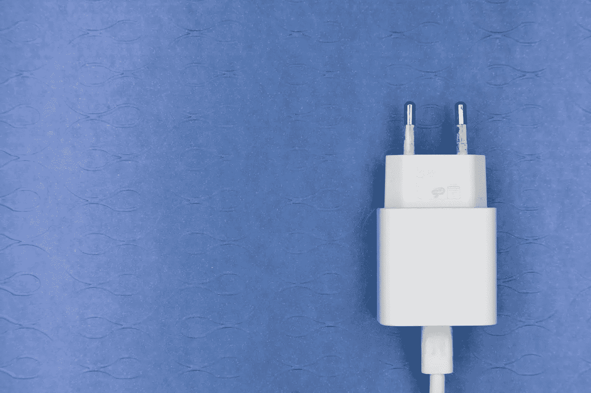

# 在 Swift 中实施适配器设计模式

> 原文：<https://betterprogramming.pub/the-adapter-design-pattern-in-swift-59ae3f2289a1>

## 让我们使用 Swift 中的一个真实例子来讨论适配器设计模式

马库斯·温克勒在 [Unsplash](https://unsplash.com/s/photos/adapter?utm_source=unsplash&utm_medium=referral&utm_content=creditCopyText) 上的照片

适配器是一种结构设计模式，允许不兼容的类或结构一起工作。

通常在我们希望将外部类/结构或第三方库集成到我们的代码中，并且它们的接口与我们当前在应用程序中使用的接口不匹配时使用。

让我们看看适配器实现的通用结构:

适配器实现由三个主要参与者组成:

**目标接口(协议):**定义客户端代码在我们的应用程序中使用的接口。我们使用适配器模式使现有的类/结构与我们的目标接口兼容。

**Adaptee:** 定义需要适配以兼容目标接口的类型。

**适配器:**负责将被适配器类型适配到目标接口。这可以使用适配器类型(如上面的代码所示实现的类或结构)或利用 Swift 扩展来实现(我们将在最后一节研究这种方法)。

## 真实世界的例子

假设我们的应用程序中目前有以下界面，其主要目的是呈现一个进度 HUD:

它在我们的应用中被广泛使用，就像这样:

然后，我们被分配了一项任务，我们需要开始使用 [PKHUD](https://github.com/pkluz/PKHUD) 进行我们所有的 HUD 演示。鉴于我们的大多数屏幕目前都将 HUDPresenter 作为一种依赖来使用，我们希望继续使用它。因此，这是使用适配器模式使 PKHUD 适应我们的 HUDPresenter 协议的好时机:

这里的目标是`HUDPresenter`协议。被适配者应该是`PKHUD`。而`PKHUDPresenter`类将是适配器。

你可能会问:为什么我们不直接用 PKHUD 的实例替换 HUDPresenter 呢？有几个原因:

1.  如果将来我们想用另一个 HUD 第三方库替换 PKHUD，我们需要用新库更新每个使用 PKHUD 的视图控制器。这太容易出错，我们的代码会变得不太容易维护(UI 依赖关系的改变会触发我们代码库中的大量更新)。
2.  我们将违反[开闭原则](http://blog.cleancoder.com/uncle-bob/2014/05/12/TheOpenClosedPrinciple.html)，该原则规定类应该对扩展开放，但对修改关闭。我们应该能够扩展视图控制器的行为，而不需要修改它们的源代码。
3.  我们将违反[依赖倒置原则](https://stackify.com/dependency-inversion-principle/)，该原则声明我们应该依赖抽象(Swift 中的协议)而不是具体类型(Swift 中的值或引用类型)。

## 快速扩展方法

让专用的结构/类作为适配器工作的另一种方法是扩展 Adaptee 以符合我们的目标接口协议。

回到上面的实际例子，我们采用这种方法的解决方案应该是这样的:

使用扩展方法，我们不需要为适配器创建额外的结构/类。

这种方法的一个缺点是，在将 PKHUD 依赖项注入视图控制器时，您需要导入它。如果您的依赖项是以集中的方式创建和注入的，那么这个缺点可以被最小化。

就是这样！我希望这个适配器模式的真实用例对您和您未来的项目有用。