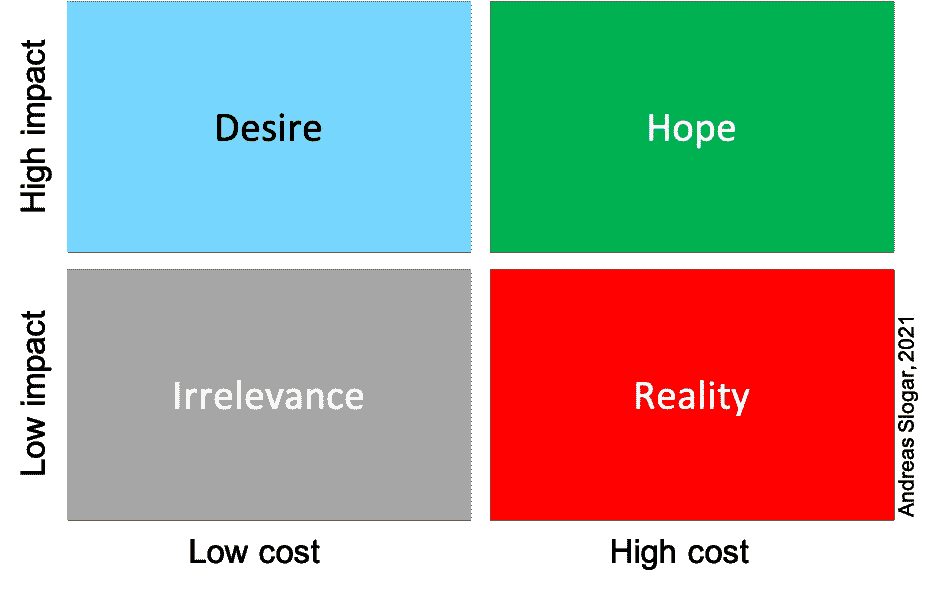

# 敏捷思维的错误#3:快速取胜

> 原文：<https://betterprogramming.pub/the-agile-thinking-mistakes-3-quick-wins-792669b95f41>

## 急功近利通常是以可持续的变化为代价的，并且对任何敏捷转型都是一种威胁

图片:[杰森·登特——Unsplash](https://unsplash.com/photos/WNVGLwGMCAg?utm_source=unsplash&utm_medium=referral&utm_content=creditShareLink)

变革管理专家建议关注速赢，以确保变革过程的成功。但是这些快速的胜利通常是以真正的改变为代价的。

## 结果成瘾

更快、更远、更高、更便宜！即使经济和社会话语中的思维似乎在逐渐变化:日常业务的主要特征是实现既定目标。为了创造成果和利润，需要达到生产率目标。

然而，创新和变革的能力是数字时代的不利因素。因此，新产品和服务必须在更短的周期内推向市场。

一些公司试图通过优化现有程序来实现这一目标。越来越多的其他公司正试图在自组织团队中建立一种全新的合作和交流模式，这种团队可以在没有层级控制负担的情况下工作。

这种方法的改变自然意味着员工必须学习和实践新的方法、启发和知识。这可能会暂时对生产率和效率产生负面影响。此外，这一试验也带来了风险，即变革可能不会带来预期的积极效果:如果员工感到不安全，或者在建立新的实践中没有得到足够的大力支持；如果管理层觉得变革威胁到他们的地位和影响力。这些因素对公司的经营活动有负面影响。

一次又一次，你读到失败的战略项目。据《福布斯》报道，变革管理项目的成功率只有 30 %左右。

急功近利的欲望，所谓的速赢，似乎是可以理解的。毕竟，作为一名董事会成员或公司经理，你需要证据，或者至少是事情正在发生变化的初步迹象。取得了进展。有些事情会改变。员工们也加入进来了。但是，对速赢的需求和希望适合作为这种成就的指标吗？

## 获胜类型

要做到这一点，我们先来看看我们可以描述的成功类型，以确定进步或变化的证据！

经理和员工以某种方式感知组织中取得的绝大多数成果:看起来他们付出了很大努力，但影响很小。代表了大多数公司的运营“现实”，并激发了对更敏捷、更高效、更有创造力、[……]*(请在括号中填入适当的形容词)*组织的基本渴望。

无关象限象征着那些我们也可以称之为“时间消耗者”的结果。它们会分散我们的注意力，造成压力，因为它们几乎没有效果。然而，他们必须做:一个必须填写的表格，旅行费用，更正，申报，提交，请求，时间记录，等等。

总的来说，我们希望我们的投资，无论是生命、精力还是金钱，也能产生适当的高影响力，尤其是在付出大量努力的情况下。这种努力应该为公司带来回报，增加竞争力，并确保就业。

然而，所有公司的欲望都指向“低垂的果实”。高效率得到了低努力的回报。这些恰恰是速赢，它们依赖于一种新的合作形式将增加它们的期望。

## 以真正的胜利为代价的快速胜利

著名的变革管理专家认为速赢是必要的。只有他们才能在持续的变革过程中给予或保持员工和经理的信心。我个人当然能理解这种想法。然而，在我自己 30 年的职业生涯中，不幸的是，我从未能够观察到这种现象——尽管我能够观察、体验或负责大约 20 个重组项目和变革管理“实验”。我的个人经历当然不代表经验证据，但它们仍然是我的经历。在我的专业领域，我经常注意到一件事:快速的胜利是以真正的胜利为代价的。

这在以下现象中变得明显:

*   营销虚张声势:已经存在的结果被当作速赢销售
*   分期死亡:为了满足管理期望的压力，结果被设计成速赢。
*   波将金村庄:速赢建筑就像门面，希望真正的结果很快实现。

这些“临时解决方案”和“善意的谎言”的致命效果是显而易见的。所有员工迟早都会认清那种骗局。尽管人们普遍怀疑员工的平均智力:他们都比经理们愿意相信的要聪明。他们认出了虚张声势——不管装饰得多么漂亮的幻灯片。涂了口红的猪还是猪。

这意味着这种“猪赢”的腐蚀效应导致了整个变更项目的高风险抵押。因为后来出现的真正的胜利会带来一定的疑问:它们是真的吗？或许他们也在假装一些不存在的东西？

## 存在而不是出现

正如约翰·沃尔夫冈·冯·歌德所写:“每个人都想成为什么，没有人想成为什么。”急功近利的冲动表明，个人(主要是利益相关者和权力中心)的快速幸福比公司的持续成功更重要。这往往是“速赢”或“假赢”发生的真正原因。

绝大多数情况下，中层管理人员会受到上级的激励，去实现快速成功。或者他们觉得有义务确保他们，因为他们想证明他们作为管理者的个人效率和表现。这些行为模式的原因主要可以追溯到各自公司中的恐惧气氛:心理安全感非常低，尤其是在那些产生巨大压力以实现速赢的公司中。

## 创造连续的成功流——连续谱

公司的变革过程是复杂的。他们的路线是不可预测的。它们受到意外的影响，即动态影响，这种影响只在实际事件中出现。变化是无法预先计算的，无论是在时间上，还是在胜率上。因此，也不可能指定变更项目的完成日期。它不是一个项目，而是一个过程。在最好的情况下，它应该永远不会完成。改变的能力是一种随着时间的推移不断暴露于新的影响和因素的能力。不能将变更功能与目标照片中可以捕捉到的最终状态相混淆。

相反，它是一种状态，在这种状态下，一个组织从专注于产生预定义的结果，或者间歇性地盯着快速的胜利，转移到确保必要的流动，以产生迭代实现的连续的增量结果。

只有这样，努力和辛劳才能成为不言而喻的连续谱。