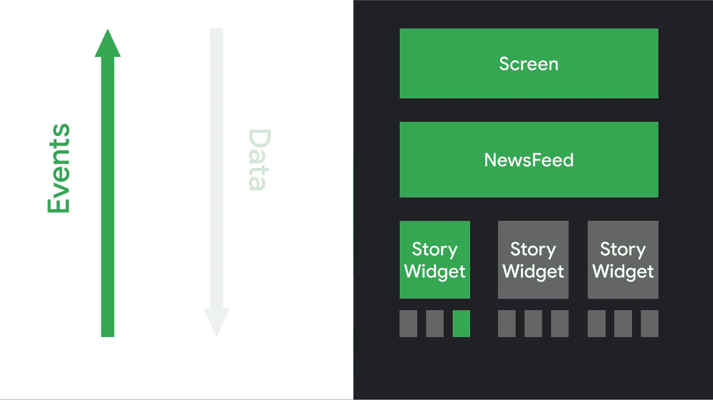
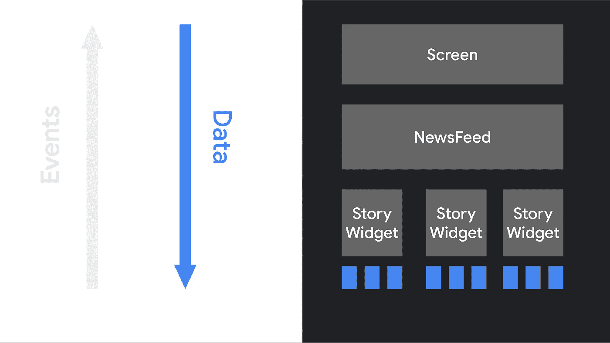

# Jetpack 组件中的全新状态

> 原文：<https://betterprogramming.pub/the-all-new-state-in-jetpack-compose-78b524cc346>

## 了解如何在 Compose 中使用 LiveData、observeAsState 和 MutableState

Gert Boers 在 [Unsplash](https://unsplash.com?utm_source=medium&utm_medium=referral) 上拍摄的照片。

在本文中，我们将学习什么是状态以及它如何在 [Jetpack Compose](https://developer.android.com/jetpack/compose) 中工作。在这样做的同时，我们将学习一些有趣的东西，比如`remember`、`LiveData`和`observeAsState`，以及特定于 Compose 的`MutableState`概念。

*注意:Jetpack Compose 最近已转移到测试版。这意味着 API 结构将不再有任何剧烈的变化。因此，这将是学习如何使用下一代 UI 套件进行 Android 开发的大好时机。Jetpack Compose 中的小部件是对状态作出反应的，所以请享受这篇文章。*

*需要安装 Android Studio Canary，北极狐(2020 . 3 . 1)***才能使用 Jetpack 缀 Beta。**

# *先决条件*

*在进一步学习之前，您必须具备如何使用 Jetpack Compose 的基本知识。如果你是作曲新手，我强烈推荐阅读以下文章:*

*   *[“Jetpack 合成组件(第一部分)”](/jetpack-compose-components-part-1-a80717dbfb59)*
*   *[“在 JetPack Compose 中构建 Android 布局”](/build-android-layouts-in-jetpack-compose-bda2e0837f5e)*
*   *[“Android 版 Jetpack Compose 中的主题化”](/theming-in-jetpack-compose-for-android-667d42b8279c)*
*   *[“在 Android 中使用 Jetpack 撰写导航”](/navigation-with-jetpack-compose-in-android-ab84d0984ade)*

# *介绍*

*在传统的 Android 开发方法中，我们通常编写代码来查找视图层次结构中的视图，并使用适当的函数来更新它们，例如`setText`、`setImageResource`、`View.GONE`等等。*

*在这种方法中，我们需要根据用户交互、`ViewModel`中发生的事件或者与系统相关的事件来手动更新 UI 的小部件。这种手动处理会增加出错的几率。*

*在 Jetpack Compose 中，我们以声明的方式使用一组可组合的函数来构建 UI。如果您不熟悉 Jetpack Compose，请在继续之前阅读以下文章(并确保使用更新版本的 Jetpack Compose 库):*

* [## jetpack Compose——一种在 Android 中创建材质界面的简单新方法

### 了解如何创建没有任何 XML 文件的用户界面

better 编程. pub](/jetpack-compose-a-new-and-simple-way-to-create-material-ui-in-android-f49c6fcb448b) 

与传统方法不同，Jetpack Compose 小部件相对来说是无状态的，不公开 setter 或 getter 函数。推荐的方法是维护高级可组合函数中的所有对象，并通过将它们作为参数传递给相同的可组合函数来更新 UI。

基本上，您可以像`ViewModel`一样维护架构组件中的状态，并将它们作为参数传递给可组合的函数。有了这种方法，我们不再需要做任何手工工作。当状态改变时，组件负责更新 UI。

在 Jetpack Compose 中，理想情况下，数据或状态应该从高级功能流向低级功能，而事件的触发则相反。看看这些图片:

来源:[安卓开发者](https://developer.android.com/jetpack/compose/mental-model)

来源:[安卓开发者](https://developer.android.com/jetpack/compose/mental-model)* 

# *带有文本字段的简单状态示例*

*让我们在 Jetpack Compose 中声明一个简单的`TextField` 。如果你是作曲新手，想知道什么是`TextField`，那么答案很简单。`TextField` 是构成框架中的一个`EditText` 。看一下代码:*

*现在，如果您运行应用程序，您将看到一个用户可以输入的`TextField`。但是，如果您尝试键入文本，它将不会反映在用户界面中。这是因为`TextField` 不会自己更新。它仅在其值参数改变时更新。*

*下一个问题是什么时候改变 value 参数。无论何时给用户输入都很简单。我们可以从`onValueChange` 参数监控输入。总而言之，我们需要维护一个代表`TextField` 状态的值，然后在`onValueChange` lambda 中更新那个状态。看一下代码:*

*作为对代码的高级解释，我们可以说我们正在维护一个状态(`name`)并用它来表示`TextField`中的文本。在`onValueChange`函数中，我们正在更新状态，这样当用户键入任何文本时，它都会在`TextField`中更新。*

*现在你已经理解了基本的类比，让我们更深入地挖掘一下。代码中有一些新概念，比如`remember`和`mutableStateOf`。*

## *纪念*

*`remember`让您即使在重新排版时也能记住状态。基本上，它在可组合函数的重组过程中维护一个状态。要了解更多信息，请阅读以下文章:*

* [## Jetpack 合成组件(第 2 部分)

### 查看图标、图像、记忆、间隔、单选按钮、加载器、开关和复选框以及滑块

better 编程. pub](/jetpack-compose-components-part-2-2b3eb135d294) 

## 什么是重组？

每当一个状态被更新时，基于该状态的可组合函数会在必要时用新的参数自动调用。这叫做重组。

我们以上面的代码为例。当用户与`TextField` 交互并改变文本时，我们正在更新状态。这导致`simpleTextfield` 可组合函数的重组。

我们将在文章的后面讨论`mutableStateOf` 。* 

# *状态提升*

*因此，使用状态使 UI 具有反应性比我们在每个场景中更新小部件的传统方法更加灵活。但是管理单个可组合对象内部的状态使得测试或重用可组合函数变得更加困难。*

*解决方法是状态提升。状态提升背后的基本类比是将所有状态变量移动到顶级可组合函数，并根据需求将它们作为参数传递给每个可组合函数。*

*如果你熟悉 Android 开发中的依赖注入，我们在构造函数中传递所需的依赖，状态托管与此类似。我们将状态作为高级组件来维护，并将它们作为参数注入到所需的组件中。*

*就拿上面的例子来说吧。`simpleTextfield`是`SimpleScreen`中的一个可组合函数，而`SimpleScreen`是主要的可组合函数，代表整个屏幕的所有内容。因此，为了便于重用和测试`simpleTextfield`可组合组件，我们可以将名称状态从`simpleTextfield`移到`SimpleScreen`，并将其作为参数传递。看一看:*

*当我们将状态值作为参数传递时，我们还需要传递 lambda 表达式来更新状态，因为默认情况下参数是值，这意味着它们不能被更新。*

# *具有视图模型的组件*

*我们还可以做得更好。我在五年的 Android 生涯中学到的一点就是隔离关注点，也就是俗称的关注点分离。*

*架构和`ViewModels`主要用于 Android 开发，以分离关注点并在模块间保持适当的层次结构。为了使我们的状态和数据在配置更改后仍然存在，我们可以将状态移到`ViewModels`中，并从顶层的 Compose 函数中观察它们。让我们在已经使用过的`Simplescreen` 例子中实现这个模式:*

*我们只是将状态转移到了`ViewModel`，并在`ViewModel`中加入了 lambda 表达式来更新状态，这样所有需要这些数据的可组合函数都可以通过`ViewModel`使用它们。在这种情况下，数据可以在配置更改后继续存在，并且您可以在一个地方维护它们。*

*这里，我们使用了两个新东西:`LiveData` 和`observeAsState`。*

## *LiveData*

*简单来说，`LiveData`是一个可观察的数据容器类，这意味着`LiveData`可以保存一组可以从其他 Android 组件(如`Activities`、`Fragments`和`Services`)中观察到的数据。要了解更多关于`LiveData`的信息，请阅读以下文章:*

* [## 探索 LiveData 和 Kotlin 流

### 何时何地使用 LiveData 和 Kotlin Flow

medium.com](https://medium.com/android-dev-hacks/exploring-livedata-and-kotlin-flow-7c8d8e706324) 

## 观察状态

这会将`LiveData`观察为 Compose 中的一个状态，因此每次在`LiveData`中发布一个新值时，它都会更新状态。这将导致重新组合以更新 UI。* 

# *可变状态*

*现在是时候了解一下`mutableState` *了。*在上一节中，我们使用`LiveData`从`ViewModel`发出数据。Compose 提供了一个名为`mutableState`的新概念，通过它我们可以实现与 LiveData 相同的功能。*

## *什么是可变状态？*

**"在执行* `*Composable*` *函数期间，读取到* `*value*` *属性的可变值持有者，当前的* `*RecomposeScope*` *将订阅该值的变化。当* `*value*` *属性被写入并更改时，将会安排对任何已订阅的* `*RecomposeScopes*` *进行重组。如果使用相同的值对* `*value*` *进行写入，则不会安排任何重新编译。”——*[*安卓开发者*](https://developer.android.com/reference/kotlin/androidx/compose/runtime/MutableState?hl=he)*

*通过定义本身，我们可以了解它是如何工作的，以及在哪里使用它。基本上`mutableState`和 Compose 函数的关系类似于`LiveData`和 Android 组件的关系。*

*现在我们的目标是用`mutableState`替换`ViewModel`中`LiveData`的用法。看一看:*

*有了`mutableState`，我们可以减少样板代码，使代码更加简洁。*

# *奖金*

*要了解有关 Jetpack Compose 的更多信息，请查看以下文章:*

*   *[“面向 Android 的 Jetpack 合成中的主题化”](/theming-in-jetpack-compose-for-android-667d42b8279c)*
*   *[“Jetpack 撰写中的导航”](/navigation-with-jetpack-compose-in-android-ab84d0984ade)*
*   *[“使用服务器驱动的用户界面构建 JetPack”](https://medium.com/android-dev-hacks/jetpack-compose-with-server-driven-ui-396a19f0a661)*

*目前就这些。希望你学到了有用的东西。感谢阅读。*