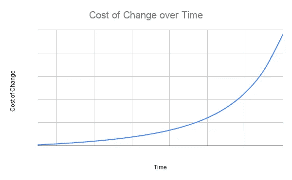
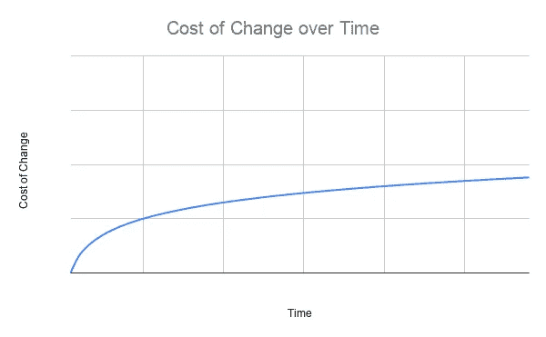

# 剖析一个好的用户故事

> 原文：<https://betterprogramming.pub/the-anatomy-of-a-good-user-story-6d8ebc0fa6d3>

## 以及它如何帮助你找到你的 MVP

与 Raj 在 [Unsplash](https://unsplash.com?utm_source=medium&utm_medium=referral) 上的[公路旅行照片](https://unsplash.com/@roadtripwithraj?utm_source=medium&utm_medium=referral)

# 什么是用户故事？

简而言之，用户故事是由产品所有者代表最终用户编写的新特性请求。它作为什么，为什么，谁，但不是如何。它以一种既不规范也不模糊的方式抓住了需求。它描述的是问题而不是解决方案。

## 用户故事是什么样的？

让我们看一个例子。您的产品负责人告诉您为用户建立一种保存他们的结账信息的方法。这就是你得到的所有描述，但是你很确定你知道它的意思——让用户保存他们的购物篮的内容以备后用。

您花了几天时间构建和测试该特性，并将其交付给产品负责人——却发现根本不是那么回事。用户希望能够使用相同的卡详细信息和交付地址结账，而不必每次都重新输入。

一个写得好的用户故事会消除这方面的模糊性:

> **作为一名**注册用户
> **，这样**我就不必在每次购物时重新输入我的卡的详细信息和地址
> **我希望**在我购物时可以选择保存我的卡的详细信息和送货地址

我们来分析一下。

## “谁”

用户故事的第一部分是一个简单的问题——谁想要这个特性？这乍一看似乎很明显，但有时并非如此。在我学会如何变得敏捷(故意大写 A)之前，我记得一个特定的项目，我用特性填充它，因为我认为它们会使它成为一个更好的产品。其中一些功能是有用的，但很多功能只是我认为它需要的或认为会很酷的东西。一旦应用上线，许多功能并没有真正使用，因为我没有考虑我的用户。问“谁？”迫使你把用户放在第一位。

## “为什么”

有人会把这一条写到最后。其实大部分人都是这样的。但是我认为用户故事的“为什么”比“是什么”更重要再次，这迫使你挑战你的假设。它要求你在开始考虑解决方案之前描述一下问题。

通常在技术领域，我们会模仿我们所知道的。以下面的用户故事为例:

> **作为一个**博客作者
> **我想要**一个按钮来保存我当前的草稿
> **以便**我以后可以继续我的故事

这个故事的顺序暗示了我在阐述问题之前就已经考虑了解决方案。答案不应该在问题之前，否则你不太可能考虑更好的答案。“为什么”不应该成为“什么”的理由——“什么”应该是对“为什么”的回应这种差别很微妙，但也许可以通过下面的修改来证明:

> **作为一名**博客作者
> **以便**我可以稍后继续我的故事
> **我希望**我当前的草稿在我打字时保存

通过将解决方案放在最后，我们更有可能挑战最初的想法，并想到更好的东西。这也是合作写故事的一个很好的理由。

## “什么”

这是故事中最不重要的部分，但这并不是说它不重要。也许我真正的意思是“一旦你知道了问题，那么任何解决问题的方案都应该交付价值。”

这通常是人们讲述的故事的第一部分，这就是为什么我们最终会有像上面这样的过度规定性的故事。“我想要一个保存按钮”没有考虑到对终端用户来说有一个更简单的解决方案。一个更复杂的例子可能是在协作文档编辑中。回想一下谷歌文档之类的东西出现之前的日子。如果您当时正在编写文档编辑器，您可能会看到类似这样的用户故事:

> **作为**文档作者
> **以便**其他人能够为我的工作做出贡献
> **我希望**任何作者都能够锁定文档进行编辑

这是一个说明性的故事，因为它给出了问题的具体解决方案。但是因为故事包括“谁”，更重要的是“为什么”，开发人员可以向产品负责人提出以下建议:

> 开发者:“我们让两个人同时编辑文档可以吗？”
> 产品负责人:“你能做到吗？”
> 开发者:“耶”
> 产品负责人:*头脑爆炸*

有时候，开发人员是最适合告诉用户什么是可能的，这有助于克服保守的功能需求，将边界推近一点。也就是说，用户很可能没有被可能性的知识所束缚，会要求开发人员不会想到的东西，从而以不同的方式突破界限。

这个推理本身就是为什么开发者和用户之间的合作对创新如此重要的最重要的例子。这也是用一种一致的、通用的语言来编写用户故事的另一个重要原因。

# 验收准则

虽然用户故事本身在细节上可能相当宽松，允许开发人员在交付特性时有一些回旋的余地，但接受标准往往更加明确。这里有一个例子，使用上面的故事:

> **假设**我当前正在编辑文档 A
> **，当**另一个用户开始编辑文档 A
> **时，那么**我应该得到通知，其他用户已经开始编辑，而不会中断我的工作流

这是故事中可能出现的几个验收标准之一，这些验收标准共同决定了故事何时完成。添加多少验收标准取决于产品所有者和最终用户。

让我们仔细分析一下验收标准。

## 考虑到

每个验收标准都需要一个前提条件，描述这些标准在什么情况下适用。这可能非常重要，因为在上面的例子中如果没有它，开发人员可能会将该特性解释为“当其他人开始编辑他们的文档时，向作者发送电子邮件”事实上，这个特性只是为了让作者知道其他人正在同时进行修改。我只关心当我也在的时候房间里还有谁。

我经常看到这样的事情:

> **假设**多个用户可以编辑一个文档
> **当**多个用户编辑一个文档
> **时，那么**应该通知他们另一个用户已经开始编辑，而不会中断他们的工作流程

这是同样的标准，但是“给定”考虑不周，措辞也不太清楚。线索通常在“给定”和“何时”之间的清晰重复中这意味着无论是谁编写了验收标准，都不理解“给定”的目的。

简而言之,“给定”应描述一个必须为真的条件，以便考虑该验收标准。如果“假设”只是“假设这个故事已经正确实现”的另一种说法，那你就没有抓住要点。

有多个条件也是完全可以接受的，就像这样:

> **假设**我当前正在编辑文档 A
> **和**另一个用户也正在编辑文档 A
> **当**另一个用户做出更改
> **然后**我应该立即看到更改

这允许我捕捉更复杂的前提条件，尽管要小心不要有太多这样的前提条件。我过去写了一些真正的 scorchers，用了比我应该做的更多的“givens ”,这使得故事更难理解。有时候也可以总结一下，或者保留逻辑假设。以下是一个包含太多条件的验收标准示例:

> **假设**产品 A 存在
> **并且**产品 A 的价格为 10
> **当**我的购物篮中有 2 件产品 A
> **那么**我的购物篮总数应为 20

在这种情况下，可以假设产品 A 存在，因为否则，它就没有价格。

## 当...的时候

这形成了标准生效的触发点。同样，如果上述标准中没有这一点，可能就不清楚要问什么。开发人员可能认为“不中断我的工作流”意味着“当我完成时，告诉我还有谁在编辑。”通过包括“何时”，我们更清楚地表明通知应该是即时的。

“何时”是验收标准的一部分，但通常写得不好。让我们以电子商务为例:

> **假设**我的购物篮中有 2 件产品 A
> **并且**产品 A 的价格为 10
> **当**我查看我的购物篮
> **时，那么**我的购物篮总数应为 20

大声读出来，如果你不看的话，听起来你的篮子总数不一定是 20。这不是薛定谔的篮子——当你加入第二个单位的产品 a 时，它应该是 20。

这通常很容易发现，因为您最终会有许多接受标准共享同一个“何时”另一个问题是，触发点不是一个特定的时间点。为了正确改写，它应该是:

> **假设**我的购物篮总数目前是 10
> **并且**产品 A 的价格是 10
> **当**我将 1 单位的产品 A 添加到我的购物篮
> **中时，那么**我的购物篮总数应该是 20

这使得应该在什么点上执行变更变得更加清楚。

## 然后

这部分类似于故事描述的“我要”。这通常是最容易写的部分，因为这是人们在写下一系列非结构化的接受标准时所想的:

*   它应该显示正确的价格
*   它应该只为每种产品显示一行
*   每一行应该显示篮子里有多少单位

如果你理解领域，这些就不会太模糊，但是当开发人员开始开发一个特性时，他们并不总是有足够的时间去完全理解领域。这就是为什么他们依赖清晰的用户故事。

我们写“给定”和“何时”而不是一长串“那么”的原因是，它们给开发者提供了行为应该如何工作的清晰例子。

在故事描述中,“那么”比“我想要”更具规定性一点通常是可以的。毕竟，这些应该是相当具体的例子。

## 我应该写几个验收标准？

如果你想听我的建议(既然你正在读这篇文章，我想你会的)，那么就把这个列表写得尽可能的短。这并不意味着你不应该计划其他的验收标准，但是要小心范围蔓延。你想尽快让用户看到你的功能:a)交付价值，b)提供反馈。

为了说明这一点，让我们从我们的协作案例中考虑以下验收标准:

> **假设**另一个用户做了与我的
> 相冲突的更改**当**文档试图自动保存
> **时，那么**我应该看到一个更改摘要，并被询问保留哪个

乍一看，这感觉像是原始功能的一部分。但是要问的问题是:如果没有这些，这个特性还能传递价值吗？在这种情况下，答案可能是肯定的。也许这款应用的第一个版本可以简单地阻止用户同时编辑文档的同一行，或者它甚至可以自动选择保留哪个版本的冲突更改。

这可能不是你最终想要的行为，但是直到你把你的应用程序放在用户面前，你实际上并不知道任何给定的特性有多有价值。

这意味着你应该努力思考一个最低限度可行的产品是由什么组成的，并把其他一切都推到一个新的用户故事中去。这样做的好处是，每个新特性都必须回答“为什么？”再说一次，而不是因为方便而被包括在内。

# 最小可行产品

软件开发中最难教的事情之一是如何考虑最小可行产品。多年来，开发人员一直被告知，一旦项目被部署到生产环境中，变更的成本就会急剧上升。因此，我们已经习惯于尽早找出问题并解决它们。现在花两个小时处理一个边缘案例，如果用户以后需要它，将会节省我们两天的时间。传统的变革成本曲线如下所示:

但是如果我们能让它看起来更像这样呢？

如果稍后交付特性的成本没有指数级地高于现在交付的成本，那么你还会做出同样的决定吗？这是[极限编程](https://en.wikipedia.org/wiki/Extreme_programming)试图回答的问题之一——通过拉平变更成本曲线，目标变成尽可能推迟决策。

这意味着，如果我们错误地认为需要这种边缘情况(我们经常这样)，那么通过将一个特性推迟到明天，我们可以避免浪费时间。这是基于这样一个前提:明天我们会比今天更清晰。因此，在上面的例子中，我们可能部署了协作特性的 MVP，却发现合并冲突极其罕见。在这种情况下，在一个复杂的不同特性上多花一天时间就浪费了。

如果我们真的需要这个特性，像持续集成、成对编程、测试驱动开发等好的实践。旨在最大限度地降低未来变革的成本。也许现在花了我们两个小时，但只是三个小时后。为了以后只节省一个小时，现在实施值得吗？通过在需要特性之前交付它们，您冒着增加不需要的代码库的复杂性的风险。

试图教会聪明的开发人员不要提前思考可能是一项艰巨的工作。谢天谢地，我没那么聪明，所以这对我来说很自然。