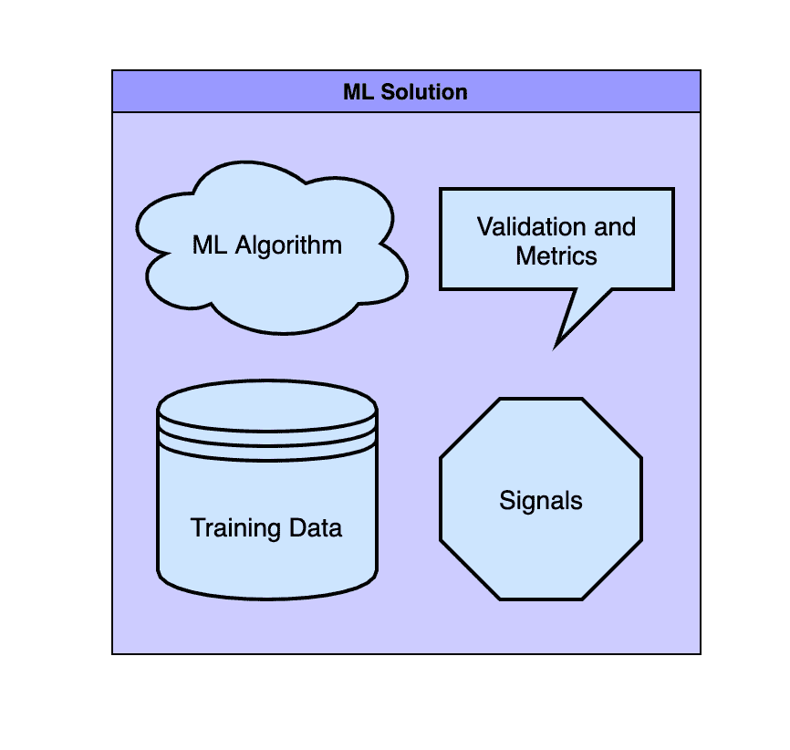
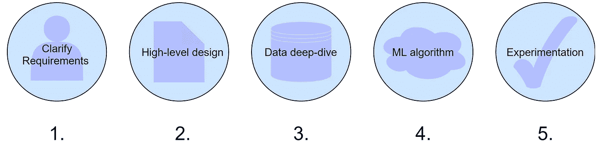

# 剖析一个机器学习系统设计面试问题

> 原文：<https://betterprogramming.pub/the-anatomy-of-a-machine-learning-system-design-interview-question-1d9a1a5d23e>

## 分解问题的结构，这样你就能很好地回答它

图片来源:作者

由 Educative 联合创始人 Fahim ul Haq 撰写。

随着越来越多的行业采用 ML 系统，机器学习系统设计面试变得越来越常见。虽然在某些方面类似于一般的系统设计面试，但 ML 面试的不同之处足以让最有经验的开发人员出错。最常见的问题是被大多数 ML 解决方案的大规模所困住或吓倒。

今天，我们将为您的下一次 ML 系统设计面试做准备，具体包括它们的独特性、您应该做的准备工作，以及您应该用来解决任何 ML 问题的五个步骤。

**今天我们将讲述:**

*   ML 系统设计面试有什么不同
*   如何准备 ML 系统设计面试
*   解决任何 ML 系统设计问题的五个步骤
*   总结和资源

# ML 系统设计面试有什么不同

机器学习系统设计面试的一般设置类似于一般的 SDI。对于这两种情况，你都将被安排与面试官一起呆 45 到 60 分钟，并被要求思考一个项目的各个组成部分。

ML 访谈通常更关注宏观层面(如架构、推荐系统和可伸缩性)，避免对可用性和可靠性等主题进行更深入的设计讨论。

在 ML 面试中，你会被问到一些高层次的问题，关于你如何设置一个系统的每个组件(数据收集、ML 算法、信号)来处理繁重的工作负荷并快速适应。

对于机器学习 SDI，你需要解释你的程序如何获取数据并实现可伸缩性。

# 如何准备 ML 系统设计面试

ML 系统设计面试将测试你对两件事的了解:你对大规模 ML 系统背后的设置和设计选择的了解，以及你在应用 ML 概念时清晰表达的能力。

让我们看看三种方法来准备你的知识和表达。

# 了解常见的 ML 面试问题

准备这些问题最好的方法就是自己练习 ML SDI 题。现代 ML SDIs 中的 ML 面试问题只有几种类型。

**最常见的是:**的迭代

*   "创建一个 Twitter 风格的社交媒体源，向用户显示相关的帖子."
*   "建立一个推荐系统来推荐产品/服务."
*   "设计一个谷歌风格的搜索引擎，为用户量身定制搜索结果."
*   "建立一个向用户展示个性化广告的广告系统."
*   "设计一个 ML 系统来识别社会网络中的不良行为者."

在目标职位的描述中搜索你将使用的特定系统，并为面试研究类似的系统。对于没有明确倾向于任何问题类型的工作，关注媒体反馈和推荐系统，因为这是被问得最多的两个问题。

# 关注每个 ML 解决方案的 4 个部分

图片来源:作者

**每毫升溶液有四个主要部分:**

*   机器学习算法
*   培训用数据
*   信号(有时称为*特征*
*   验证和指标

对于**算法**，你会选择什么算法，为什么？深度学习，线性回归，随机森林？各有什么优缺点？根据您的系统需求，它们能实现什么？

对于**数据**，你会从哪里得到测试数据？你将从哪些数据点得出结论？您将处理多少个数据点？

对于**信号**，您的程序使用什么度量来确定相关数据？你会发信号强调数据的一个方面还是综合多个方面？确定数据相关性需要多长时间？

对于**指标**，您将跟踪哪些成功和项目学习指标？你如何衡量你的系统的成功？你将如何验证你的假设？

# 练习大声解释

许多受访者会学习概念和算法，但不会练习面试的口语部分。

在整个过程中练习大声解释你的系统架构。叙述你做的任何决定，简要解释你为什么做那个选择。这是一个很好的机会向面试官展示你的想法，而不仅仅是你所知道的。

此外，练习回答常见的试探性问题。面试官会要求你澄清项目中的任何决策点或不确定性。确保您可以在过程中的任何一点证明您所做的设计选择是正确的。

**一些常见的试探性问题有:**

*   这个项目在大规模下会有怎样的表现？
*   您将如何获取培训数据？
*   您将如何保持低延迟？

# 解决任何 ML 系统设计问题的 5 个步骤

ML SDI 面试通常有严格的时间限制，要么 45 分钟，要么 60 分钟，在开始和结束时有五分钟的介绍/总结时间。

所以一般来说，你需要在 35 到 50 分钟内完成你的 ML 项目的所有关键领域。重要的是要有一个如何起草系统的结构化计划，以确保你不偏离轨道。

接下来，我们将看看如何打破你的时间来 ace 任何 ML 问题。为了帮助理解这一过程，我们还将在 45 分钟的采访中通过一个 feed 类型的问题示例来演示每个步骤。

如果你增加每一步的时间，你可以将这些步骤应用到 60 分钟的面试中。

**我们的问题是:创建一个向用户显示个性化帖子的内容提要。**

## 第一步。阐明要求(5 分钟)

在前五分钟，我们将向面试官阐明我们的**系统目标**和**要求**。这些面试问题故意模糊，让你直接询问你需要的信息。你的澄清问题将有助于指导你的设计，并决定你的系统的最终目标。

**一些常见的澄清问题是:**

*   我们期望这个程序处理多少用户？
*   我们目前正在跟踪哪些指标？
*   我们想用这个系统达到什么目的？我们想要优化什么？
*   我们期望什么类型的输入？

**第一步。示例**

如果我们要澄清提要问题，我们会问:

*   这将是什么类型的饲料？纯文字？文字和图片？
*   我们预计会有多少用户？每个人每天发多少帖子？
*   我们的系统优化了什么指标？我们是希望每个职位有更多的参与，还是增加职位的数量？
*   我们有目标延迟吗？
*   我们的系统应用新知识的速度有多快？

## 第二步。概要设计(5 分钟)

在接下来的五分钟里，创建一个处理从输入到使用的数据的高级设计。直观地绘制图表，并连接所有相互作用的组件。面试官会在你建立的时候问一些试探性的问题，所以要留意那些暗示你缺少了什么的问题。

记住保持这种抽象:决定多少层，数据将如何进入系统，数据将如何被解析，以及您将如何决定相关数据。

确保明确提及您为可伸缩性或响应时间所做的任何选择。

**第二步。示例**

我们会写道，我们的训练数据来自我们当前的社交媒体平台。每次创建新帖子时，都会有新的实时数据进入系统，这些数据基于创建者的位置、创建者过去帖子的受欢迎程度以及关注该创建者的帐户。

我们将使用这些指标来确定一篇文章与用户的相关性。相关性将在应用程序启动时确定。我们的目标是提高每个帖子的参与度。

## 步骤 3:数据深度挖掘(10 分钟)

在接下来的十分钟里，深入解释你的数据。确保涵盖训练数据和实时数据。考虑数据在整个过程中需要如何转换。

ML 面试官在寻找懂得数据抽样重要性的候选人。你需要明确你从哪里获得训练数据，你将使用当前系统中的哪些数据点，以及你希望开始跟踪哪些数据。

这不同于一般的 SDI，在一般的 SDI 中，受访者只考虑数据进入程序流后会发生什么。

**对于训练数据，考虑:**

*   我将从什么来源获得培训数据？
*   我如何确保它是公正的？

**对于实时数据，考虑:**

*   我将在数据中使用什么信号？
*   为什么这个信号是相关的？
*   有没有什么情况下这个信号不能反映我想要的结果？
*   我的算法反应如何？会在十分钟或十小时内发生变化等。？
*   我的程序一次能处理多少数据？输入越多，性能越差吗？

**第三步。示例**

我们希望每个用户关注 300 个账户，每个账户平均每天发布三篇文章。我们将有三层数据评估，以在系统评估 1，000 篇帖子时保持较低的延迟。第一层根据帖子的受欢迎程度快速删除大部分帖子。

第二层使用位置数据根据位置来删帖。这是我们第二快的一层。第三层将是最长的，将使用追随者和被追随者之间的交叉接触数据来削减职位。

## 第四步。机器学习算法(10 分钟)

在接下来的十分钟里，向面试官详细说明你对机器学习算法的选择。每种算法处理某些任务的方式不同，面试官会希望你知道不同算法的优缺点。

如果你使用几种算法来处理规模，说明它们的结果将如何综合，以及你选择多种算法的原因。

请务必提及每种算法如何利用您的信号来创建一个有凝聚力的解决方案。同样的信号在一种算法中可能不如在另一种算法中有效。

**第四步。示例**

我们将使用前馈神经网络算法来预测相关性。这种算法与我们的创建者/用户交互信号配合得很好，因为它从非循环连接网络中形成预测。

## 第五步。实验(5 分钟)

在最后的五分钟里，假设你的系统将会完成什么。这一部分是对你的程序的一种总结，在这里你可以总结这些组件是如何一起实现某个目标的。

你的假设可能很宽泛，比如“按相关性排序的帖子会比按时间顺序排序的帖子获得更多的参与度”，也可能很具体，比如“添加位置信号会增加 0.5%的参与度。”

从这里开始，解释你如何测试这个假设。确保涵盖最初的离线评估以及如何在线评估。

*   你会使用哪些离线评估？
*   您需要多大的离线数据集？
*   在线时，如果有 bug 你会怎么做？
*   您将如何跟踪用户对变更的满意度？
*   你用评论或任何形式的帖子互动来计算参与度吗？

ML 工程师在日常工作中不断测试假设。对实验的关注会让你从其他申请者中脱颖而出，因为这表明你可以综合你的程序的功能，并拥有适合这份工作的正确心态。

**第五步。示例**

我们基于相关性的订阅源将提高用户参与度 0.5%。我们将首先使用编程的离线模型来模拟用户，并查看什么类型的帖子进入提要。

一旦我们上线，我们将使用关键字“更新”和“相关性”来跟踪帖子，以确定有效性。

# 5 步总结

第一步。阐明要求(5 分钟)

第二步。概要设计(5 分钟)

第三步。数据深度挖掘(10 分钟)

第四步。机器学习算法(10 分钟)

第五步。实验(5 分钟)

# 总结和资源

你现在已经具备了赢得下一次 ML 面试的所有条件。通过准备 ML 学习材料和一个定时的解决方案，你将使自己从那些还不熟悉这种新兴面试类型的人中脱颖而出。

面试愉快！