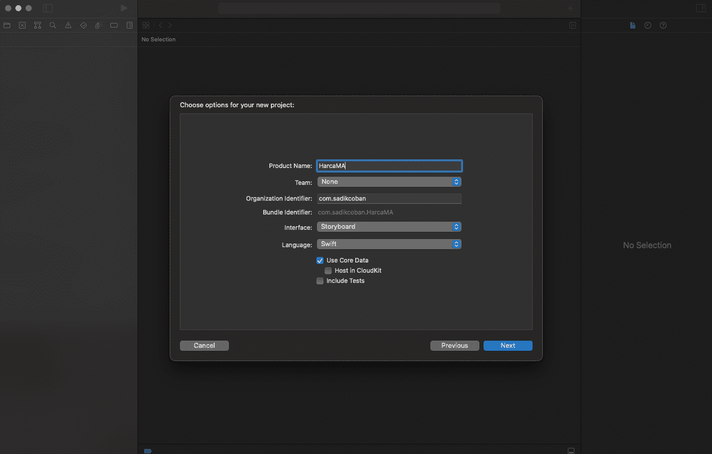
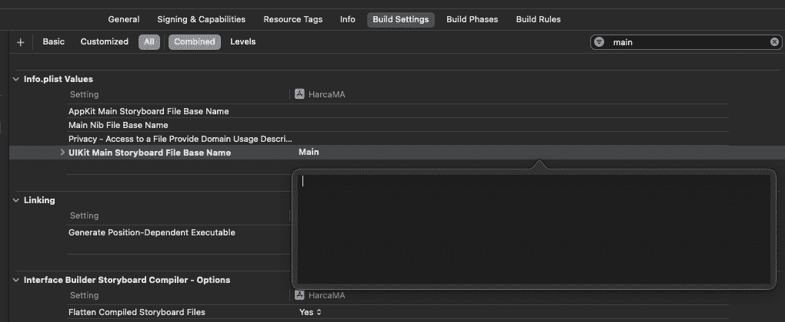
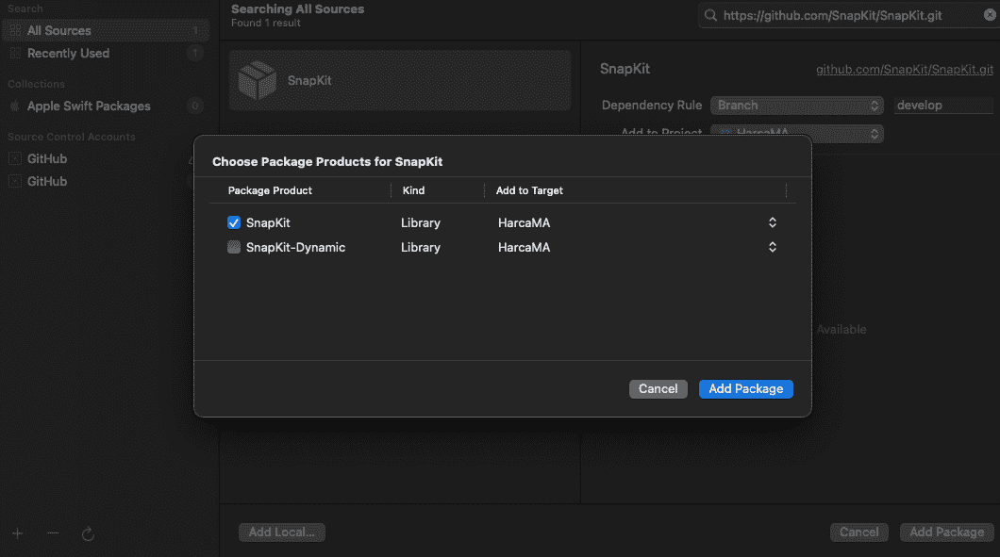
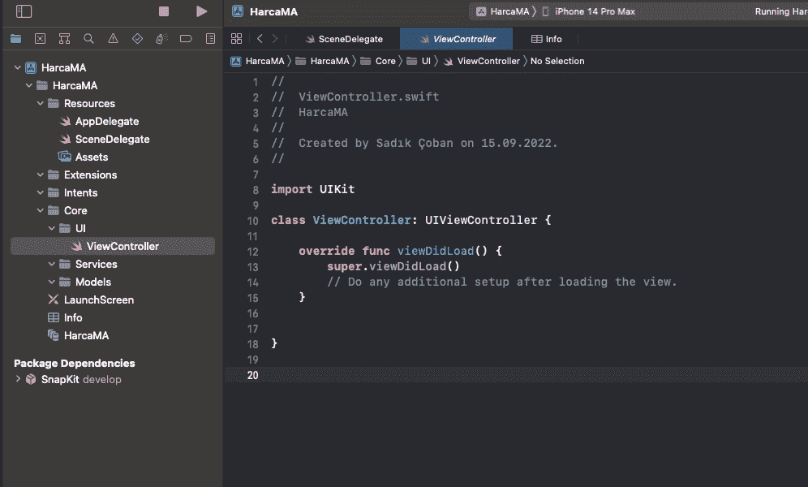
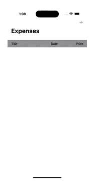
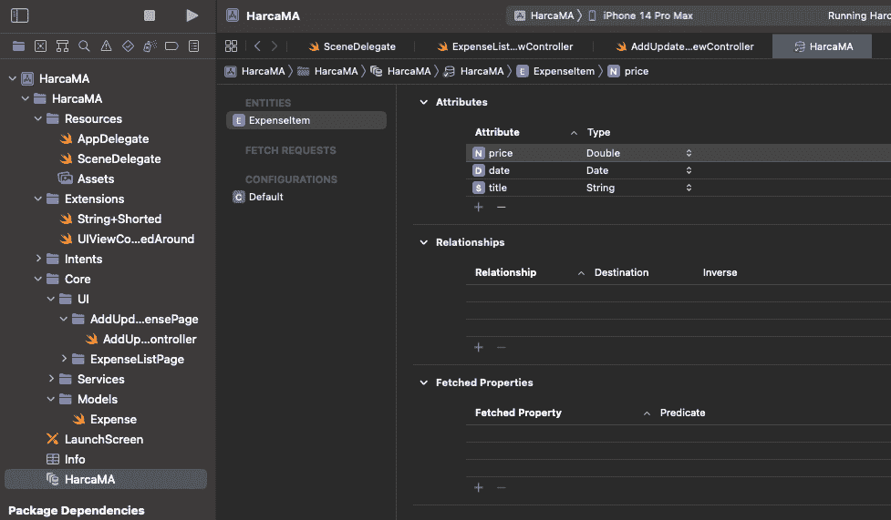
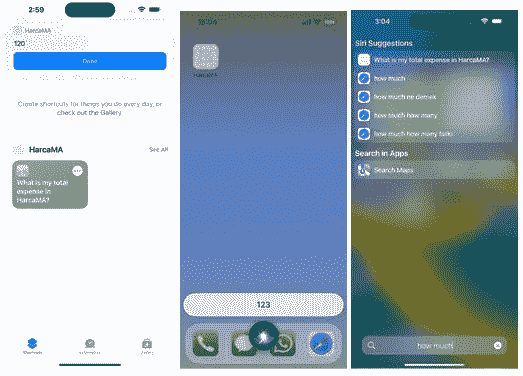
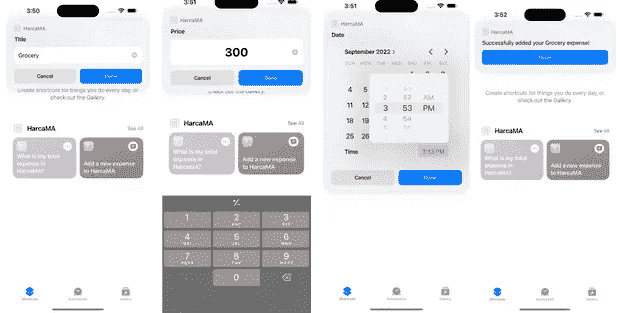

# 介绍 AppIntents 框架——一种将 App 功能集成到系统中的新方法

> 原文：<https://betterprogramming.pub/the-appintents-framework-a-new-way-to-hook-up-apps-functionality-to-the-system-96279feb4cce>

## 演示 AppIntents 框架的费用跟踪器应用程序


米格尔·托马斯在 [Unsplash](https://unsplash.com?utm_source=medium&utm_medium=referral) 上拍摄的照片

WWDC 一直是苹果每年最大的活动之一，因为世界上最大的技术公司向其客户、媒体和世界其他地方，更重要的是向开发者宣布其最新的软件和硬件产品，这些产品采用了尖端技术。

每个 iOS 开发者都会在这一天赶上苹果的最新产品，并通过整合苹果操作系统新版本发布的新功能来增加应用程序的价值。

随着 iOS 16 和 Xcode 14 的发布，我们现在可以在我们的 iPhones 和开发环境中完全访问 iOS 16 功能。

在这篇文章中，我们将深入探讨苹果在 iOS 16 中引入的一个很酷的功能，以增强我们的 iOS 应用程序并使其更加用户友好，这就是所谓的应用程序意图。

应用意向框架提供了一种编程方法，使系统服务可以访问您的应用的内容和功能。这些意图是可以在整个系统中使用的动作。应用程序意图使您的应用程序的功能在更多地方可用，包括快捷方式、Spotlight、焦点滤镜和 Siri，这为您的客户带来了巨大的好处。听起来很棒，对吧？那么我们来试着理解一下这些 App 意图的结构。

意图是你的应用程序向系统公开的单一功能。这项功能可以从您的应用程序中获取一些数据，例如找出下一次会议的时间和您的订单所在的位置，并将数据推送到您的应用程序，而无需在前台启动，例如向您的日历添加新事件。这些功能完全取决于你的应用程序的功能和你的创造力。

一个意向主要由三部分组成；

*   元数据(关于意图的信息，如快捷方式应用程序中显示的标题)。
*   参数(您的意图需要用户通过使用键盘、交互或 Siri 进行的输入)。
*   执行方法(在执行意图时负责运行主函数)。

应用程序的意图就像写几行代码集成到你的应用程序中一样简单。但是，如果您想要创建更复杂的特性，框架也可以让您这样做。您可以使用 Swift 为我们提供的所有功能来创建意图。不需要重构您的项目或一些自动代码生成步骤。

为了更好地可视化如何将应用程序意图添加到 iOS 项目中，我将创建一个名为 HarcaMA 的费用跟踪器应用程序。就其功能和用户界面而言，这款应用不会是世界上最好的，但它足以解释应用意图框架的力量。

在这个项目中，我将在使用 SnapKit 设计用户界面时以编程方式使用 UIKit，但同样值得注意的是，您也可以将应用程序意图应用于您的 SwiftUI 应用程序。

我们的应用程序将有三页。第一个是我们到目前为止所做的费用列表，第二个是添加新的费用，第三个是编辑当前的费用。我们还将有机会从申请中删除费用。所有这些费用都将存储在核心数据中。我将遵循 MVVM 的委托设计模式来创建这个应用程序。所以，让我们从从 Xcode 创建我们的应用程序开始。



选择 storyboard 界面，swift 作为语言，并选中“使用核心数据”选项，然后将项目保存在存储器中的某个位置。

正如我所说的，我们不会使用故事板来创建用户界面，我们也可以从项目导航器中删除`Main.storyboard`文件。并开始配置我们的项目。

```
func scene(_ scene: UIScene, willConnectTo session: UISceneSession, options connectionOptions: UIScene.ConnectionOptions) {

        guard let windowScene = (scene as? UIWindowScene) else { return }
        window = UIWindow(windowScene: windowScene)
        window?.rootViewController = UINavigationController(rootViewController: ViewController())
        window?.makeKeyAndVisible()
    }
```

转到`SceneDelegate`文件，用上面的代码替换`connectionOptions`函数的内容。

然后打开`Info.plist`文件，删除键为`UISceneStoryboardFile`值为`Main`的属性。

最后转到目标的构建设置，过滤`Main`的内容，并删除 UIKit 主故事板文件基本名称属性的值。



现在，我们安全地移除了故事板，并准备创建用户界面——在将 SnapKit 作为依赖项添加到我们的项目之后。

我将使用 Swift 包管理器，但你也可以使用 CocoaPods 或 Carthage。转到文件菜单，并从 Xcode 选项中选择添加包。搜索“[https://github.com/SnapKit/SnapKit.git](https://github.com/SnapKit/SnapKit.git)”，然后按添加包按钮。

在一小段时间后，它会询问您要在应用程序中包含的产品包。仅选择 SnapKit 就足以满足我们的目的。



现在你可以在项目导航器的`PackageDependencies`中看到 SnapKit。让我们继续为项目创建文件夹结构。



如上图所示，在开始开发之前，我创建了一些文件夹来组织我们的项目。现在，让我们看看第一页，它列出了我们在`tableview`中的花费。由于我们将使用一个`UITableView`，我认为从设计表格视图的单元格开始是一个好方法。

```
import UIKit
import SnapKit
class ExpenseListTableViewCell: UITableViewCell {
    static let identifier = "ExpenseListTableViewCell"

    var expense: Expense? {
        didSet {
            self.configure()
        }
    }

    private lazy var stackView: UIStackView = {
        let stackView = UIStackView()
        stackView.layoutMargins = UIEdgeInsets(top: 0, left: 20, bottom: 0, right: 20)
        stackView.isLayoutMarginsRelativeArrangement = true
        stackView.axis = .horizontal
        return stackView
    }()

    private lazy var tailStackView: UIStackView = {
        let stackView = UIStackView()
        stackView.spacing = 50
        return stackView
    }()

    private lazy var titleLabel: UILabel = {
        let label = UILabel()
        return label
    }()

    private lazy var dateLabel: UILabel = {
        let label = UILabel()
        label.textAlignment = .right
        return label
    }()

    private lazy var priceLabel: UILabel = {
        let label = UILabel()
        return label
    }()

    private func configure(){
        self.titleLabel.text = expense?.title.shorted(to: 15)
        self.dateLabel.text = expense?.formattedDate
        let price = expense?.price ?? 0
        self.priceLabel.text = "$ \(price)"
        setupConsts()
    }

    override init(style: UITableViewCell.CellStyle, reuseIdentifier: String?) {
        super.init(style: style, reuseIdentifier: reuseIdentifier)
    }

    required init?(coder: NSCoder) {
        fatalError("init(coder:) has not been implemented")
    }

    private func setupConsts(){
        tailStackView.addArrangedSubview(dateLabel)
        tailStackView.addArrangedSubview(priceLabel)
        priceLabel.snp.makeConstraints { $0.width.equalTo(70) }
        stackView.addArrangedSubview(titleLabel)
        stackView.addArrangedSubview(tailStackView)
        contentView.addSubview(stackView)
        stackView.snp.makeConstraints { $0.edges.equalToSuperview() }
    }
}
```

将上面的代码粘贴到一个名为`ExpenseListTableViewCell` .swift 的文件中。注意，我们有一个名为 expense 的属性，它代表一个`Expense`，也就是一个模型。当该费用被设置为用该属性的内容填充视图时，我们运行配置功能。让我们也将费用结构添加到`Models`文件夹中。

```
struct Expense {
    let title: String
    let date: Date
    let price: Double
    var formattedDate: String {
        let formatter = DateFormatter()
        formatter.dateFormat = "MM-dd HH:mm"
        return formatter.string(from: date)
    }
}
```

我们的`Expense`模型现在由三个存储的和一个计算的属性组成。

让我们将默认的`ViewController`重命名为`ExpenseListViewController`，并开始添加我们的表格视图。

```
class ExpenseListViewController: UIViewController {

    let viewModel: ExpenseListViewModel

    private lazy var tableView: UITableView = {
        let tableView = UITableView()
        return tableView
    }()

    init(context: NSManagedObjectContext) {
        self.viewModel = ExpenseListViewModel(context: context)
        super.init(nibName: nil, bundle: nil)
    }
    required init?(coder: NSCoder) {
        fatalError("init(coder:) has not been implemented")
    }
    override func viewDidLoad() {
        super.viewDidLoad()
        view.addSubview(tableView)
        tableView.delegate = self
        tableView.dataSource = self
        tableView.register(ExpenseListTableViewCell.self, forCellReuseIdentifier: ExpenseListTableViewCell.identifier)
        configureNavigationBar()
    }

    override func viewDidLayoutSubviews() {
        super.viewDidLayoutSubviews()
        tableView.frame = view.bounds
    }
    private func configureNavigationBar(){
        self.title = "Expenses"
        let titleTextAttrs = [NSAttributedString.Key.foregroundColor: UIColor.black]
        navigationController?.navigationBar.titleTextAttributes = titleTextAttrs
        navigationController?.navigationBar.prefersLargeTitles = true
        navigationItem.rightBarButtonItem = UIBarButtonItem(barButtonSystemItem: .add, target: self, action: #selector(didTapAddExpense))
    }
    @objc private func didTapAddExpense(){

    }
}extension ExpenseListViewController: UITableViewDelegate, UITableViewDataSource {

    func numberOfSections(in tableView: UITableView) -> Int {
        1
    }

    func tableView(_ tableView: UITableView, numberOfRowsInSection section: Int) -> Int {
        1
    }
    func tableView(_ tableView: UITableView, cellForRowAt indexPath: IndexPath) -> UITableViewCell {
        UITableViewCell()
    }
    func tableView(_ tableView: UITableView, viewForHeaderInSection section: Int) -> UIView? {
        nil
    }
    func tableView(_ tableView: UITableView, heightForRowAt indexPath: IndexPath) -> CGFloat {
        50
    }
    func tableView(_ tableView: UITableView, heightForHeaderInSection section: Int) -> CGFloat {
        40
    }
    func tableView(_ tableView: UITableView, didSelectRowAt indexPath: IndexPath) {

    }
}
```

将上面的代码粘贴到视图控制器中。在这里，我们创建表格视图，设置其约束，注册单元格，并通过添加加号按钮来配置我们的导航栏，以便稍后添加新的费用。

为了启动表视图数据源和委托功能，我们还将为上面的视图控制器创建一个扩展。

```
struct ExpenseListViewModel {

    var expenseList = [Expense]()
}
```

我们的视图模型目前还很基本，但是我们以后会改进它。现在让我们将一个视图模型实例添加到视图控制器中。并填充一些表视图委托函数，如下所示。

```
func tableView(_ tableView: UITableView, numberOfRowsInSection section: Int) -> Int {
        viewModel.expenseList.count
    } func tableView(_ tableView: UITableView, cellForRowAt indexPath: IndexPath) -> UITableViewCell {
        guard let cell = tableView.dequeueReusableCell(withIdentifier: ExpenseListTableViewCell.identifier, for: indexPath) as? ExpenseListTableViewCell else { return UITableViewCell() }
        cell.expense = viewModel.expenseList[indexPath.row]
        return cell
    } func tableView(_ tableView: UITableView, viewForHeaderInSection section: Int) -> UIView? {
        let stackView = UIStackView()
        stackView.axis = .horizontal
        stackView.backgroundColor = .systemGray
        stackView.layoutMargins = UIEdgeInsets(top: 0, left: 20, bottom: 0, right: 20)
        stackView.isLayoutMarginsRelativeArrangement = true
        let titleLabel = UILabel()
        titleLabel.text = "Title"
        let tailStackView = UIStackView()
        tailStackView.spacing = 100
        let dateLabel = UILabel()
        dateLabel.text = "Date"
        let priceLabel = UILabel()
        priceLabel.text = "Price"
        stackView.addArrangedSubview(titleLabel)
        tailStackView.addArrangedSubview(dateLabel)
        tailStackView.addArrangedSubview(priceLabel)
        stackView.addArrangedSubview(tailStackView)
        return stackView
    }
```



到目前为止，我们的应用程序看起来像这样。现在让我们创建创建和编辑费用页面。

```
import UIKit

protocol AddUpdateExpanseDelegate: AnyObject {
    func addNewExpanse(title: String, date: Date, price: Double)
    func updateExpanse(with expense: Expense)
}

public enum AddEditExpenseMode {
    case update
    case add
}

class AddUpdateExpenseViewController: UIViewController {
    private let mode: AddEditExpenseMode
    private let expense: Expense?

    weak var delegate: AddUpdateExpanseDelegate?

    private lazy var titleTextField: UITextField = {
        let textField = UITextField()
        textField.attributedPlaceholder = NSAttributedString(string: "Title...", attributes: [NSAttributedString.Key.foregroundColor: UIColor.lightGray])
        textField.leftView = UIView(frame: CGRect(x: 0, y: 0, width: 10, height: 0))
        textField.leftViewMode = .always
        textField.layer.borderWidth = 1
        textField.layer.borderColor = UIColor.lightGray.cgColor
        textField.layer.cornerRadius = 12
        textField.returnKeyType = .continue
        return textField
    }()

    private lazy var priceTextField: UITextField = {
        let textField = UITextField()
        textField.attributedPlaceholder = NSAttributedString(string: "Amount...", attributes: [NSAttributedString.Key.foregroundColor: UIColor.lightGray])
        textField.leftView = UIView(frame: CGRect(x: 0, y: 0, width: 10, height: 0))
        textField.leftViewMode = .always
        textField.layer.borderWidth = 1
        textField.layer.borderColor = UIColor.lightGray.cgColor
        textField.layer.cornerRadius = 12
        textField.keyboardType = .decimalPad
        textField.returnKeyType = .done
        return textField
    }()

    private lazy var dateStackView: UIStackView = {
        let stackView = UIStackView()
        stackView.layer.borderWidth = 1
        stackView.layer.borderColor = UIColor.lightGray.cgColor
        stackView.layer.cornerRadius = 12
        stackView.layoutMargins = UIEdgeInsets(top: 0, left: 10, bottom: 0, right: 10)
        stackView.isLayoutMarginsRelativeArrangement = true
        return stackView
    }()

    private lazy var dateLabel: UILabel = {
        let label = UILabel()
        label.text = "Date"
        label.textColor = .lightGray
        return label
    }()

    private lazy var datePicker: UIDatePicker = {
        let datePicker = UIDatePicker(frame: .zero)
        datePicker.datePickerMode = .dateAndTime
        datePicker.timeZone = TimeZone.current
        return datePicker
    }()

    private lazy var addUpdateButton: UIButton = {
        let button = UIButton()
        button.setTitle(self.mode == .add ? "Add Expense" : "Save Changes", for: .normal)
        button.setTitleColor(.white, for: .normal)
        button.backgroundColor = .systemPurple
        button.contentEdgeInsets = UIEdgeInsets(top: 8, left: 12, bottom: 8, right: 12)
        button.layer.borderWidth = 1
        button.layer.borderColor = UIColor.lightGray.cgColor
        button.layer.cornerRadius = 8
        button.addTarget(self, action: #selector(didTapButton), for: .touchUpInside)
        return button
    }()

    init(mode: AddEditExpenseMode, expense: Expense?) {
        self.mode = mode
        self.expense = expense
        super.init(nibName: nil, bundle: nil)
    }

    required init?(coder: NSCoder) {
        fatalError("init(coder:) has not been implemented")
    }

    override func viewDidLoad() {
        super.viewDidLoad()
        self.hideKeyboardWhenTappedAround()
        configureNavigationBar()
        view.backgroundColor = .systemBackground
        titleTextField.delegate = self
        priceTextField.delegate = self
        titleTextField.becomeFirstResponder()
        addSubviews()
    }

    private func configureNavigationBar(){
        self.title = self.mode == .add ? "Add Expense" : "Update Expense"
        let titleTextAttrs = [NSAttributedString.Key.foregroundColor: UIColor.label]
        navigationController?.navigationBar.titleTextAttributes = titleTextAttrs
        navigationController?.navigationBar.prefersLargeTitles = true
    }

    private func addSubviews(){
        view.addSubview(titleTextField)
        view.addSubview(priceTextField)
        dateStackView.addArrangedSubview(dateLabel)
        dateStackView.addArrangedSubview(datePicker)
        view.addSubview(dateStackView)
        view.addSubview(addUpdateButton)
        guard let expense = self.expense, self.mode == .update else { return }
        fillFields(with: expense)
    }

    private func fillFields(with expense: Expense){
        self.titleTextField.text = expense.title
        self.priceTextField.text = String(expense.price)
        self.datePicker.date = expense.date
    }

    override func viewDidLayoutSubviews() {
        titleTextField.snp.makeConstraints { make in
            make.top.equalToSuperview().offset(200)
            make.leading.equalToSuperview().offset(50)
            make.trailing.equalToSuperview().inset(50)
            make.height.equalTo(52)
        }
        priceTextField.snp.makeConstraints { make in
            make.leading.trailing.equalTo(titleTextField)
            make.top.equalTo(titleTextField.snp.bottom).offset(20)
            make.height.equalTo(52)
        }

        dateStackView.snp.makeConstraints { make in
            make.leading.trailing.equalTo(titleTextField)
            make.top.equalTo(priceTextField.snp.bottom).offset(20)
            make.height.equalTo(52)
        }

        addUpdateButton.snp.makeConstraints { make in
            make.trailing.equalTo(titleTextField)
            make.top.equalTo(dateStackView.snp.bottom).offset(20)
        }
    }

    @objc private func didTapButton(){
        guard let priceText = priceTextField.text,
              let price = Double(priceText),
              let title = titleTextField.text else { return }
        let date = datePicker.date
        if self.mode == .add {
            delegate?.addNewExpanse(title: title, date: date, price: price)
        } else {
            let newExpense = Expense(title: title, date: date, price: price)
            delegate?.updateExpanse(with: newExpense)
        }
        self.dismiss(animated: true)
    }

}
extension AddUpdateExpenseViewController: UITextFieldDelegate {
    func textFieldShouldReturn(_ textField: UITextField) -> Bool {
        if textField == titleTextField {
            priceTextField.becomeFirstResponder()
        } else if textField == priceTextField {
            view.endEditing(true)

        }
        return true
    }
}
```

如上所示，我们将通过 mode 参数在同一个视图控制器中处理添加和更新操作。我们将使用`AddUpdateExpanseDelegate`协议来触发添加和编辑操作。

由于我们的用户界面已经接近完成，让我们创建核心数据实体模型及其配置文件。打开`HarcaMA.xcdatamodeld`文件并点击下方的`Add Entity`按钮。将实体命名为`ExpenseItem`，并添加具有兼容数据类型的属性，如下图所示。此外，从数据模型检查器中选择手动代码生成选项。



当您在 Xcode 中选择`datamodel`文件时，进入编辑器并选择`Create NSManagedObject Subclass`选项。当您选择实体模型并选择 create 时，Xcode 将为`Entity`创建`CoreDataClass`，以及一个包含其属性的扩展文件。

在这些步骤之后，如果您成功地构建了您的项目，我们可以继续创建我们的服务结构。

```
struct ExpenseService {

    let context: NSManagedObjectContext

    init(context: NSManagedObjectContext) {
        self.context = context
    }

    public func fetchExpenseItems(completion: @escaping (Result<[ExpenseItem], ExpenseServiceErrors>) -> (Void)){
        do {
            let items = try context.fetch(ExpenseItem.fetchRequest())
            completion(.success(items))
        } catch  {
            completion(.failure(.fetchError))
        }
    }

    public func addExpenseItem(title: String, date: Date, price: Double, completion: @escaping (Bool) -> (Void)){
        let newItem = ExpenseItem(context: context)
        newItem.title = title
        newItem.date = date
        newItem.price = price
        do {
            try context.save()
            completion(true)
        } catch  {
            completion(false)
        }
    }

    public func updateExpenseItem(with newExpense: Expense, completion: @escaping (Bool) -> (Void)){
        guard let prevExpense = context.object(with: newExpense.id) as? ExpenseItem else {
            completion(false)
            return
        }
        prevExpense.title = newExpense.title
        prevExpense.date = newExpense.date
        prevExpense.price = newExpense.price
        do {
            try context.save()
            completion(true)
        } catch  {
            completion(false)
        }
    }

    public func deleteExpenseItem(with id: NSManagedObjectID, completion: @escaping (Bool) -> (Void)){
        guard let expense = context.object(with: id) as? ExpenseItem else {
            completion(false)
            return
        }
        context.delete(expense)
        do {
            try context.save()
            completion(true)
        } catch  {
            completion(false)
        }
    }

    public func totalExpenseAmount() -> Double? {
        do {
            let items = try context.fetch(ExpenseItem.fetchRequest())
            let total = items.reduce(0) { $0 + $1.price }
            return total
        } catch  {
            return nil
        }
    }
}

public enum ExpenseServiceErrors: Error {
    case fetchError
}
```

如上所示，我们的服务在`ExpenseItem`实体上有基本的 CRUD 操作。为了安全地执行这些操作，我们还在费用模型中添加了一个类型为`NSManagedObjectID`的 id 参数，它是为每个条目自动生成的。

现在我们需要修改我们的视图模型，以利用我们服务中的函数。用下面的代码替换视图模型的内容。

```
class ExpenseListViewModel {

    var expenseList = [Expense]()
    let service: ExpenseService

    init(context: NSManagedObjectContext) {
        self.service = ExpenseService(context: context)
        fetchExpenses(completion: nil)
    }

    public func fetchExpenses(completion: (() -> Void)?){
        service.fetchExpenseItems {[weak self] result in
            switch result {
            case .success(let expenses):
                self?.expenseList = expenses.map { Expense(id: $0.objectID, title: $0.title, date: $0.date, price: $0.price) }
                completion?()
            case .failure(_):
                print("error")
            }
        }
    }

    public func addExpense(title: String, date: Date, price: Double, completion: @escaping () -> Void){
        service.addExpenseItem(title: title, date: date, price: price) {[weak self] success in
            if success {
                self?.fetchExpenses(completion: completion)
            }
        }
    }

    public func deleteExpense(id: NSManagedObjectID, completion: @escaping () -> Void){
        service.deleteExpenseItem(with: id) {[weak self] success in
            if success {
                self?.fetchExpenses(completion: completion)
            }
        }
    }

    public func updateExpense(with newExpense: Expense, completion: @escaping () -> Void){
        service.updateExpenseItem(with: newExpense) {[weak self] success in
            if success {
                self?.fetchExpenses(completion: completion)
            }
        }
    }

}
```

然后，我们将向 ExpenseListViewController 添加另一个扩展，并遵循我们的协议。将以下代码添加到 viewcontroller 类中。

```
extension ExpanseListViewController: AddUpdateExpanseDelegate {
    func updateExpanse(with expense: Expense) {
        viewModel.updateExpense(with: expense) {[weak self] in
            self?.tableView.reloadData()
        }
    }

    func addNewExpanse(title: String, date: Date, price: Double) {
        viewModel.addExpense(title: title, date: date, price: price) {[weak self] in
            self?.tableView.reloadData()
        }
    }
}
```

然后改变`didSelectRowAt`功能的内容，如下图所示。

```
func tableView(_ tableView: UITableView, didSelectRowAt indexPath: IndexPath) {
        tableView.deselectRow(at: indexPath, animated: true)
        showAlertSheet(for: viewModel.expenseList[indexPath.row])

    }

    private func showAlertSheet(for expense: Expense){
        let alert = UIAlertController(title: "What to do with this expense?", message: expense.title, preferredStyle: .actionSheet)
        let deleteAction = UIAlertAction(title: "Delete", style: .destructive) {[weak self] _ in
            guard let strongSelf = self else { return }
            strongSelf.viewModel.deleteExpense(id: expense.id) {
                strongSelf.tableView.reloadData()
            }
        }
        let editAction = UIAlertAction(title: "Edit", style: .default) { [weak self] _ in
            guard let strongSelf = self else { return }
            let vc = AddUpdateExpenseViewController(mode: .update, expense: expense)
            vc.delegate = strongSelf
            strongSelf.present(UINavigationController(rootViewController: vc), animated: true)
        }
        alert.addAction(UIAlertAction(title: "Dismiss", style: .cancel))
        alert.addAction(editAction)
        alert.addAction(deleteAction)
        present(alert, animated: true)
    }
```

恭喜🎉。现在您有了一个漂亮的费用跟踪应用程序。现在让我们跳转到本文的主体部分，也就是`AppIntents`。

# 将应用意图集成到应用中

在我们的应用程序中，我们将创建两个不同的应用程序意图。

其中之一是添加新的费用记录。

另一个是得到我们到目前为止的总支出。

这些功能可以从快捷方式应用程序、Spotlight 和 Siri 中访问。让我们从创建第二个意图开始。

进入`Intents`文件夹，新建一个名为`ShowTotalExpense.swift`的 Swift 文件，导入`AppIntents`框架。

任何意图都可以通过遵守一个叫做`AppIntent`的协议来创建。

```
import AppIntents

struct ShowTotalExpense: AppIntent {
    static var title: LocalizedStringResource = ""
    func perform() async throws -> some IntentResult {
           return .result()
    }
}
```

可以用这两个参数创建意图，这两个参数是 title 和以最简单的形式执行功能。如果您的 perform 函数需要在主线程上执行，您可以通过添加`@MainActor`注释来实现。

```
@MainActor
func perform() async throws -> some IntentResult {
    print("You know, I am doing something on the main thread...")
    return .result()
}
```

标题参数是快捷方式编辑器中显示的参数。您可以将其设置为静态值，或者将其设置为注册到可本地化文件中的本地化键，并使用该键的值。

为了避免这篇文章太长，我们将不讨论本地化步骤，但是您可以找到大量的资源来解释如何为您的 iOS 应用程序添加本地化支持。

```
struct ShowTotalExpense: AppIntent {
    static var title: LocalizedStringResource = "Show my total expense"

    func perform() async throws -> some IntentResult & ProvidesDialog {
        let total = await getTotalExpanse()
        let dialog = IntentDialog(total)
        return .result(dialog: dialog)
    }

    private func getTotalExpanse() async -> LocalizedStringResource {
        let service = await ExpenseService(context: (UIApplication.shared.delegate as! AppDelegate).persistentContainer.viewContext)
        guard let total = service.totalExpenseAmount() else { return LocalizedStringResource(stringLiteral: "0") }
        return LocalizedStringResource(stringLiteral: String(format: "%2.f", total))
    }
}
```

我们的意图的最终外观将如上所示。我们运行一个服务函数来获取总费用并返回它。最后，我们提供一个对话框作为运行这个意图的结果。

如果你用这段代码运行你的应用程序，你不会看到为你的应用程序创建的快捷方式，也不会在聚光灯下找到它，因为我们还应该告诉系统哪个`AppIntents`对用户可用，并配置这些意图。

为了保持项目的模块化，让我们在 Intents 文件夹中创建一个新的 swift 文件并命名为`HarcaMAShortCuts.swift`。该文件将包含一个符合 AppShortcutsProvider 协议的结构，并将成为快捷方式的主条目。

```
struct HarcaMAShortCuts: AppShortcutsProvider {
    static var appShortcuts: [AppShortcut] {
        AppShortcut(
            intent: ShowTotalExpense(),
            phrases: [
                "What is my total expense in \(.applicationName)?",
                "Show my total expense in \(.applicationName)",
                "How much did I spend in \(.applicationName)?"
            ]
        )
    }
}
```

该结构有一个名为`appShortcuts`的静态属性，它是一个类型为`AppShortcut`的数组。请记住，目前我们限制一个 iOS 应用程序最多有 10 个应用程序快捷方式。在设置了意图和短语参数之后，现在我们的应用程序可以在不同的地方使用我们的`AppIntent`。

您可以添加任意数量的短语。通过在 Spotlight 中键入或告诉 Siri，这些短语将用于触发意图的执行方法。短语数组的第一个元素将是显示给用户的元素。

现在让我们运行我们的应用程序，看看我们的应用程序是否如预期的那样工作。



如果你看到了你的`AppIntent`并获得了成功的结果，那么为自己骄傲吧！现在你已经创造了一个`AppIntent`。

让我们创建第二个应用程序意图，它使用户能够添加新的费用项目。在 Intents 文件夹中创建一个名为`AddExpense.swift`的新文件，并将下面的代码添加到其中。

```
struct AddExpense: AppIntent {

    static var title: LocalizedStringResource = "Add a new expense"

    @Parameter(title: "Title")
    var title: String

    @Parameter(title: "Price")
    var price: Double

    @Parameter(title: "Date")
    var date: Date

    func perform() async throws -> some IntentResult & ProvidesDialog  {
        await addExpense()
        let dialog = IntentDialog("Successfully added your \(title) expense!")
        return .result(dialog: dialog)
    }

    private func addExpense() async {
        let service = await ExpenseService(context: (UIApplication.shared.delegate as! AppDelegate).persistentContainer.viewContext)
        service.addExpenseItem(title: title, date: date, price: price, completion: {_ in})
    }

}
```

除了标题参数和执行函数之外，这个 intent 还有三个输入参数。当添加到`AppIntent`中时，我们为这种输入添加了`@Parameter`属性包装器。

在用于`AppIntent`之前，每个 Intent 参数应符合`AppEnum`协议。如果你想有一些自定义的数据类型，不要忘记遵守这个协议。由于我们的应用程序只使用基本数据类型，我们不需要，因为它们已经符合该协议。

这里，我们在从用户那里获得输入(无论是通过键盘还是 Siri)后，在 perform 函数中运行另一个服务方法。然后向用户显示一个对话框。现在我们还需要将这个意图添加到`AppShortcutsProvider`中。

```
struct HarcaMAShortCuts: AppShortcutsProvider {
    static var appShortcuts: [AppShortcut] {
        AppShortcut(
            intent: ShowTotalExpense(),
            phrases: [
                "What is my total expense in \(.applicationName)?",
                "Show my total expense in \(.applicationName)",
                "How much did I spend in \(.applicationName)?"
            ]
        )

        AppShortcut(
            intent: AddExpense(),
            phrases: [
                "Add a new expense to \(.applicationName)",
                "Create an expense in \(.applicationName)"
            ]
        )
    }
}
```

如果您运行该应用程序，您将会看到我们的新意图。让我们试试它是否像预期的那样工作。



做得好，它的工作像一个魔咒！！我们现在为用户提供了另一种方式，无需打开应用程序就可以从多个地方注册新的费用。相信我，这些功能使您的 iOS 应用程序更加用户友好，用户将快速完成日常任务，这对您和您的客户都有巨大的好处。

到目前为止，我们找到了一种无需在前台启动就能与应用程序交互的方法。但是 AppIntents 框架允许的不止这些，您可以通过在您的`AppIntent`结构中将`openAppWhenRun`参数设置为 true 来打开您的应用程序的某些特定部分，创建定义如何填充 intent 参数的参数摘要并显示自定义用户界面，如 SwiftUI 视图，创建自定义实体并编写查询来收集它们，通过添加`ReturnsResult`协议从 intent 返回结果并在另一个应用程序 intent 中使用该结果，等等。

但是，在计划您将为应用程序提供的应用程序快捷方式之前，也要考虑这些限制。一个 iOS 应用程序不能有 10 个以上的应用程序快捷方式。此外，如果你想在应用程序意图中显示你的自定义视图，这些视图不能包括交互性或动画。我强烈建议你在计划你的应用意图之前考虑这些。最后，我们还应该考虑我们的应用程序快捷方式将被用户发现的方式。

尽管如此，AppIntents 框架似乎是一种增加用户和应用程序之间的交互并为我们的 iOS 应用程序创造更多价值的绝佳方式。让我们想想我们的快捷方式，看看为 iOS 应用程序创建的伟大 AppIntent 创意。

GitHub 资源库:

[](https://github.com/sadikcoban/HarcaMA) [## GitHub - sadikcoban/HarcaMA

### 此时您不能执行该操作。您已使用另一个标签页或窗口登录。您已在另一个选项卡中注销，或者…

github.com](https://github.com/sadikcoban/HarcaMA) 

# ***参考文献***

*   [苹果开发者文档](https://developer.apple.com/documentation/AppIntents)
*   [深入了解应用意图](https://developer.apple.com/videos/play/wwdc2022/10032/)
*   [使用应用意图实现应用快捷方式](https://developer.apple.com/videos/play/wwdc2022/10170)