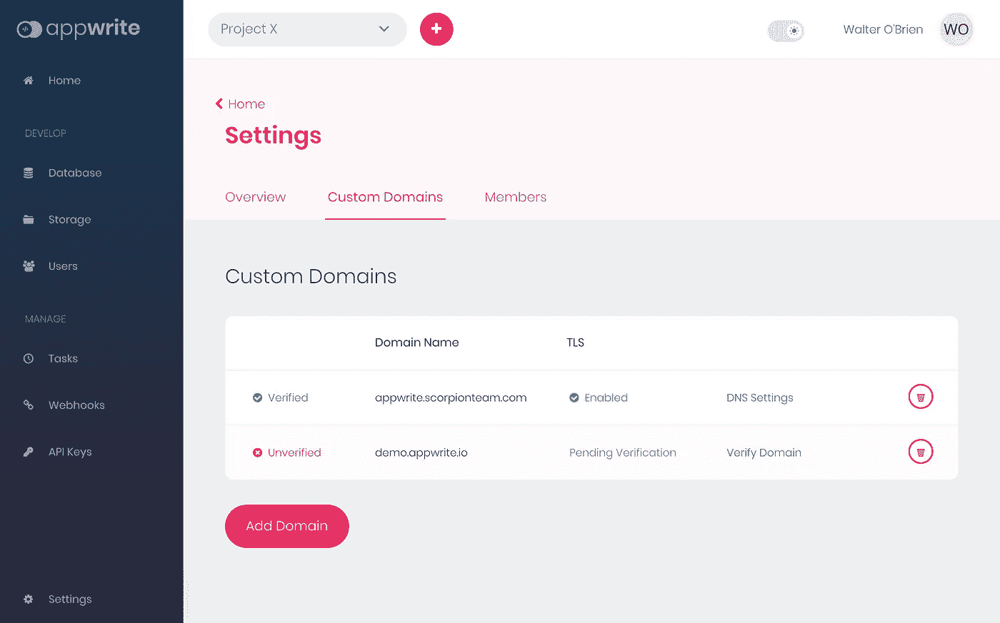
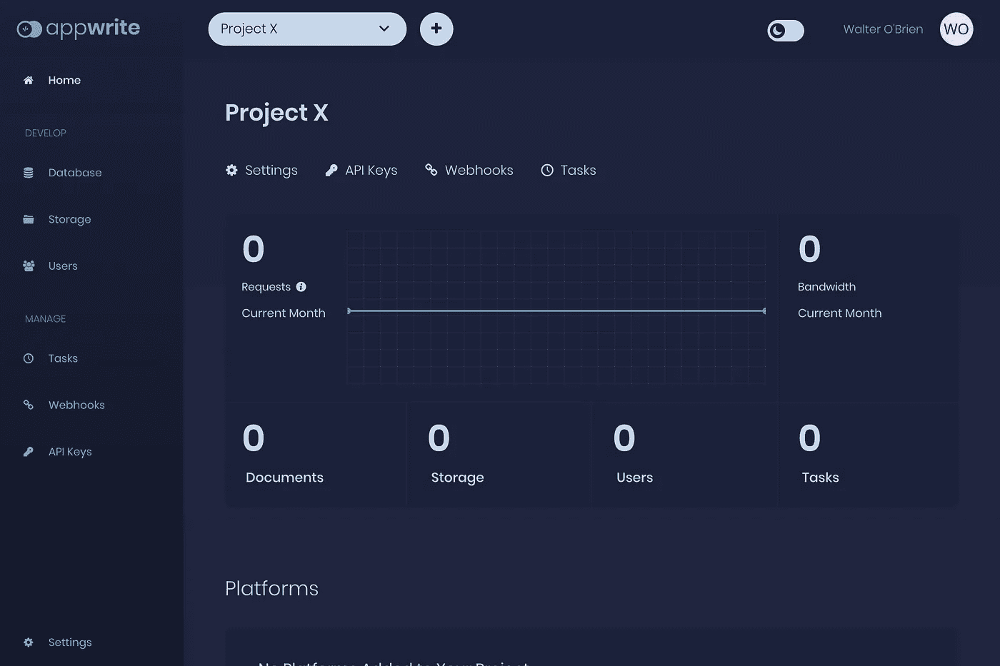

# Appwrite 开源后端服务器 0.5 推出了 5 个主要的新特性

> 原文：<https://betterprogramming.pub/the-appwrite-open-source-backend-server-0-5-is-out-with-5-new-major-features-e94e09d280fc>

## 内置的自动化 SSL、自定义域、新的身份验证功能、黑暗模式等等！

SpaceX 在 [Unsplash](https://unsplash.com/s/photos/rocket?utm_source=unsplash&utm_medium=referral&utm_content=creditCopyText) 上拍摄的

经过我们开发者社区的大量工作和期待，我非常兴奋地宣布 [Appwrite](https://appwrite.io/) 后端服务器 0.5 版本的发布。

新的 Appwrite 版本充满了新的特性，是对 Appwrite API 的改进。Appwrite 0.5 是迄今为止最稳定的 Appwrite 版本。

与每一个 Appwrite 版本一样，如果没有 Appwrite 开源社区的大力支持，这个版本是不可能发布的。感谢我们的社区反馈、错误报告和功能建议，我们可以确保在每个新版本中充分利用 Appwrite 服务器。

这也是一个很好的机会来感谢我们的社区贡献者克里斯蒂雅各布，托尔斯滕迪特曼，阿米诺波普，佩德罗希斯内罗斯桑塔纳给我们发送了巨大的拉动请求，使这一版本成为可能。

# 有什么新鲜事？

在这个新版本中，我们添加了许多新功能，还改进了 Appwrite API 规范，使其更加一致、可预测，并缩短了开始使用 Appwrite 的学习曲线。

以下是我们一些最显著的新功能列表。我还建议查看我们的新主页和文档网站，了解更多关于我们新的和改进的 API 规范。

# 自定义 OAuth 范围

自定义 OAuth 作用域允许 Appwrite 开发人员在 OAuth 提供者处登录用户时请求额外的权限，方法是请求对给定 OAuth 提供者提供的任何可用 OAuth 作用域具有权限的访问令牌。

当需要与第三方提供商进行高级和更复杂的集成时，这将为开发人员提供更大的灵活性。

# 新 OAuth 适配器

与以前的 Appwrite 版本一样，新的 Appwrite 版本也引入了您选择的新 OAuth 适配器。

在 0.5 版本中，你会发现针对 [Discord](https://discordapp.com/) 、 [Twitch](https://www.twitch.tv/) 、Spotify、Yahoo、 [Salesforce](https://www.salesforce.com/) 、 [Yandex](https://yandex.com/) 、PayPal 和 Bitly 的八个新适配器。

# 自定义域

新的自定义域功能将允许您将您的域附加到 Appwrite 服务器。

这个特性允许您使用第一方的安全会话 cookies，而不是第三方的，这对于为 web 集成增加额外的隐私和安全性非常有用。这也非常有用，因为现代浏览器将在未来的版本中开始完全阻止第三方 cookies。

# 自动生成的 SSL 证书

随着新的自定义域功能的推出，我们也非常高兴地推出 auto-SSL 证书生成器。

证书生成器将使用[让我们加密](https://letsencrypt.org/getting-started/)证书机器人为您的自定义域自动创建一个新的免费 SSL 证书。Appwrite 还将负责您的 SSL 证书更新，以确保您除了编写应用程序的代码之外，不必担心任何事情。

# 黑暗模式和响应式用户界面

0.5 版本为 Appwrite 主页、docs 网站和 Appwrite 控制台仪表板引入了全黑模式和响应 UI 支持。

使用主题切换按钮，您可以轻松选择在明暗模式之间切换。这也是一个很好的机会来感谢我们的社区成员， [Kolkies](https://github.com/Kolkies) ，他们首先在我们的 [GitHub 库](https://github.com/appwrite/appwrite/issues/237)中提出了这个特性。

# 开始

如果您还没有开始使用 Appwrite 后端服务器，您可以通过用 Docker 安装您的本地实例[来快速完成(大约需要两分钟)。](https://github.com/appwrite/appwrite#installation)

一旦你安装了 Appwrite 后端服务器的本地副本，最好的开始方式是阅读我们的[入门教程](https://appwrite.io/docs/getting-started-for-web) (大约两分钟阅读)和阅读我们的 [API 文档](https://appwrite.io/docs)。

0.5 版还引入了一个新的分步命令行安装，以帮助您轻松地自定义 Appwrite 设置。

# 查看 Appwrite 游乐场

随着新的 Appwrite 0.5 发布，我们也发布了一个更新版本的 [Appwrite Playground](https://github.com/appwrite/playground-for-js) 。Appwrite Playground 是快速了解如何利用 Appwrite 构建下一个新项目的好方法。

Appwrite playground 是一个 Appwrite web 集成的简单演示，在这里您可以找到非常基本和简单的代码示例，以帮助您了解如何轻松快速地集成 Appwrite。

# **接下来是什么？**

你可以通过查看 Appwrite [变更日志](https://github.com/appwrite/appwrite/blob/master/CHANGES.md)来了解更多关于 0.5 版本的全部变更。

虽然我们刚刚发布了 0.5 版本，但 0.6 版本的工作已经开始，欢迎大家到 GitHub 上的[关注我们的进度直播](https://github.com/appwrite/appwrite/projects/6)，分享你们的反馈、建议和请求。

感谢阅读！