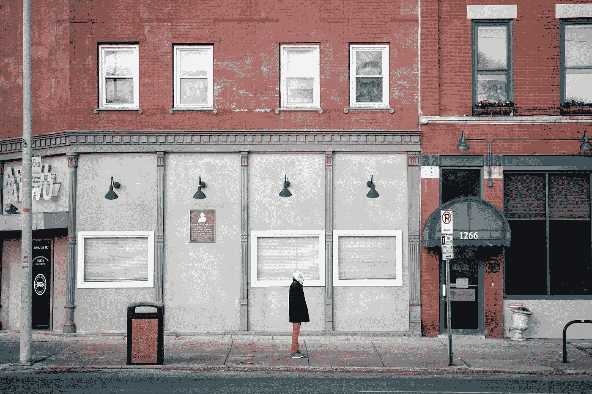

# 程序员的舍弃艺术

> 原文：<https://betterprogramming.pub/the-art-of-discarding-for-programmers-73a9696d59bd>

## 不要到处乱放东西——很少有东西是神圣的



在 [Unsplash](https://unsplash.com/s/photos/trashcan?utm_source=unsplash&utm_medium=referral&utm_content=creditCopyText) 上由 [Tim Umphreys](https://unsplash.com/@timumphreys?utm_source=unsplash&utm_medium=referral&utm_content=creditCopyText) 拍摄的照片

最近偶然看到一本很有意思的书:[《丢弃的艺术:如何摆脱杂乱找到快乐》](https://www.amazon.com/Art-Discarding-How-clutter-find/dp/B01M5IM7XH)渚辰巳著。

这本书讲述了如何丢弃生活中对你没用但你又难以释怀的东西。

关于这个话题，我读得越多，就越觉得这对软件专业人士来说也是如此。因此，我想我应该写一篇文章。

这本书由三部分组成:

*   帮助摆脱事物的十种态度
*   丢弃的十个策略
*   投掷的替代方式

以下是从软件专业人员的角度对这些部分的总结。

# 不要“暂时”保留它

通常，我们有一个死代码块，是有人为某一天要实现的某个特性编写的。或者我们有一些作业/任务正在运行，你知道它们没有被使用，但是因为你继承了它，你；你害怕关闭它。对于所有这样的事情，人们最终会说，“我们暂时保留它吧。”

作者建议，如果你已经有一段时间没有使用这个代码/工作/任务了，最好还是把它丢掉。将来可能也不会有用。

# 避免临时存储—现在就决定

在设计系统的时候，我遇到过这样的情况，人们最终会说，“让我们暂时把这个数据/表格保存在这里，我们以后再修改它。”或者他们说，“暂时先用这个方法，以后再改。”

另一种看待这个问题的方式是，当我们要求人们丢弃一些东西时，他们最终会将这些东西转移到临时存储区。作者建议，如果你打算丢弃某样东西，现在就行动，不要想着把东西转移到临时仓库。

# 有时永远不会到来

当被要求丢弃某样东西时，人们倾向于说，“这可能在某个时候有用”

作者说大多数人不会丢弃东西，相信这些东西将来会有用。但大多数时候，那个时刻永远不会到来。因此，如果你发现一些没用的东西，马上扔掉。

# 没有什么是神圣的

如果你继承了一段巨大的软件代码，总会有一些类、脚本和代码块被视为神圣的，人们担心如果你对它们做任何改变，最终会破坏东西。

我们需要明白，随着时间的推移，某些功能和特性会被禁用，通过删除失效的代码来保持代码最新是很重要的。这将帮助你保持你的系统干净整洁。

# 不要担心扔掉一些有用的东西

这是丢弃东西时最大的恐惧。识别什么时候有用什么时候没用总是好的。

但是有时候你会不确定某些东西是否真的被使用了。在这种情况下，最好一步一步地抛弃这些类型的东西。例如，您可能正在运行一个作业/任务，即使在研究了它的用法之后，您也不知道它是否被使用了。在这种情况下，您可以从禁用计划的执行开始，而不是完全放弃作业/任务。

这将帮助您确定某个东西是否真的被使用了，如果某个东西坏了，您将能够快速启用它。

# 不要追求完美

掌握放弃的艺术需要时间，所以你不应该在第一天就瞄准它。你可以从小处着手。并不断练习做或不做某事的利弊。

最终，你会掌握这门艺术。

# 常规丢弃

你不应该把丢弃当成一年一度的活动。你可能想经常这样做——也许每个季度。这将帮助您消除系统中不必要的负载。

如今，我们使用云进行大多数软件部署，并且我们为我们使用的东西付费。定期丢弃甚至可以帮助你降低一点成本。

# 建立丢弃标准

不应该由一个人来决定丢弃什么。建立标准可能很好——这有助于使决策过程更容易。

例如:

*   该特性/功能/工作是否有活跃的消费者？
*   暂时禁用特性/功能/作业后是否有噪音？
*   如果我们放弃该特性/功能/工作，是否会降低成本？
*   如果放弃该特性/功能/作业，是否会提高性能？
*   放弃一些工作有助于减轻运营团队的压力吗？他们能否将注意力放在关键业务工作/功能上？

# 不要认为这是浪费

作者一直在强调这一点。我们拥有某些东西是因为我们在某个时候想要它们。

经过一段时间后，需求、用户和需求会发生变化，这反过来会使某些东西变得无用。因此，它们需要被丢弃。如果保持这种态度，丢弃就会容易很多。

# 结论

总之，不管是生活还是软件，经过一段时间后，事物都会老化，因此，掌握丢弃的艺术以保持你的生活和系统的精简和干净是很重要的。

```
Hey, if you enjoyed this story, check out [Medium Membership](https://deshpandetanmay.medium.com/membership)! Just $5/month!*Your membership fee directly supports me and other writers you read. You’ll also get full access to every story on Medium.*
```