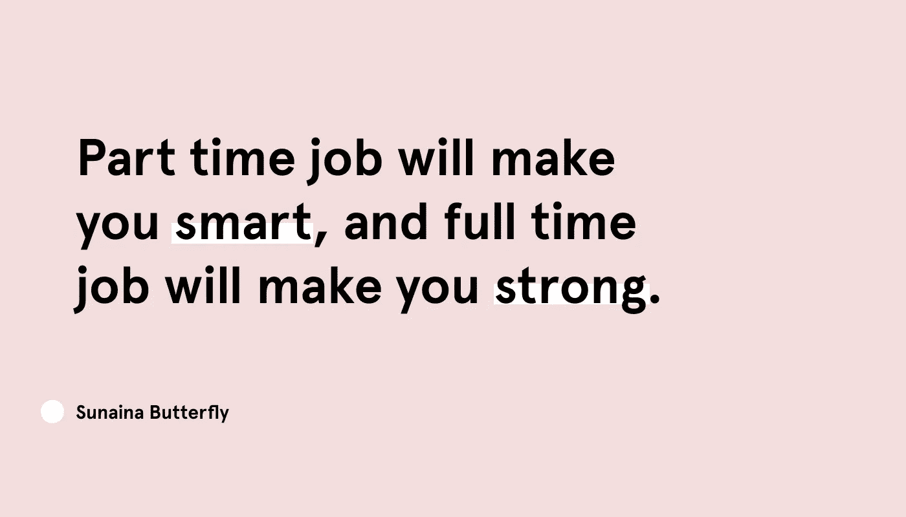

# 做兼职工作的艺术

> 原文：<https://betterprogramming.pub/the-art-of-doing-part-time-40a58835d85>

## “兼职会让你变聪明，全职会让你变强壮”

图片由作者提供。

大家好，我将分享一些我过去做兼职的经历，以及磨练我在任务优先级排序方面的技能。

举个例子，我是澳大利亚布里斯班一家初创公司的全职远程 UI/UX 设计师。事实上，你可以放弃它，把它作为“全职远程全栈设计师。”我不仅设计他们的应用程序，还设计公司的品牌和宣传材料。除此之外，我还在一家名为“一代女孩”的机构兼职，是他们营销团队的一员。对于我的主要工作之外的副业，我目前正在设计两个移动应用程序，并想办法通过我的艺术和手工艺获得被动收入。唷，作为一个介绍，要输入很多东西。

现在你了解我了，人们会问我的第一个问题是，“你是怎么做到的？你不是有一份全职工作要做吗？”

对此的回答是，“是的，我做了几年的兼职，从我的经历中学到了很多东西。是的，这并不像你想象的那么简单。”

## 让我带你回到 2016 年…

我的第一份兼职工作是在一家软件公司做 UI/UX 实习生。那时候我在大学三年级。这是我第一次接触到一份与我所学专业相关的真正工作，这是一种难以置信的幸运。我认识的一些人通常会做兼职，比如咖啡师或服务员。它是通过一门大学课程提供的，我们基本上是和一个真实的客户做一个项目。他们对我们的工作很满意，并给我所有的队友提供了在那里兼职的机会。

坦率地说，我在那里呆的时间不够长。我觉得我没有做我认为我喜欢做的事情，再加上我有点害怕失去我的成绩。在我的上一个学期，我刚刚勉强达到最低的及格分数，我意识到我需要更加努力地提高我的成绩。也许现在还不是我融入现实世界的时候。我是说，这很正常，对吧？也许现在还不是时候。我注定要做一些伟大的事情，但我不认为那就是。

现在我回头看那个时刻，如果我选择留下，事情可能会有所不同。我可以肯定地说:如果没有那次经历，我不会有现在的成就。

从好的一面来看，我的实习经历对决定我现在走的路非常有用。我意识到这对我非常有益，我可以学到学校里没有教给我的东西。我不可能掌握所有的内幕消息、行业标准或他们在日常工作中需要的东西，所以我永远对此心存感激。

他们说的没错:经历是无价的。尽你所能抓住他们。

# 快进到 2017 年，我已经毕业了

我不知道我是否曾在公共场合分享过这些，但事实上我在找工作时很挣扎。我的朋友们花了差不多三个月的时间才找到他们梦想中的工作，而我花了五到六个月才最终在一家公司找到了一份工作。在那段时间里，我得到了几次面试机会，但大多数人都告诉我，我的背景不是纯粹的交互设计，这似乎让我看起来“不太吸引人”，相比之下，其他人实际上选择了确切的专业。

但后来，当我已经签了第一份顾问工作的合同时，一个澳大利亚人联系了我，给了我一份 UI/UX 的工作。我决定告诉他我的情况，他提出让我远程做兼职。我记得当时对此非常纠结，甚至问过我爱的人要不要考虑。这是一个如此重大的决定，如果我错过了，这将是一个如此浪费的机会。最后，我还是决定去做。

随着时间的推移，我慢慢掌握了任务的节奏和复杂性。对于这份兼职工作，我同意每周做十个小时。在全职工作和兼职工作之间划分你的生产时间并不容易。由于我的全职工作相当忙碌和耗时，我决定从兼职工作中休息五个月，只是为了回到全职工作的轨道上来，并确保我没有懈怠。

随着时间的推移，我的一个朋友给我介绍了另一份兼职工作，除了我当时正在做的工作。所以是的，曾经有一段时间我同时做三份工作。最棒的是我真的很喜欢它。不知所措的感觉并没有给我太大的打击，因为我的价值观与他们正在做的事情一致，这让我坚持下去。

对于那些读过我以前的故事的人来说，你知道做你喜欢的事情其实很重要。你有做事情的动力，不仅仅是为了钱，也是为了事业，因为你对此感到高兴。一旦你对某事充满热情，我保证你不会有任何感觉。出自一个已经走过这条路的人之口。

好了，故事讲够了。让我们回到第一个问题:你是怎么做到的？

除了从经验中找出公式，我实际上学会了如何一心多用。是的，我知道，不是每个人都能掌握一心多用的艺术。说实话，是真的。它甚至被科学证明，人们不能专注于一件以上的事情，因为我们的大脑不是那样工作的。但是，嘿，试着从不同的角度看它。你可以试着优先处理重要的任务，我就是这么做的。

# 当初是什么让我想去做？

开始做兼职有很多好处，比如:

*   在全职工作之外获得更多经验
*   连接到各种网络
*   进一步磨练你的技能
*   了解其他公司是如何工作的，他们的生命周期和规范，你可以在哪里适应你目前的工作场所
*   外快
*   还有更多

对我来说，获得兼职经验至关重要。你要和不同类型的客户打交道，完成不同类型的任务，了解他们的工作方式。我可以和很多人讨论，他们有我以前想都没想过的好主意。

但是当然，它也有一些缺点:

*   超载
*   感觉没有太多属于自己的时间
*   强迫自己太多，你以为你可以达到一个水平，但结果你不能全力以赴

关键是找到事情的平衡点，以及你想如何利用这个机会来提升你目前的专业技能。如果你把大学期间的实习算作兼职，那么是的，你绝对应该去做！这将是你简历上的一大亮点，无论何时未来的雇主想要雇佣你，你都有东西可带。

## 如果你抓住机会，你能贡献多少时间

这很重要，因为你需要衡量出在你所做的基础上增加额外工作的能力。比方说，你从 9 点工作到 5 点。如果你算上路上花的时间，并打算在 8 点钟到家，那么你就有了晚上 8 点到 10 点的时间。在这个时间范围内，计算出你是否需要一个小时的“自我时间”，来满足你的日常需求，比如和家人一起吃晚餐和享受美好时光。在你把它简化成等式之后，我可以有把握地说，你将有一个小时的“空闲时间”，你可以把它算作你兼职的机会之窗。将它乘以五个工作日，那么你就有了五个小时的生产时间。

你需要确保在这段兼职时间里，你不会让任何事情打扰你。否则，你做兼职就不会那么有效。此外，你需要对此有一种责任感，把它当作和你的全职工作一样重要。

## 你和对方之间有明确的合同

一旦你算好了时间，一定要通知你的兼职雇主。如果需要的话，你也可以描述你的背景和在工作日可能发生的任何情况，这样他们就会对你的结果有一个想法和明确的预期。

大多数兼职工作通常按小时计算，但有些也提供每周、每两周甚至每月的报酬。根据公司本身的情况，有时他们可能会要求你加班。如果发生这种情况，请查阅合同。如果你能做到，那就去做吧。但切记不要强求，否则会烧坏的。总是给自己一些空间，如果你认为你一开始就把时间算错了，就回到第一点。不要害怕告诉雇主你的情况。我相信他们会理解的，因为你实际上不是公司的全职员工。

## 选择一份适合你的兼职工作

做兼职，尤其是当你已经有一份全职工作的时候，是一个巨大的决定，你需要仔细考虑。它需要你的承诺。如果事实证明你没有时间做这件事，你不能就这样放弃。再次强调，要把它们看得很重要，因为它们打开了一个职位空缺。

在你开始做任何事情之前，一定要知道你在业余时间喜欢做什么。如果你在 Instagram 上很活跃，也许做社交媒体管理对你有好处，因为你会非常清楚这一点。如果你想磨练自己的社交能力，可以随意加入任何和你有相同价值的社区和组织。如果你想提高你的技术技能，和你的朋友，甚至是真正的客户一起做一些外部项目。你不仅一举两得，还可能从他们那里得到更好的工作机会。

## 你不需要抓住每一个机会

如果你觉得这个提议要求太多，那就休息一下。并不是说第一次尝试后就可以轻易退出，更多的是实现自己每周用于事情的带宽。

在我决定是否抓住机会时，最重要的事情之一是衡量工作所需的时间。比方说，你的全职工作要求你每天工作八到九个小时，你知道回到家你会抽不出一点时间，那就不要强迫自己去做兼职。

如果这是你的情况，试着看看你是否能在周末承诺。如果这对你有用，那么问问雇主是否有这个选择。我知道在周末保持高效率是一件困难的事情，但是现在我已经习惯了。

# 你是如何平衡工作量的？

如果你的兼职工作要求相当高，有时你会在一天当中被窃听，我通常会通过转移任务来平衡。我通过从我的全职工作和兼职工作中优先列出清单来做到这一点。

例如，我通常会为我的全职工作列出当天的任务。我会根据每个问题的复杂程度和紧急程度，试着一个一个完成。在等待团队审核的过程中，我会检查自己的兼职工作，看自己是否能在短时间内快速完成任何事情或对任何事情做出回应。看起来你在欺骗时间，但技术上来说你没有留下任何东西。如果这可能需要相当长的时间，那么我通常会推迟，直到我确定我先完成了我的全职需求。

是的，这就是为什么我通常对任何事情都反应迅速的原因，因为我让我的空闲渠道对全职和兼职工作都保持开放。

如果都失败了，我选择周末而不是工作日。试着在周六或周日抽出四到五个小时，你会惊讶地发现完成工作时间是多么有影响力。事实上，如果我无事可做，我会感到非常困惑，这真的很奇怪。

# 你是从哪里找到这些兼职机会的？

这一条，我可以从找设计作品的角度来回答。老实说，你可以在很多地方找到，无论是本地的还是国际的。我的机会来自于在上发布我过去的一些作品。与我最近的作品相比，我的 Behance 作品集确实过时了，但至少它展示了一些技巧，告诉你如果一个潜在的雇主正溜进你的在线作品集，你能提供什么。我实际上正在创建我自己的作品集网站，这样它会更集中，我可以用我自己的风格来命名它。

说到在线作品集，像 [Behance](https://www.behance.net/joblist) 和 [Dribbble](https://dribbble.com/jobs) 这样的网站都有你可以看到的招聘页面。当你在那里搜索时，他们通常会有这种“远程工作”和“兼职”过滤，这使你能够申请这些工作，即使你不在同一个国家。试着了解他们的要求，看看是否符合你的时间表。如果要求太高，试着搜索基于项目的工作，这样你就不用花太多时间。他们的活动范围很广，从两到三个月到一年不等。

如果你的背景不是设计，可以去查一下[自由职业者](https://www.freelancer.com)、 [LinkedIn](http://linkedin.com/) ，甚至简单到朋友引荐。确保你的专业知识与他们的需求相匹配，这样你就不会提供不属于你工作范围的东西。

# 最后，但并非最不重要

永远把你的全职工作放在第一位。如果你没有时间去做，不要给自己压力。试着找到事物之间的平衡，希望你会找到结合你兼职和全职工作的完美匹配。