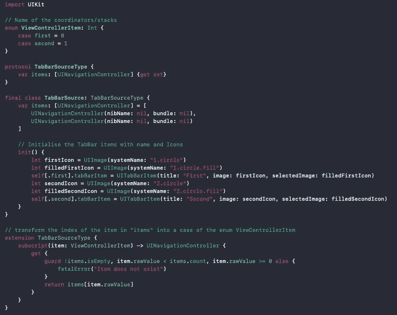
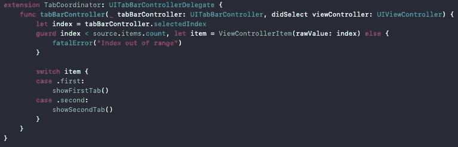
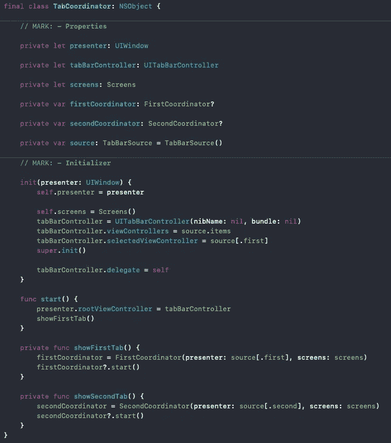
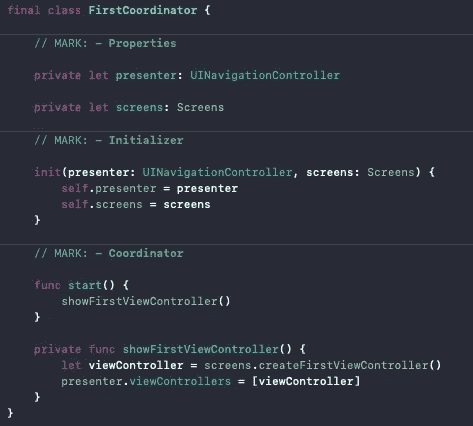
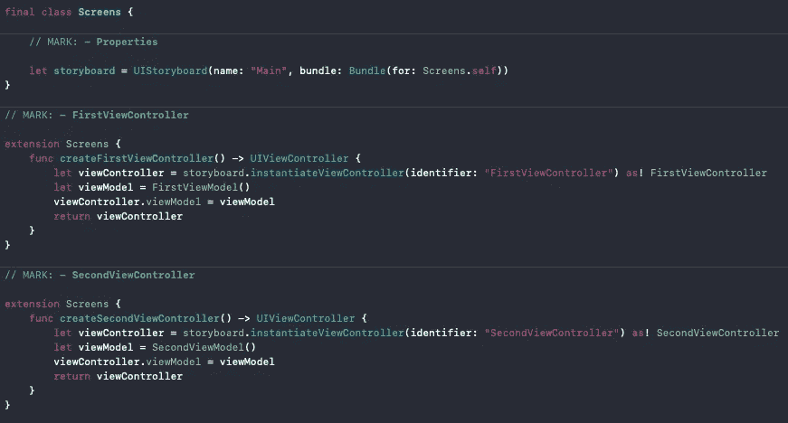

# MVVM-C 模式的艺术

> 原文：<https://betterprogramming.pub/the-art-of-mvvm-c-pattern-6fb9def2bb66>

## *如何优化 TabBar 项目中的导航*

照片由[达维·门德斯](https://unsplash.com/@ddmdsdd?utm_source=unsplash&utm_medium=referral&utm_content=creditCopyText)在 [Unsplash](https://unsplash.com/s/photos/tabs?utm_source=unsplash&utm_medium=referral&utm_content=creditCopyText) 上拍摄

作为一名开发人员，或者只是一名智能手机用户，你可能已经体验过了，现在大多数应用程序都是用 TabBars 构建的。过去，应用程序通常是用 segues 构建的，这有时会导致巨大的堆栈，并且同一个 ViewController 可能需要构建两次。

希望，Soroush Khanlou 给我们带来了这些巨大故事板的答案:[协调者模式](http://khanlou.com/2015/01/the-coordinator/)。

值得注意的是，我的教程首先是基于 MVVM 模式的，我不打算在本文中解释。通过实例化独立的视图控制器，协调器模式本身将只负责应用程序中的导航，现在可以一个接一个地使用多次。

这些模式的结合带来了惊人的结果:MVVM-C 模式。

现在，让我们开始吧！

# 场景代表

场景委托已经包含在每个 Xcode 项目中。它在这种情况下的作用是抓住 AppCoordinator 不放。

然后您将调用`start()`。

# 应用协调员

这是指挥整个 app 的协调者的切入点。这很简单:你只需要把它和场景委托连接起来，实例化 TabCoordinator，把它和场景委托连接起来，然后调用它的启动函数。

# 选项卡协调员

这里是航海的地球。选项卡协调器可以分为几个部分:

**来源:**`TabBarSource`的一个实例，它是负责带标签栏相关参数的类。因为我们在讨论接口编程，所以你需要继承一个协议，该协议在其扩展中将为每个标签添加一个名为`relatively`的原始值。

下面是文件中的源代码

然后，在选项卡协调器上进行扩展(在底部),以获得所选选项卡的原始值:

最后，调用 relative `show()` func 来实例化堆栈的协调器:

这是 TabBar 类的样子

# 协调者

每个堆栈都有一个协调器。然后，它将在屏幕的帮助下，通过实例化不同的 MVVM 块来协调整个堆栈的流程。

# 屏幕

这个类`Screens`只包括故事板。

最后，创建扩展。每一个都应该包含一个函数，负责实例化 viewController 及其相关的视图模型和最终的存储库、委托等。

# MVVM

此外，您将找到与每个视图相关的 MVVM 块。在本教程中，它仅指 ViewController 和 ViewModel。

我不愿意在这个话题上更进一步。然而，我只能建议发展您对此模式的理解和技能。

# 结论

我希望我已经很好地介绍了 MVVM-C 模式。当然，这个教程对那些已经有这方面的高级知识的人来说不会很有用。但是，要成为专家，总要从某个地方开始，化繁为简往往就是把事情说清楚。

您可能还想在这个[地址](https://github.com/Cublax/MVVM-C-Tutorial)上检查这个项目的存储库。

感谢阅读，祝你好运！