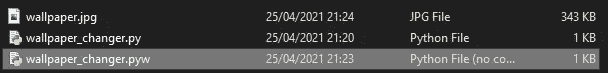
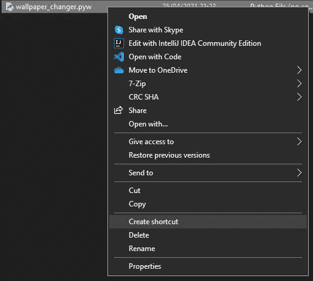

# Python 壁纸引擎

> 原文：<https://betterprogramming.pub/the-art-of-web-scraping-2-0-63fc2b49c7b6>

## Python 带来全新的日常外观

在这个项目中，你将学习一些新的网络抓取技巧，使用 Python 制作一个应用程序，自动找到桌面壁纸并将其应用到你的 PC 上。

那么，我们需要什么？

# 图像的来源

对于我们的图像来源，我们需要一个网站，有一个合适的分辨率和高质量的图像集合。它不应该使用 JavaScript 来加载图像，因为那样我们将无法使用 [Beautiful Soup 4](https://www.crummy.com/software/BeautifulSoup/bs4/doc/) (用于高效网页抓取的 Python 库)，我们将不得不求助于一个实际上是自动化浏览器的库(例如 [Selenium](https://selenium-python.readthedocs.io/) 或 [Mechanical Soup](https://mechanicalsoup.readthedocs.io/en/stable/) )。它们有它们的用途，但是对于我们想要做的事情来说，它们往往是缓慢而低效的。

现在的问题是，几乎所有的壁纸网站，如 [Unsplash](https://unsplash.com/) 和 [Pexels](https://www.pexels.com/) 都用 JS 加载图片，所以我们需要采取不同的方法。

Reddit 是出了名的非常好刮，我看了一下，发现了几个图片和壁纸都很酷的 subreddits。我找到的最好的一个是 [r/wallpaper](https://www.reddit.com/r/wallpaper/) ，内容丰富。所以这将是我们的来源。

# 下载这些图片的方法

用 Reddit 以编程方式获取帖子很容易。其实你根本不需要网页抓取库。

在每个 subreddit URL 的末尾，您可以键入`/new.json`、`/hot.json`或`/top.json`来获得一个 [JSON 文件](https://en.wikipedia.org/wiki/JSON)，其中包含该类别中所有最近帖子的所有数据。

# MJSON 上的矿石

JSON 代表 JavaScript 对象符号，它基本上是一种将字典保存到文件或从文件中加载字典的方法。很多 API 用它来返回数据，而且可以用 Python 来解析。

尝试加载这个网址:[https://www.reddit.com/r/wallpaper/hot.json](https://www.reddit.com/r/wallpaper/hot.json)。

如你所见，它的结构是:

```
{“kind”: “X”, “data”: {“modhash”: “X”, “dist”: X, “children”: [{},{},{}]
```

我们感兴趣的是最后一部分:`"children"`。

是一个字典数组，每个字典包含一篇文章的数据(标题、作者、内容等)。).

让我们试着用 Python 来解析这个。

首先，导入内置的请求库，以便我们可以从 URL 获取 JSON 文件:

```
import requests
```

现在使用从特定资源请求数据的 [HTTP GET](https://www.w3schools.com/tags/ref_httpmethods.asp) 方法来获取 JSON 数据:

```
textData = requests.get("[https://www.reddit.com/r/wallpaper/hot.json](https://www.reddit.com/r/wallpaper/hot.json)").content
```

尝试打印请求的响应。在我的例子中，我被返回了`{"message": "Too Many Requests", "error": 429}`。

我没有发出太多请求，但服务器知道这不是来自浏览器或真正的 Reddit 应用程序的真正请求。

为了解决这个问题，我们需要在消息头中提供一个[用户代理](https://en.wikipedia.org/wiki/User_agent)。[该站点](https://www.whatismybrowser.com/guides/the-latest-user-agent/windows)显示了最新的用户代理，因此我将把它包含在我的请求头中:

```
myHeaders={"User-Agent":"Mozilla/5.0 (Windows NT 10.0; Win64; x64) AppleWebKit/537.36 (KHTML, like Gecko) Chrome/90.0.4430.85 Safari/537.36"}textData = requests.get("[https://www.reddit.com/r/wallpaper/hot.json](https://www.reddit.com/r/wallpaper/hot.json)",headers=myHeaders).content
```

再次打印字符串后，我得到了我们想要的大型 JSON 文件。

现在我们有了文本形式的 JSON 数据，我们需要解析它，所以导入内置的 JSON 库:

```
import json
```

要将文本数据转换成字典，我们将使用`loads`方法。你可以在 W3Schools 上阅读更多关于各种 JSON 方法[的内容。](https://www.w3schools.com/python/python_json.asp)

```
jsonData = json.loads(textData)
```

按照我前面指出的结构，我们可以通过访问新构建的字典中不同索引处的条目来找到子节点(帖子)。我们会这样访问孩子:`jsonData -> "data" -> "children"`。

```
posts = jsonData["data"]["children"]
```

你现在可以得到任何帖子的图片网址。让我们试试第一篇文章:

```
posts[0]["data"]["url"]
```

这给了我以下网址:[https://i.redd.it/24vbhq06y6v61.jpg](https://i.redd.it/24vbhq06y6v61.jpg)，这是一个全分辨率图像。我们需要想办法把这个存到磁盘上。

我们可以对图像的 URL 执行另一个 HTTP GET 请求，这将为我们提供图像的内容，并以字节模式将字节写入文件:

```
imageContents = requests.get(posts[0]["data"]["url"],headers=myHeaders).contentwith open("wallpaper.jpg","wb") as imageFile:
     imageFile.write(imageContents)
```

这将成功地将其保存到磁盘。酷毙了。但是我们希望它是随机的，所以让我们将`0`索引改为一个在`0`和文章列表长度之间的随机数:

现在把它设为你的壁纸。

根据[这个堆栈溢出线程](https://stackoverflow.com/questions/1977694/how-can-i-change-my-desktop-background-with-python)，在 Windows 上，可以使用`ctypes`模块。对我来说，这段代码有效:

```
import ctypesSPI_SETDESKWALLPAPER = 20ctypes.windll.user32.SystemParametersInfoW(SPI_SETDESKWALLPAPER, 0, "%USERPROFILE%/wallpaper.jpg" , 3)
```

如果这对您不起作用，或者您使用的是 Linux/Unix，那么看看这个线程，尝试一些不同的东西。

现在我们将所有代码编译在一起，并在固定的时间间隔后重复:

最后，您可能希望它在启动时运行。如果是这样，你也会希望它没有窗户，所以让我们来看看。

*   将 Python 文件另存为`.pyw`而不是`.py`。这意味着文件不创建窗口。



*   右键单击`.pyw`文件，然后单击“创建快捷方式”



*   按 Windows 键+ R 并键入`shell:startup`。
*   将新的快捷方式拖到新的浏览器窗口中。

你就完了。该脚本将在您每次启动电脑时运行，并每 30 分钟随机更换一次壁纸。