# 网络抓取的艺术

> 原文：<https://betterprogramming.pub/the-art-of-web-scraping-382e2ea43c18>

## 掌握尽可能高效地从网站中提取数据的做法。


照片由[达米安·扎莱斯基](https://unsplash.com/@zal3wa?utm_source=medium&utm_medium=referral)在 [Unsplash](https://unsplash.com?utm_source=medium&utm_medium=referral) 上拍摄

这几乎是自动化的复制/粘贴，事实证明它有一些非常有用的应用。网络上充满了有价值的信息和资源，但是人们需要花费时间和精力来发现和处理这些信息，这就是为什么网络抓取很流行的原因。

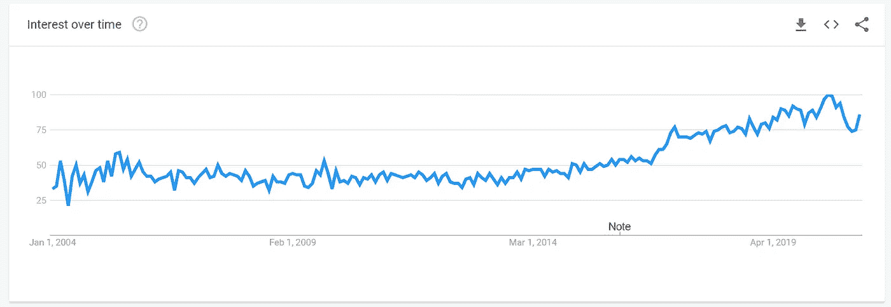

网络抓取在 2020 年 6 月最受欢迎，现在还没有结束

让我们看一个例子。

假设你是一名消费者，想从易贝购买一款新的显卡。你*可以*查看每天搜索到的类似商品的价格，并在 Excel 中写下平均价格，这样你就知道最佳购买时间——但这需要耗费大量人力。而且费时。以及*镗孔*。

你*应该*做的是写一个程序替你做这件事。但是你会怎么做呢？

首先，如果你还没有学过编程语言，你就必须学一门。出于本文的目的，我们称之为 Python。你还必须知道网站是如何工作的，这意味着一些基本的 HTML 和 CSS。

接下来，你需要决定如何使用这种语言从这个网站上提取信息。你需要检查网站，了解你会刮什么。您是否必须与页面交互来提取数据，或者您是否可以简单地下载页面数据并处理文本？

我们正在搜索 GTX 1660 显卡，现在让我们来看看易贝:

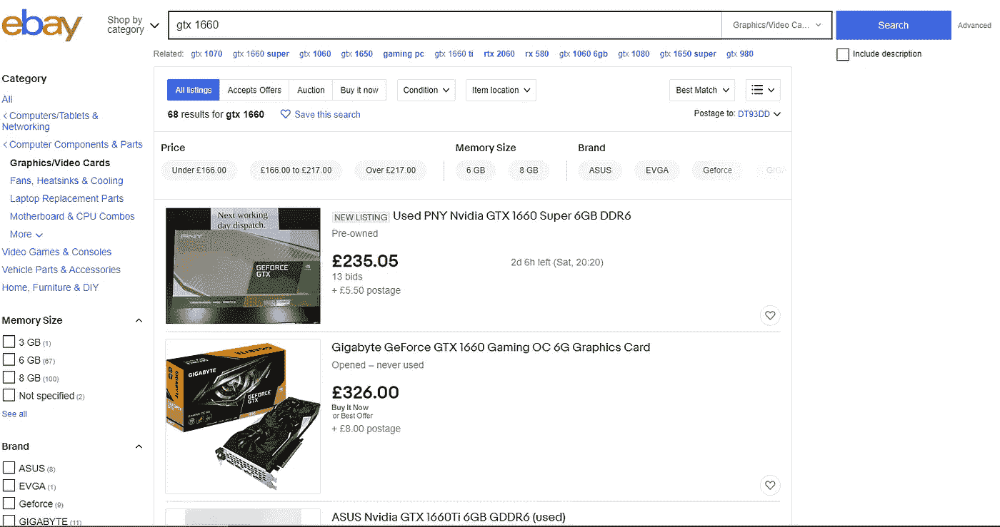

马上你看到搜索把我们带到了网址:“https://www . ebay . co . uk/sch/I . html？_ nkw = gtx+1660”，结果好像瞬间加载。现在是检查页面源代码的好时机。右键单击产品，然后按“检查”结果如下:

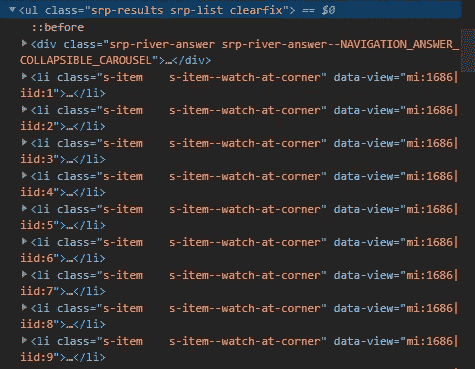

在检查产品清单时，我们看到每个清单都是一个[无序清单](https://www.w3schools.com/html/html_lists_unordered.asp)中的一个项目。列表有一些独特的类，可以用来将这个 HTML 元素从页面的其余部分中分离出来:`srp-results`和`srp-list`，每个列表项都有一个类`s-item`。

每个产品列表都有一个类别为`s-item__price`的范围。这是 HTML:

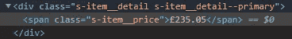

由于这项任务的性质，我们可以使用 [Beautiful Soup](https://www.crummy.com/software/BeautifulSoup/) *，*一个处理标记文档的 Python 库，以便于导航和提取数据。如果您必须与页面进行交互(例如，单击按钮、提供输入)，最好使用 Selenium 或 Mechanize 之类的库，它可以自动化整个浏览器，但是最好尽可能避免这样做，因为在许多情况下这不是最有效的方法。

要安装漂亮的汤:

```
pip3 install bs4
```

当使用内置的“requests”库获取 URL 的来源时，我得到了响应代码 200。您可以在这里阅读不同的响应代码，但是 200 意味着请求是正确的，我们可以继续。但是，有时候，你必须使用一个用户代理[来让网站认为请求来自浏览器而不是抓取器。代码如下:](https://en.wikipedia.org/wiki/User_agent)

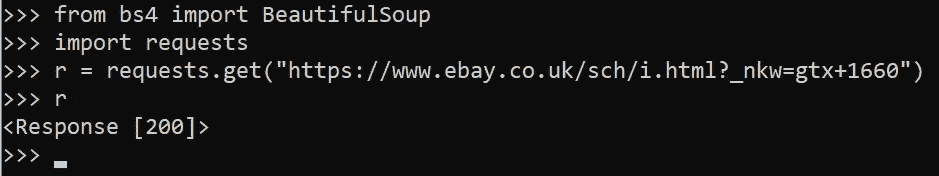

> “用户代理字符串是使用 [Robots 排除标准](https://en.wikipedia.org/wiki/Robots_Exclusion_Standard) ( *robots.txt* 文件)排除网络爬虫访问网站特定部分的标准之一。”—维基百科

总之，有时用户代理必须包含某个字符串才能接受请求，或者不能包含某个字符串，或者必须简单地包含某些内容而不是什么都没有。

HTTP 请求返回页面的来源——这与您浏览网页时浏览器获取它呈现和显示的 HTML 的方式相同

我们可以使用 Beautiful Soup 来解析 HTML，并通过使用我们之前确定的类来处理产品列表。代码如下:

```
from bs4 import BeautifulSoup
import requests # get source
r = requests.get("[https://www.ebay.co.uk/sch/i.html?_nkw=gtx+1660](https://www.ebay.co.uk/sch/i.html?_nkw=gtx+1660)")# parse source
soup = BeautifulSoup(r.text, 'html.parser')# find all list items from search results
results = soup.find("ul",{"class":"srp-results"}).find_all("li",{"class":"s-item"})
```

我们可以对结果进行迭代，找到类为`s-item__price`的 span 中的文本。下面是实现这一点的代码:

```
for result in results:
    priceSpan = result.find("span",{"class":"s-item__price"})
    print(priceSpan.text)
```

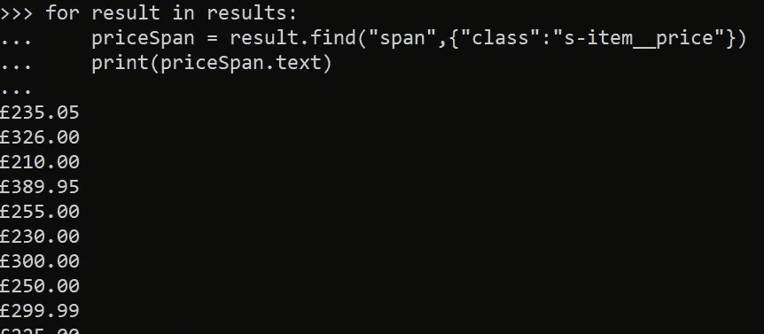

您将获得以下输出。要将其转换为整数，我们应该首先删除第一个字符，该字符始终为“，”然后您就可以对其余的字符使用 Python `float`方法——如果没有一些异常的话。

有时，有多种价格:

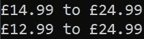

其他时候，用逗号分隔千位:

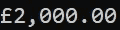

为了解决这个问题，您可以忽略包含字符串“To”的列表，使用 Python `replace`方法删除任何逗号，然后转换为 float。代码如下:

```
for result in results:
    priceText = result.find("span",{"class":"s-item__price"}).text
    if "to" in priceText:
        continue
    price = float(priceText[1:].replace(",",""))
```

每个易贝产品列表还包含一个类别为`s-item__shipping`的 span。我们可以使用它来查找运费和项目的总成本，如下所示:

```
for result in results:
    shippingSpan = result.find("span",{"class":"s-item__shipping"})
    print(shippingSpan.text)
```

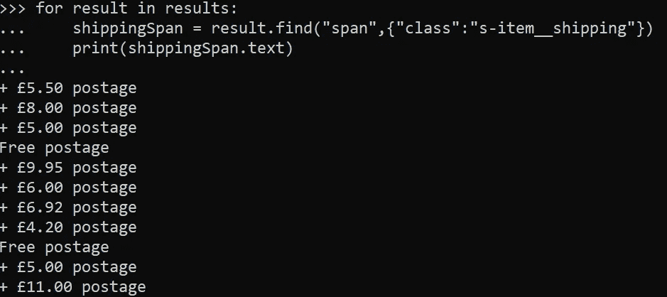

如果运输是免费的，运输文本采用`+ £(PRICE) postage`或`Free postage`的形式。您可以使用 Python 的`split()`函数处理第一个例子，选择第二个项目，做与上面相同的事情:将没有第一个字符的字符串解析为`float`。对于第二个实例，您可以检查价格是否包含“免费”，如果包含，则将价格值设置为`0`。

```
prices = []for result in results:
    priceText = result.find("span",{"class":"s-item__price"}).text
    if "to" in priceText:
        continue
    price = float(priceText[1:].replace(",",""))

    shippingText = result.find("span",{"class":"s-item__shipping"}).text
    if "Free" in shippingText:
        shipping = 0
    else: # is not free
        shipping = float(shippingText.split()[1][1:])prices.append(price+shipping)
```

上面，我已经实现了这个描述的方法，并把商品和邮费加到一个列表中，这样以后就可以处理它了。

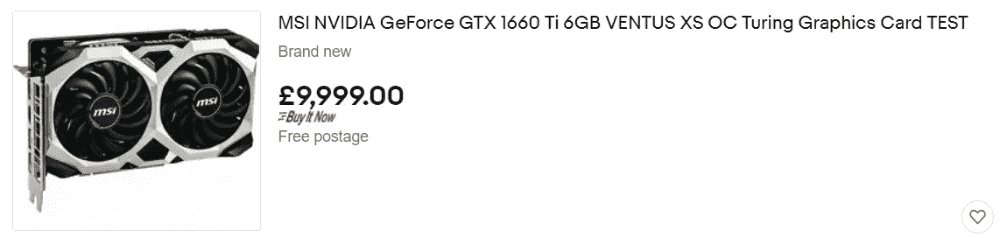

有一些异常的清单——可能是为了欺骗自动采购机器人在供应链短缺时购买价格过高的商品。

在计算平均值之前，您应该从数据中排除这些异常值。这可以通过标准差和正态分布来实现。如果这对你来说是新的，我推荐阅读[维基百科页面](https://en.wikipedia.org/wiki/Standard_deviation)，以及[这篇关于排除 Python](https://www.kdnuggets.com/2017/02/removing-outliers-standard-deviation-python.html) 中异常的文章。

> “我们的方法是在绘制频率之前，通过消除任何高于(平均值+ 2*SD)和低于(平均值-2 * SD)的点来消除异常点。”—首席数据科学家 Punit Jajodia

使用 Numpy，可以实现上述内容。首先，确保您安装了 Numpy。命令如下:

```
pip3 install numpy
```

将此方法添加到代码中:

```
import numpy as npdef reject_outliers(data, m=2):
    return data[abs(data - np.mean(data)) < m * np.std(data)]
```

这将从 Numpy 数组中移除离群值。现在，您可以将它与您的价格表一起使用，并取平均值，如下所示:

```
prices = reject_outliers(np.array(prices))
avgPrice = np.mean(prices)
```

为了能够在 Excel 中分析这些数据，平均值应被写入一个 [CSV 文件](https://www.howtogeek.com/348960/what-is-a-csv-file-and-how-do-i-open-it/)。我使用日期作为第一列，价格作为第二列。

```
import csvfields=[date.today().strftime("%b-%d-%Y"),np.around(avgPrice,2)]
with open('prices.csv', 'a', newline='') as f:
    writer = csv.writer(f)
    writer.writerow(fields)
```

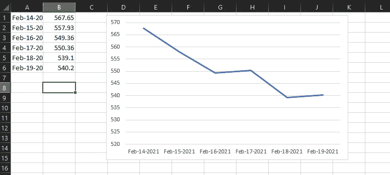

在运行我的脚本几天后，我使用 Excel 绘制了数据的图表，给出了上面的结果。代码如下:

网络抓取是一个强大的工具，学习和练习它非常有趣。我推荐在 Raspberry Pi 或类似的设备上运行这样的程序，因为它可以 24/7 全天候运行，几乎不耗电。此外，您可以将脚本编程为每天运行，而不是自己每天运行程序。

我强烈建议您更多地了解这个主题，这是一个非常吸引人的数据科学介绍。我希望这篇文章是有帮助的。